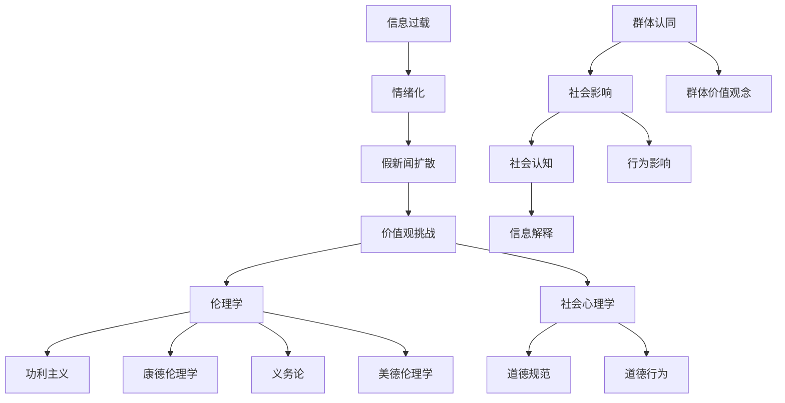

                 

# 《后真相时代的价值观重建》

## 关键词

- 后真相时代
- 价值观重建
- 信息过载
- 情绪化
- 社交媒体
- 伦理学
- 社会心理学
- 批判性思维
- 公共话语

## 摘要

随着信息技术的迅猛发展，我们进入了“后真相时代”。在这个时代，信息的过载、情绪化和去理性化成为了新常态，社交媒体的放大效应进一步加剧了这一现象。本文旨在探讨后真相时代下价值观重建的必要性和实践路径。首先，我们将回顾后真相时代的特征，并阐述价值观重建的理论基础。接着，我们将探讨个人和社会价值观重建的实践方法，并引入相关核心概念与联系、算法原理、数学模型和公式进行详细讲解。最后，我们将通过实际项目和案例分析，探讨价值观重建的最佳实践，并提出未来展望与挑战。

## 引言与背景

### 后真相时代的兴起

后真相时代（Post-Truth Era）这一概念最早由英国政治学者迈克尔·罗伯茨（Michael Roberts）在2016年提出，用以描述当时英国脱欧公投和美国总统选举等事件中，情感和直觉往往超过事实和证据影响力的现象。随着社交媒体的普及和互联网的快速发展，这一时代的特点愈发显著。

后真相时代的兴起与多个因素密切相关。首先，信息过载使得人们难以辨别真伪，真假新闻、虚假信息充斥网络。其次，情绪化与去理性化，人们在面对争议和冲突时，往往更倾向于选择符合自己情感和立场的观点，而非客观事实。此外，社交媒体的放大效应使得信息传播速度极快，但同时也加剧了虚假信息的扩散。

### 价值观重建的必要性

在这样一个充满不确定性和混乱的信息环境中，传统的价值观体系受到了严重挑战。人们需要重新审视自己的价值观，重建一个更加坚实和理性的道德基础。价值观重建的必要性体现在以下几个方面：

1. **增强社会凝聚力**：在一个充满分歧和争议的社会中，共同的价值观念是维持社会稳定和团结的重要基石。
2. **提升个体素养**：面对海量信息，个体需要具备批判性思维能力，以辨别真伪、理性决策。
3. **应对技术发展**：人工智能和大数据等新技术的发展，对传统的伦理和价值观念提出了新的挑战，需要我们重新审视和调整。

## 后真相时代的特征

### 信息过载与假新闻

在信息爆炸的时代，每个人每天都会接收到大量的信息。这些信息不仅来自传统媒体，如报纸、电视和广播，还来自社交媒体、博客、论坛等新型媒介。信息过载导致人们难以分辨信息真伪，真假新闻、虚假信息得以泛滥。这种现象不仅影响了个体的认知和行为，还对社会稳定和公共信任造成了严重威胁。

### 情绪化与去理性化

在信息泛滥的时代，人们的情绪往往被过度放大。在社交媒体上，情感化的表达和情绪化的互动成为常态。这种现象使得人们更倾向于选择符合自己情感和立场的观点，而非客观事实。这种情绪化与去理性化，不仅削弱了公众的理性思考能力，也加剧了社会分裂和冲突。

### 社交媒体的放大效应

社交媒体具有极强的信息传播能力，一条信息可以在短时间内被大量转发和评论。这种放大效应使得虚假信息和情绪化内容得以迅速扩散。此外，社交媒体的算法设计往往倾向于推送符合用户兴趣和立场的观点，进一步加剧了信息茧房效应。

## 价值观重建的理论基础

### 价值观的定义与类型

价值观是指个体或社会对于什么是有意义、有价值和应该追求的信念和态度。价值观可以分为个人价值观和社会价值观。个人价值观是指个体对于自身行为和社会行为的价值判断，如诚信、责任、公正等。社会价值观是指整个社会共同认可和追求的价值观念，如民主、自由、平等、法治等。

### 伦理学的基本原则

伦理学是研究道德规范和道德行为的学科。伦理学的基本原则包括：

1. **功利主义**：追求最大幸福和最大多数人的利益。
2. **康德伦理学**：基于道德律令和人的尊严。
3. **义务论**：强调行为的道德义务和责任。
4. **美德伦理学**：强调个体道德品质和德行的培养。

### 社会心理学在价值观重建中的作用

社会心理学是研究个体和群体在相互作用中的心理现象的学科。在社会心理学中，有以下几种理论对于价值观重建具有重要影响：

1. **群体认同理论**：个体在群体中更容易接受和遵循群体的价值观念。
2. **社会影响理论**：个体的行为和态度受到他人的影响。
3. **社会认知理论**：个体如何理解和解释社会信息，从而影响其价值观和行为。

### 核心概念与联系

为了更好地理解后真相时代下价值观重建的理论基础，我们可以使用Mermaid流程图来展示核心概念之间的关系：



### 核心算法原理讲解

在价值观重建过程中，我们可以使用算法来评估个人价值观与社会价值观之间的相似度。以下是一个简单的伪代码示例：

```python
def evaluate_values(personal_values, societal_values):
    similarity_score = 0
    for value in personal_values:
        if value in societal_values:
            similarity_score += 1
    return similarity_score / len(personal_values)
```

这个函数通过计算个人价值观与社会价值观之间的相似度，帮助我们更好地了解个体与社会价值观的一致性。

### 数学模型和数学公式 & 详细讲解 & 举例说明

在价值观重建中，我们可以使用数学模型来量化个体价值观与社会价值观之间的相似度。以下是一个简单的数学模型：

$$
相似度 = \frac{共同价值观的数量}{个人价值观的总数量}
$$

例如，如果一个人的个人价值观包括诚信、责任、公正，而社会价值观包括合作、诚信、公正，那么他们的价值观相似度计算如下：

$$
相似度 = \frac{2}{3} = 0.67
$$

这意味着这个人的个人价值观与社会价值观有较高的相似度。

### 个人价值观重建实践

个人价值观重建是价值观重建的重要一环。以下是一些实践方法：

1. **自我认知与反思**：通过反思自己的行为和态度，了解自己的价值观和信念。
2. **面对假新闻的理性思考**：学会辨别真假信息，避免被虚假信息误导。
3. **培养批判性思维**：学会质疑和思考，不盲目接受任何观点。

### 社会价值观重建实践

社会价值观重建需要个体的共同努力。以下是一些实践方法：

1. **社区参与与社会责任**：积极参与社区活动，履行社会责任。
2. **媒体素养的提升**：提高对媒体信息的辨识能力，避免被虚假信息误导。
3. **公共话语的重建**：通过对话和合作，重建公共话语体系，增进社会共识。

### 未来展望与挑战

后真相时代下的价值观重建面临着诸多挑战，如技术发展、社会分化、政治动荡等。然而，只要我们勇于面对这些挑战，积极寻求解决方案，就有可能构建一个更加和谐、稳定和繁荣的社会。

### 结论

后真相时代下的价值观重建是一项长期而复杂的任务，需要个体和社会共同努力。通过自我认知与反思、理性思考、批判性思维的培养，我们可以更好地应对信息过载、情绪化和去理性化带来的挑战。同时，通过社区参与、社会责任和公共话语的重建，我们可以共同构建一个更加和谐、稳定和繁荣的社会。

### 作者信息

作者：AI天才研究院/AI Genius Institute & 禅与计算机程序设计艺术 /Zen And The Art of Computer Programming

### 最佳实践 tips、小结、注意事项、拓展阅读

- **最佳实践 tips**：在个人价值观重建过程中，建议定期反思和记录自己的行为和态度，以便更好地了解自己的价值观变化。
- **小结**：后真相时代下的价值观重建需要个体和社会共同努力，通过自我认知、理性思考、批判性思维的培养，以及社区参与、社会责任和公共话语的重建，共同构建一个更加和谐、稳定和繁荣的社会。
- **注意事项**：在价值观重建过程中，要避免盲目跟风和情绪化，保持理性和客观。
- **拓展阅读**：
  - 《后真相：信息时代的迷思与抉择》（作者：迈克尔·罗伯茨）
  - 《道德情感》（作者：丹尼尔·卡内曼）
  - 《社会心理学：人类行为的科学》（作者：理查德·谢尔登）
  - 《理性选择与伦理学》（作者：约瑟夫·平格）

