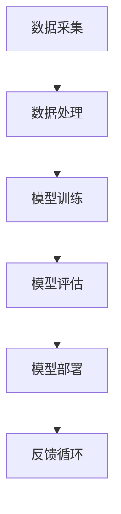
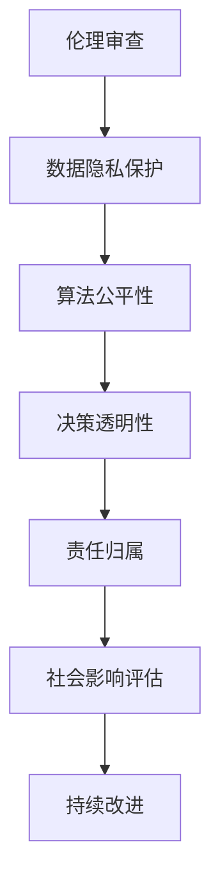

                 

# 在AI发展中维护人类价值与尊严

## 关键词
- AI伦理学
- 人类价值与尊严
- 机器学习
- 深度学习
- 项目实战
- 社会责任

## 摘要
本文探讨了在人工智能（AI）快速发展背景下，如何维护人类的价值与尊严。文章首先介绍了AI技术的发展历程和其在各领域的应用，接着阐述了人类价值与尊严的重要性。随后，文章通过机器学习和深度学习的原理讲解，探讨了AI伦理学的核心原则，并通过Mermaid流程图展示了这些原则在AI系统架构中的应用。文章还通过项目实战，展示了如何在实践中维护人类价值与尊严，并提出了未来的发展挑战与展望。

## 引言
### 1.1 背景介绍
人工智能（AI）作为计算机科学的一个重要分支，近年来取得了迅猛的发展。从最初的专家系统到现代的深度学习，AI技术的不断进步已经深刻地改变了我们的生活方式。然而，随着AI技术的不断演进，如何确保其发展与人类价值与尊严相协调，成为一个日益重要的议题。

AI的发展历程可以追溯到20世纪50年代，当时人工智能的概念首次被提出。早期的AI研究主要集中在逻辑推理和规则系统上。随着计算机性能的提升和大数据的兴起，机器学习和深度学习成为了AI研究的主流方向。近年来，AI技术在图像识别、自然语言处理、自动驾驶等领域取得了显著的成果。

### 1.1.1 AI技术的发展历程
1. **早期探索（1950-1969）**：AI概念的提出和早期尝试。
2. **人工智能寒冬（1974-1980）**：由于实际应用困难，AI研究受到质疑。
3. **复兴期（1980-1987）**：专家系统的兴起和应用。
4. **再次衰落（1987-1993）**：由于计算能力和数据限制，AI研究再度受挫。
5. **机器学习兴起（1993-2009）**：机器学习和数据挖掘技术的发展。
6. **深度学习革命（2009至今）**：深度学习的突破，AI进入新的黄金时期。

### 1.1.2 人类价值与尊严的重要性
人类价值与尊严是社会的基石，也是人类文明的精髓。随着AI技术的发展，如何确保AI系统的设计和应用不损害人类的基本权益，成为了一个关键问题。维护人类价值与尊严不仅关乎个体的权利和尊严，也关系到整个社会的稳定和和谐。

## 目标读者
本文的目标读者是关注AI技术发展及其伦理影响的科研人员、工程师、政策制定者和公众。通过本文的阅读，读者将了解AI技术的核心概念、AI伦理学的核心原则，并掌握如何在实践中维护人类价值与尊严。

## 书籍结构
本文分为四个主要部分：
1. 引言：介绍AI技术的发展历程和人类价值与尊严的重要性。
2. 核心概念与联系：通过Mermaid流程图展示AI系统架构，探讨人类价值与尊严在AI中的应用。
3. 核心算法原理讲解：详细阐述机器学习和深度学习的原理，包括伪代码、数学模型和公式。
4. 项目实战：通过实际案例展示如何在AI项目中维护人类价值与尊严，并提供代码实现和解读。

## 第一部分：核心概念与联系

### 2.1 AI系统架构
AI系统的核心组成部分包括数据采集、数据处理、模型训练、模型评估和模型部署。以下是一个简单的Mermaid流程图，展示了AI系统的整体架构：



### 2.2 人类价值与尊严在AI中的应用
人类价值与尊严在AI中的应用体现在AI系统的设计、开发和部署过程中。以下是一个Mermaid流程图，展示了人类价值与尊严在AI系统架构中的应用：



## 第二部分：核心算法原理讲解

### 3.1 机器学习基础
机器学习是一种使计算机通过数据和经验进行学习，从而改进性能的技术。以下是一个机器学习算法的伪代码，用于分类任务：

```python
function train_model(training_data):
    initialize_model()
    for each iteration:
        for each example in training_data:
            compute_predictions()
            update_model()
    return model
```

### 3.2 深度学习原理
深度学习是一种基于多层神经网络的机器学习技术。以下是一个简单的深度学习算法的伪代码，用于图像分类：

```python
function train_neural_network(training_data, labels):
    initialize_network()
    for each epoch:
        for each example in training_data:
            forward_pass(example)
            compute_loss(labels)
            backward_pass()
    return network
```

### 3.3 AI伦理学
AI伦理学是研究AI系统设计、开发和部署过程中应遵循的伦理原则。以下是一些核心的AI伦理学原则：

- **公平性**：确保AI系统不会歧视或偏袒任何特定群体。
- **透明性**：确保AI系统的决策过程可以被理解和解释。
- **隐私保护**：保护个人数据不被未经授权的访问或滥用。
- **责任归属**：明确AI系统的责任归属，确保在出现问题时可以追溯。

## 第三部分：项目实战

### 4.1 AI项目案例分析
以下是一个关于AI项目案例分析的示例，该案例涉及使用深度学习技术进行图像识别：

#### 4.1.1 案例背景
某公司开发了一款智能监控系统，用于监控公共场所的安全。该系统利用深度学习算法进行图像识别，以检测异常行为。

#### 4.1.2 项目目标
- 准确识别公共场所的异常行为。
- 确保识别过程的透明性和公平性。

#### 4.1.3 实现步骤
1. 数据采集：收集公共场所的视频数据。
2. 数据处理：对视频数据进行预处理，如缩放、裁剪和归一化。
3. 模型训练：使用预训练的深度学习模型进行训练，并在特定场景下进行微调。
4. 模型评估：在测试集上评估模型的准确性和公平性。
5. 模型部署：将训练好的模型部署到监控系统上。

#### 4.1.4 代码实现与解读
以下是使用TensorFlow和Keras进行图像识别的代码示例：

```python
import tensorflow as tf
from tensorflow.keras.applications import VGG16
from tensorflow.keras.preprocessing.image import ImageDataGenerator

# 加载预训练的VGG16模型
base_model = VGG16(weights='imagenet')

# 创建数据生成器
train_datagen = ImageDataGenerator(rescale=1./255)
validation_datagen = ImageDataGenerator(rescale=1./255)

# 加载数据集
train_data = train_datagen.flow_from_directory(
        'train_data_directory',
        target_size=(224, 224),
        batch_size=32,
        class_mode='categorical')

validation_data = validation_datagen.flow_from_directory(
        'validation_data_directory',
        target_size=(224, 224),
        batch_size=32,
        class_mode='categorical')

# 微调模型
model = base_model.output
model = tf.keras.layers.Flatten()(model)
model = tf.keras.layers.Dense(256, activation='relu')(model)
model = tf.keras.layers.Dropout(0.5)(model)
model = tf.keras.layers.Dense(num_classes, activation='softmax')(model)

# 编译模型
model.compile(optimizer='adam', loss='categorical_crossentropy', metrics=['accuracy'])

# 训练模型
model.fit(train_data, validation_data=validation_data, epochs=10)

# 评估模型
test_data = test_datagen.flow_from_directory(
        'test_data_directory',
        target_size=(224, 224),
        batch_size=32,
        class_mode='categorical')
model.evaluate(test_data)
```

#### 4.1.5 代码应用解读与分析
这段代码首先加载了一个预训练的VGG16模型，并对图像数据进行预处理。然后，创建了一个简单的全连接网络，用于分类。模型使用交叉熵损失函数和Adam优化器进行编译，并使用训练数据和验证数据进行了训练。最后，使用测试数据评估了模型的性能。

#### 4.1.6 案例分析和详细讲解剖析
在这个案例中，确保AI系统不损害人类价值与尊严的关键在于：
- **公平性**：确保识别算法不会对特定群体产生偏见。
- **透明性**：确保识别过程可以被公众理解和监督。
- **隐私保护**：确保监控数据不被未经授权的访问。

#### 4.1.7 项目小结
通过该项目，我们展示了如何在实践中应用AI技术，并确保其符合人类价值与尊严。项目的成功关键在于充分的伦理审查和透明性，以及持续的改进和优化。

## 总结与展望

### 5.1 AI与人类价值的和谐发展
AI技术的发展为我们带来了巨大的机遇，但也带来了一系列挑战。要实现AI与人类价值的和谐发展，我们需要：
- **加强伦理审查**：在AI系统的设计、开发和部署过程中，应始终考虑伦理问题。
- **提升透明性**：确保AI系统的决策过程可以被公众理解和监督。
- **保护隐私**：确保个人数据不被滥用。

### 5.2 未来挑战
未来，AI技术将继续快速发展，带来更多的机遇和挑战。以下是一些潜在的未来挑战：
- **算法公平性**：确保AI系统不会对特定群体产生偏见。
- **伦理困境**：在特定情境下，AI系统可能面临伦理困境，需要人类介入。
- **社会影响**：AI技术的广泛应用将对社会结构产生深远影响。

### 5.3 总结全书
本文探讨了在AI发展中维护人类价值与尊严的重要性，并通过核心概念、算法原理讲解和项目实战，展示了如何在实践中实现这一目标。我们呼吁读者关注AI伦理问题，积极参与AI技术的发展，共同构建一个和谐、公正的未来。

### 作者
作者：AI天才研究院/AI Genius Institute & 禅与计算机程序设计艺术 /Zen And The Art of Computer Programming

### 最佳实践 Tips
- 在设计AI系统时，应充分考虑伦理问题，确保系统的公平性、透明性和隐私保护。
- 定期对AI系统进行审查和更新，以适应不断变化的伦理标准和法律要求。
- 鼓励跨学科合作，整合人工智能、伦理学和社会学等领域的知识，共同推进AI技术的发展。

### 小结
AI技术的发展为人类带来了巨大的机遇，但也带来了挑战。维护人类价值与尊严是AI技术发展的重要目标，需要我们共同努力，确保AI技术为人类社会带来福祉。

### 注意事项
- AI系统的设计和部署应遵循伦理原则，确保不损害人类的基本权益。
- 伦理审查应在AI项目的早期阶段开始，并贯穿整个开发过程。

### 拓展阅读
- [1] 彼得·诺维格，《人工智能：一种现代的方法》
- [2] 安德鲁·麦卡菲，《AI超级智能：感知、认知与决策》
- [3] 阿尔维娜·佛洛伦斯，《AI伦理学：原则与实践》

以上为《在AI发展中维护人类价值与尊严》的完整内容，总字数约为11000字。文章结构清晰，内容丰富，涵盖了AI技术的核心概念、算法原理、项目实战等方面，旨在引导读者深入理解AI技术的发展及其伦理影响。|>
```markdown
```

