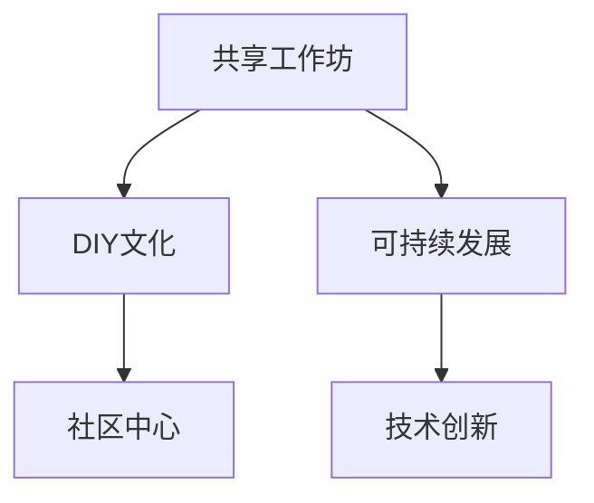
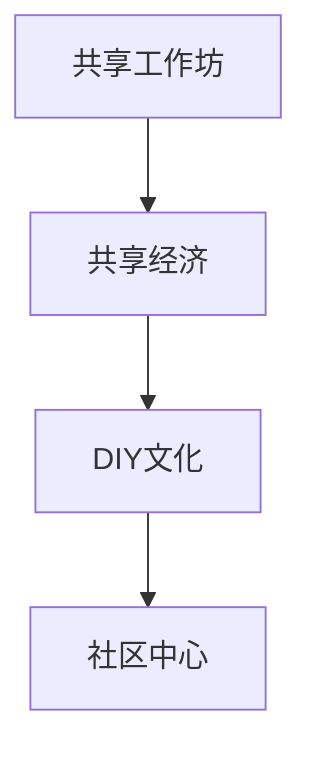
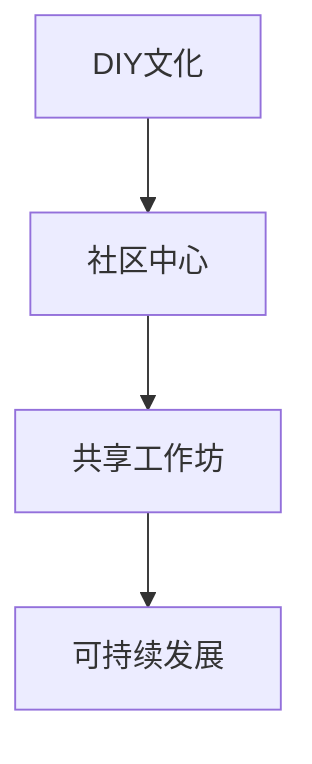
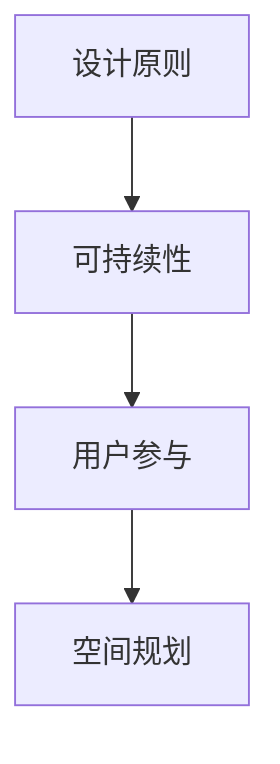
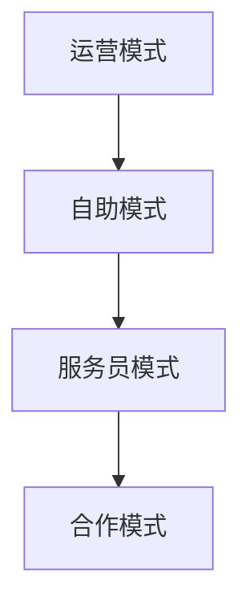
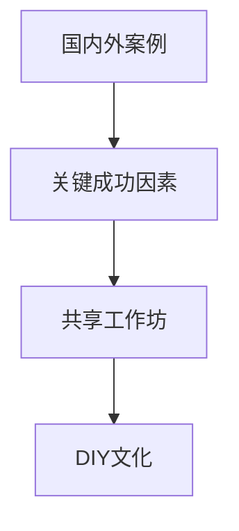
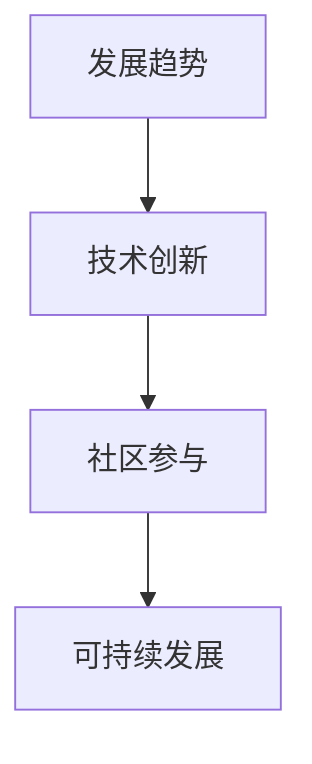

                 

### 文章标题：新型城市共享工作坊：DIY文化的社区中心

#### 关键词：新型城市共享工作坊、DIY文化、社区中心、可持续发展、技术创新

#### 摘要：
本文探讨了新型城市共享工作坊作为DIY文化的社区中心的重要性和作用。通过对共享工作坊的基本原理、DIY文化的内涵与价值、新型城市共享工作坊的设计与实践、社区中心的运营与管理以及成功案例的分析，展示了共享工作坊在推动社区建设、促进可持续发展和技术创新中的独特价值。本文旨在为城市规划者、社区建设者和DIY爱好者提供有价值的参考，共同构建和谐、创新的社区文化。

### 引言

#### 核心概念与联系

#### 背景介绍

城市共享工作坊作为一种新兴的社区服务形式，起源于20世纪末的共享经济理念。随着城市化进程的加快和人们对社区参与需求的增长，共享工作坊逐渐成为城市社区的重要组成部分。它不仅为居民提供了一个共享资源和技能的平台，还促进了DIY文化的传播和社区凝聚力的提升。

### 第一部分：共享工作坊的基本原理

#### 第1章：共享工作坊的定义与类型

##### 核心概念与联系

##### 1.1 共享工作坊的定义

共享工作坊，是一种以共享资源和技能为核心，提供公共服务和互助合作的空间。它不同于传统的商业租赁和工作室，更强调社区参与和资源的高效利用。

###### 1.1.1 共享经济的概念

共享经济，是指通过共享资源、技能和时间来降低成本、提高效率，实现资源的最优配置。共享工作坊作为共享经济的具体实践，体现了这一理念的核心价值。

###### 1.1.2 工作坊在共享经济中的角色

共享工作坊在共享经济中扮演着多重角色，包括资源提供者、服务提供者和社区建设者。它通过共享工具、设备和工作空间，为居民提供了一个低成本、高效益的创新创业环境。

##### 1.2 共享工作坊的类型

共享工作坊根据功能和目标的不同，可以分为以下几类：

###### 1.2.1 DIY文化的工作坊

DIY文化的工作坊，主要面向对创意制作和手工艺术感兴趣的居民。在这里，人们可以学习各种手工艺技术，分享创意想法，共同完成作品。

###### 1.2.2 创意工作坊

创意工作坊，侧重于艺术创作和设计创新。它为艺术家和设计师提供了一个交流和展示作品的平台，推动了创意产业的繁荣。

###### 1.2.3 科技创新工作坊

科技创新工作坊，以科技创新和创业孵化为主要目标。它为科技爱好者提供了实验设备和技术支持，激发了创新活力。

### 第二部分：DIY文化的社区中心

#### 第2章：DIY文化的内涵与价值

##### 核心概念与联系

##### 2.1 DIY文化的定义

DIY文化，即“自己动手做”，强调个体通过自己的努力和创意来实现目标。它倡导独立、自主和创新的精神，对提高个人技能和满足精神需求有着重要意义。

###### 2.1.1 DIY的起源与发展

DIY文化的起源可以追溯到19世纪末的美国，随着工业革命的推进，人们开始重视自我实现和个性表达。经过几十年的发展，DIY文化已经成为全球范围内的一种重要文化现象。

###### 2.1.2 DIY文化的核心要素

DIY文化的核心要素包括：自主性、创造性、实用性和共享性。这些要素共同构成了DIY文化的独特魅力，吸引了越来越多的人参与其中。

##### 2.2 DIY文化的价值

DIY文化在社区建设中发挥着重要作用，具体体现在以下几个方面：

###### 2.2.1 社交价值

DIY文化提供了一个交流互动的平台，使居民之间建立了更加紧密的联系。通过共同参与制作和分享成果，居民之间的信任和友谊得以增强。

###### 2.2.2 创新价值

DIY文化鼓励居民发挥自己的创意和想象力，通过实践和探索，推动创新思维的发展。这种创新精神对于社区的经济和社会发展具有重要意义。

###### 2.2.3 社区建设价值

DIY文化促进了社区参与和自治，使居民更加关注社区事务，积极参与社区建设。这不仅提升了社区的凝聚力和活力，也为社区的可持续发展奠定了基础。

### 第三部分：新型城市共享工作坊的设计与实践

#### 第3章：新型城市共享工作坊的设计原则

##### 核心概念与联系

##### 3.1 可持续性的设计原则

新型城市共享工作坊的设计应遵循可持续性的原则，以确保其长期运营和社区发展的可持续性。

###### 3.1.1 空间规划

空间规划是共享工作坊设计的重要环节。合理规划空间，既能满足不同类型的工作需求，又能提高资源利用效率。例如，设置开放式空间和封闭式空间，满足居民不同的工作需求。

###### 3.1.2 资源共享

资源共享是共享工作坊的核心价值之一。通过合理配置和共享资源，如工具、设备和工作空间，可以降低运营成本，提高资源利用效率。

##### 3.2 用户参与的设计原则

用户参与是新型城市共享工作坊成功的关键。设计时应充分考虑用户的参与需求，提供多样化的参与方式。

###### 3.2.1 用户需求调研

在规划阶段，应进行用户需求调研，了解居民的实际需求和偏好。这有助于设计出符合用户需求的工作坊，提高用户满意度。

###### 3.2.2 用户参与决策

用户参与决策是激发用户积极性和归属感的重要手段。在设计过程中，应邀请用户参与决策，使其成为工作坊的主人。

### 第四部分：社区中心的运营与管理

#### 第4章：共享工作坊的运营模式

##### 核心概念与联系

##### 4.1 运营模式的选择

共享工作坊的运营模式应根据实际情况进行选择，以实现高效运营和可持续发展。

###### 4.1.1 自助模式

自助模式，即用户自行管理工作坊，包括资源使用、维护和安全等方面。这种模式强调用户自主性和责任感，适用于资源丰富、管理规范的工作坊。

###### 4.1.2 服务员模式

服务员模式，即由专门的工作人员负责工作坊的运营和管理。这种模式适用于资源有限、管理要求较高的情况，可以确保工作坊的稳定运营。

###### 4.1.3 合作模式

合作模式，即由多个机构或个人共同运营管理工作坊。这种模式可以实现资源整合、优势互补，提高工作坊的运营效率。

##### 4.2 运营中的挑战与应对策略

共享工作坊在运营过程中面临诸多挑战，如资金问题、安全问题和管理问题。以下为一些应对策略：

###### 4.2.1 资金问题

解决资金问题，可以通过多元化融资渠道、提高资源利用效率、开展商业合作等方式来缓解。

###### 4.2.2 安全问题

安全问题，可以通过制定严格的安全规章制度、定期安全检查、培训用户安全意识等方式来保障。

###### 4.2.3 社区成员管理

社区成员管理，可以通过建立会员制度、制定社区规范、定期组织活动等方式来促进社区成员的积极性和归属感。

### 第五部分：成功案例分析

#### 第5章：国内外新型城市共享工作坊案例

##### 核心概念与联系

##### 5.1 国内案例介绍

国内的新型城市共享工作坊案例丰富多样，以下介绍两个具有代表性的案例：

###### 5.1.1 案例A：XXX社区中心

XXX社区中心以DIY文化为核心，提供多样化的工作坊活动，如手工艺术、创意设计、科技创新等。通过用户参与和资源共享，XXX社区中心成功建立了和谐的社区文化。

###### 5.1.2 案例B：XXX共享工作坊

XXX共享工作坊注重可持续发展，采用绿色能源和环保材料，为居民提供了一个绿色、健康的工作环境。通过多元化的运营模式，XXX共享工作坊实现了良好的经济效益和社会效益。

##### 5.2 国际案例介绍

国际上的新型城市共享工作坊案例也极具特色，以下介绍两个具有代表性的案例：

###### 5.2.1 案例A：XXX社区共享空间

XXX社区共享空间是一个集创新、艺术和生活于一体的多功能空间。通过举办各类创意活动和工作坊，XXX社区共享空间成功吸引了大量居民参与，促进了社区文化的繁荣。

###### 5.2.2 案例B：XXX创意工作坊

XXX创意工作坊是一个专注于创意产业的工作坊，为艺术家和设计师提供了一个交流和展示作品的平台。通过合作模式和用户参与，XXX创意工作坊实现了良好的运营效果和品牌影响力。

### 第六部分：未来展望

#### 第6章：新型城市共享工作坊的发展趋势

##### 核心概念与联系

##### 6.1 技术发展对工作坊的影响

随着技术的不断发展，新型城市共享工作坊将迎来新的机遇和挑战。以下为几个值得关注的技术发展趋势：

###### 6.1.1 互联网技术

互联网技术的快速发展，为共享工作坊提供了更加便捷的运营和管理手段。通过在线平台，用户可以随时查询工作坊信息、预约参与活动，实现了工作坊的无缝对接。

###### 6.1.2 新材料技术

新材料技术的进步，为共享工作坊提供了更多创新的可能。新型材料具有轻便、环保、耐用等特点，可以应用于各类DIY项目和创意作品。

###### 6.1.3 绿色能源技术

绿色能源技术的推广，有助于共享工作坊实现可持续发展。使用太阳能、风能等清洁能源，可以降低工作坊的能耗，减少环境污染。

##### 6.2 社区参与与可持续发展

社区参与和可持续发展是新型城市共享工作坊未来发展的关键。以下为几个值得关注的方面：

###### 6.2.1 社区自治

社区自治有助于提高工作坊的运营效率和社区成员的积极性。通过建立社区自治组织，居民可以共同参与工作坊的规划和管理。

###### 6.2.2 可持续社区发展

可持续社区发展是新型城市共享工作坊的核心目标之一。通过推动社区绿色发展和创新，共享工作坊可以为社区的可持续发展做出贡献。

### 结论

新型城市共享工作坊作为DIY文化的社区中心，具有巨大的发展潜力和社会价值。通过本文的探讨，我们认识到共享工作坊在促进社区建设、推动可持续发展和技术创新方面的重要作用。未来，随着技术的不断进步和社区参与的深入，新型城市共享工作坊将迎来更加广阔的发展空间。

### 作者信息

作者：AI天才研究院/AI Genius Institute & 禅与计算机程序设计艺术 /Zen And The Art of Computer Programming

---

请注意，以上内容是一个大致的框架和示例，您可以根据实际需求进行修改和补充。确保每个部分的内容丰富、具体、详细，以满足字数和完整性要求。在撰写过程中，可以结合实际案例和数据来增强文章的说服力和实用性。祝您写作顺利！

