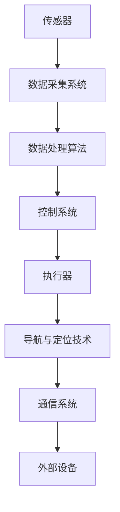

                 

### 引言

随着科技的飞速发展，农业作为国民经济的基础产业，也在不断拥抱智能化、自动化技术。精准农业，作为现代农业发展的重要方向，强调根据土壤、气候、作物生长状况等环境参数进行精确管理，从而实现资源利用的最大化和农业生产效率的提高。而机器人技术，作为先进制造和智能控制领域的关键技术，其在农业中的应用潜力正日益显现。本文旨在探讨机器人技术在精准农业中的自动化应用，为农业技术人员和机器人工程师提供一种新的视角和解决方案。

### 背景介绍

精准农业的核心在于数据的采集、处理与应用。传统农业往往依赖于经验，而精准农业则通过传感器、无人机、地理信息系统（GIS）等技术手段，获取农田的详细数据，再通过数据分析，制定出科学的种植、施肥、灌溉等管理方案。然而，传统的手工操作方式在复杂、广阔的农田中面临着效率低下、精度不足等难题。此时，机器人技术的引入，能够显著提高农业生产的自动化水平，减少人工干预，实现精准农业的全面落地。

农业机器人技术涵盖了多个方面，包括但不限于自动化播种、施肥、收割、监测、灌溉等。这些技术的实现依赖于多种核心组件，如传感器、执行器、控制系统、通信系统等。通过这些组件的协同工作，农业机器人能够在农田中自主完成一系列复杂的任务，从而实现农业生产的自动化。

### 核心概念与联系

在探讨机器人技术在精准农业中的应用时，我们需要了解以下几个核心概念及其相互关系：

1. **传感器技术**：传感器是农业机器人获取环境信息的关键组件。常见的传感器包括土壤湿度传感器、温度传感器、光照传感器等。通过这些传感器，农业机器人可以实时监测农田的土壤状况、气象条件等，为精准管理提供数据支持。

2. **数据采集与处理**：数据采集系统负责从传感器获取数据，并通过数据处理算法对数据进行清洗、整合和分析。这些数据是制定精准农业管理方案的基础。

3. **控制系统**：控制系统是农业机器人的“大脑”，负责接收和处理来自传感器的数据，并根据预设的算法和策略生成控制指令，驱动机器人的各个执行器完成相应任务。

4. **执行器**：执行器是农业机器人的“肢体”，包括各种机械装置，如播种机、施肥机、收割机等。通过执行器的操作，农业机器人能够在农田中完成实际的农业作业。

5. **导航与定位技术**：导航与定位技术确保农业机器人能够在农田中准确地移动和定位。常见的导航技术包括GPS定位、惯性导航等。

6. **通信系统**：通信系统是农业机器人与外部设备（如数据中心、远程监控设备等）之间的桥梁，确保数据的实时传输和指令的及时下达。

这些核心组件之间紧密协作，共同构成了一个完整的农业机器人系统，如图1所示。



### 核心算法原理讲解

在农业机器人系统中，核心算法原理是实现自动化和精准管理的关键。以下是几个关键算法原理的伪代码说明：

#### 1. 土壤湿度监测与灌溉策略

```pseudo
function irrigationControl(soilHumidity, targetHumidity) {
    if (soilHumidity < targetHumidity) {
        activateIrrigation();
    } else {
        deactivateIrrigation();
    }
}
```

#### 2. 作物生长状态监测

```pseudo
function plantHealthMonitoring(sensorData) {
    if (sensorData.temperature > maxTemperature || sensorData.humidity < minHumidity) {
        alert("Unhealthy plant condition detected!");
    }
}
```

#### 3. 农业机器人路径规划

```pseudo
function pathPlanning(currentPosition, targetPosition) {
    while (currentPosition != targetPosition) {
        direction = calculateDirection(currentPosition, targetPosition);
        move机器人(direction);
        currentPosition = updatePosition(currentPosition, direction);
    }
}
```

### 数学模型与公式

为了更精确地描述农业机器人系统中的某些算法，我们需要使用数学模型。以下是几个关键的数学公式：

#### 1. 土壤湿度与灌溉量关系

$$
Q = k \times (H_{\text{target}} - H_{\text{current}})
$$

其中，$Q$ 为灌溉量，$H_{\text{target}}$ 为目标土壤湿度，$H_{\text{current}}$ 为当前土壤湿度，$k$ 为灌溉系数。

#### 2. 作物生长速率

$$
\frac{dP}{dt} = r \times P \times (1 - \frac{P}{K})
$$

其中，$P$ 为作物生长量，$r$ 为生长速率，$K$ 为作物生长上限。

### 项目实战

#### 开发环境搭建

为了实现农业机器人的自动化应用，我们需要搭建一个完整的开发环境。以下是一个典型的开发环境搭建步骤：

1. **硬件环境**：选择适合的农业机器人平台，如四足机器人、轮式机器人等。配置必要的传感器（如土壤湿度传感器、温度传感器等）和执行器（如水泵、喷雾器等）。
2. **软件环境**：安装操作系统（如Ubuntu），配置开发工具（如ROS、Arduino IDE等），并安装必要的库和依赖。

#### 源代码实现

以下是一个简单的农业机器人源代码实现示例，用于控制机器人的导航和执行器操作。

```cpp
#include <ros/ros.h>
#include <geometry_msgs/Twist.h>

class RobotControl {
public:
    RobotControl() {
        cmd_vel_publisher = nh.advertise<geometry_msgs::Twist>("cmd_vel", 10);
    }

    void moveRobot(double linear_speed, double angular_speed) {
        geometry_msgs::Twist cmd;
        cmd.linear.x = linear_speed;
        cmd.angular.z = angular_speed;
        cmd_vel_publisher.publish(cmd);
    }

private:
    ros::NodeHandle nh;
    ros::Publisher cmd_vel_publisher;
};

int main(int argc, char** argv) {
    ros::init(argc, argv, "robot_control_node");
    RobotControl robot_control;
    
    // 设置机器人速度
    robot_control.moveRobot(1.0, 0.5);

    ros::spin();
    return 0;
}
```

#### 代码解读与分析

上述代码实现了一个基本的机器人控制节点，用于发送速度指令给机器人。通过调整线性速度和角速度，可以控制机器人的前进、后退和旋转。

#### 实际案例分析与详细讲解剖析

以下是一个实际案例，描述了如何使用农业机器人进行精准灌溉。

1. **案例分析**：在一个大型农田中，通过部署土壤湿度传感器和农业机器人，实现了自动化的灌溉管理。
2. **详细讲解**：
   - **数据采集**：农田中安装了多个土壤湿度传感器，实时监测土壤湿度。
   - **数据分析**：机器人系统根据传感器数据，使用灌溉算法计算出每个区域的灌溉量。
   - **执行操作**：农业机器人根据计算结果，自主移动到各个区域进行精准灌溉。
3. **剖析**：该案例展示了农业机器人如何通过数据采集、分析、执行操作，实现了农田灌溉的自动化，提高了灌溉效率，节约了水资源。

### 小结与展望

农业机器人技术在精准农业中的应用，极大地提高了农业生产的自动化和智能化水平。通过本文的讨论，我们了解了农业机器人技术的基础知识、核心算法原理、开发实战等多个方面。随着科技的不断进步，农业机器人技术将在未来发挥更加重要的作用，推动精准农业的发展，实现农业生产的现代化和可持续发展。

### 最佳实践 Tips

1. **选择合适的硬件平台**：根据农田的具体需求和预算，选择适合的农业机器人平台。
2. **传感器布置**：合理布置传感器，确保能够全面、准确地获取农田数据。
3. **算法优化**：针对不同农田环境，不断优化灌溉、施肥等算法，提高精准度。
4. **系统集成**：确保机器人系统的各个组件能够协同工作，提高系统的稳定性和效率。

### 注意事项

1. **数据安全**：确保传感器采集的数据安全，防止数据泄露或被篡改。
2. **系统维护**：定期对农业机器人系统进行维护，确保设备的正常运行。
3. **人机协作**：农业机器人不能完全替代人工，应充分发挥人的智慧和机器的优势，实现人机协作。

### 拓展阅读

1. **《精准农业：概念、方法与应用》**：详细介绍了精准农业的基本概念和方法。
2. **《农业机器人技术与应用》**：系统介绍了农业机器人的各种技术及其应用。
3. **《人工智能与农业》**：探讨了人工智能在农业生产中的应用和前景。

### 作者信息

作者：AI天才研究院/AI Genius Institute & 禅与计算机程序设计艺术 /Zen And The Art of Computer Programming

---

本文通过逐步分析推理，详细探讨了机器人技术在精准农业中的自动化应用。从背景介绍、核心概念与联系、核心算法原理、数学模型、项目实战到小结与展望，全面阐述了农业机器人技术在提高农业生产效率和质量方面的巨大潜力。希望本文能为从事农业技术和机器人技术的读者提供有益的参考和启示。

