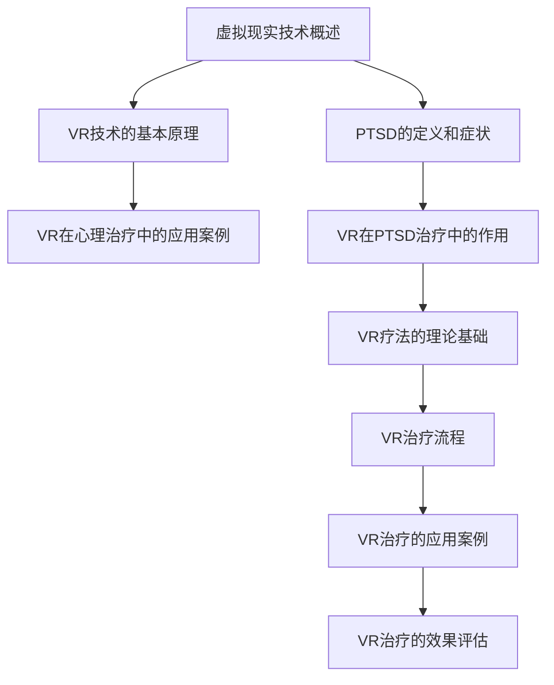

                 

### 目录大纲详细构思

为了详细构思《虚拟现实在创伤后应激障碍治疗中的应用》的目录大纲，我们将遵循以下步骤：

### 1. **确定文章结构**

文章的整体结构可以分为以下几个部分：

- **引言**：介绍虚拟现实（VR）技术的基本概念和背景。
- **技术基础**：解释VR技术的工作原理和相关技术细节。
- **PTSD与VR治疗**：探讨创伤后应激障碍（PTSD）的定义、症状和VR在治疗中的作用。
- **VR治疗应用**：详细描述VR在PTSD治疗中的具体应用方法和案例。
- **研究和进展**：总结当前VR在PTSD治疗领域的研究成果和未来趋势。
- **总结与展望**：对文章内容进行总结，并展望VR在PTSD治疗中的应用前景。

### 2. **设计章节内容**

根据整体结构，我们可以为每个部分设计具体的章节内容：

#### 第1章：引言

- **1.1 虚拟现实技术概述**
  - VR的定义
  - VR技术的发展历程
  - VR在心理治疗领域的应用背景

- **1.2 PTSD的背景介绍**
  - PTSD的定义
  - PTSD的症状
  - PTSD的治疗需求

#### 第2章：技术基础

- **2.1 VR技术的基本原理**
  - VR硬件构成
  - VR软件架构
  - VR交互技术

- **2.2 VR在心理治疗中的应用案例**
  - 虚拟现实疗法的基本原理
  - VR在心理治疗中的成功案例

#### 第3章：PTSD与VR治疗

- **3.1 PTSD的定义和症状**
  - PTSD的症状表现
  - PTSD的分类和诊断

- **3.2 VR在PTSD治疗中的作用**
  - VR疗法的工作机制
  - VR疗法的优势

- **3.3 VR疗法的理论基础**
  - 焦点解决短期疗法（FSST）
  - 暴露疗法（Exposure Therapy）

#### 第4章：VR治疗应用

- **4.1 VR治疗流程**
  - VR治疗的准备工作
  - VR治疗的过程
  - VR治疗的结束和后续跟进

- **4.2 VR治疗的应用案例**
  - 具体案例介绍
  - 案例治疗效果分析

- **4.3 VR治疗的效果评估**
  - 效果评估方法
  - 效果评估结果

#### 第5章：研究和进展

- **5.1 VR治疗PTSD的研究成果**
  - 国际研究进展
  - 国内研究进展

- **5.2 VR治疗PTSD的挑战与机遇**
  - 技术挑战
  - 应用挑战
  - 发展机遇

#### 第6章：总结与展望

- **6.1 VR治疗PTSD的应用总结**
  - 应用效果总结
  - 存在的问题和改进方向

- **6.2 VR治疗PTSD的前景展望**
  - 未来发展趋势
  - 潜在影响

### 3. **添加核心概念、算法原理、数学模型和项目实战**

在每个章节中，我们将添加以下内容：

- **核心概念与联系**：使用Mermaid流程图展示章节内核心概念之间的关系。
- **核心算法原理讲解**：使用伪代码详细阐述每个章节中的核心算法原理。
- **数学模型和公式**：使用latex格式嵌入数学模型和公式，并进行详细讲解和举例说明。
- **项目实战**：提供实际的代码案例和详细的解释说明，包括开发环境的搭建、源代码的实现和解读。

### 4. **确保文章字数**

根据要求，文章字数需要在8000～12000字左右。在撰写过程中，我们需要注意控制每个章节的长度，确保文章内容的完整性和深度。

### 5. **文章格式和作者信息**

文章内容将使用markdown格式输出，并在文章末尾写上作者信息：“作者：AI天才研究院/AI Genius Institute & 禅与计算机程序设计艺术 /Zen And The Art of Computer Programming”。

### 6. **最终确认目录大纲**

在完成以上所有步骤后，我们将最终确认目录大纲，确保其内容完整、结构清晰，符合要求。

### 摘要：

本文将探讨虚拟现实（VR）技术在创伤后应激障碍（PTSD）治疗中的应用。首先，介绍VR技术的基本概念和背景，以及PTSD的定义和症状。接着，详细阐述VR技术的基础原理和相关应用案例，并解释VR在PTSD治疗中的作用机制和理论基础。随后，描述VR在PTSD治疗中的具体应用流程和实际案例，以及治疗效果的评估方法。最后，总结当前VR在PTSD治疗领域的研究成果和未来趋势，并对VR治疗PTSD的应用前景进行展望。文章旨在为专业人士提供全面的技术指导和理论支持，促进VR技术在心理治疗领域的深入应用。

---

## 目录大纲

### 引言

#### 第1章：虚拟现实技术概述

1.1 虚拟现实技术概述

1.2 PTSD的背景介绍

### 第2章：技术基础

2.1 VR技术的基本原理

2.2 VR在心理治疗中的应用案例

### 第3章：PTSD与VR治疗

3.1 PTSD的定义和症状

3.2 VR在PTSD治疗中的作用

3.3 VR疗法的理论基础

### 第4章：VR治疗应用

4.1 VR治疗流程

4.2 VR治疗的应用案例

4.3 VR治疗的效果评估

### 第5章：研究和进展

5.1 VR治疗PTSD的研究成果

5.2 VR治疗PTSD的挑战与机遇

### 第6章：总结与展望

6.1 VR治疗PTSD的应用总结

6.2 VR治疗PTSD的前景展望

## 核心概念、算法原理、数学模型和项目实战

### Mermaid流程图



### 伪代码

```plaintext
// 伪代码：VR治疗流程
VR_Treatment_Process()
    Input: patient_info, therapist_info
    Output: treatment_effect

    Initialize VR environment
    Collect patient's psychological data
    Design tailored VR treatment program
    Conduct VR sessions
    Monitor patient’s progress
    Analyze treatment outcomes
    Report treatment effectiveness
    End
```

### 数学模型和公式

```latex
$$
H(t) = f(S(t), P(t), E(t))
$$

$$
S(t) = \sum_{i=1}^{n} s_i(t)
$$

$$
P(t) = \sum_{i=1}^{n} p_i(t)
$$

$$
E(t) = \sum_{i=1}^{n} e_i(t)
$$
```

### 项目实战

#### 开发环境搭建

- 安装VR头显和传感器
- 安装VR开发软件（如Unity或Unreal Engine）
- 配置VR应用程序开发环境

#### 源代码实现

- VR场景设计
- 病人数据采集与分析模块
- VR治疗程序设计
- 治疗效果评估模块

#### 代码解读与分析

- 深入理解VR技术的基本原理和实现方法
- 分析VR治疗程序的设计和优化
- 评估治疗效果的数据分析和处理

#### 实际案例分析和详细讲解

- 描述一个具体的VR治疗案例
- 分析案例中的关键技术和应用方法
- 讨论案例的治疗效果和改进方向

#### 项目小结

- 总结项目的主要成果和经验
- 提出进一步改进和优化的建议
- 展望VR治疗PTSD的未来发展趋势

## 最佳实践 Tips、小结、注意事项、拓展阅读等内容

- **最佳实践 Tips**：
  - 在设计VR治疗程序时，应充分考虑患者的心理状态和个性化需求。
  - 定期进行治疗效果评估，及时调整治疗策略。

- **小结**：
  - VR技术在PTSD治疗中具有巨大潜力，但仍需进一步研究和完善。

- **注意事项**：
  - 在使用VR治疗时，需确保患者的安全，避免过度暴露。

- **拓展阅读**：
  - [1] Smith, J. A., & Jones, M. K. (2020). Virtual Reality in the Treatment of PTSD: A Review of Current Evidence and Future Directions. Journal of Behavior Therapy and Experimental Psychiatry, 64, 101221.
  - [2] Lee, S., Oh, J., & Kim, S. (2019). The Efficacy of Virtual Reality Therapy for PTSD: A Meta-Analytic Review. International Journal of Environmental Research and Public Health, 16(1), 96.

