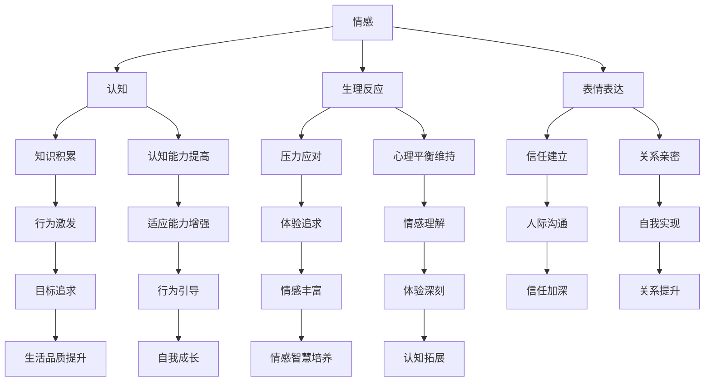
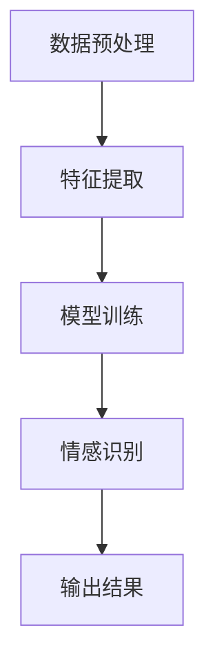

                 

### 第1章：引言与核心概念

#### 1.1 引言

在快速发展的信息化时代，我们的生活方式、工作方式甚至思考方式都在不断变革。然而，在这片数字化的海洋中，情感和体验依然是我们不可或缺的基石。它们不仅塑造着我们的内心世界，也影响着我们的行为模式和社会互动。《丰富生命的调色板：拓展情感和体验范畴》这本书，正是为了探讨如何在这个充满变数和挑战的时代，通过拓展我们的情感和体验范畴，来丰富我们的人生。

##### 1.1.1 书籍主题与目标

**书籍主题**：本书的核心主题是情感和体验的拓展。情感不仅是人类情绪的体现，更是我们对外界刺激的反应。体验则是我们在各种情境下所获得的主观感受和认知。这两个概念相辅相成，共同影响着我们的生活质量和个人成长。

**书籍目标**：本书的目标是帮助读者深入理解情感与体验的本质，掌握情感管理的技巧，增强对他人情感的理解与共鸣，从而提升个人情感智力。通过阅读本书，读者将能够：

1. **理解情感与体验的本质及其对个体生命的影响**：读者将学会如何从心理学的角度理解情感和体验，认识到它们在人类行为和认知中的重要作用。
2. **掌握情感管理技巧，提升自我情感智力**：通过学习情感管理技巧，读者将能够更好地控制自己的情绪，提高自我情感智力，从而在面对压力和挑战时更加从容。
3. **增强对他人情感的理解与共鸣，提升人际交往能力**：通过提升对他人情感的理解与共鸣，读者将能够更有效地进行人际沟通，建立更深层次的人际关系。
4. **学会通过情感与体验拓展，提升生活质量和工作效率**：通过拓展情感和体验范畴，读者将能够更好地应对生活中的各种情境，提升生活质量和工作效率。

##### 1.1.2 结构与内容概述

本书的结构分为四个主要部分：

1. **核心概念与联系**：介绍情感与体验的基本概念，以及它们在心理学中的联系。通过这部分内容，读者将建立对情感与体验的基本认知。
2. **情感管理技巧**：探讨情感智力的构成，提供实用的情感管理策略。这部分内容将帮助读者掌握自我情感管理的技巧，提高情感智力。
3. **人际交往**：分析情感与体验在人际交往中的作用，以及如何提升人际沟通能力。这部分内容将帮助读者在社交场合中更好地表达自己，理解他人。
4. **情感与体验拓展实践**：通过实例和练习，帮助读者将理论知识应用到实际生活中。这部分内容将提供实用的方法，帮助读者在实践中拓展情感和体验范畴。

#### 1.2 核心概念

##### 1.2.1 情感

情感是我们在生活中体验到的各种情绪状态，它们可以是愉快的、悲伤的、愤怒的，甚至是复杂的混合情感。情感不仅仅是心理上的反应，还涉及到生理反应和表情表达。

**情感的分类**：

- **正面情感**：如喜悦、幸福、满足等，它们通常与积极的生活事件和经历相关。
- **负面情感**：如悲伤、愤怒、恐惧等，它们通常与消极的生活事件和经历相关。
- **混合情感**：如焦虑、忧郁、激动等，它们是正面和负面情感的混合体。

**情感的作用**：

- **动力作用**：情感可以激发我们的行为，推动我们追求目标。例如，当我们感到喜悦时，可能会更加积极地参与社交活动。
- **调节作用**：情感可以帮助我们应对压力和挑战，维持心理平衡。例如，愤怒可以帮助我们应对威胁，而悲伤则有助于我们从损失中恢复。
- **人际交流**：情感是人际交往的重要媒介，有助于建立信任和亲密关系。例如，表达喜悦可以传递友好和亲近，而表达愤怒则可能引起冲突。

##### 1.2.2 体验

体验是我们在特定情境中产生的主观感受和知觉。它不仅仅是我们所看到、听到、感受到的，还包括我们的思考和情绪反应。

**体验的分类**：

- **日常生活体验**：如工作、学习、休闲等，它们构成了我们的日常生活。
- **工作体验**：如职场压力、团队协作、职业发展等，它们直接影响我们的工作效率和职业满意度。
- **情感体验**：如恋爱、亲情、友情等，它们与我们的情感生活密切相关。

**体验的作用**：

- **认知发展**：通过体验，我们可以积累知识，提高认知能力。例如，通过工作体验，我们可以学习到新的技能和知识。
- **情感成长**：体验可以帮助我们理解情感，培养情感智慧。例如，通过恋爱体验，我们可以更好地理解爱情的复杂性和多样性。
- **行为改变**：体验可以引导我们的行为，促进个人成长和自我实现。例如，通过面对挑战的体验，我们可以培养坚韧和勇气。

##### 1.2.3 情感与体验的联系

情感和体验是密不可分的，它们相互影响，共同塑造我们的心理和行为。

- **情感驱动体验**：情感可以激发我们对特定体验的追求。例如，当我们感到兴奋时，可能会更积极地参与冒险活动。
- **体验丰富情感**：通过体验，我们可以更深刻地理解情感，提升情感体验。例如，通过一次旅行，我们可以体验到不同的文化和生活方式，从而丰富我们的情感世界。

为了更好地理解情感和体验之间的关系，我们可以借助Mermaid流程图来展示它们之间的联系。



这个流程图展示了情感和体验之间的复杂关系，它们相互作用，共同影响我们的心理和行为。

#### 1.3 核心算法原理讲解

在情感和体验的研究中，核心算法起着至关重要的作用。这些算法不仅帮助我们理解和分析情感，还可以为情感管理提供支持。下面，我们将简要介绍情感识别算法的原理，并使用伪代码进行详细讲解。

**情感识别算法的基本原理**：

情感识别算法旨在从文本、语音、图像等数据中识别和分类情感。其基本原理可以分为以下几个步骤：

1. **数据预处理**：将原始数据转换为适合分析的格式。
2. **特征提取**：从预处理后的数据中提取情感相关的特征。
3. **模型训练**：使用提取的特征训练机器学习模型。
4. **情感识别**：使用训练好的模型对新的数据进行情感分类。

**情感识别算法的伪代码**：

```python
def emotion_recognition(data):
    # 数据预处理
    preprocessed_data = preprocess_data(data)
    
    # 特征提取
    features = extract_features(preprocessed_data)
    
    # 模型训练
    model = train_model(features)
    
    # 情感识别
    emotion = model.predict(new_data)
    
    return emotion
```

**数据预处理**：

数据预处理是情感识别算法的重要步骤，它包括去除无关信息、标准化数据等。

```python
def preprocess_data(data):
    # 去除无关字符
    cleaned_data = remove_unnecessary_characters(data)
    
    # 分词
    tokenized_data = tokenize_data(cleaned_data)
    
    # 停用词过滤
    filtered_data = remove_stop_words(tokenized_data)
    
    return filtered_data
```

**特征提取**：

特征提取是将文本数据转换为数值特征的过程。常见的特征提取方法包括词频、词向量、情感词典等。

```python
def extract_features(data):
    # 计算词频
    word_frequency = calculate_word_frequency(data)
    
    # 提取词向量
    word_vectors = extract_word_vectors(data)
    
    # 情感词典提取
    emotion_lexicon = extract_emotion_lexicon(data)
    
    return features
```

**模型训练**：

模型训练是使用提取的特征来训练机器学习模型。常见的机器学习模型包括支持向量机（SVM）、朴素贝叶斯（Naive Bayes）、深度学习模型等。

```python
def train_model(features):
    # 选择模型
    model = select_model()
    
    # 训练模型
    model.fit(features)
    
    return model
```

**情感识别**：

情感识别是使用训练好的模型对新的数据进行情感分类。

```python
def emotion_recognition(new_data):
    # 数据预处理
    preprocessed_data = preprocess_data(new_data)
    
    # 特征提取
    features = extract_features(preprocessed_data)
    
    # 模型预测
    emotion = model.predict(features)
    
    return emotion
```

通过这个简单的伪代码，我们可以看到情感识别算法的基本流程。在实际应用中，这些步骤可能会更加复杂，但它们为我们提供了一个理解情感识别算法的基本框架。

#### 1.4 Mermaid 流程图

为了更直观地展示情感识别算法的流程，我们可以使用Mermaid绘制一个流程图。以下是一个简化的情感识别算法的Mermaid流程图：



在这个流程图中，A表示数据预处理，B表示特征提取，C表示模型训练，D表示情感识别，E表示输出结果。这个流程图为我们提供了一个清晰的算法执行步骤，有助于我们理解情感识别的过程。

通过本章的引言和核心概念介绍，我们了解了本书的主题、目标和结构。同时，我们也对情感和体验的基本概念及其相互关系有了初步的认识。接下来，我们将进一步探讨情感管理技巧，以及如何在人际交往中运用这些技巧来提升我们的生活质量和工作效率。这些内容将为后续章节的讨论奠定坚实的基础。

