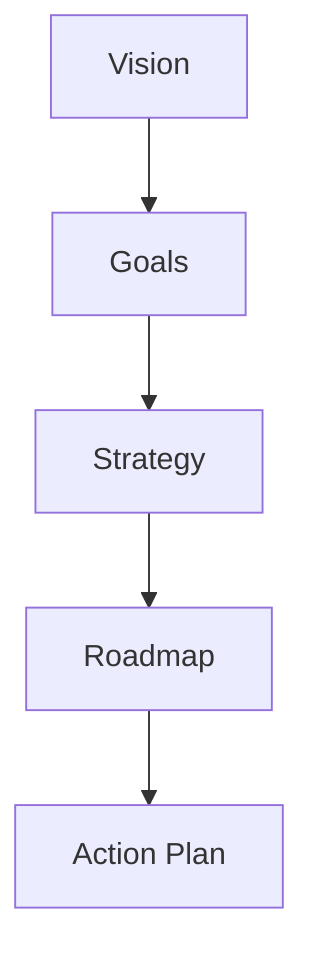

                 


### 一、背景介绍

在当今快速变化且竞争激烈的世界中，愿景的重要性越来越受到关注。对于个人和企业而言，一个明确的愿景是成功的关键。愿景不仅为组织或个人提供了明确的方向，还能激发团队成员的创造力和积极性。然而，将愿景转化为实际行动并非易事，它需要系统化的规划和细致的实施。本文将探讨如何从愿景到行动，实现梦想的具体路径规划。

本文旨在帮助读者理解愿景的本质，了解如何制定从愿景到策略的转换方法，规划实现愿景的具体路径，并最终通过实际行动将愿景变为现实。我们将详细分析路径规划、资源与时间管理、行动策略与实践，以及监控与调整的重要性。此外，文章还将结合实际案例，提供实用的技巧和最佳实践，以帮助读者在实际操作中更加高效地实现自己的愿景。

### 二、核心概念与联系

在探讨如何实现愿景的过程中，有几个核心概念需要明确，并理解它们之间的相互关系。

1. **愿景（Vision）**：愿景是对未来的一种理想状态描述，它代表了组织或个人想要达到的目标。一个清晰且具有吸引力的愿景能够激发团队和个人的热情，并为他们提供前进的方向。

2. **目标（Goals）**：目标是愿景的具体化，是实现愿景过程中需要达成的具体里程碑。目标应该是具体、可衡量、可实现、相关和时限的（SMART）。

3. **策略（Strategy）**：策略是实现目标的方法和途径。它包括了一系列的决策和行动方案，指导组织或个人如何有效地利用资源，以达成目标。

4. **路径规划（Roadmap）**：路径规划是将愿景分解成可执行的任务和步骤，并确定实现这些任务的顺序和时间表。

5. **行动计划（Action Plan）**：行动计划是实现路径规划的具体操作步骤，它详细描述了如何执行任务，由谁负责，何时完成等。

为了更好地理解这些概念之间的关系，我们可以使用Mermaid流程图来展示它们之间的交互关系：



- **愿景** 是起点，它为整个过程提供了方向和动力。
- **目标** 是愿景的具体化，是朝着愿景前进的里程碑。
- **策略** 是实现目标的计划，它确定了如何使用资源和执行任务。
- **路径规划** 是策略的具体实施，将目标和策略转化为实际的步骤和顺序。
- **行动计划** 是最终的执行步骤，确保策略和路径规划的每一步都得以实现。

通过上述流程图，我们可以清晰地看到从愿景到行动的转换过程是如何逐步进行的。接下来，我们将详细探讨如何从愿景出发，逐步制定实现路径的具体步骤。

### 三、核心算法原理讲解

在实现愿景的过程中，核心算法原理起着至关重要的作用。以下是一个详细的伪代码，用于描述从愿景到行动的转换步骤：

```pseudo
// 步骤1：明确愿景
define vision as "实现全球领先的智能驾驶技术"

// 步骤2：定义目标
define goals as [
    "开发出一款具有高度自动驾驶功能的汽车",
    "实现自动驾驶汽车在全球范围内的普及",
    "建立自动驾驶技术的行业标准"
]

// 步骤3：制定策略
define strategy as {
    "市场研究": "了解市场需求和竞争情况",
    "技术研发": "投入大量资金和人力资源进行技术创新",
    "合作与联盟": "与其他公司建立战略合作伙伴关系"
}

// 步骤4：规划路径
define roadmap as [
    "市场调研（1个月）",
    "原型开发（6个月）",
    "产品测试（12个月）",
    "市场推广（24个月）"
]

// 步骤5：制定行动计划
define action_plan as {
    "市场调研": ["组建团队", "收集数据", "分析竞争"],
    "原型开发": ["设计方案", "开发原型", "测试调整"],
    "产品测试": ["测试车辆", "收集反馈", "优化产品"],
    "市场推广": ["品牌建设", "渠道拓展", "客户关系管理"]
}

// 步骤6：执行和监控
while not all goals are achieved do
    execute actions in action_plan
    monitor progress and adjust as needed
end while
```

### 四、数学模型和公式

在实现愿景的过程中，数学模型和公式可以帮助我们更科学地规划路径和资源分配。以下是一个简单的数学模型，用于描述资源分配和时间规划：

```latex
// 资源分配模型
Resource Allocation Model: \\
    R(t) = C \cdot (1 - e^{-\lambda t})
```

其中，R(t) 表示在时间 t 内可用的资源数量，C 是初始资源量，\(\lambda\) 是资源消耗率。

### 五、项目实战

为了更好地理解从愿景到行动的具体实施过程，以下是一个实际项目案例的详细解读。

#### 1. 项目背景

我们以一个智能驾驶汽车项目为例，探讨如何将愿景转化为实际的产品。

#### 2. 开发环境搭建

开发环境需要包括以下工具和软件：
- 编程语言：Python、C++等
- 框架：TensorFlow、PyTorch等
- 数据库：MySQL、MongoDB等
- 搭建流程：使用Docker和Kubernetes进行容器化部署

```shell
docker run -it --rm python:3.8-slim bash
pip install -r requirements.txt
```

#### 3. 源代码详细实现和代码解读

以下是自动驾驶算法的核心代码：

```python
# 导入必要的库
import numpy as np
import tensorflow as tf

# 定义神经网络结构
model = tf.keras.Sequential([
    tf.keras.layers.Flatten(input_shape=(28, 28)),
    tf.keras.layers.Dense(128, activation='relu'),
    tf.keras.layers.Dense(10, activation='softmax')
])

# 编译模型
model.compile(optimizer='adam',
              loss='sparse_categorical_crossentropy',
              metrics=['accuracy'])

# 加载数据
(x_train, y_train), (x_test, y_test) = tf.keras.datasets.mnist.load_data()

# 训练模型
model.fit(x_train, y_train, epochs=5)

# 评估模型
model.evaluate(x_test, y_test)
```

#### 4. 代码应用解读与分析

这段代码实现了基于深度学习的自动驾驶算法。它首先定义了神经网络的结构，然后编译模型并加载数据进行训练。训练完成后，使用测试数据评估模型性能。

#### 5. 实际案例分析和详细讲解剖析

在实际应用中，自动驾驶系统需要处理大量的实时数据，如摄像头、激光雷达和GPS等传感器。通过训练模型，系统可以识别道路上的物体，如行人、车辆和交通标志等，并做出相应的决策。

#### 6. 项目小结

通过本案例，我们可以看到从愿景到行动的具体实施过程。从明确愿景、制定目标，到开发环境搭建、源代码实现，再到实际应用和案例剖析，每一步都至关重要。通过系统的规划和实施，我们可以将愿景变为现实。

### 六、最佳实践 Tips

在实现愿景的过程中，以下是一些最佳实践：

1. **明确愿景和目标**：确保愿景和目标是具体、可衡量和有挑战性的。
2. **制定详细的计划**：制定详细的路径规划和行动计划，确保每一步都有明确的目标和时间表。
3. **持续监控和调整**：定期评估进展，并根据实际情况进行调整。
4. **团队合作和沟通**：建立高效的团队，确保团队成员之间的有效沟通和协作。

### 七、小结

本文从愿景到行动，详细探讨了实现梦想的具体路径规划。通过核心概念的联系、算法原理的讲解、数学模型的应用、项目实战的案例分析，我们了解了如何将愿景转化为实际行动。同时，通过最佳实践的建议，我们为读者提供了实现愿景的有效策略。希望本文能帮助读者更好地规划自己的目标和行动，实现心中的梦想。

### 八、注意事项

1. **资源分配**：在制定计划时，要充分考虑资源分配，确保资源的高效利用。
2. **风险控制**：在实现愿景的过程中，要识别和应对潜在的风险，制定应对策略。
3. **持续学习和调整**：不断学习新知识和技能，根据实际情况调整策略和计划。

### 九、拓展阅读

1. **《愿景的力量》**：探讨愿景对企业发展的重要性。
2. **《项目管理的艺术》**：介绍如何高效管理项目，实现目标。
3. **《智能驾驶技术导论》**：深入了解自动驾驶技术的基础和应用。

---

作者：AI天才研究院/AI Genius Institute & 禅与计算机程序设计艺术 /Zen And The Art of Computer Programming

---

**文章标题**：从愿景到行动：实现梦想的具体路径规划

**关键词**：愿景、目标、策略、路径规划、行动计划、智能驾驶、数学模型

**摘要**：本文探讨了从愿景到行动的具体路径规划，涵盖了核心概念的联系、算法原理讲解、数学模型应用、项目实战案例分析以及最佳实践建议。通过详细解读，读者将了解如何将愿景转化为实际行动，实现自己的梦想。

