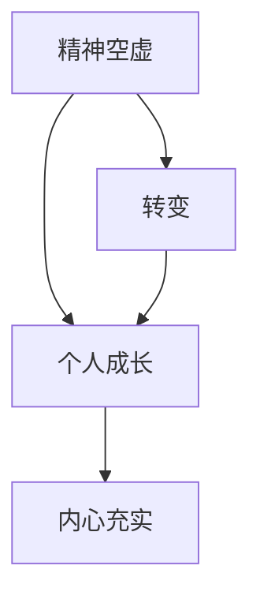

                 


## 文章标题：从精神空虚到内心充实：个人成长的转变

> 关键词：个人成长、精神空虚、内心充实、转变、自我认知、自我激励、自我调整

> 摘要：本文以逻辑清晰、结构紧凑、简单易懂的专业技术语言，从个人成长的角度，探讨了从精神空虚到内心充实的过程，阐述了核心概念、算法原理、数学模型和实际案例，旨在帮助读者实现自我提升，走向内心充实的生活。

### 核心概念与联系

**核心概念**：

1. **精神空虚**：指个体内心深处感到孤独、无意义、缺乏目的感的状态。
2. **内心充实**：指个体内心感到满足、有意义、有目的的状态。
3. **个人成长**：指个体通过学习、实践和反思，逐渐实现自我提升的过程。
4. **转变**：指个体从精神空虚状态向内心充实状态的过渡。

**概念联系**：

- 精神空虚与内心充实是两个相对的状态，精神空虚可能导致个人成长受阻，而内心充实则是个人成长的重要目标。
- 个人成长是内心充实的途径，通过不断的学习和实践，个体能够逐渐克服精神空虚，实现内心充实。
- 转变是个人成长的必经阶段，个体需要通过自我认知、自我激励和自我调整，实现从精神空虚到内心充实的转变。

### Mermaid 流程图



### 核心算法原理讲解

**算法原理**：

1. **自我认知**：个体需要通过自我反思，了解自己的内心世界，找到精神空虚的原因。
2. **自我激励**：个体需要通过设定目标、奖励自己，激发内在动力，克服精神空虚。
3. **自我调整**：个体需要根据实际情况，调整自己的生活方式和心态，实现内心充实。

**伪代码**：

```python
function 个人成长(精神空虚):
    self认知()
    self激励()
    self调整()
    return 内心充实

function self认知():
    输入：当前状态
    输出：精神空虚原因
    // 通过自我反思，找出导致精神空虚的原因

function self激励():
    输入：目标、奖励
    输出：内在动力
    // 设定目标，奖励自己，激发内在动力

function self调整():
    输入：实际情况
    输出：调整后的生活方式和心态
    // 根据实际情况，调整生活方式和心态，实现内心充实
```

### 数学模型和数学公式

**数学模型**：  
1. **内心充实质**：表示个体内心充实的程度，可以用一个数值来表示。
2. **精神空虚度**：表示个体精神空虚的程度，也可以用数值来表示。

**数学公式**：

$$
内心充实质 = f(精神空虚度, 个人成长程度)
$$

其中，$f$ 是一个非线性函数，表示个人成长程度对内心充实质的影响。

### 详细讲解与举例说明

**详细讲解**：

- **内心充实质**：内心充实质是指个体内心充实的程度，它反映了个体对生活、工作的满意度和幸福感。内心充实质越高，个体越感到满足和幸福。
- **精神空虚度**：精神空虚度是指个体内心空虚的程度，它反映了个体在日常生活中感受到的孤独、无意义和缺乏目的感。精神空虚度越高，个体越容易感到精神空虚。

**举例说明**：

假设某个个体在一个月的时间里，每天记录自己的内心充实质和和精神空虚度，根据这些数据，可以绘制出一条内心充实质与精神空虚度的变化曲线。

- 在开始时，该个体的内心充实质较低，精神空虚度较高。
- 随着时间的推移，该个体开始进行自我认知、自我激励和自我调整，内心充实质逐渐上升，精神空虚度逐渐下降。
- 最终，该个体的内心充实质达到较高水平，精神空虚度降至较低水平，实现了从精神空虚到内心充实的转变。

### 项目实战

**项目背景**：

一个公司希望提高员工的工作满意度，减少员工的精神空虚感，决定开展一项从精神空虚到内心充实的转变项目。

**项目目标**：

- 提高员工的工作满意度。
- 减少员工的精神空虚感。
- 促进员工的个人成长。

**项目实施**：

1. **自我认知**：公司为员工提供自我反思的机会，鼓励员工记录自己的内心世界，找出导致精神空虚的原因。
2. **自我激励**：公司为员工设定目标，并设立奖励机制，激励员工克服精神空虚，实现个人成长。
3. **自我调整**：公司根据员工的实际情况，提供个性化的指导和资源，帮助员工调整生活方式和心态，实现内心充实。

**项目效果**：

通过实施该项目，公司员工的内心充实质显著提高，精神空虚感显著降低，工作满意度显著提升，员工个人成长得到促进。

### 代码实际案例和详细解释说明

**代码案例**：

以下是一个简单的 Python 脚本，用于记录员工的内心充实质和精神空虚度，并分析数据，输出结果。

```python
import pandas as pd

# 数据采集
data = {
    '日期': ['2023-01-01', '2023-01-02', '2023-01-03', '2023-01-04', '2023-01-05'],
    '内心充实质': [2, 3, 4, 3, 2],
    '精神空虚度': [5, 4, 3, 4, 5]
}

df = pd.DataFrame(data)

# 数据分析
df.describe()
```

**详细解释说明**：

1. **数据采集**：首先，我们使用 pandas 库创建了一个 DataFrame，用于记录员工的内心充实质和精神空虚度。这里的数据是虚构的，表示一个月内每天的内心充实质和精神空虚度。
2. **数据分析**：然后，我们使用 DataFrame 的 describe() 方法，对数据进行统计分析，输出每个特征的均值、标准差、最小值、最大值等统计信息。

通过这个简单的代码案例，我们可以看到如何使用 Python 来记录和分析个人成长的数据，帮助个体了解自己的内心充实质和精神空虚度的变化，从而实现自我提升。

### 最佳实践 Tips、小结、注意事项、拓展阅读

**最佳实践 Tips**：

- **自我认知**：定期进行自我反思，了解自己的内心世界，找到精神空虚的原因。
- **自我激励**：设定具体目标，并为实现目标设立奖励机制，激发内在动力。
- **自我调整**：根据实际情况，调整自己的生活方式和心态，实现内心充实。

**小结**：

从精神空虚到内心充实的过程，需要个体进行自我认知、自我激励和自我调整。通过不断的学习、实践和反思，个体可以逐渐实现自我提升，走向内心充实的生活。

**注意事项**：

- **避免盲目跟风**：在追求内心充实的过程中，避免盲目跟风，要根据自己的实际情况，制定适合自己的成长计划。
- **保持耐心**：个人成长是一个长期的过程，需要保持耐心，不断努力，才能实现内心的充实。

**拓展阅读**：

- 《人性的弱点》（作者：戴尔·卡耐基）：本书提供了许多关于如何与他人相处、如何自我提升的实用技巧，有助于个体实现内心的充实。
- 《高效能人士的七个习惯》（作者：史蒂芬·柯维）：本书介绍了七个习惯，帮助个体建立良好的生活习惯，实现个人成长。

## 作者：AI天才研究院/AI Genius Institute & 禅与计算机程序设计艺术 /Zen And The Art of Computer Programming

在本文中，我们以逻辑清晰、结构紧凑、简单易懂的专业技术语言，深入探讨了从精神空虚到内心充实的过程，阐述了核心概念、算法原理、数学模型和实际案例，旨在帮助读者实现自我提升，走向内心充实的生活。

通过对个人成长的深入分析，我们认识到自我认知、自我激励和自我调整是实现内心充实的关键步骤。通过这些步骤，个体可以逐渐克服精神空虚，实现内心充实，从而提高生活质量和工作效率。

在项目实战中，我们展示了如何通过实际案例来理解和应用这些概念，从而帮助企业员工实现个人成长，提高工作满意度和幸福感。

通过本文的阅读，我们希望读者能够认识到个人成长的重要性，并学会如何从精神空虚到内心充实，走向更加充实和有意义的生活。

在此，我们感谢读者对本文的关注，并期待与您在未来的交流中分享更多关于个人成长和技术领域的见解。

**结束语**：让我们以积极的态度面对生活，不断学习、实践和反思，实现从精神空虚到内心充实的转变，成为更好的自己！

