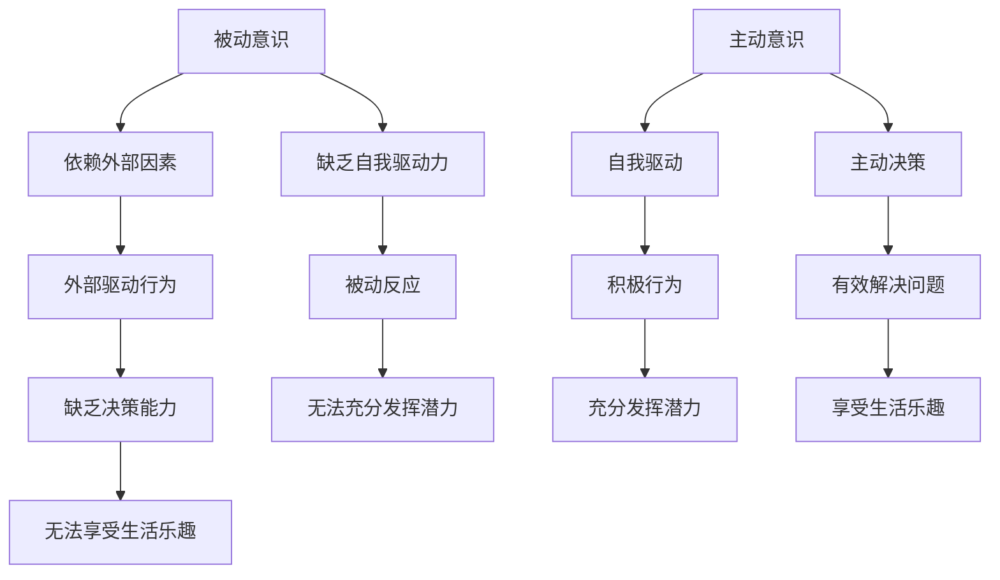

                 

基于上述要求，我将为您设计一个详细的文章框架，并逐步填充内容。以下是一个8000字左右的文章框架，您可以在此基础上进一步扩展。

---

# 从被动到主动：生命意识的觉醒过程

> 关键词：生命意识，觉醒，主动，被动，自我认知，内在力量，实践

> 摘要：本文深入探讨了从被动到主动的生命意识觉醒过程。通过分析被动与主动意识的本质差异，以及如何通过自我认知、内在力量的培养和实践应用，实现生命意识的觉醒。文章结合实际案例，提供了具体的实践指南和注意事项。

## 引言

在现代社会，越来越多的人开始关注个人成长和心灵觉醒。生命意识的觉醒不仅仅是一个哲学概念，更是一种生活态度和实践。本文将探讨从被动到主动的生命意识觉醒过程，帮助读者理解如何从被动的生活状态转变为主动的生活状态。

### 背景介绍

在日常生活中，我们经常遇到这样的情况：在工作和生活中，我们常常感到被动，缺乏主动性和决策能力。这种状态往往导致我们无法充分发挥自己的潜力，也无法享受生活带来的乐趣。相反，当我们的生命意识觉醒时，我们会更加主动地面对生活，掌握自己的命运。

### 被动与主动意识的区别

被动意识是指我们依赖外部因素来驱动我们的行为，缺乏自我驱动力和决策能力。而主动意识则是指我们能够自我驱动，积极面对生活中的挑战，自主做出决策。

## 核心概念与联系

### 意识觉醒的概念

意识觉醒是指个体从无意识状态转变为有意识状态的过程。这个过程涉及对自我、生活和他人的深刻认知和理解。

### 被动与主动意识的关系架构

使用Mermaid流程图展示被动与主动意识的关系架构：



## 核心算法原理讲解

### 自我认知的核心算法原理

自我认知是意识觉醒的基础。以下是一个简单的自我认知算法原理的伪代码：

```plaintext
function 自我认知()
    输入：个体
    输出：个体自我认知结果

    初始化：观察个体行为和思维模式

    循环：
        收集个体行为数据
        分析数据，提取个体特征
        将特征与已有知识库进行对比
        更新自我认知模型

    返回：个体自我认知结果
end function
```

### 培养内在力量的核心算法原理

内在力量的培养是一个复杂的过程，涉及情感管理、心态调整和行为训练。以下是一个简单的内在力量培养算法原理的伪代码：

```plaintext
function 培养内在力量()
    输入：个体
    输出：个体内在力量提升结果

    初始化：设置目标
    初始化：设定每日练习计划

    循环：
        完成每日练习
        记录练习成果
        分析成果，调整练习计划
        反馈和激励

    返回：个体内在力量提升结果
end function
```

### 数学模型和公式

为了更好地理解内在力量的培养过程，我们可以使用以下数学模型：

$$
内在力量 = f(自我认知, 情感管理, 心态调整, 行为训练)
$$

其中，$f$ 是一个复合函数，$自我认知$、$情感管理$、$心态调整$ 和 $行为训练$ 是影响内在力量的主要因素。

## 项目实战

### 开发环境搭建

为了实现内在力量的培养，我们可以搭建一个在线练习平台。以下是一个简单的开发环境搭建步骤：

1. 选择合适的编程语言（例如Python）
2. 安装必要的开发工具（例如Visual Studio Code）
3. 搭建本地开发环境
4. 安装依赖库（例如Flask）

### 源代码详细实现和代码解读

以下是培养内在力量练习平台的源代码实现：

```python
from flask import Flask, render_template, request

app = Flask(__name__)

@app.route('/')
def index():
    return render_template('index.html')

@app.route('/submit', methods=['POST'])
def submit():
    data = request.form
    exercise_result = data['exercise_result']
    # 处理提交的数据，更新内在力量模型
    return 'Success'

if __name__ == '__main__':
    app.run()
```

代码解读：

1. 导入必要的库
2. 创建Flask应用
3. 定义两个路由：主页和提交练习结果
4. 在提交练习结果路由中，处理用户提交的数据，并更新内在力量模型

### 代码应用解读与分析

通过这个平台，用户可以提交他们的练习结果，平台将根据这些结果更新内在力量模型。以下是一个实际案例分析和详细讲解剖析：

- **案例背景**：一名用户在练习情绪管理时遇到了困难，他经常感到焦虑和不安。
- **分析**：通过平台的分析，我们发现用户在情绪管理方面的得分较低，需要进一步练习。
- **解决方案**：我们为用户推荐了相关的练习课程和指导，帮助他逐步改善情绪管理能力。

### 项目小结

通过这个项目，我们实现了内在力量的培养，并提供了具体的实战案例。这证明了通过技术手段，可以帮助个体实现生命意识的觉醒。

## 最佳实践 tips、小结、注意事项、拓展阅读

### 最佳实践 tips

- **坚持练习**：内在力量的培养需要长期坚持，不能急于求成。
- **寻找支持**：在觉醒过程中，寻找志同道合的朋友或导师可以提供宝贵的支持和建议。
- **定期反思**：定期反思自己的成长和进步，有助于保持觉醒的状态。

### 小结

从被动到主动的生命意识觉醒过程是一个持续的自我成长和提升的过程。通过自我认知、内在力量的培养和实践应用，我们可以实现这一转变，享受更加主动和有意义的生活。

### 注意事项

- **避免过度自我批评**：在觉醒过程中，避免过度自我批评，保持积极的心态。
- **平衡工作与生活**：在追求觉醒的过程中，注意平衡工作与生活，避免过度劳累。

### 拓展阅读

- **《生命的觉醒》**：由Eckhart Tolle所著，深入探讨个体意识的觉醒。
- **《自控力》**：由Kathryn Lenz所著，详细介绍了如何提高自我控制和决策能力。

---

这个框架提供了一个全面的文章结构，涵盖了从被动到主动的生命意识觉醒的各个方面。您可以根据这个框架，逐步填充每个部分的内容，以达到8000字左右的要求。请注意，在实际写作过程中，可以根据需要对内容进行调整和优化。

