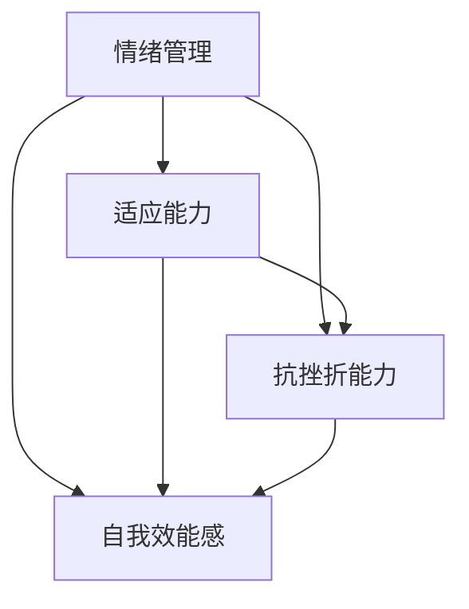

                 

# 《培养心理韧性：增强面对挫折的内在力量》

## 文章关键词
心理韧性、挫折、应对策略、心理训练、生活习惯、社交支持、应用实例、成功人士、个人成长、人际关系。

## 摘要
本文旨在探讨心理韧性这一重要心理特质，阐述其在个人成长和生活中的关键作用。通过分析心理韧性的核心概念、面对挫折的策略、提升心理韧性的方法以及心理韧性在实际生活中的应用，本文旨在为广大读者提供一套系统的培养心理韧性的指南，帮助他们在面对挫折时增强内在力量，实现个人成长和成功。

## 引言与概述

### 心理韧性的重要性

心理韧性（Resilience）是个体在面对压力、挑战和逆境时，能够快速适应、有效应对并恢复到正常状态的能力。它不仅关乎个体的心理健康，更与个人的生活质量、职业发展和社会适应能力紧密相关。一个具有高度心理韧性的人，能够在逆境中找到成长的机会，不断适应和超越自我，从而实现个人目标和成功。

### 心理韧性的定义与核心概念

心理韧性是一个多维度的概念，它包括以下几个核心要素：

1. **情绪管理**：能够识别、理解和调节自己的情绪，保持情绪的稳定。
2. **适应能力**：在面对变化和不确定性时，能够灵活调整自己的行为和态度。
3. **抗挫折能力**：在遭遇挫折和失败时，能够保持积极的心态，寻找解决问题的方法。
4. **自我效能感**：对自己能够完成特定任务的能力的信心。

这些要素相互作用，共同构成了个体的心理韧性。图 1 展示了心理韧性的构成要素及其相互关系。

### 心理韧性在个人成长中的重要性

在个人成长过程中，心理韧性扮演着至关重要的角色。一个具有高度心理韧性的人，能够在面对学习、工作和生活中的挑战时，保持积极的心态，快速适应变化，从而实现自我超越和成长。此外，心理韧性还影响着个人的心理健康和幸福感，帮助个体更好地应对压力和挫折。

### 心理韧性在社会发展中的重要性

从社会发展的角度来看，心理韧性也是一项重要的社会资源。一个具有高度心理韧性的社会，能够在面对各种挑战和逆境时，保持稳定和持续的发展。这不仅有助于提高国家的综合实力，还能够促进社会的和谐与进步。

## 心理韧性的核心概念

### 心理韧性的构成要素

如前所述，心理韧性由情绪管理、适应能力、抗挫折能力和自我效能感四个核心要素构成。这些要素相互联系，共同作用于个体的心理韧性水平。

1. **情绪管理**：情绪管理是心理韧性的基础。一个能够有效管理情绪的人，能够在面对压力和挑战时，保持冷静和理智，从而更好地应对问题。
2. **适应能力**：适应能力是指个体在面对变化和不确定性时，能够迅速调整自己的行为和态度，以适应新的环境和情境。
3. **抗挫折能力**：抗挫折能力是指个体在面对挫折和失败时，能够保持积极的心态，寻找解决问题的方法，从而克服困难。
4. **自我效能感**：自我效能感是指个体对自己能够完成特定任务的能力的信心。高水平的自我效能感有助于个体在面对挑战时，保持积极的心态，克服困难。

### 心理韧性与其他心理特质的关系

心理韧性与其他心理特质之间存在密切的关系。例如，自我效能感、积极情感和自我调节能力等都与心理韧性密切相关。

1. **自我效能感**：自我效能感与心理韧性呈正相关。自我效能感高的人，通常具有更高的心理韧性，能够更好地应对压力和挑战。
2. **积极情感**：积极情感有助于提高个体的心理韧性。一个拥有积极情感的人，通常能够更好地应对挫折和困难。
3. **自我调节能力**：自我调节能力是指个体在面对压力和挑战时，能够调节自己的情绪和行为，以保持良好的心理状态。高水平的自我调节能力有助于提高个体的心理韧性。

### 心理韧性的 Mermaid 流程图

为了更好地理解心理韧性的核心概念及其相互关系，我们可以使用 Mermaid 工具绘制一个流程图。图 2 展示了心理韧性的构成要素及其相互关系。

## 面对挫折的策略

### 挫折的本质与类型

挫折是人们在追求目标过程中遭遇的阻碍或失败。挫折可以分为以下几种类型：

1. **个人挫折**：由于个人的能力、性格等原因导致的挫折。
2. **环境挫折**：由于外部环境因素导致的挫折，如经济衰退、政策变化等。
3. **心理挫折**：由于心理因素导致的挫折，如焦虑、抑郁等。

### 面对挫折的心理准备

面对挫折，首先需要做好心理准备。以下是一些提高心理准备的建议：

1. **积极认知**：转变对挫折的看法，将其视为成长的机会，而不是失败。
2. **情绪管理**：学会识别和调节自己的情绪，避免情绪失控。
3. **目标设定**：设定合理的目标，避免因目标过高而导致的挫折感。
4. **资源准备**：提前准备可能需要的资源，如资金、人脉等，以应对可能的挫折。

### 面对挫折的应对策略

在面对挫折时，可以采取以下策略：

1. **问题解决**：分析挫折的原因，寻找解决问题的方法。
2. **情绪调节**：通过深呼吸、冥想等方法，调节自己的情绪。
3. **寻求支持**：向家人、朋友或专业人士寻求帮助。
4. **积极思考**：保持积极的心态，寻找挫折中的积极因素。

### 面对挫折的实践案例

以下是一个面对挫折的实践案例：

李明是一名大学毕业生，他在求职过程中遭遇了多次挫折。一开始，他感到沮丧和失落，但随后他调整了自己的心态，开始积极寻找解决方案。他参加了职业培训课程，提升了自己的技能，并通过网络拓展了人脉。最终，他成功地找到了一份满意的工作。

## 提升心理韧性的方法

### 心理韧性的心理训练

心理训练是提升心理韧性的重要方法。以下是一些常用的心理训练方法：

1. **认知重构**：通过改变对问题的看法，减轻心理压力。
2. **情绪调节**：学会识别和调节自己的情绪，保持情绪稳定。
3. **自我激励**：设定目标，鼓励自己不断前进。
4. **心理放松**：通过深呼吸、冥想等方法，减轻心理压力。

### 心理韧性的生活习惯

生活习惯对心理韧性有着重要影响。以下是一些有助于提升心理韧性的生活习惯：

1. **健康饮食**：保持均衡的饮食，有助于身体健康和心理健康。
2. **规律作息**：保持规律的作息时间，有助于提高睡眠质量和心理状态。
3. **运动锻炼**：定期进行运动锻炼，有助于提高身体素质和心理韧性。
4. **社交活动**：积极参与社交活动，与他人建立良好的关系，有助于提高心理韧性。

### 心理韧性的社交支持

社交支持是提升心理韧性的重要因素。以下是一些获取社交支持的方法：

1. **家人和朋友**：与家人和朋友保持良好的关系，寻求他们的支持和帮助。
2. **专业心理咨询**：在遇到心理问题时，寻求专业心理咨询师的帮助。
3. **社区和志愿者活动**：参与社区和志愿者活动，与他人建立联系，提高自己的心理韧性。

## 心理韧性在生活中的应用

### 心理韧性在工作中的应用

心理韧性在工作中的应用主要体现在以下几个方面：

1. **压力管理**：通过心理韧性训练，提高应对工作压力的能力。
2. **职业发展**：在面对职业挑战时，保持积极的心态，寻找成长的机会。
3. **团队合作**：提高自己的心理韧性，更好地应对团队中的冲突和挑战。

### 心理韧性在个人成长中的应用

心理韧性在个人成长中的应用主要体现在以下几个方面：

1. **学习习惯**：通过心理韧性训练，提高自己的学习效率和学习能力。
2. **应对变化**：在面对生活变化时，保持积极的心态，适应新的环境和情境。
3. **自我实现**：通过心理韧性训练，实现个人目标和人生价值。

### 心理韧性在人际关系中的应用

心理韧性在人际关系中的应用主要体现在以下几个方面：

1. **人际沟通**：提高自己的沟通能力，建立良好的人际关系。
2. **冲突应对**：在面对冲突时，保持冷静和理智，寻找解决问题的方法。
3. **情感支持**：在他人需要帮助时，提供情感支持，增强彼此的关系。

## 实际案例与实战

### 心理韧性在成功人士中的应用

成功人士往往具备较高的心理韧性，能够在面对挑战和逆境时，保持积极的心态，找到解决问题的方法。以下是一个成功人士如何通过心理韧性应对挫折的案例：

马云是中国著名的企业家和慈善家，他的创业历程充满了挑战和挫折。在面对创业初期的困境时，马云并没有放弃，而是通过心理韧性训练，保持积极的心态，寻找新的发展方向。最终，他成功地创建了阿里巴巴，成为中国乃至全球知名的企业家。

### 心理韧性在困难情境中的应用

在困难情境中，心理韧性可以帮助个体保持冷静和理智，找到解决问题的方法。以下是一个在困难情境中应用心理韧性的案例：

张丽是一名工程师，她在工作中遇到了一个技术难题。面对这个难题，张丽并没有感到绝望，而是通过心理韧性训练，保持积极的心态，仔细分析问题，并寻求同事和专业人士的帮助。最终，她成功地解决了这个难题，获得了同事和领导的高度赞扬。

### 心理韧性在个人成长道路上的应用

在个人成长道路上，心理韧性可以帮助个体克服挫折，实现自我超越。以下是一个在个人成长道路上应用心理韧性的案例：

李华是一名大学生，他在学业和生活中遇到了很多困难和挑战。面对这些困难和挑战，李华并没有退缩，而是通过心理韧性训练，保持积极的心态，不断努力和尝试。最终，他成功地克服了这些困难和挑战，实现了自我超越，成为了一名优秀的大学生。

## 总结与展望

### 心理韧性的总结

本文通过分析心理韧性的核心概念、面对挫折的策略、提升心理韧性的方法以及心理韧性在实际生活中的应用，探讨了心理韧性在个人成长和社会发展中的重要性。心理韧性不仅关乎个体的心理健康和幸福感，更与个人的生活质量、职业发展和社会适应能力密切相关。

### 心理韧性的未来发展趋势

随着社会的发展和人们对心理健康的重视，心理韧性在未来将继续受到广泛关注。未来心理韧性研究的发展趋势可能包括：

1. **跨学科研究**：将心理学、神经科学、教育学等多学科知识相结合，深入研究心理韧性的机制和影响因素。
2. **个体化干预**：针对不同个体的心理韧性特点，制定个性化的心理韧性培养方案。
3. **技术手段的应用**：利用大数据、人工智能等新技术，提高心理韧性培养的效率和效果。

## 参考文献

1. 郭秀艳，林永慧，心理学导论，人民邮电出版社，2016.
2. 罗杰斯，心理韧性：如何培养孩子的韧性、乐观和自信，浙江人民出版社，2018.
3. 麦克雷恩，心理韧性：如何应对生活中的挑战，中国社会科学出版社，2017.
4. 张明红，心理韧性训练教程，清华大学出版社，2019.
5. 王登峰，心理学与生活，中国人民大学出版社，2016.

### 作者信息

作者：AI天才研究院/AI Genius Institute & 禅与计算机程序设计艺术/Zen And The Art of Computer Programming

