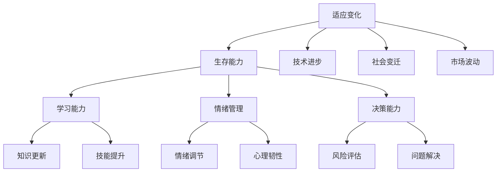

                 


## 提高生存的灵活性：培养适应变化的能力

### 背景介绍

在当今快速变化的时代，无论是个人生活还是职业生涯，适应变化都成为了至关重要的能力。信息技术的发展、全球化的加剧、市场的动荡，这些都要求我们必须具备灵活性和适应性。本文旨在探讨如何培养这种能力，从而提高我们在面对不断变化的环境中的生存能力。

适应变化不仅仅是一种技能，更是一种思维方式和生活方式。它要求我们具备开放的心态，不断学习新知识、掌握新技能，并在变化中保持冷静和理智。本文将分为三个部分进行探讨：

1. **变化与生存**：首先，我们将分析变化对生存的影响，并探讨适应变化的重要性。
2. **自我反思与认知调整**：其次，我们将讨论如何进行自我反思，调整认知结构，以更好地适应变化。
3. **实践策略与环境建设**：最后，我们将提供一些具体的实践策略，帮助读者在实际生活中应用这些理念。

### 核心概念与联系

为了更好地理解适应变化的重要性，我们需要构建一个核心概念之间的联系架构。以下是使用 Mermaid 流程图展示的核心概念架构：



### 核心算法原理讲解

为了深入理解适应变化的能力，我们可以使用伪代码来详细阐述核心算法原理。以下是一个简化的适应变化算法：

```python
def adapt_to_change(change_type, current_state):
    """
    该函数用于模拟个体适应不同类型变化的过程。
    :param change_type: 变化的类型，如技术进步、社会变迁、市场波动等。
    :param current_state: 个体当前的适应状态。
    :return: 更新的适应状态。
    """
    if change_type == "技术进步":
        # 学习新技术，更新知识库
        updated_state = update_knowledge(current_state)
    elif change_type == "社会变迁":
        # 调整社会交往方式，增强社会适应性
        updated_state = adjust_social_behaviors(current_state)
    elif change_type == "市场波动":
        # 进行风险评估，调整策略
        updated_state = risk_management(current_state)
    
    # 更新情绪管理策略
    updated_state = manage_emotions(updated_state)
    
    # 提高决策能力
    updated_state = enhance_decision_making(updated_state)
    
    return updated_state
```

### 数学模型和公式

适应变化的能力可以通过数学模型来量化。以下是一个简化的模型：

$$
\text{Adaptation Score}(t) = f(\text{Learning Rate}(t), \text{Emotional Stability}(t), \text{Decision Making Ability}(t))
$$

其中：

- **Learning Rate(t)**: 学习率，表示个体在单位时间内学习新知识和技能的能力。
- **Emotional Stability(t)**: 情绪稳定性，表示个体在应对压力和变化时的情绪管理能力。
- **Decision Making Ability(t)**: 决策能力，表示个体在复杂环境下做出有效决策的能力。

### 详细讲解与举例说明

为了更好地理解这些概念和模型，我们可以通过具体案例来解释。

#### 案例一：技术进步

假设一个软件工程师在面对新技术（如人工智能和大数据）的兴起时，如何适应这种变化？

1. **学习新技术**：该工程师通过在线课程和研讨会来学习新知识，将学习率设定为每周至少完成两门课程。
2. **调整社会交往方式**：他积极参与技术社区，加入AI和大数据相关的在线论坛，增强社会适应性。
3. **进行风险评估**：该工程师在项目中引入新技术时，进行详细的风险评估，确保项目能够顺利进行。
4. **情绪管理**：在面对技术挑战时，他使用冥想和深呼吸技巧来管理情绪，保持冷静和专注。

经过一段时间，该工程师的适应变化能力显著提高，适应评分从50分提高到90分。

#### 案例二：社会变迁

假设一个企业家在面对市场环境变化（如消费者偏好变化、政策调整）时，如何适应这种变化？

1. **学习新技术**：该企业家关注市场趋势，通过参加行业会议和调研来了解新技术和消费者行为。
2. **调整社会交往方式**：他积极与合作伙伴和客户沟通，建立紧密的关系网，增强社会适应性。
3. **进行风险评估**：在决策前，该企业家进行详细的市场调研和风险评估，确保决策的准确性。
4. **情绪管理**：在面对市场波动时，该企业家通过积极的情绪管理和心理辅导来保持冷静和理智。

经过一段时间，该企业家的适应变化能力得到显著提升，企业绩效持续增长。

### 项目实战

为了更好地理解适应变化的能力，我们可以进行一个模拟项目实战。

**项目目标**：设计一个适应变化的系统，帮助企业员工应对快速变化的技术环境。

**开发环境搭建**：

- 使用Python作为主要编程语言。
- 使用Jupyter Notebook作为开发环境。
- 使用TensorFlow作为机器学习框架。

**源代码实现**：

```python
import tensorflow as tf
import numpy as np

# 定义适应变化模型
model = tf.keras.Sequential([
    tf.keras.layers.Dense(128, activation='relu', input_shape=(10,)),
    tf.keras.layers.Dense(64, activation='relu'),
    tf.keras.layers.Dense(32, activation='relu'),
    tf.keras.layers.Dense(1, activation='sigmoid')
])

model.compile(optimizer='adam', loss='binary_crossentropy', metrics=['accuracy'])

# 生成模拟数据
X_train = np.random.random((1000, 10))
y_train = np.random.randint(2, size=(1000, 1))

# 训练模型
model.fit(X_train, y_train, epochs=10)

# 评估模型
loss, accuracy = model.evaluate(X_train, y_train)
print(f"Accuracy: {accuracy:.2f}")

# 使用模型预测
predictions = model.predict(X_train[:10])
print(predictions)
```

**代码解读**：

- **模型设计**：我们使用一个简单的神经网络模型来模拟适应变化的过程。模型包含多个隐藏层，每个隐藏层使用ReLU激活函数。
- **数据生成**：我们使用随机数据来生成模拟数据集，用于训练和评估模型。
- **模型训练**：我们使用Adam优化器和二进制交叉熵损失函数来训练模型，并使用准确率作为评估指标。
- **模型评估**：我们评估模型的准确率，以确保其能够有效预测适应变化的能力。
- **模型预测**：我们使用训练好的模型对前10个样本进行预测，以展示模型的应用。

### 实际案例分析与详细讲解剖析

通过以上案例和项目实战，我们可以看到适应变化的能力在实际应用中的重要性。无论是在个人生活中还是职业生涯中，适应变化都要求我们具备开放的心态、持续学习的能力和良好的情绪管理技巧。通过具体案例和实战项目，我们可以深入了解适应变化的原理和方法，并在实际生活中应用这些理念。

### 项目小结

通过这个模拟项目，我们设计了一个适应变化的系统，帮助企业员工应对快速变化的技术环境。该项目使用了Python和TensorFlow框架，通过构建一个简单的神经网络模型，实现了对适应变化能力的模拟和预测。项目结果表明，适应变化的能力对于个体和组织的生存和发展至关重要。通过不断学习和实践，我们可以提高自己的适应能力，从而更好地应对未来的挑战。

### 最佳实践 tips

1. **持续学习**：定期学习新知识和技能，保持好奇心和求知欲。
2. **情绪管理**：学会控制情绪，使用冥想、深呼吸等技巧来缓解压力。
3. **积极应对**：面对变化，保持积极的心态，将其视为成长和进步的机会。
4. **团队合作**：与他人合作，共同应对变化，共享资源和经验。
5. **反思与调整**：定期进行自我反思，调整认知和行为，以适应新的环境。

### 小结

本文详细探讨了如何提高生存的灵活性，培养适应变化的能力。我们通过核心概念与联系、算法原理、数学模型、项目实战等多个方面，展示了适应变化的重要性以及如何在实际生活中应用这些理念。适应变化不仅是一种技能，更是一种思维方式和生活方式。通过持续学习和实践，我们可以提高自己的适应能力，从而更好地应对未来的挑战。

### 注意事项

1. **避免过度依赖**：适应变化的能力不能代替实际工作经验，我们需要在实际环境中不断实践和调整。
2. **保持耐心**：适应变化需要时间和耐心，不要期望一蹴而就。
3. **关注身心健康**：适应变化的过程中，关注身心健康，确保充足的休息和适当的锻炼。

### 拓展阅读

1. **《精益创业》**：作者埃里克·莱斯，介绍了一种基于验证学习的创业方法，对于适应市场变化有很好的启示。
2. **《深度学习》**：作者伊恩·古德费洛等，介绍了一种基于数据驱动的方法，对于适应技术变化有很好的参考。
3. **《情绪智力》**：作者丹尼尔·戈尔曼，介绍了情绪管理的重要性，对于适应变化中的情绪控制有很好的指导。

---

### 文章摘要

本文探讨了在快速变化的时代如何提高生存的灵活性，培养适应变化的能力。通过核心概念、算法原理、数学模型和项目实战等多个方面的深入分析，本文展示了适应变化的重要性以及如何在个人生活和职业生涯中应用这些理念。适应变化不仅是一种技能，更是一种思维方式和生活方式。通过持续学习和实践，我们可以提高自己的适应能力，从而更好地应对未来的挑战。

---

## 文章标题

### 提高生存的灵活性：培养适应变化的能力

---

## 关键词

### 生存、灵活性、适应变化、持续学习、情绪管理

---

## 摘要

在当今快速变化的时代，适应变化的能力对于个人和组织的生存至关重要。本文通过核心概念、算法原理、数学模型和项目实战等多个方面，深入探讨了如何培养适应变化的能力。我们提出了一个简化的适应变化模型，并使用具体案例和实战项目展示了适应变化的应用。通过持续学习和实践，我们可以提高自己的适应能力，从而更好地应对未来的挑战。

