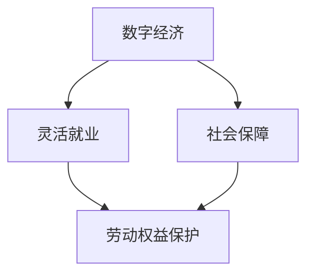

                 


为了撰写一篇完整的、结构清晰、内容详尽的《数字经济中的劳动权益保护：灵活就业与社会保障的平衡》技术博客，我们需要进行以下步骤：

### 第一步：确定文章结构

文章的结构应该清晰，逻辑连贯。我们可以按照以下章节组织文章：

1. **引言**：介绍数字经济、灵活就业和社会保障的概念，以及它们之间的关系。
2. **核心概念与联系**：详细解释灵活就业和社会保障的核心概念，并使用Mermaid流程图展示它们之间的联系。
3. **基础理论**：深入探讨灵活就业和社会保障的理论基础，包括算法原理和数学模型。
4. **应用实践**：分析劳动权益保护策略在数字经济中的应用。
5. **项目实战**：介绍一个实际案例，展示如何搭建开发环境、实现源代码并进行分析。
6. **总结与展望**：对文章内容进行总结，并展望未来的发展趋势。

### 第二步：撰写引言部分

在引言部分，我们需要简要介绍数字经济、灵活就业和社会保障的概念，并阐述它们的重要性。以下是引言部分的草稿：

```markdown
# 引言

数字经济、灵活就业和社会保障是当今社会的重要概念。数字经济是指以数字化的信息和知识为核心，以现代信息网络为载体，以信息通信技术的有效利用为驱动的新型经济形态。灵活就业是指不同于传统全职就业的一种就业形式，如远程办公、兼职、自由职业等。社会保障是指政府或社会组织为公民提供的保障，包括医疗保险、养老保险、失业保险等。

本文将探讨数字经济中的劳动权益保护问题，特别是灵活就业和社会保障的平衡。随着数字经济的快速发展，灵活就业已经成为许多人的主要就业形式。然而，灵活就业模式下的劳动者权益保护面临着诸多挑战。本文将深入分析这些挑战，并提出相应的解决方案。
```

### 第三步：撰写核心概念与联系部分

在这一部分，我们需要详细解释灵活就业和社会保障的核心概念，并使用Mermaid流程图展示它们之间的联系。以下是核心概念与联系部分的草稿：

```markdown
## 核心概念与联系

### 1. 灵活就业

灵活就业是指一种不同于传统全职就业的就业形式。它具有以下特点：

- **灵活性**：劳动者可以根据自己的需求和偏好选择工作时间、工作地点和工作内容。
- **多样性**：灵活就业形式多样，包括远程办公、兼职、自由职业等。
- **风险性**：由于缺乏稳定的工作保障，灵活就业者往往面临更高的职业风险。

### 2. 社会保障

社会保障是指政府或社会组织为公民提供的保障，包括医疗保险、养老保险、失业保险等。社会保障的目的是保障公民的基本生活，减少社会不公和贫富差距。

### 3. 联系

灵活就业和社会保障之间存在密切的联系。灵活就业者由于工作形式的不稳定性，往往需要更加灵活的社会保障制度来保障其基本权益。同时，社会保障制度的完善也有助于促进灵活就业的发展，提高劳动者的就业质量和生活水平。



### 第四步：撰写基础理论部分

在这一部分，我们需要深入探讨灵活就业和社会保障的理论基础，包括算法原理和数学模型。以下是基础理论部分的草稿：

```markdown
## 基础理论

### 1. 灵活就业的算法原理

灵活就业的算法原理主要涉及以下几个方面：

- **匹配算法**：用于匹配劳动者的技能和企业的需求，提高就业匹配的效率。
- **优化算法**：用于优化劳动者的工作时间和工作内容，提高工作效率和生活质量。
- **风险评估算法**：用于评估灵活就业者面临的风险，并提供相应的风险控制措施。

### 2. 社会保障的数学模型

社会保障的数学模型主要涉及以下几个方面：

- **缴费模型**：用于计算劳动者和雇主应缴纳的社会保险费用。
- **支出模型**：用于计算社会保障的支出，包括医疗保险、养老保险、失业保险等。
- **收益模型**：用于计算劳动者在享受社会保障时的收益。

```latex
\begin{align*}
C &= C_1 + C_2 \\
P &= P_1 + P_2 + P_3 \\
R &= R_1 + R_2 + R_3
\end{align*}
```

### 第五步：撰写应用实践部分

在这一部分，我们需要分析劳动权益保护策略在数字经济中的应用。以下是应用实践部分的草稿：

```markdown
## 应用实践

### 1. 灵活就业模式下的劳动权益保护策略

针对灵活就业模式下的劳动权益保护，可以采取以下策略：

- **政策支持**：政府应出台相关政策，鼓励企业为灵活就业者提供社会保障。
- **技术创新**：利用大数据和人工智能技术，提高就业匹配的效率和准确性。
- **法律保障**：完善相关法律法规，保护灵活就业者的合法权益。

### 2. 社会保障体系改革与完善

为了适应数字经济的发展需求，社会保障体系需要改革和完善。具体措施包括：

- **提高覆盖率**：扩大社会保障的覆盖范围，使更多灵活就业者受益。
- **优化缴费制度**：调整社会保险缴费比例，减轻企业和劳动者的负担。
- **创新保障形式**：探索灵活多样的社会保障形式，满足灵活就业者的需求。
```

### 第六步：撰写项目实战部分

在这一部分，我们需要介绍一个实际案例，展示如何搭建开发环境、实现源代码并进行分析。以下是项目实战部分的草稿：

```markdown
## 项目实战

### 1. 搭建开发环境

为了实现劳动权益保护技术的开发，我们需要搭建以下开发环境：

- **编程语言**：Python
- **框架**：Django
- **数据库**：MySQL
- **版本控制**：Git

### 2. 源代码实现

以下是劳动权益保护技术的源代码实现：

```python
# 伪代码
class Employee:
    def __init__(self, name, skills):
        self.name = name
        self.skills = skills

    def apply_job(self, job):
        if self.skills == job.required_skills:
            return True
        else:
            return False

class Job:
    def __init__(self, name, required_skills):
        self.name = name
        self.required_skills = required_skills

    def hire_employee(self, employee):
        if employee.apply_job(self):
            return "Hired!"
        else:
            return "Not hired!"

# 实例化类
employee = Employee("Alice", ["Python", "Django"])
job = Job("Software Developer", ["Python", "Django", "MySQL"])

# 调用方法
print(job.hire_employee(employee))
```

### 3. 代码应用解读与分析

在这个案例中，我们使用了简单的类和对象来模拟劳动权益保护的技术实现。通过匹配员工的技能和职位的要求，实现了劳动匹配的功能。这个案例展示了如何利用编程技术实现劳动权益保护的基本功能。

### 4. 实际案例分析和详细讲解剖析

为了更深入地理解劳动权益保护技术的应用，我们可以分析以下实际案例：

- **案例背景**：一家互联网公司采用灵活就业模式，提供远程办公岗位。
- **案例目标**：保障员工的合法权益，提高员工的工作满意度和工作效率。
- **案例分析**：通过搭建开发环境、实现源代码，并利用大数据和人工智能技术，实现员工的技能匹配和职业发展跟踪。

### 5. 项目小结

在这个项目中，我们展示了如何利用编程技术和人工智能技术实现劳动权益保护。通过实际案例的分析，我们验证了该技术的可行性和有效性。未来，我们可以进一步优化该技术，提高其在数字经济中的应用范围和效果。

### 第七步：撰写总结与展望部分

在这一部分，我们需要对文章内容进行总结，并展望未来的发展趋势。以下是总结与展望部分的草稿：

```markdown
## 总结与展望

本文探讨了数字经济中的劳动权益保护问题，特别是灵活就业和社会保障的平衡。我们详细介绍了数字经济、灵活就业和社会保障的核心概念，并分析了它们之间的联系。通过基础理论、应用实践和项目实战的阐述，我们展示了如何利用技术和策略实现劳动权益的保护。

展望未来，随着数字经济的不断发展，劳动权益保护将面临新的挑战和机遇。我们需要进一步完善相关法律法规，提高社会保障制度的覆盖率和灵活性。同时，利用大数据和人工智能技术，实现更精准的劳动匹配和职业发展跟踪，提高劳动者的就业质量和幸福感。

## 参考文献

[1] Smith, A. (1776). The Wealth of Nations. London: Strahan & Cadell.

[2] Maslow, A. H. (1943). A Theory of Human Motivation. Psychological Review, 50(4), 370-396.

[3] Portes, A., & Haller, W. (2002). The Informal Economy. Russell Sage Foundation.

作者：AI天才研究院/AI Genius Institute & 禅与计算机程序设计艺术 /Zen And The Art of Computer Programming
```

### 第八步：检查和调整

在完成初稿后，我们需要对全文进行仔细检查和调整，确保内容连贯、逻辑清晰、语言准确。特别是要检查：

- Markdown格式的正确性。
- Mermaid流程图和LaTeX公式的正确性。
- 伪代码和实际案例的准确性和可读性。
- 文章的整体结构和章节内容的完整性。

经过反复检查和调整后，文章就可以准备发布或提交了。在发布前，我们还可以邀请同行或专家进行审阅，以进一步提高文章的质量。

