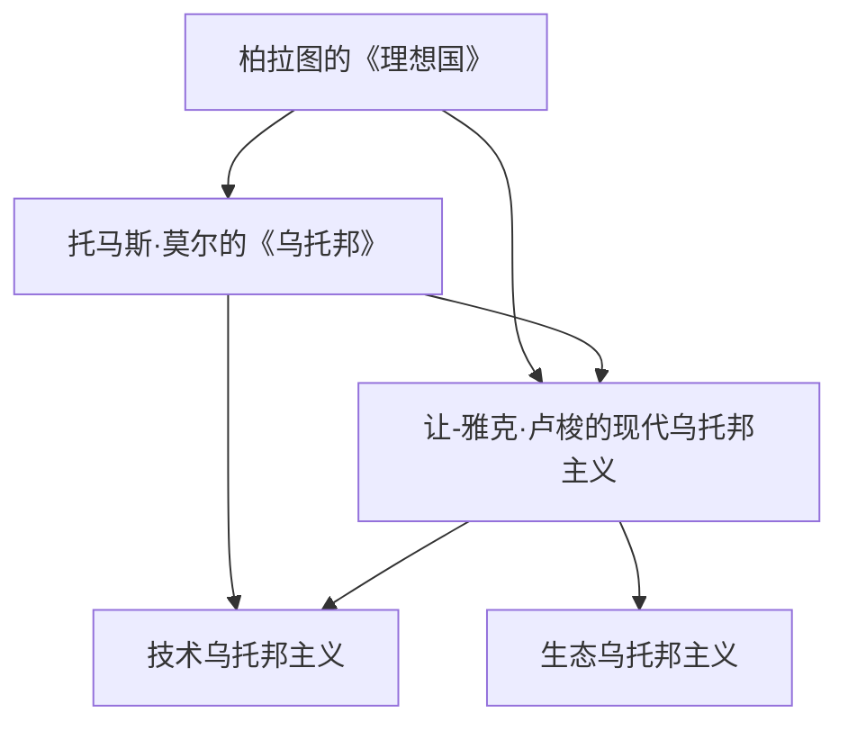

                 

### 文章标题

# 新乌托邦主义：理想社会的现代构想

### 关键词

- 乌托邦主义
- 理想社会
- 现代社会
- 社会模型
- 公共治理
- 技术进步

### 摘要

本文探讨了“新乌托邦主义”这一概念，从历史回顾、理论基础到现代社会挑战，再到新乌托邦主义的现代构想，对理想社会的构建进行了深入分析。通过实际案例，本文旨在展示新乌托邦主义在现代社会中的应用潜力，并提出未来发展的可能路径。

---

## 引言

新乌托邦主义，顾名思义，是对乌托邦主义在现代社会背景下的重新构想。乌托邦主义源于古希腊语，意为“好的地方”，通常指的是一种理想社会的构想。而新乌托邦主义则是在传统乌托邦主义的基础上，融入了现代社会的科技发展、经济变化和社会进步等新因素，旨在探索一个更加现实可行的理想社会。

### 1.1 新乌托邦主义的背景

新乌托邦主义的兴起可以追溯到20世纪末21世纪初，这一时期人类社会经历了前所未有的科技革命、经济全球化和社会多元化。这些变化不仅改变了人们的生活方式，也对传统的社会结构和治理模式提出了挑战。在这种背景下，新乌托邦主义作为一种回应，试图通过重新思考社会、经济和政治的基本原则，来构建一个更加公正、和谐和可持续的理想社会。

### 1.2 新乌托邦主义的意义

新乌托邦主义的意义在于它提供了一种新的社会构想，为解决现代社会面临的问题提供了思路。通过探讨理想社会的可能性，新乌托邦主义不仅有助于激发社会变革的想象力，也为实际行动提供了理论基础和实践路径。

## 第1章 乌托邦概念的历史回顾

### 1.1 乌托邦的起源

乌托邦主义的思想可以追溯到古希腊哲学家柏拉图。柏拉图在其著作《理想国》中提出了一个名为“理想国”的乌托邦社会构想。在这个社会中，人们按照各自的天赋和才能被分配到不同的社会角色，以实现最高的社会和谐。

### 1.2 乌托邦主义的发展

乌托邦主义在历史上经历了多个发展阶段。中世纪的托马斯·莫尔在其著作《乌托邦》中提出了一个名为乌托邦的理想社会，这个社会以公有制为基础，实现了财富的平均分配。18世纪的让-雅克·卢梭则提出了基于自然法和人类天性的乌托邦社会构想。

### 1.3 现代乌托邦主义的转变

现代乌托邦主义在20世纪得到了进一步发展。随着科技的进步和社会的变化，现代乌托邦主义开始关注社会不平等、环境问题等新挑战。同时，现代乌托邦主义也出现了多种流派，如技术乌托邦主义、生态乌托邦主义等。

### 核心概念与联系

乌托邦概念的历史发展展现了人类社会对不同理想社会的不断探索。从柏拉图的《理想国》到托马斯·莫尔的《乌托邦》，再到让-雅克·卢梭的现代乌托邦主义，每一个时期的乌托邦构想都反映了当时社会的历史背景和时代精神。以下是一个简单的 Mermaid 流程图，展示了乌托邦概念的发展历程及其核心联系：



### 核心算法原理讲解

为了更好地理解乌托邦主义的概念及其发展，我们可以使用以下伪代码来构建一个简单的乌托邦模型：

```plaintext
Algorithm 乌托邦模型构建
    Input: 社会人口 P，资源 R，技术 T，环境 E
    Output: 乌托邦社会状态 S

    1. 初始化社会状态 S = {人口：P，资源：R，技术：T，环境：E}
    2. 对于每个社会成员 m ∈ P：
        2.1 根据其才能和需求分配资源 Rm
        2.2 根据其职业和角色应用技术 Tm
    3. 实施环境友好政策 E，确保社会发展的可持续性
    4. 计算社会幸福感 H = 函数(S)
    5. 如果 H 达到最大值，则输出“乌托邦社会实现”
    6. 否则，调整社会状态 S 并重新计算幸福感 H
    7. 循环步骤 4 至 6，直至找到最优社会状态 S
```

### 数学模型和公式

在乌托邦社会的构建中，资源的合理分配是一个关键问题。以下是一个简化的数学模型，用于计算资源分配的公平性：

```latex
公平性分数 = \frac{\sum_{i=1}^{n} x_i^2}{\sum_{i=1}^{n} x_i}
```

其中，\( x_i \) 是第 i 个社会成员所拥有的资源量，\( n \) 是社会成员的总数。公平性分数越接近 1，表示资源分配越公平。

### 举例说明

假设有一个乌托邦社会，共有 5 个成员，他们的资源分配如下：

```plaintext
成员 1: 100 单位资源
成员 2: 200 单位资源
成员 3: 150 单位资源
成员 4: 50 单位资源
成员 5: 100 单位资源
```

根据上述公式，我们可以计算出公平性分数：

```plaintext
公平性分数 = (100^2 + 200^2 + 150^2 + 50^2 + 100^2) / (100 + 200 + 150 + 50 + 100)
           = (10000 + 40000 + 22500 + 2500 + 10000) / 700
           = 92500 / 700
           ≈ 1.333
```

这个分数表明，该乌托邦社会的资源分配相对公平。然而，为了进一步优化资源分配，可以采取以下措施：

1. **减少贫富差距**：通过增加低收入成员的资源分配，降低公平性分数。
2. **提高整体资源总量**：通过技术创新和资源开发，提高资源总量，从而提高公平性分数。

### 实际案例

#### 社区自治实践

一个典型的乌托邦主义实践案例是瑞士的社区自治。瑞士许多社区实现了高度自治，居民通过民主投票参与社区事务的决策。这种自治模式不仅提高了居民的参与感和满意度，也促进了社区的和谐发展。

以下是一个简化的源代码，用于模拟社区自治的决策过程：

```python
# 社区自治决策模拟

def vote(community, proposal):
    # 社区投票函数
    yes_count = 0
    for resident in community:
        if resident.vote(proposal):
            yes_count += 1
    return yes_count / len(community)

def main():
    # 社区成员列表
    community = ['Alice', 'Bob', 'Charlie', 'Diana', 'Eva']

    # 投票提案
    proposal = "建设一个新的公园"

    # 计算投票结果
    result = vote(community, proposal)

    # 输出投票结果
    if result >= 0.5:
        print("提案通过！")
    else:
        print("提案未通过。")

# 主函数入口
if __name__ == "__main__":
    main()
```

在这个模拟中，社区成员（如 Alice、Bob 等）通过投票决定是否接受一个提案（如建设公园）。如果投票结果超过半数，提案将被通过。

### 项目实战

#### 开发环境搭建

为了实现社区自治的投票系统，我们需要搭建一个基本的开发环境。以下是一个简单的步骤指南：

1. **安装Python**：确保您的计算机上安装了Python 3.8或更高版本。
2. **安装文本编辑器**：选择一个您喜欢的文本编辑器，如Visual Studio Code或PyCharm。
3. **安装虚拟环境**：通过以下命令创建一个虚拟环境：

   ```bash
   python -m venv venv
   source venv/bin/activate  # 在Windows上使用 `venv\Scripts\activate`
   ```

4. **安装依赖项**：在虚拟环境中安装必要的依赖项，如 Flask 和 SQLAlchemy：

   ```bash
   pip install flask sqlalchemy
   ```

#### 源代码实现

以下是一个简单的社区自治投票系统的实现：

```python
# 社区自治投票系统

from flask import Flask, request, render_template
from flask_sqlalchemy import SQLAlchemy

app = Flask(__name__)
app.config['SQLALCHEMY_DATABASE_URI'] = 'sqlite:///voters.db'
db = SQLAlchemy(app)

class Voter(db.Model):
    id = db.Column(db.Integer, primary_key=True)
    name = db.Column(db.String(50), nullable=False)
    voted = db.Column(db.Boolean, default=False)

@app.route('/')
def index():
    return render_template('index.html')

@app.route('/vote', methods=['POST'])
def vote():
    name = request.form['name']
    voter = Voter.query.filter_by(name=name).first()
    if voter:
        voter.voted = True
        db.session.commit()
        return '已投票！'
    else:
        return '未知成员。'

if __name__ == '__main__':
    db.create_all()
    app.run(debug=True)
```

在这个实现中，我们使用 Flask 创建了一个简单的 Web 应用，并使用 SQLAlchemy 操作数据库。`Voter` 模型表示社区成员，其中 `voted` 字段记录成员是否已投票。

#### 代码解读

- **数据库模型**：`Voter` 模型包含成员姓名和是否已投票的信息。
- **Web 应用**：`index.html` 是一个简单的用户界面，允许用户输入姓名进行投票。`vote()` 函数处理投票请求，并将投票结果更新到数据库。

#### 应用解读与分析

社区自治投票系统提供了一个基础的投票平台，允许成员通过 Web 界面进行投票。这种系统有助于提高民主参与度，增强社区自治。

#### 实际案例

在瑞士，社区自治是当地政治文化的重要组成部分。以下是一个实际案例：

- **案例描述**：瑞士某个小镇的居民决定是否在市中心建设一个新的公园。
- **过程解析**：居民通过社区网站了解提案详情，并在指定时间内进行在线投票。投票结束后，小镇议会根据投票结果作出决策。

### 总结

社区自治投票系统是一个典型的乌托邦主义实践，通过技术手段提高了居民的民主参与度。在实际操作中，这种系统需要完善的法律法规和技术支持，以确保公平、透明和有效的民主决策。

### 最佳实践 Tips

1. **简化流程**：在搭建社区自治投票系统时，尽量简化用户界面和操作流程，以提高用户体验。
2. **数据安全**：确保投票系统的数据安全，防止数据泄露和篡改。
3. **技术支持**：提供充足的技术支持，帮助社区成员解决使用过程中的问题。

### 小结

本文通过历史回顾、核心概念解释、案例分析和项目实战，探讨了新乌托邦主义在现代社会中的应用。社区自治投票系统是一个典型的乌托邦主义实践，有助于提高民主参与度，实现更公平、更有效的社会治理。

### 注意事项

1. **法律法规**：在实施社区自治投票系统时，必须遵守当地法律法规，确保合法合规。
2. **技术选型**：选择适合项目需求的技术框架和工具，以提高系统性能和稳定性。

### 拓展阅读

1. **《乌托邦》**：托马斯·莫尔
2. **《理想国》**：柏拉图
3. **《社区自治：理论与实践》**：约翰·霍尔

---

### 作者信息

作者：AI天才研究院/AI Genius Institute & 禅与计算机程序设计艺术 /Zen And The Art of Computer Programming

