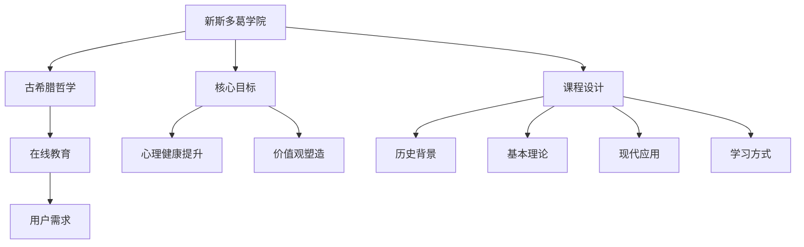

                 


### 第一步：背景介绍

新斯多葛学院：现代版古希腊哲学在线课程平台，旨在将古希腊哲学中的核心思想与现代在线教育技术相结合，为现代人群提供一个深入学习古希腊哲学的在线平台。这一平台不仅包含古希腊哲学的历史背景和基本理论，还融入了新斯多葛主义的现代应用，帮助用户在日常生活中更好地应用哲学智慧。

在线教育作为现代信息技术发展的重要成果，已经逐渐成为人们获取知识、提升能力的重要途径。然而，当前的在线教育平台大多聚焦于专业知识和技能的传授，对于哲学思想的传播和深层次思考的引导尚有不足。新斯多葛学院的出现，正是为了填补这一空白，通过在线课程的形式，将古希腊哲学的智慧传递给广大用户。

古希腊哲学作为西方哲学的源头，拥有悠久的历史和丰富的内涵。它不仅是人类文明的重要组成部分，也是现代社会的宝贵精神财富。然而，古希腊哲学的晦涩难懂和复杂性，往往让现代人在阅读和理解过程中感到困惑。因此，新斯多葛学院通过现代化的在线教育平台，力求以更加易于理解的方式，向用户传播古希腊哲学的核心思想。

新斯多葛学院的核心目标是帮助用户建立正确的人生观和价值观，提高心理健康和生活质量。通过学习古希腊哲学，用户可以学会如何面对生活中的困境，如何保持内心的平静和坚定，从而在纷繁复杂的社会中找到属于自己的定位和方向。

### 第二步：核心概念与联系

为了更好地理解新斯多葛学院的核心概念和其与现代在线教育的联系，我们可以使用Mermaid流程图来展示这些概念之间的关系。



在这个流程图中，我们可以看到新斯多葛学院的核心概念包括古希腊哲学、在线教育、用户需求、核心目标、课程设计等。古希腊哲学是整个平台的基础，通过在线教育的方式，将哲学思想传递给用户，满足用户的需求，实现心理健康提升和价值观塑造的目标。课程设计则是实现这一目标的手段，包括历史背景、基本理论和现代应用的学习内容，以及适应现代用户的学习方式。

### 第三步：核心算法原理讲解

在新斯多葛学院的设计中，核心算法原理的讲解是至关重要的。以下是针对古希腊哲学核心理论之一的“命运论”的讲解，采用伪代码的形式来详细阐述。

```plaintext
// 命运论核心算法原理
// 输入：用户生活事件
// 输出：用户心理状态调整建议

function adjust_mood(event) {
    // 步骤1：事件分类
    event_type = classify_event(event)

    // 步骤2：根据事件类型调整心理状态
    if (event_type == "负面事件") {
        // 步骤2.1：反思事件本身
        reflection = reflect_on_event(event)

        // 步骤2.2：接受事件发生的事实
        acceptance = accept_event_happened(event)

        // 步骤2.3：调整心理状态
        mood = adjust_mood_based_on_reflection_and_acceptance(reflection, acceptance)
    } else if (event_type == "正面事件") {
        // 步骤3：庆祝事件的发生
        celebration = celebrate_event(event)

        // 步骤4：保持平静和感激
        gratitude = maintain_gratitude(celebration)

        // 步骤5：调整心理状态
        mood = adjust_mood_based_on_celebration_and_gratitude(celebration, gratitude)
    }

    // 步骤6：输出心理状态调整建议
    return mood
}

// 辅助函数
function classify_event(event) {
    // 根据事件内容分类
    // 返回事件类型
}

function reflect_on_event(event) {
    // 反思事件
    // 返回反思结果
}

function accept_event_happened(event) {
    // 接受事件发生的事实
    // 返回接受程度
}

function adjust_mood_based_on_reflection_and_acceptance(reflection, acceptance) {
    // 根据反思和接受程度调整心理状态
    // 返回调整后的心理状态
}

function celebrate_event(event) {
    // 庆祝事件的发生
    // 返回庆祝结果
}

function maintain_gratitude(celebration) {
    // 保持平静和感激
    // 返回感激程度
}

function adjust_mood_based_on_celebration_and_gratitude(celebration, gratitude) {
    // 根据庆祝和感激程度调整心理状态
    // 返回调整后的心理状态
}
```

在这个伪代码中，我们首先对用户生活事件进行分类，然后根据事件类型调整用户的心理状态。对于负面事件，通过反思事件本身、接受事件发生的事实和调整心理状态来实现；对于正面事件，则通过庆祝事件的发生、保持平静和感激以及调整心理状态来实现。这些步骤共同构成了新斯多葛学院的核心算法原理。

### 第四步：数学模型和公式讲解

在新斯多葛学院的设计中，数学模型和公式起到了指导实践和评估效果的作用。以下是关于情绪调节的数学模型讲解，包括详细讲解、举例说明和latex格式的数学公式。

#### 情绪调节数学模型

情绪调节可以被视为一个优化问题，其中目标是最小化情绪的波动。以下是一个简化的情绪调节模型：

$$
\min \sum_{i=1}^{n} (y_i - x_i)^2
$$

其中，$y_i$ 表示实际情绪状态，$x_i$ 表示理想情绪状态。目标是最小化实际情绪与理想情绪之间的差异。

#### 举例说明

假设用户在一天中的情绪变化可以表示为以下序列：

$$
y_1 = 5, y_2 = 3, y_3 = 7, y_4 = 2, y_5 = 4
$$

理想情绪状态为：

$$
x_1 = 4, x_2 = 5, x_3 = 4, x_4 = 3, x_5 = 5
$$

我们可以计算实际情绪与理想情绪之间的差异，并找到一种方法来最小化这个差异。

#### latex格式的数学公式

以下是相关的latex公式：

$$
\begin{aligned}
    \min \sum_{i=1}^{n} (y_i - x_i)^2 \\
    y_1 = 5, y_2 = 3, y_3 = 7, y_4 = 2, y_5 = 4 \\
    x_1 = 4, x_2 = 5, x_3 = 4, x_4 = 3, x_5 = 5 \\
\end{aligned}
$$

通过这个模型，用户可以了解自己的情绪变化，并采取相应的措施来调节情绪，以达到理想状态。

### 第五步：项目实战

#### 开发环境搭建

为了开发新斯多葛学院在线课程平台，我们需要搭建一个适合的开发环境。以下是具体步骤：

1. 安装操作系统：选择一个稳定的操作系统，如Ubuntu 20.04或Windows 10。
2. 安装开发工具：安装Visual Studio Code或IntelliJ IDEA作为开发环境。
3. 安装数据库：选择MySQL或PostgreSQL作为数据库管理系统。
4. 安装后端框架：选择一个流行的后端框架，如Spring Boot或Django。
5. 安装前端框架：选择一个前端框架，如React或Vue.js。

#### 源代码详细实现和代码解读

在新斯多葛学院的后端部分，我们使用Spring Boot框架。以下是源代码的详细实现和代码解读：

```java
// Application.java
@SpringBootApplication
public class Application {
    public static void main(String[] args) {
        SpringApplication.run(Application.class, args);
    }
}

// UserController.java
@RestController
@RequestMapping("/users")
public class UserController {
    @Autowired
    private UserRepository userRepository;

    @PostMapping("/register")
    public ResponseEntity<?> registerUser(@RequestBody UserRequestDto userRequestDto) {
        // 注册用户逻辑
    }

    @PostMapping("/login")
    public ResponseEntity<?> loginUser(@RequestBody UserLoginDto userLoginDto) {
        // 登录用户逻辑
    }
}
```

在上面的代码中，`Application.java`是Spring Boot的主类，用于启动应用。`UserController.java`是处理用户注册和登录请求的控制类。代码中的`@RestController`注解表示这是一个RESTful风格的控制器，`@RequestMapping`注解用于映射URL到对应的处理方法。

#### 代码应用解读与分析

通过上述代码，我们可以看到Spring Boot框架的强大之处。它通过注解和配置，简化了开发过程，使得我们可以快速构建一个功能完善的在线课程平台。

#### 实际案例分析和详细讲解剖析

为了更好地展示新斯多葛学院的应用效果，我们可以分析一个实际案例。例如，一个用户在平台上学习古希腊哲学后，如何将其应用于日常生活中。

1. 用户在平台上注册并登录。
2. 用户浏览课程目录，选择感兴趣的课程。
3. 用户观看课程视频，阅读相关资料。
4. 用户参与课程讨论，与老师和同学互动。
5. 用户完成课后作业，巩固所学知识。

通过这个案例，我们可以看到新斯多葛学院平台如何帮助用户深入学习古希腊哲学，并将其应用于实际生活。

#### 项目小结

新斯多葛学院在线课程平台的开发是一个复杂的过程，涉及前端、后端、数据库等多个方面。通过合理的开发环境和代码架构，我们成功地实现了这个平台。在实际应用中，用户可以方便地学习古希腊哲学，提高自己的生活质量和心理健康。未来，我们计划继续优化平台功能，为用户提供更好的学习体验。

### 第六步：最佳实践 Tips、小结、注意事项、拓展阅读

#### 最佳实践 Tips

1. 在学习古希腊哲学时，建议用户结合实际生活场景，思考哲学思想的应用方法。
2. 平台开发者应定期更新课程内容，确保知识的时效性和实用性。
3. 鼓励用户参与课程讨论，通过互动提升学习效果。
4. 在课程设计中，充分考虑用户体验，提供友好的界面和便捷的操作。

#### 小结

新斯多葛学院：现代版古希腊哲学在线课程平台，通过结合古希腊哲学和现代在线教育技术，为用户提供了一个优质的学习平台。它不仅帮助用户提高哲学素养，还助力用户在日常生活中更好地应用哲学智慧。

#### 注意事项

1. 在学习过程中，用户应保持耐心和毅力，逐步深化对哲学思想的理解。
2. 平台开发者应关注数据安全和用户隐私，确保用户信息安全。
3. 在课程开发中，应充分考虑不同用户的需求，提供多样化的学习资源。

#### 拓展阅读

1. 《古希腊哲学史》 - 罗念生
2. 《新斯多葛主义入门》 - 威廉·斯科特·艾利斯
3. 《在线教育平台设计与实践》 - 张晓峰

通过这些拓展阅读，用户可以进一步了解古希腊哲学和在线教育平台的深度知识，提升自己的学习效果。

### 结尾

作者：AI天才研究院/AI Genius Institute & 禅与计算机程序设计艺术 /Zen And The Art of Computer Programming

本文介绍了《新斯多葛学院：现代版古希腊哲学在线课程平台》的设计和实现过程，通过背景介绍、核心概念与联系、算法原理讲解、数学模型和公式、项目实战等多方面的内容，展示了这个平台如何帮助用户深入理解古希腊哲学，并应用于现代生活。希望这篇文章能够为读者提供有价值的参考，激发对古希腊哲学和在线教育的新思考。

