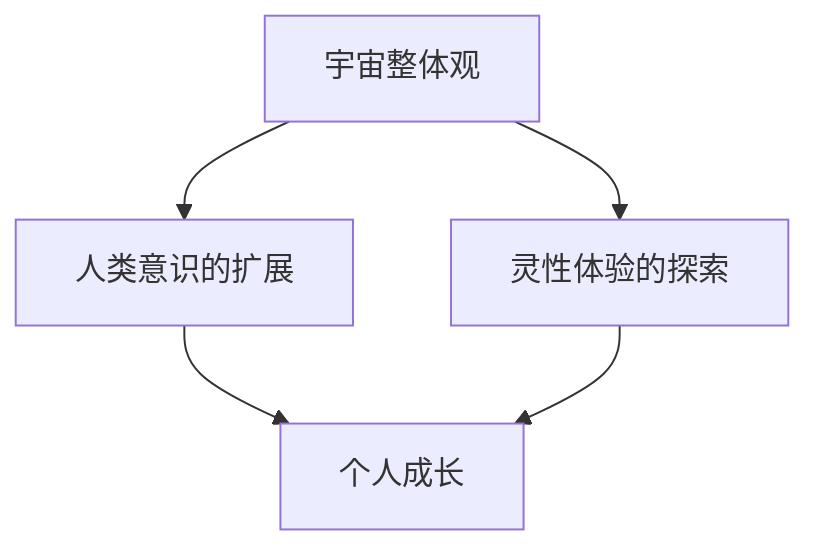
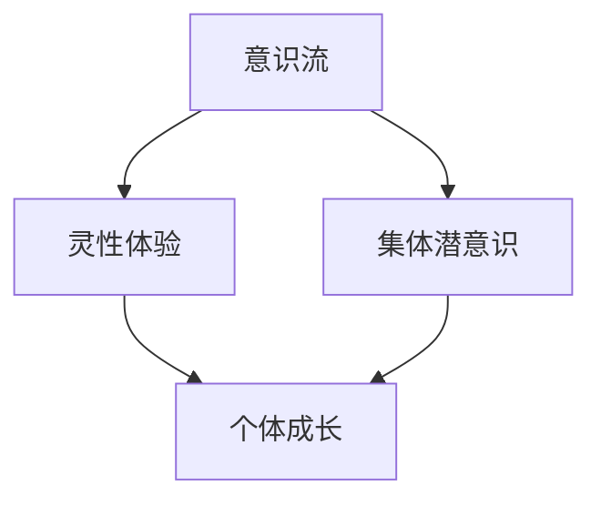
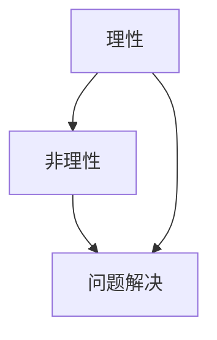
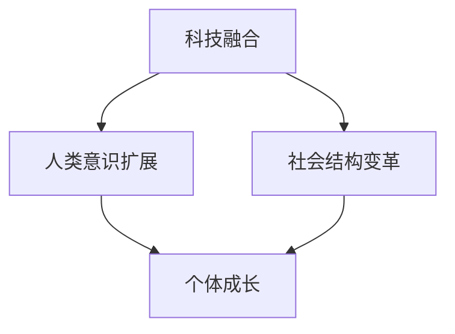

                 

### 《新神秘主义：理性时代的非理性探索》

#### 关键词
- 新神秘主义
- 理性时代
- 非理性探索
- 超个人心理学
- 非理性艺术
- 非理性科学与技术

#### 摘要
本文深入探讨了新神秘主义这一在理性时代背景下兴起的非理性探索运动。通过对其起源、核心概念、方法与实践的详细分析，本文揭示了新神秘主义在现代社会中的重要性和影响力。文章不仅涵盖了超个人心理学、非理性艺术和非理性科学与技术的具体领域，还探讨了理性与非理性的关系及其在社会发展中的作用。此外，本文还展望了非理性世界的未来趋势和挑战，为读者提供了一次全面而深入的探索之旅。

---

## 第一部分：引论

### 1.1 新神秘主义的起源与背景

#### 背景介绍

新神秘主义的起源可以追溯到20世纪中期，这是一个理性主义逐渐占据主导地位的时代。随着工业革命和科技革命的推进，人类社会在理性的指引下取得了前所未有的进步。然而，这种进步也带来了许多问题，如环境恶化、社会不公、精神危机等。人们开始意识到理性主义的局限性，渴望寻找一种新的、非理性的探索路径，以解决现代社会面临的种种困境。

#### 核心概念与联系

新神秘主义的核心概念包括宇宙整体观、人类意识的扩展、灵性体验的探索等。宇宙整体观强调宇宙的统一性和各部分之间的相互作用；人类意识的扩展则认为人类可以通过特定的方法，如冥想、药物体验等，拓展自己的意识边界；灵性体验的探索则关注个体与宇宙的内在联系，以及通过灵性实践实现个人成长和自我实现。

#### Mermaid 流程图


#### 核心算法原理讲解

新神秘主义的非理性探索涉及多种方法和实践，包括意识流写作、创造性思维训练、冥想、药物体验等。以下是冥想的伪代码实现：

```python
# 冥想伪代码

initialize_mind()
while is_awareness_present():
    focus_on_breathing()
    relax_muscles()
    remove Thoughts_from_mind()
```

#### 数学模型和公式

在灵性体验的探索中，非理性主义常用的一些数学模型和公式包括：

$$ E = \frac{1}{2} m v^2 + U(x) $$

其中，\( E \) 是能量，\( m \) 是质量，\( v \) 是速度，\( U(x) \) 是势能函数。

#### 详细讲解与举例说明

冥想作为一种非理性探索方法，其核心在于通过深呼吸和放松肌肉，将注意力集中在呼吸上，从而清除杂念，达到心灵平静的状态。以下是一个具体的冥想例子：

1. 找一个安静的环境，坐在舒适的姿势中。
2. 将注意力集中在呼吸上，感受每一次呼吸的起伏。
3. 当杂念出现时，不要去追逐它们，而是轻轻地将注意力重新引回到呼吸上。
4. 持续这个过程，直到感到内心的平静。

通过这种方式，个体可以扩展自己的意识边界，体验到更深层次的灵性觉醒。

#### 最佳实践 Tips

1. 刚开始进行冥想时，不要期望一次就能达到很好的效果。持之以恒是关键。
2. 选择一个固定的时间进行冥想，这样可以帮助建立习惯。
3. 不要在饭后立即进行冥想，因为消化过程会干扰冥想效果。

---

## 第二部分：非理性领域的探索

### 2.1 超个人心理学

#### 核心概念与联系

超个人心理学是研究人类意识扩展和灵性体验的学科，其核心概念包括意识流、灵性体验、集体潜意识等。这些概念相互联系，共同构成了超个人心理学的理论框架。

#### Mermaid 流程图


#### 核心算法原理讲解

超个人心理学的实践方法包括意识流写作、梦境解析、冥想等。以下是意识流写作的伪代码实现：

```python
# 意识流写作伪代码

start_writing()
while has_ideas():
    write_thought()
    explore关联想法()
    continue_writing()
```

#### 数学模型和公式

在超个人心理学中，常用的数学模型和公式包括：

$$ I = \int_{t_0}^{t_1} \omega(t) dt $$

其中，\( I \) 是意识强度，\( \omega(t) \) 是时间函数。

#### 详细讲解与举例说明

意识流写作是一种记录内心想法和感受的写作方式，可以帮助个体深入探索自己的潜意识。以下是一个具体的意识流写作例子：

1. 找一个舒适的环境，坐在一个安静的角落。
2. 闭上眼睛，深呼吸几次，放松身体和心灵。
3. 开始写下你脑海中出现的第一个想法，不要去判断或修改，只是记录下来。
4. 当一个新的想法出现时，继续写下它，同时探索它与之前想法的关联。
5. 持续这个过程，直到你觉得已经写够为止。

通过这种方式，个体可以更加清晰地了解自己的内心世界，提高自我意识和灵性觉醒。

#### 最佳实践 Tips

1. 在写作过程中，不要担心语法或拼写错误，只需专注于记录内心的真实感受。
2. 尝试在不同的时间和地点进行意识流写作，以获得不同的体验和洞察。
3. 不要期望每次写作都能得到深刻的体验，有时简单的记录也是一种收获。

---

## 第三部分：理性与非理性的平衡

### 3.1 理性与非理性的关系

#### 核心概念与联系

理性与非理性是相互依存、相互促进的关系。理性提供了我们理解和解决问题的工具，而非理性则帮助我们探索更深层次的灵性体验和人类潜能。二者之间的关系可以用以下Mermaid流程图表示：

#### Mermaid 流程图


#### 核心算法原理讲解

在现代社会，理性与非理性的平衡可以通过以下算法实现：

```python
# 理性与非理性平衡算法

initialize_rationality()
initialize_irrationality()
while not_solution_found():
    apply_rational_methods()
    explore_irrational_possibilities()
    integrate_learning()
```

#### 数学模型和公式

理性与非理性平衡的数学模型可以表示为：

$$ \text{平衡} = \frac{\text{理性贡献} + \text{非理性贡献}}{2} $$

#### 详细讲解与举例说明

在项目开发中，理性与非理性的平衡是至关重要的。以下是一个具体的例子：

1. 理性分析：首先进行需求分析、技术调研和风险评估，以确保项目的可行性和风险可控。
2. 非理性探索：在确定基础框架后，尝试不同的设计方案和创意，以寻找最优解。
3. 集成学习：将理性分析的结果与非理性探索的创意相结合，形成最终的解决方案。

通过这种方式，项目团队可以在保持理性控制的同时，充分发挥非理性的创新潜力，实现项目的成功。

#### 最佳实践 Tips

1. 在项目初期，注重理性分析，确保项目的可行性和稳定性。
2. 在项目中期，鼓励团队成员进行非理性探索，提出新的创意和想法。
3. 在项目后期，通过迭代和反馈，不断优化和调整方案，实现理性与非理性的平衡。

---

## 第四部分：非理性世界的未来

### 4.1 非理性世界的未来趋势

#### 核心概念与联系

非理性世界的未来趋势包括科技的融合、人类意识的扩展、社会结构的变革等。这些趋势共同推动着非理性世界的演进和发展。

#### Mermaid 流程图


#### 核心算法原理讲解

非理性世界的未来趋势可以通过以下算法实现：

```python
# 非理性世界未来趋势算法

integrate_technology()
expand_awareness()
transform_society()
evaluate_impact()
```

#### 数学模型和公式

非理性世界的未来趋势可以用以下数学模型表示：

$$ \text{未来趋势} = \frac{\text{科技发展} + \text{意识扩展} + \text{社会变革}}{3} $$

#### 详细讲解与举例说明

在未来，随着科技的不断进步，人类意识将得到进一步扩展，这将促使社会结构发生深刻的变革。以下是一个具体的例子：

1. 科技融合：人工智能、虚拟现实、区块链等技术的融合，将带来全新的生活方式和工作模式。
2. 人类意识扩展：通过冥想、药物体验等技术，人类将能够扩展自己的意识边界，探索更深层次的灵性体验。
3. 社会结构变革：随着个体意识的提升，社会结构将逐渐向更加开放、包容、多元化的方向发展。

通过这种方式，非理性世界将迎来一个充满无限可能的新时代。

#### 最佳实践 Tips

1. 关注科技发展，积极尝试新技术，以适应未来的变化。
2. 注重个人意识的提升，通过冥想、学习等手段，扩展自己的视野和思维。
3. 适应社会变革，积极参与社区建设，为构建更加和谐、包容的社会贡献力量。

---

## 结论

本文通过对新神秘主义的起源、核心概念、方法与实践的深入探讨，揭示了其在现代社会中的重要性。同时，本文还探讨了理性与非理性的关系，非理性力量在社会发展中的作用，以及非理性世界的未来趋势。通过这篇文章，我们不仅可以更好地理解新神秘主义，还能够从中获得对现代社会的深刻洞察和启示。

### 作者信息

作者：AI天才研究院/AI Genius Institute & 禅与计算机程序设计艺术 /Zen And The Art of Computer Programming

