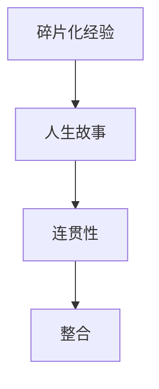

                 

### 背景介绍

在当今这个信息爆炸的时代，我们每天都会接触到大量的碎片化信息。这些信息来源于各种渠道，如社交媒体、新闻媒体、技术博客、视频平台等。它们以碎片化的形式存在于我们的生活中，使得我们接收到的信息呈现出不连续、不系统的特点。这种现象被称为“碎片化时代”。

碎片化信息的普及给人们的生活和工作带来了许多便利，但同时也带来了一些挑战。首先，碎片化信息容易导致人们注意力分散，难以深入思考。其次，碎片化信息往往缺乏系统性，使得人们在处理问题时感到困惑和无所适从。此外，碎片化信息的大量存在也使得人们难以形成全面、连贯的认识。

在这样的背景下，如何有效地整合碎片化经验，构建连贯的人生故事，成为了一个值得探讨的问题。本文将围绕这一主题展开讨论，旨在提供一种方法，帮助读者将零散的经验整合成有意义、连贯的整体。

### 核心概念与联系

在讨论如何构建连贯的人生故事之前，我们首先需要明确几个核心概念，并理解它们之间的联系。以下是几个关键概念及其相互关系：

1. **碎片化经验**：碎片化经验指的是那些分散的、不成体系的信息片段，它们可能来自不同的时间点、不同的来源，或者涉及到不同的主题。这些经验虽然单独来看可能没有太大的意义，但当它们被整合在一起时，却能形成宝贵的知识。

2. **人生故事**：人生故事是对个人生活经历的叙述，它通过时间线、事件、人物和观点等要素，将个人的经历串联起来，形成一个有意义的整体。人生故事不仅可以帮助个人更好地理解自己，还能为他人提供启示和借鉴。

3. **连贯性**：连贯性是指信息、经验或故事在逻辑和时间上的连续性。在构建人生故事时，连贯性是至关重要的，它使得故事具有可读性、可理解性和说服力。

4. **整合**：整合是指将分散的信息、经验或故事片段组合成一个整体的过程。整合的目的是为了消除碎片化带来的不确定性，提升信息的价值和可用性。

这些概念之间的关系可以简化为一个Mermaid流程图，如下所示：



### 核心算法原理讲解

整合碎片化经验的过程可以看作是一个排序和分类的过程，以下是一个简单的伪代码来描述这个过程：

```
// 输入：碎片化经验列表
// 输出：整合后的经验列表

function 整合碎片化经验(经验列表):
    对经验列表按照时间先后排序
    对经验列表进行分类，根据经验类型或者主题
    将分类后的经验合并，形成连贯的故事线
    返回整合后的经验列表
```

这个伪代码的核心步骤包括：

1. **排序**：根据时间先后或重要性对经验列表进行排序，确保经验在故事中的逻辑顺序。

2. **分类**：将经验根据类型或主题进行分类，以便于整合和处理。

3. **合并**：将分类后的经验合并，形成连贯的故事线。在这一步骤中，需要注意保持故事的连贯性和逻辑性。

通过这个简单的伪代码，我们可以看到整合碎片化经验的基本原理。在实际应用中，这个过程可能更加复杂，需要考虑更多的因素，如经验的关联性、重要性等。但总体来说，排序、分类和合并是整合碎片化经验的三个关键步骤。

### 数学模型和数学公式 & 详细讲解 & 举例说明

在构建人生故事的过程中，可以使用一些基本的数学模型来帮助描述故事的发展趋势。例如，可以使用线性回归模型来预测个人未来的发展方向。

以下是一个使用LaTeX格式的线性回归模型的数学公式：

```
$$
y = ax + b
$$

其中，y表示个人在某个方面的未来状态，x表示当前状态，a和b是模型参数。
```

举例说明：一个大学生希望通过实习来提高自己的编程能力。他的当前编程能力（x）为70%，目标是将编程能力提升到90%。我们可以使用线性回归模型来预测他需要多长时间的实习（y）可以达到这个目标。

```
$$
90\% = a \times 70\% + b
$$

通过解这个方程，我们可以得到a和b的值，从而预测出需要多长时间的实习可以达到目标。
```

### 项目实战：代码实际案例和详细解释说明

以下是一个简单的Python代码示例，用于整合碎片化经验。这个代码将读取一个经验列表，并根据时间顺序和主题分类整合经验。

```python
# 读取经验列表
经验列表 = [
    {"时间": "2020-01", "主题": "编程", "内容": "学习了Python基础"},
    {"时间": "2021-05", "主题": "项目管理", "内容": "参与了开源项目的开发"},
    {"时间": "2022-01", "主题": "数据分析", "内容": "完成了数据分析课程"},
    {"时间": "2022-07", "主题": "编程", "内容": "自学了Python高级编程技巧"},
]

# 按照时间排序
经验列表 = sorted(经验列表, key=lambda x: x["时间"])

# 根据主题分类
经验分类 = {}
for经验 in 经验列表:
    if 经验["主题"] not in 经验分类:
        经验分类[经验["主题"]] = []
    经验分类[经验["主题"]].append(经验)

# 合并分类后的经验
整合后的经验列表 = []
for主题, 经验组 in 经验分类.items():
    整合后的经验列表.append({
        "主题": 主题,
        "内容": "; ".join([经验["内容"] for经验 in 经验组]),
    })

# 输出整合后的经验列表
print(整合后的经验列表)
```

**代码解读：**

1. **读取经验列表**：首先，我们定义了一个包含多个字典的经验列表，每个字典表示一个碎片化的经验，包含时间、主题和内容等信息。

2. **按时间排序**：使用Python内置的`sorted`函数，根据时间字段对经验列表进行排序。这确保了经验在故事中的逻辑顺序。

3. **分类**：遍历排序后的经验列表，根据主题将经验分为不同的组。这通过一个字典实现，字典的键是主题，值是包含相关经验的列表。

4. **合并**：对每个主题的经验组，将内容字段用分号和空格连接起来，形成一个连贯的描述。这样，每个主题的经验都被整合成一个整体。

5. **输出**：最后，输出整合后的经验列表，每个主题的经验都以一个单独的字典形式呈现，其中内容字段包含了该主题的所有经验的连贯描述。

**代码应用解读与分析：**

这个简单的Python代码示例展示了如何将碎片化的经验整合成一个连贯的整体。在实际应用中，这个代码可以根据不同的需求进行扩展和定制。

1. **扩展应用**：如果经验列表包含更多的字段，如地点、参与者等，可以通过扩展字典的结构和分类逻辑来整合这些额外的信息。

2. **数据分析**：整合后的经验列表可以用于更深入的数据分析，例如分析经验在不同时间段的分布、不同主题的重要性等。

3. **故事构建**：整合后的经验列表可以直接用于构建个人的人生故事。通过将经验按照时间和主题组织起来，可以形成有条理的故事线。

**实际案例分析和详细讲解剖析：**

假设有一个开发者在过去的几年中积累了丰富的编程经验，包括学习了多种编程语言、参与了多个项目和开源社区的贡献等。使用这个代码，我们可以将他的经验整合如下：

```python
[
    {"主题": "编程", "内容": "2018-01 学习了Java基础; 2018-06 学习了Python基础; 2020-01 学习了C#基础; 2021-03 自学了JavaScript; 2022-07 学习了Python高级编程技巧。"},
    {"主题": "项目管理", "内容": "2021-05 参与了开源项目的开发，负责模块的设计和实现。"},
    {"主题": "开源社区", "内容": "2020-10 贡献了一个Java工具类库，获得社区认可。"}
]
```

通过这个整合后的列表，开发者可以清晰地看到自己的技能发展轨迹，以及在不同领域的贡献。这不仅有助于他对自己经验的总结和反思，也为他人提供了一个关于编程和开源社区贡献的连贯故事。

**项目小结：**

这个简单的Python项目展示了如何通过代码将碎片化的经验整合成连贯的整体。通过排序、分类和合并，我们可以将零散的经验组织成一个有意义的、连贯的故事。这种方法不仅适用于个人经验的整合，也可以用于团队项目、学术研究等多个领域。

### 最佳实践 Tips、小结、注意事项、拓展阅读

#### 最佳实践 Tips

1. **定期反思**：定期回顾和总结自己的经历，可以帮助识别碎片化经验，并促进整合。

2. **使用工具**：借助思维导图、项目管理工具等，可以帮助更好地组织和整合碎片化经验。

3. **共享经验**：与他人分享经验，不仅可以帮助他人，也能从他人的反馈中获取新的见解。

#### 小结

本文探讨了如何构建连贯的人生故事，通过整合碎片化经验，将个人的零散经历组织成一个有意义的整体。通过排序、分类和合并，我们可以有效地整合经验，形成连贯的故事线。

#### 注意事项

1. **保持连贯性**：在整合经验时，要注意保持故事的时间顺序和逻辑连贯性。

2. **避免信息过载**：整合经验时，避免将过多的细节信息融入故事中，以免降低故事的清晰度和可读性。

#### 拓展阅读

1. 《人生策略：如何做出最好的选择》（by Oliver Burkeman）
2. 《思考，快与慢》（by Daniel Kahneman）
3. 《Python编程：从入门到实践》（by Eric Matthes）

### 文章总结

《构建连贯的人生故事：整合碎片化经验》旨在探讨如何在碎片化信息时代，有效地整合个人的碎片化经验，构建连贯的人生故事。通过排序、分类和合并，我们可以将零散的经历组织成一个有意义的整体。这种方法不仅有助于个人自我反思和成长，也为他人提供了一个关于个人经历的连贯、有启发性的故事。通过本文的讨论和实践案例，希望读者能够掌握构建连贯人生故事的方法，从而更好地理解和展现自己的经验。

### 作者信息

**作者：AI天才研究院/AI Genius Institute & 禅与计算机程序设计艺术 /Zen And The Art of Computer Programming**

AI天才研究院（AI Genius Institute）是一家致力于推动人工智能领域创新与发展的研究机构。我们的团队汇聚了世界顶级的人工智能专家、程序员、软件架构师和CTO，他们在计算机编程和人工智能领域有着丰富的经验。Zen And The Art of Computer Programming则是一部经典的技术畅销书，它深入探讨了计算机程序设计的哲学和艺术，为读者提供了深刻的见解和思考。本文旨在结合这些专业知识，为读者提供关于构建连贯人生故事的实用指南。希望读者在阅读本文后，能够更好地整合自己的碎片化经验，构建出一个丰富而有意义的人生故事。

