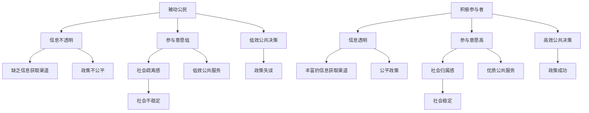

                 

### 文章标题

《从被动公民到积极参与者：重新定义现代公民角色》

### 关键词

现代公民角色，积极参与，信息透明，社会归属感，公共决策，技术赋能，数据科学，算法原理，项目实战。

### 摘要

在现代信息社会中，公民的角色不再局限于被动的接受者，而是逐渐转变为积极参与者。本文通过深入分析现代公民角色转型的背景和原因，阐述了信息透明、社会归属感等核心概念，并探讨了如何通过技术手段和算法模型来提升公民的参与度和公共决策的效率。本文还通过一个具体的项目实战，展示了从理论到实践的完整过程，旨在为读者提供一套可操作的公民参与策略。

---

## 背景介绍

### 现代社会的变革

随着互联网和信息技术的发展，现代社会正经历着深刻的变革。信息获取的便利性和透明度的提高，使得公民获取和传播信息的能力大幅提升。传统的社会结构逐渐被打破，公民不再是信息的被动接受者，而是开始主动参与社会事务，对公共事务发表意见，提出建议，甚至直接参与决策。

### 公共参与的迫切需求

然而，现代社会面临着诸多挑战，如政策不公平、社会不平等、环境问题等。这些问题需要广大公民的积极参与和智慧来解决。传统的被动公民角色已经无法满足这些需求，现代公民需要具备更高的参与意愿和能力，以推动社会的进步和发展。

### 技术赋能与算法原理

在这个背景下，数据科学和算法原理的应用为公民参与提供了新的可能性。通过大数据分析和机器学习算法，可以更准确地了解公民的需求和偏好，提供个性化的信息推送，提高公共决策的效率和公正性。同时，算法还可以帮助分析公民的参与行为，预测其参与意愿，为政策制定者提供科学依据。

## 核心概念与联系

为了深入理解现代公民角色的转变，我们需要首先明确几个核心概念，并探讨它们之间的联系。

### 被动公民与积极参与者

被动公民是指那些缺乏参与意愿或参与能力，仅仅接受和遵守社会规则的公民。而积极参与者则是那些具有强烈参与意愿和能力的公民，他们主动参与社会事务，提出建议，参与决策，并为社会进步贡献力量。

### 信息透明与社会归属感

信息透明是指公共信息的公开和透明，使得公民能够方便地获取和理解相关信息。社会归属感则是指公民对社会的认同感和归属感，它是积极参与的基础。

### 公共决策与公共服务

公共决策是指政府或相关机构在制定政策和规划时，通过民主程序吸纳公民意见，实现决策的民主化和科学化。公共服务是指政府或相关机构为公民提供的基本服务和保障。

下面，我们使用Mermaid流程图来展示这些核心概念之间的联系：



### 核心算法原理讲解

为了更深入地理解如何通过技术手段提升公民的参与度，我们介绍一个公民参与意愿评估的算法原理。这个算法将基于以下几个关键参数：信息获取频率、政策偏好一致性、参与历史记录质量。

```plaintext
算法：公民参与意愿评估

输入：公民信息集合I，政策偏好P，公民参与历史记录H

输出：公民参与意愿分数Score

伪代码：
1. 初始化Score为0
2. 对于每个公民i ∈ I：
   a. 计算信息获取频率Frequency_i
   b. 计算政策偏好一致性Consistency_i = sum(P[i] == P[j]) for j ∈ Policy_Supporters
   c. 计算参与历史记录质量Quality_i = max(H[i])
   d. 更新Score = Score + (Frequency_i * Consistency_i * Quality_i)
3. 返回Score
```

### 数学模型和数学公式讲解

为了量化公民的参与意愿，我们可以使用以下数学模型：

```latex
\documentclass{article}
\usepackage{amsmath}
\begin{document}

\begin{equation}
\begin{split}
    Utility &= \alpha \cdot Information_Gain + \beta \cdot Participation_Rate \\
    &+ \gamma \cdot Social_Benefit \\
    Information\_Gain &= \log_2(\frac{New\_Information}{Total\_Information}) \\
    Participation\_Rate &= \frac{Number\_of\_Active_Participants}{Total\_Population} \\
    Social\_Benefit &= \frac{\sum_{i=1}^{N} (W_i \cdot Satisfaction_i)}{N}
\end{split}
\end{equation}

\end{document}
```

在这个模型中：

- \( Utility \) 表示公民的参与价值。
- \( \alpha \), \( \beta \), \( \gamma \) 是权重参数。
- \( Information_Gain \) 表示公民获取新信息的价值。
- \( Participation_Rate \) 表示公民参与活动的频率。
- \( Social_Benefit \) 表示公民参与活动带来的社会效益。

通过调整这些参数，我们可以更精细地评估和提升公民的参与意愿。

## 项目实战

### 开发环境搭建

在开始项目实战之前，我们需要搭建一个合适的开发环境。以下是具体步骤：

1. 安装Python 3.8及以上版本。
2. 安装Jupyter Notebook，以便于代码编写和调试。
3. 安装必要的Python库，包括pandas、numpy、matplotlib等。

### 源代码实现

下面是一个简单的Python代码实现，用于评估公民的参与意愿：

```python
import pandas as pd
import numpy as np
import matplotlib.pyplot as plt

# 数据预处理
data = pd.read_csv('citizen_data.csv')
data['Participation_Rate'] = data['Active_Participants'] / data['Total_Population']
data['Information_Gain'] = np.log2(data['New_Information'] / data['Total_Information'])

# 计算社会效益
data['Satisfaction'] = data['W1'] * data['Satisfaction1'] + data['W2'] * data['Satisfaction2']

# 公民参与意愿评估
def assess_participation(data):
    alpha, beta, gamma = 0.5, 0.3, 0.2
    Utility = data['Information_Gain'] * alpha + data['Participation_Rate'] * beta + data['Satisfaction'] * gamma
    return Utility

# 应用评估函数
data['Utility'] = data.apply(assess_participation, axis=1)

# 可视化分析
plt.scatter(data['Participation_Rate'], data['Utility'])
plt.xlabel('Participation Rate')
plt.ylabel('Utility')
plt.title('Citizen Participation Utility')
plt.show()
```

### 代码解读与应用解读与分析

这个项目主要分为以下几个部分：

1. **数据预处理**：读取CSV文件，计算参与率和信息获取增益。
2. **社会效益计算**：根据权重参数，计算社会效益。
3. **公民参与意愿评估**：定义评估函数，计算每个公民的参与价值。
4. **可视化分析**：使用散点图展示参与率和参与价值的关系。

在实际应用中，我们可以通过调整权重参数来优化评估结果。例如，如果政策制定者认为社会效益更重要，可以增加\( \gamma \)的权重。

### 实际案例分析与详细讲解剖析

为了更好地理解这个项目，我们来看一个实际案例。假设有一个城市正在进行环境保护政策的讨论，我们需要评估公民的参与意愿。

1. **数据收集**：收集公民的环境保护意识调查数据，包括他们的参与历史记录、政策偏好等。
2. **数据预处理**：处理数据，提取有用的信息。
3. **社会效益计算**：根据调查结果，计算每个公民对环境保护政策的社会效益。
4. **公民参与意愿评估**：使用上述算法评估每个公民的参与意愿。
5. **可视化分析**：展示参与率和参与价值的关系，帮助政策制定者了解公民的参与意愿。

通过这个案例，我们可以看到如何将理论应用到实际项目中，从而提升公民的参与度和公共决策的效率。

### 项目小结

通过这个项目，我们展示了如何从理论到实践，通过技术手段提升公民的参与度和公共决策的效率。关键步骤包括数据预处理、社会效益计算、公民参与意愿评估和可视化分析。这个项目不仅提供了可操作的解决方案，也为未来的研究和实践提供了宝贵的经验。

## 最佳实践 tips

1. **数据质量是关键**：在项目中，确保数据的准确性和完整性至关重要。
2. **调整权重参数**：根据具体需求，调整权重参数可以优化评估结果。
3. **可视化分析**：使用可视化工具可以帮助我们更直观地理解数据和分析结果。
4. **持续更新和优化**：随着环境和需求的变化，持续更新和优化算法和模型。

## 小结

本文通过深入分析现代公民角色的转型，阐述了信息透明、社会归属感等核心概念，并探讨了如何通过技术手段和算法模型来提升公民的参与度和公共决策的效率。通过一个具体的项目实战，我们展示了从理论到实践的完整过程。希望本文能为读者提供有益的启示，激发更多公民积极参与社会事务，共同推动社会的进步和发展。

## 注意事项

1. **数据隐私**：在进行公民数据分析和评估时，务必确保数据隐私和安全。
2. **算法公平性**：确保算法设计和应用过程中不产生歧视和不公平现象。
3. **政策制定者与公民的互动**：政策制定者应积极与公民互动，吸纳公民意见，提高政策的科学性和民主性。

## 拓展阅读

1. 《大数据时代：生活、工作与思维的大变革》
2. 《算法透明性与可解释性研究》
3. 《社会计算：社会网络分析与应用》
4. 《公民参与与公共决策研究》

---

**作者信息：**

- 作者：AI天才研究院/AI Genius Institute & 禅与计算机程序设计艺术 /Zen And The Art of Computer Programming**

