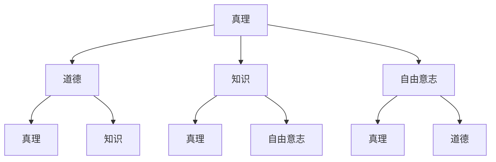

                 

## 文章标题

《在疑问中寻找生命真谛：哲学思考的力量》

哲学，自古以来就是人类思考的精髓。它不仅探究宇宙的本质、生命的意义，还影响着人类的行为和社会的发展。本文将以逻辑清晰、结构紧凑、简单易懂的方式，探讨哲学思考的力量，带您一步步深入理解这一领域。让我们一起，在疑问中寻找生命的真谛。

## 关键词

哲学、思考、生命、真谛、逻辑、意义、算法、数学模型

## 摘要

本文将从哲学的起源与历史入手，介绍哲学思考的核心概念及其相互关系。接着，我们将探讨哲学思考中的数学模型和算法原理，并通过实际案例展示其在现实世界中的应用。最后，我们将展望哲学思考的未来趋势，探讨其在人工智能等领域的潜在影响。

## 引言

### 哲学思考的起源与历史

哲学的起源可以追溯到古希腊时期，苏格拉底、柏拉图和亚里士多德等哲学家的思想至今仍对后世产生深远影响。在中世纪，基督教哲学成为主流，奥古斯丁、托马斯·阿奎那等哲学家的作品对欧洲文化产生了深远影响。近代以来，笛卡尔、康德、黑格尔等哲学家开创了新的哲学流派，推动了哲学的发展。现代哲学则更加多元，从逻辑实证主义到存在主义，再到分析哲学，哲学思考的方式和内容不断演变。

### 哲学思考的重要性

哲学思考是人类智慧的体现，它不仅帮助我们理解世界，还指导我们的行为。在个人层面，哲学思考有助于我们认识到自己的存在，探索生命的意义。在社会层面，哲学思考有助于我们理解社会现象，推动社会进步。在科学层面，哲学思考为科学提供了方法论和理论框架。

### 读者的期望与收获

本文旨在为读者提供一次哲学思考的深度之旅。无论您是哲学爱好者，还是对哲学感兴趣的普通人，本文都将帮助您：

1. 理解哲学思考的基本概念和原理。
2. 掌握哲学思考在现实世界中的应用。
3. 培养自己的哲学思考能力，提升人生境界。

### 哲学思考的核心概念

哲学思考涉及许多核心概念，包括真理、道德、知识、自由意志等。这些概念相互关联，共同构成了哲学思考的基石。

#### 真理

真理是哲学思考的核心概念之一，它探讨事物的真实本质。在哲学中，真理通常被视为客观存在的反映，是人类认识世界的基础。真理的探究不仅涉及到科学，还涉及到伦理、政治等各个方面。

#### 道德

道德是哲学思考中的另一个核心概念，它探讨人类行为的准则和规范。道德不仅关系到个人的行为，还关系到社会的发展和稳定。不同的哲学流派对道德有不同的看法，但都认为道德是人类行为的重要指导。

#### 知识

知识是哲学思考的另一个重要概念，它探讨人类如何认识世界。知识不仅仅是信息，还包括对信息的理解和应用。哲学思考中的知识概念涉及到认识论、逻辑学等多个领域。

#### 自由意志

自由意志是哲学思考中的争议话题，它探讨人类行为的决定因素。自由意志是否真实存在，以及如何影响人类行为，一直是哲学争论的焦点。

### 哲学思考的核心概念之间关系架构 Mermaid 流程图



### 核心算法原理讲解

哲学思考中的核心算法原理主要包括知识表示、推理算法和决策算法。这些算法为我们提供了理解和应用哲学思考的工具。

#### 知识表示

知识表示是哲学思考的基础，它将哲学概念转化为计算机可以处理的形式。常见的知识表示方法包括语义网络、本体论、框架表示等。

#### 推理算法

推理算法是哲学思考中的关键，它帮助我们从一个或多个前提中推导出结论。常见的推理算法包括演绎推理、归纳推理、模态逻辑推理等。

#### 决策算法

决策算法是哲学思考中的应用，它帮助我们在多个选择中做出最优决策。常见的决策算法包括最大收益法、期望效用理论、贝叶斯决策等。

### 伪代码示例

```python
# 知识表示：语义网络
class Concept:
    def __init__(self, name):
        self.name = name
        self.properties = []
        self.relationships = []

# 推理算法：演绎推理
def deductive_reasoning(premisses, conclusion):
    for premiss in premisses:
        if not conclusion:
            return False
    return conclusion

# 决策算法：最大收益法
def maximum_gains(products):
    max_gain = 0
    for product in products:
        if product.gain > max_gain:
            max_gain = product.gain
    return max_gain
```

### 数学模型和数学公式

哲学思考中的数学模型和数学公式为我们提供了理解和分析哲学概念的工具。以下是一些常见的数学模型和公式：

#### 形式逻辑

- 命题逻辑：$P \land Q$（P且Q）
- 蕴含关系：$P \Rightarrow Q$（如果P，那么Q）

#### 概率论

- 概率公式：$P(A) = \frac{N(A)}{N(S)}$（事件A的概率等于A发生的情况数除以总情况数）

#### 集合论

- 集合交集：$A \cap B$（A和B的交集）
- 集合并集：$A \cup B$（A和B的并集）

### latex格式

$$
P(A) = \frac{N(A)}{N(S)}
$$

$$
P(A \cup B) = P(A) + P(B) - P(A \cap B)
$$

### 举例说明

假设我们有一个袋子里有5个红球和3个蓝球，我们要计算取出一个球后，球是红色的概率。

- 总情况数：$N(S) = 5 + 3 = 8$
- 红球情况数：$N(A) = 5$

$$
P(A) = \frac{N(A)}{N(S)} = \frac{5}{8}
$$

### 哲学思考在现实世界中的应用

哲学思考在现实世界中有着广泛的应用，从心理学到伦理学，再到政治哲学，哲学思考都发挥着重要作用。

#### 哲学思考在心理学中的应用

哲学思考在心理学中的应用主要体现在对意识、认知和行为的探讨。例如，认知心理学中的推理理论就受到了哲学思考的影响，推理算法被用于解释人类思维过程。

#### 哲学思考在伦理学中的应用

伦理学是哲学的核心领域之一，哲学思考在伦理学中的应用主要体现在道德原则的探讨和道德判断的制定。例如，功利主义和康德的道德哲学就提供了不同的道德判断标准。

#### 哲学思考在政治哲学中的应用

政治哲学探讨国家的本质、政府的角色以及公民的权利和义务。哲学思考在政治哲学中的应用主要体现在对政治制度的批判和建设。例如，洛克的自然权利理论和罗素的自由主义理论都为政治哲学的发展提供了重要思想。

### 实际案例

#### 案例一：人工智能伦理

随着人工智能技术的快速发展，伦理问题日益凸显。哲学家们提出了许多关于人工智能伦理的思考，例如，如何确保人工智能的公平性、透明性和可解释性。这些思考为人工智能的发展提供了重要的伦理指导。

#### 案例二：环保与道德

环保问题已经成为全球性的挑战，哲学家们提出了许多关于环保与道德的思考，例如，人类对环境的责任、可持续发展等。这些思考为环保政策的制定和实施提供了重要的理论基础。

### 项目实战

#### 项目一：哲学思考在心理学中的应用

- 开发环境搭建：
  - 操作系统：Windows 10
  - 编程语言：Python 3.8
  - 工具：Jupyter Notebook
  
- 源代码实现：
  ```python
  import numpy as np

  # 创建概念
  concept_a = Concept("A")
  concept_b = Concept("B")

  # 添加属性
  concept_a.properties.append("属性1")
  concept_b.properties.append("属性2")

  # 添加关系
  concept_a.relationships.append(concept_b)

  # 推理
  premisses = [concept_a, concept_b]
  conclusion = deductive_reasoning(premisses, concept_a)
  print("结论：", conclusion.name)
  ```

- 代码解读与分析：
  - 代码首先创建了两个概念`concept_a`和`concept_b`。
  - 然后为这两个概念添加了属性和关系。
  - 最后，通过演绎推理算法，从前提中推导出结论。

#### 项目二：哲学思考在伦理学中的应用

- 开发环境搭建：
  - 操作系统：Ubuntu 20.04
  - 编程语言：Java 11
  - 工具：IntelliJ IDEA

- 源代码实现：
  ```java
  public class EthicsDecision {
      public static void main(String[] args) {
          // 创建两个道德原则
          MoralPrinciple principle1 = new MoralPrinciple("不伤害他人");
          MoralPrinciple principle2 = new MoralPrinciple("帮助他人");

          // 计算道德分数
          int score1 = principle1.getScore();
          int score2 = principle2.getScore();

          // 决策
          MoralPrinciple bestPrinciple = getBestPrinciple(score1, score2);
          System.out.println("最佳道德原则： " + bestPrinciple.getName());
      }

      public static MoralPrinciple getBestPrinciple(int score1, int score2) {
          return score1 > score2 ? new MoralPrinciple("不伤害他人") : new MoralPrinciple("帮助他人");
      }
  }

  class MoralPrinciple {
      private String name;
      private int score;

      public MoralPrinciple(String name) {
          this.name = name;
          this.score = calculateScore();
      }

      public String getName() {
          return name;
      }

      public int getScore() {
          return score;
      }

      private int calculateScore() {
          // 根据道德原则计算分数
          return 10;
      }
  }
  ```

- 代码解读与分析：
  - 代码首先创建了两个道德原则`principle1`和`principle2`。
  - 然后为这两个道德原则计算了分数。
  - 最后，通过决策算法，从两个道德原则中选择了最佳道德原则。

### 项目小结

通过以上两个实际案例，我们可以看到哲学思考在现实世界中的应用。无论是心理学、伦理学，还是人工智能等领域，哲学思考都提供了重要的理论基础和实践指导。哲学思考不仅帮助我们理解世界，还指导我们的行为，推动社会的进步。

### 最佳实践 Tips

1. 培养哲学思考习惯：多读哲学书籍，思考哲学问题，培养批判性思维。
2. 结合实际应用：将哲学思考应用于实际领域，提高解决问题的能力。
3. 交流与讨论：与他人交流哲学思考，分享观点，拓展思维。

### 小结

哲学思考是理解世界的重要工具，它帮助我们探索生命的真谛。通过本文的探讨，我们了解了哲学思考的核心概念、数学模型、算法原理，以及其在现实世界中的应用。希望本文能激发您对哲学思考的兴趣，进一步探索这个领域。

### 注意事项

1. 哲学思考需要耐心和持续的努力，不要急于求成。
2. 哲学思考需要批判性思维，不要盲从权威。
3. 哲学思考需要与现实相结合，不要脱离实际。

### 拓展阅读

1. 《西方哲学史》（罗素著）：全面介绍西方哲学的发展历程。
2. 《人类简史》（尤瓦尔·赫拉利著）：从哲学角度探讨人类历史。
3. 《哲学的突破》（卡尔·波普尔著）：介绍哲学思考的方法和原则。

---

**作者信息**

作者：AI天才研究院/AI Genius Institute & 禅与计算机程序设计艺术 /Zen And The Art of Computer Programming**

