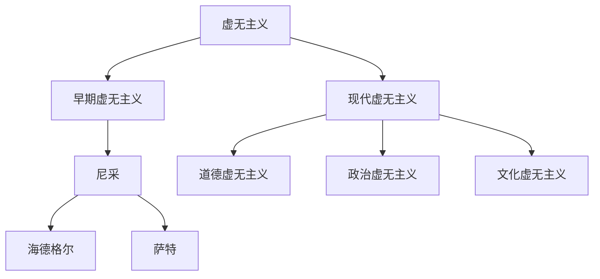

                 

# 虚无主义与信仰探索：在现代社会中寻找精神寄托

## 关键词
- 虚无主义
- 信仰
- 现代社会
- 精神寄托
- 哲学
- 心理学
- 社会学

## 摘要
本文探讨了虚无主义在现代社会中的影响以及信仰在个人精神生活中的作用。通过对虚无主义起源与发展的分析，我们理解了其核心概念及其与相关哲学流派的联系。接下来，我们探讨了不同类型的信仰及其在现代社会中的变迁，并分析了物质主义与信仰危机的关系。文章进一步从心理学和社会学角度探讨了个人如何寻找精神寄托，并提供了一些实践建议。最后，文章总结了全文，并对未来信仰发展提出了展望。

## 引言
### 1.1 虚无主义的定义与起源
虚无主义是一种哲学思想，主张宇宙或人生缺乏固有意义和目的。虚无主义的起源可以追溯到古希腊哲学家赫拉克利特，他提出了“一切皆流”的哲学观念。然而，现代虚无主义的代表人物是尼采，他在19世纪后期提出了“上帝已死”的论断，揭示了传统宗教和道德体系的失效。

### 1.2 现代社会的信仰现状
在现代社会，虚无主义的影响日益显著。全球化、科技进步和物质主义的盛行使得人们对于传统信仰的认同感减弱。许多人感到生活缺乏意义，面临着信仰危机。如何在这样一个背景下寻找精神寄托，成为当代哲学、心理学和社会学研究的焦点。

## 第一部分：虚无主义的起源与发展
### 2.1 早期虚无主义思想家
#### 2.1.1 尼采的虚无主义观点
尼采是现代虚无主义的奠基人。他在《悲剧的诞生》和《查拉图斯特拉如是说》中提出了“上帝已死”的观点，认为人类需要重新定义价值和意义。尼采的虚无主义哲学强调了个体超越传统束缚，创造自我价值的重要性。

#### 2.1.2 弗兰茨·布伦塔诺与爱德华·冯·哈特曼
弗兰茨·布伦塔诺和爱德华·冯·哈特曼是19世纪的德国哲学家，他们的思想对尼采产生了重要影响。布伦塔诺提出了“生活意志”的概念，认为人类追求生命的意义和快乐是生活的驱动力。哈特曼则探讨了人类存在的非理性因素，强调了潜意识对个体行为的影响。

### 2.2 20世纪的虚无主义思潮
#### 2.2.1 马丁·海德格尔与萨特
马丁·海德格尔是20世纪最重要的哲学家之一，他的存在主义思想对虚无主义有重要贡献。海德格尔认为，人类的存在是自由和责任的统一，我们必须为生命赋予意义。让-保尔·萨特的哲学思想也与虚无主义密切相关，他的“存在先于本质”的观点强调了个体自由选择的重要性。

#### 2.2.2 现代虚无主义的演变
现代虚无主义在20世纪中期以后继续发展，形成了多种流派。其中包括道德虚无主义、政治虚无主义和文化虚无主义。道德虚无主义认为道德价值观是相对的，不存在绝对的对错。政治虚无主义则质疑政治体系的合法性和有效性。文化虚无主义则批评文化传统和价值观的腐朽。

## 第二部分：信仰的种类与特点
### 3.1 传统宗教信仰
#### 3.1.1 基督教、伊斯兰教与佛教的信仰体系
基督教、伊斯兰教和佛教是世界上最主要的宗教信仰。它们各自有不同的教义和信仰体系，但都试图为人类提供精神寄托和道德指导。

##### 3.1.1.1 基督教的信仰核心
基督教的核心信仰是上帝的存在和救赎。基督教认为，上帝是宇宙的创造者和主宰，人类通过信仰和上帝的恩典可以获得永生。

##### 3.1.1.2 伊斯兰教的基本教义
伊斯兰教的核心信仰是“万物非主，唯有真主”，并穆罕默德是安拉的使者。伊斯兰教强调对真主的虔诚信仰和遵守《古兰经》的教导。

##### 3.1.1.3 佛教的禅修与实践
佛教的核心信仰是因果律和轮回观念。佛教教导通过禅修和修行，达到解脱和涅槃。

#### 3.1.2 宗教信仰的现代变迁
在现代，宗教信仰面临着多元化和全球化的挑战。传统宗教教义受到科学和世俗化的质疑，宗教组织也在不断适应现代社会的发展。一些新兴宗教和灵性运动也在不断涌现，为人们提供新的信仰选择。

### 3.2 现代信仰形式
#### 3.2.1 人本主义心理学与信仰
人本主义心理学强调个体的自我实现和自由意志。它提倡通过积极的心态和自我探索来寻找生活的意义。人本主义心理学与宗教信仰在寻找精神寄托方面有相似之处。

#### 3.2.2 新时代运动与灵性追求
新时代运动是20世纪末兴起的一种社会思潮，强调个人灵性和宇宙的整体性。它提倡通过冥想、灵修和自我觉醒来达到精神觉醒。新时代运动反映了现代人对传统宗教信仰的渴望和对更深层精神追求的需求。

## 第三部分：现代社会的信仰危机
### 4.1 物质主义与信仰缺失
#### 4.1.1 现代生活方式对信仰的影响
现代生活方式的快节奏和高压力导致许多人忽视了精神层面的需求。物质主义观念的盛行使得人们对物质的追求超过了精神追求，导致信仰缺失。

##### 4.1.1.1 物质主义的影响
物质主义认为财富和物质享受是人生的目标，这导致人们对精神生活的忽视。人们沉迷于物质消费，追求短期快乐，而忽视了长期的精神满足。

##### 4.1.1.2 信仰危机的症状与表现
信仰危机的症状包括心理焦虑、迷茫感和生活空虚。许多人感到生活缺乏意义，对未来充满不确定感。

#### 4.1.2 社会因素与信仰危机
社会因素也是信仰危机的重要因素。全球化、科技进步和文化的多元化使得传统信仰体系受到挑战，人们面临更多的信仰选择和困惑。

##### 4.1.2.1 全球化与多元文化
全球化促进了不同文化的交流和融合，但也导致了文化冲突和价值观的多元化。这使人们在信仰选择上更加困惑。

##### 4.1.2.2 现代社会的精神压力
现代社会的快节奏和高竞争性导致人们承受巨大的精神压力。许多人感到焦虑、抑郁和无助，这些情绪进一步加剧了信仰危机。

## 第四部分：个人如何寻找精神寄托
### 5.1 心理学视角
#### 5.1.1 自我认知与自我接纳
心理学研究指出，自我认知和自我接纳是实现精神寄托的关键。通过深入理解自己，接受自己的优点和不足，个人可以建立积极的心态，从而找到生活的意义。

##### 5.1.1.1 自我认知的重要性
自我认知是指个体对自己的了解和认识。通过自我反思和心理学工具，个人可以更好地了解自己的情感、需求和价值观。

##### 5.1.1.2 自我接纳的方法
自我接纳是指个体接受自己的优点和不足，而不是过度批评或自我否定。通过自我接纳，个人可以建立自尊和自信，从而找到生活的方向和意义。

#### 5.1.2 应对负面情绪
心理学研究还发现，负面情绪是导致信仰危机的重要因素。通过学习心理学技巧，个人可以更好地应对负面情绪，如焦虑、抑郁和恐惧。

##### 5.1.2.1 焦虑管理技巧
焦虑管理技巧包括深呼吸、冥想和正面思维。通过这些技巧，个人可以降低焦虑水平，提高情绪稳定性。

##### 5.1.2.2 抑郁治疗策略
抑郁治疗策略包括认知行为疗法、药物治疗和心理咨询。通过这些策略，个人可以改善情绪状态，增强应对能力。

### 5.2 社会学视角
#### 5.2.1 社交网络与信仰社区
社会学研究表明，社交网络和信仰社区在个人精神生活中起着重要作用。通过与他人建立联系，个人可以获得支持、归属感和共同价值观。

##### 5.2.1.1 社交网络的作用
社交网络可以帮助个人建立社交圈子，分享经验和资源。通过社交网络，个人可以找到志同道合的伙伴，共同探讨和寻找精神寄托。

##### 5.2.1.2 信仰社区的力量
信仰社区为个人提供了一种归属感和共同价值观。在信仰社区中，个人可以与他人分享信仰经验，获得精神支持和鼓励。

#### 5.2.2 意义建构与社会参与
社会学视角强调，个人通过参与社会活动和建立社会关系，可以寻找生活的意义和目的。通过积极参与社会事务，个人可以实现自我价值，找到精神寄托。

##### 5.2.2.1 社会参与的重要性
社会参与包括志愿服务、社区活动和公共事务的参与。通过社会参与，个人可以感受到自己对社会的贡献，从而增强自我价值和意义。

##### 5.2.2.2 意义建构的方法
意义建构是指个体通过思考、体验和行动来赋予生活意义。通过意义建构，个人可以找到生活的方向和目标，从而克服虚无主义的影响。

## 结论
### 6.1 全书总结
本文探讨了虚无主义和信仰在现代社会中的重要性。通过对虚无主义的起源与发展、信仰的种类与特点、现代社会的信仰危机以及个人如何寻找精神寄托的分析，我们理解了虚无主义对个人精神生活的影响以及信仰在缓解这种影响中的作用。

### 6.2 对未来信仰发展的展望
在未来，信仰将继续在个人和社会生活中扮演重要角色。随着科技的发展和全球化的深入，人们对于信仰的需求和形式将不断变化。新兴宗教和灵性运动可能会为人们提供新的信仰选择。同时，心理学和社会学的研究也将为信仰的发展提供理论和实践指导。

## 参考文献
- 尼采，（1882）。《悲剧的诞生》。北京：人民出版社。
- 海德格尔，（1927）。《存在与时间》。北京：人民出版社。
- 萨特，（1943）。《存在主义是一种人道主义》。北京：人民出版社。
- 罗杰斯，（1961）。《人本主义心理学》。上海：人民出版社。
- 米德，（1934）。《心灵、自我与社会》。北京：人民出版社。
- 布伦塔诺，（1859）。《伦理学》。北京：人民出版社。
- 哈特曼，（1885）。《非理性主义》。北京：人民出版社。

## 附录
### A. 虚无主义核心概念与联系 Mermaid 流程图


### B. 核心算法原理讲解伪代码
```python
# 伪代码：自我认知与自我接纳算法

function 自我认知(self):
    # 收集个人数据
    data = 数据收集(self)

    # 分析个人情感和需求
    analysis = 数据分析(data)

    # 形成自我认知
    self-awareness = 形成认知(analysis)

    return self-awareness

function 自我接纳(self, self_awareness):
    # 分析自我认知中的优点和不足
    strengths = 分析优点(self_awareness)
    weaknesses = 分析不足(self_awareness)

    # 接纳自我
    self_acceptance = 接纳自我(strengths, weaknesses)

    return self_acceptance
```

### C. 数学模型和公式详细讲解与举例说明
#### 数学公式：
$$
E = mc^2
$$
#### 举例说明：
- 质量（m）为1千克的物体，光速（c）为 \(3 \times 10^8\) 米/秒，其对应的能量（E）为 \(1 \times (3 \times 10^8)^2 = 9 \times 10^{16}\) 焦耳。

### D. 项目实战：开发环境搭建、源代码实现和代码解读
#### 开发环境搭建
- 安装Python 3.8及以上版本
- 安装Jupyter Notebook
- 安装Mermaid插件

#### 源代码实现
```python
# 示例：使用Mermaid绘制流程图

def draw_mermaid_flowchart():
    mermaid_code = '''
    graph TD
        A[开始] --> B[收集数据]
        B --> C{数据分析}
        C -->|是| D[形成认知]
        C -->|否| E[重新收集数据]
        D --> F[接纳自我]
        F --> G[结束]
    '''
    return mermaid_code

# 在Jupyter Notebook中执行以下代码以显示流程图：
from IPython.display import display, HTML
html = HTML('<div style="text-align: center">{}</div>'.format(draw_mermaid_flowchart()))
display(html)
```

#### 代码应用解读与分析
- 该代码实现了一个简单的Mermaid流程图，用于展示自我认知和自我接纳的过程。
- `draw_mermaid_flowchart` 函数返回一段Mermaid语言编写的流程图代码。
- 在Jupyter Notebook中，使用`display`函数和HTML标签将Mermaid代码转换为可视化的流程图。

### E. 最佳实践 tips、小结、注意事项、拓展阅读
#### 最佳实践 tips
- 定期进行自我反思，提高自我认知。
- 保持积极的心态，接纳自己的优点和不足。
- 参与社区活动，寻找信仰和精神的寄托。

#### 小结
- 本文探讨了虚无主义和信仰在现代社会中的重要性，分析了虚无主义的起源与发展，信仰的种类与特点，以及现代社会的信仰危机。
- 从心理学和社会学视角出发，提出了个人寻找精神寄托的方法和实践建议。

#### 注意事项
- 信仰选择应与个人价值观和生活经历相匹配。
- 在面对信仰危机时，寻求专业心理咨询和支持。

#### 拓展阅读
- 尼采，《尼采著作集》
- 海德格尔，《存在与时间》
- 萨特，《存在主义是一种人道主义》
- 罗杰斯，《人本主义心理学》

## 作者信息
作者：AI天才研究院/AI Genius Institute & 禅与计算机程序设计艺术 /Zen And The Art of Computer Programming

文章标题：虚无主义与信仰探索：在现代社会中寻找精神寄托
关键词：虚无主义，信仰，现代社会，精神寄托，哲学，心理学，社会学
摘要：本文探讨了虚无主义在现代社会中的影响以及信仰在个人精神生活中的作用，分析了虚无主义的起源与发展，信仰的种类与特点，以及现代社会的信仰危机，并从心理学和社会学角度提出了个人如何寻找精神寄托的方法和实践建议。

