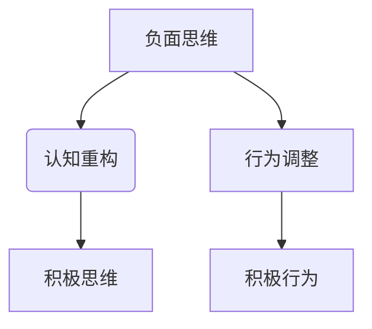
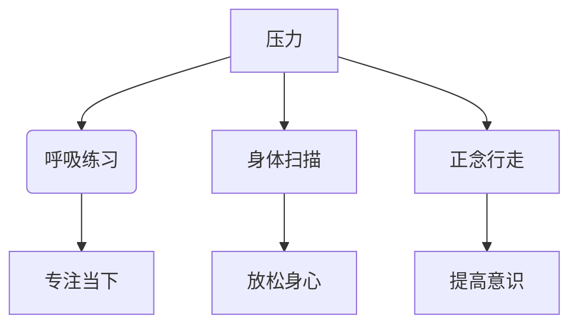
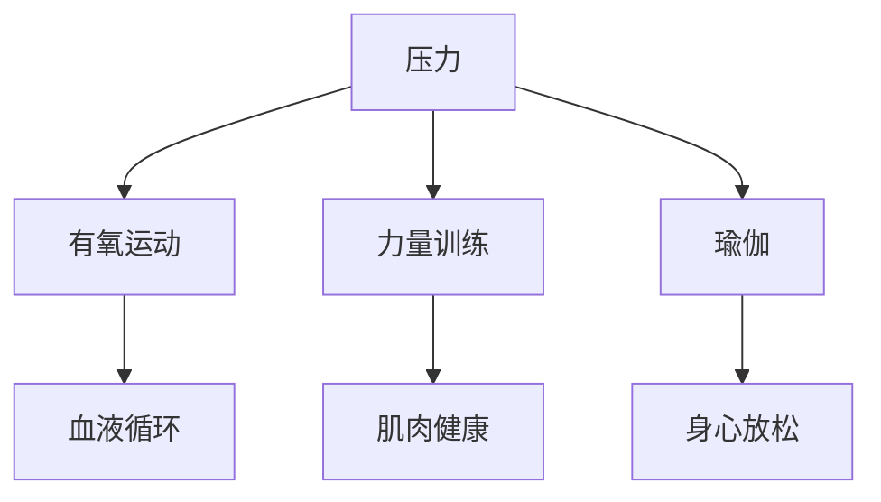

                 

### 虚无主义与身心健康：在压力中寻找生活的平衡点

#### 关键词：虚无主义、身心健康、压力管理、认知行为疗法、冥想、正念练习

#### 摘要：
在现代社会，虚无主义作为一种哲学思潮，对人们的身心健康产生了深远的影响。面对日益增加的压力，如何寻找生活的平衡点，成为许多人关注的课题。本文将探讨虚无主义的哲学内涵及其与现代社会的关联，分析压力的类型与反应，介绍压力管理的方法与策略，并通过实际案例，提供对虚无主义与身心健康关系的深入解读，旨在帮助读者在压力中寻找到生活的平衡点。

## 第一部分：虚无主义的哲学探讨

### 1.1 虚无主义的定义与起源

虚无主义，作为一种哲学思潮，主张生活、世界或宇宙的本质是无意义的、无目的的。其核心概念在于对存在本身的质疑和对意义感的缺失。虚无主义的思想可以追溯到古希腊哲学，尤其是苏格拉底和柏拉图的观点。苏格拉底强调个体的道德和理性，而柏拉图则提出了理念世界，两者都试图为生活赋予意义。然而，随着古希腊文明的衰落，虚无主义的种子逐渐萌芽。

#### 1.1.1 虚无主义的哲学内涵

虚无主义哲学内涵的核心在于对生活意义的否定。它认为，生命缺乏内在的、固有的意义，人类行为和经验的价值是相对的、主观的。虚无主义哲学家如尼采和萨特，进一步探讨了这种观点，提出了“生命是无意义的”和“人是自由的”两个核心命题。尼采认为，生命的意义在于超越自我，创造自己的价值观。而萨特则强调，自由是人类的本质，意义是通过人的自由选择和行动来创造的。

#### 1.1.2 虚无主义的历史背景

虚无主义的历史背景可以追溯到古希腊哲学，随后在中世纪和现代哲学中得到了进一步的发展。中世纪时期，宗教哲学试图通过神学和道德教义来对抗虚无主义。然而，随着文艺复兴和启蒙运动的兴起，人们开始更加关注个体的自由和理性，虚无主义的思潮逐渐兴起。在现代哲学中，虚无主义作为一种对现代生活挑战的回应，得到了更多的关注和研究。

### 1.2 虚无主义与现代社会的关联

现代社会的高压生活方式和快速发展的科技，使得虚无主义的思想更加流行。现代人在面对职业压力、人际关系和未来的不确定性时，往往感到迷茫和无助。虚无主义提供了一个解释这种困境的框架，尽管它可能并不提供解决方案。

#### 1.2.1 现代生活压力与虚无主义

现代生活压力主要来源于工作、人际关系和家庭责任。这些压力可能导致焦虑、抑郁和无意义感，从而诱发虚无主义倾向。例如，工作中的竞争和加班，可能导致个人时间和家庭生活的失衡，产生焦虑和无意义感。人际关系中的冲突和误解，也可能导致孤独和绝望感。

#### 1.2.2 虚无主义对个人心理健康的影响

虚无主义对个人心理健康的影响是双重的。一方面，它可能加剧心理健康问题，如抑郁症和焦虑症。当人们感到生活无意义时，他们可能失去动力，对任何事情都缺乏兴趣，从而导致心理健康状况恶化。另一方面，虚无主义也可能帮助人们接受现实，减少对未知的恐惧，从而有助于心理健康。

### 1.3 虚无主义的批判与反思

虚无主义并非没有局限性。首先，它可能导致悲观主义和对现实的逃避。其次，虚无主义可能忽视个体的创造力和变革力量。因此，对虚无主义的批判和反思是必要的。

#### 1.3.1 虚无主义的局限性

虚无主义的局限性在于，它可能忽视个体的内在力量和创造性。人类具有适应环境和改变现实的能力，虚无主义可能导致人们对这种能力缺乏信心，从而阻碍个人成长和社会进步。

#### 1.3.2 虚无主义的解构与重建

虚无主义的解构与重建是哲学研究的重要课题。通过批判虚无主义，我们可以发现生活中的价值和意义。重建虚无主义，意味着通过个体的自由选择和行动，创造自己的意义和价值。

## 第二部分：压力管理与身心健康

### 2.1 压力的定义与类型

压力，是指个体在面对外部挑战或要求时产生的生理和心理反应。压力的类型可以分为以下几种：

#### 2.1.1 生理反应

生理反应包括心跳加速、血压升高、肌肉紧张等。长期的压力可能导致慢性疾病，如心脏病、高血压和免疫系统功能下降。

#### 2.1.2 心理反应

心理反应包括焦虑、抑郁、愤怒等情绪反应。长期的压力可能导致心理健康问题，如抑郁症和焦虑症。

### 2.2 压力管理的方法与策略

有效的压力管理是保持身心健康的关键。以下是一些常见的压力管理方法：

#### 2.2.1 认知行为疗法

认知行为疗法（CBT）是一种通过改变负面思维模式和行为来减轻压力的方法。CBT的核心在于识别和纠正负面思维，并将其转化为积极的思维。

#### 2.2.2 冥想与正念练习

冥想和正念练习是通过专注于当下，减轻压力和焦虑的有效方法。正念练习包括呼吸练习、身体扫描和正念行走等。

#### 2.2.3 体能训练与运动

体能训练和运动是释放压力、提高身心健康的有效方法。适量的运动可以提高心率，促进血液循环，减轻压力和焦虑。

### 2.3 心理健康与压力平衡

心理健康与压力平衡是保持身心健康的关键。以下是一些心理健康与压力平衡的方法：

#### 2.3.1 心理健康的重要性

心理健康对个体的生活质量和社会功能具有重要影响。心理健康问题不仅影响个人的情感和行为，还可能影响工作和社交生活。

#### 2.3.2 寻找生活的平衡点

寻找生活的平衡点意味着在工作和休息、个人生活和社交生活、家庭责任和自我发展之间找到合适的平衡。以下是一些方法：

- **时间管理**：合理安排时间，确保工作和休息的平衡。
- **设定目标**：设定可实现的目标，提高生活动力。
- **社交支持**：建立良好的社交关系，寻求支持和帮助。
- **自我照顾**：关注自己的身心健康，确保身心健康。

## 第三部分：实践与案例分析

### 3.1 压力管理实践案例

以下是一个关于压力管理的实践案例：

#### 案例一：工作压力与职业倦怠

李先生是一名IT公司的项目经理，他经常因为工作压力而感到焦虑和疲惫。为了解决这个问题，他开始尝试以下方法：

1. **认知行为疗法**：李先生开始记录自己的负面思维，并尝试将其转化为积极的思维。例如，将“我无法完成任务”转化为“我可以尝试找到解决问题的方法”。
2. **冥想与正念练习**：每天早晨，李先生花15分钟进行冥想和呼吸练习，以放松身心。
3. **体能训练**：李先生每周参加三次健身课程，以提高身体素质。

通过这些方法，李先生的工作压力得到了有效缓解，他的情绪稳定，工作效率也有所提高。

### 3.2 心理健康实践案例

以下是一个关于心理健康实践案例：

#### 案例二：抑郁症与心理治疗

张女士是一名教师，她因为长期的职业压力和人际关系问题，患上了抑郁症。为了治疗抑郁症，她开始进行以下治疗：

1. **心理治疗**：张女士每周进行一次心理治疗，与心理咨询师探讨自己的情绪和行为。
2. **药物治疗**：在医生的指导下，张女士服用抗抑郁药物，以调节情绪。
3. **社交活动**：张女士开始参加一些社交活动，扩大社交圈子，寻求支持和帮助。

通过这些方法，张女士的抑郁症症状得到了显著改善，她重新找到了生活的乐趣。

### 3.3 综合案例：虚无主义、压力管理与身心健康

以下是一个关于虚无主义、压力管理与身心健康综合案例：

#### 案例三：寻找生活的平衡点

王先生是一名资深程序员，他在工作中经常感到虚无主义和对生活的迷茫。为了解决这个问题，他开始尝试以下方法：

1. **哲学思考**：王先生开始阅读哲学书籍，了解虚无主义的思想，并思考如何应对。
2. **压力管理**：王先生采用认知行为疗法、冥想和正念练习等方法，减轻工作压力。
3. **自我发展**：王先生开始学习新的技能，参加社交活动，以充实自己的生活。

通过这些方法，王先生逐渐找到了生活的平衡点，他的心理健康得到了显著改善。

## 附录

### 4.1 虚无主义与身心健康相关资源

以下是一些虚无主义与身心健康相关的资源：

1. **推荐书籍**：
   - 《存在与时间》（Heidegger）
   - 《人的存在的哲学》（Sartre）
   - 《查拉图斯特拉如是说》（Nietzsche）

2. **推荐电影**：
   - 《存在主义咖啡馆》（Existential Café）
   - 《心之探险》（Up）
   - 《喜剧之王》（The King of Comedy）

3. **心理咨询与治疗资源**：
   - 中国心理卫生协会（CPS）
   - 世界卫生组织（WHO）
   - 美国心理学会（APA）

### 最佳实践 tips、小结、注意事项、拓展阅读等内容

在应对虚无主义和压力时，以下是一些最佳实践 tips：

1. **保持积极心态**：积极的心态有助于减轻压力，提升心理健康。
2. **寻求专业帮助**：在遇到心理健康问题时，及时寻求专业帮助，如心理咨询和治疗。
3. **培养健康习惯**：保持健康的生活习惯，如充足的睡眠、适量的运动和健康的饮食。
4. **拓展阅读**：阅读哲学书籍和心理健康相关书籍，以增加对虚无主义和压力管理的理解。

总之，虚无主义和压力管理是现代生活中不可忽视的问题。通过哲学思考、压力管理和心理健康实践，我们可以找到生活的平衡点，提升身心健康。希望本文能对您有所帮助。作者：AI天才研究院/AI Genius Institute & 禅与计算机程序设计艺术 /Zen And The Art of Computer Programming。

