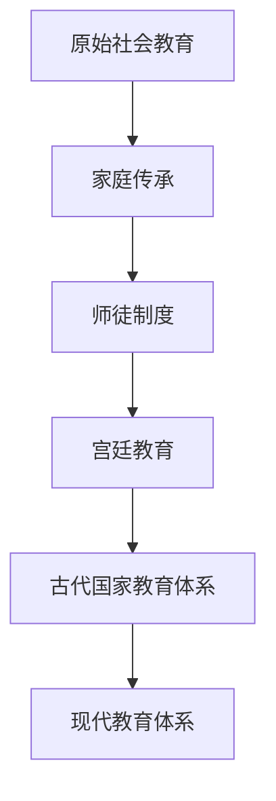
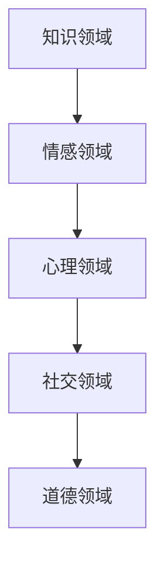
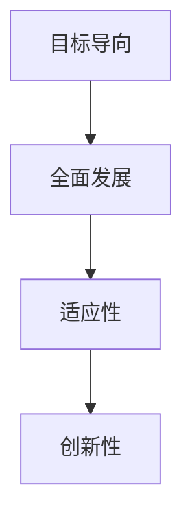
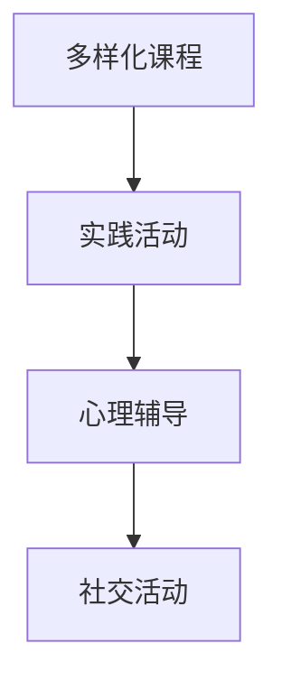
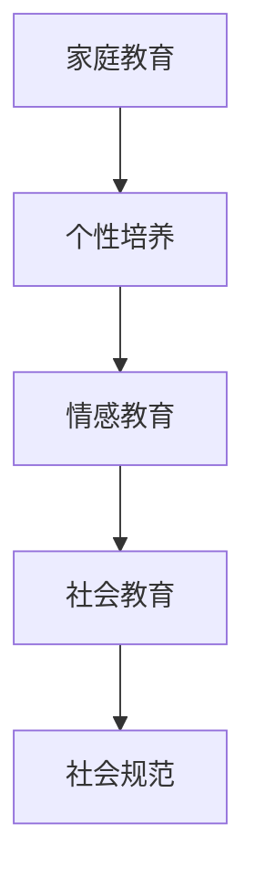
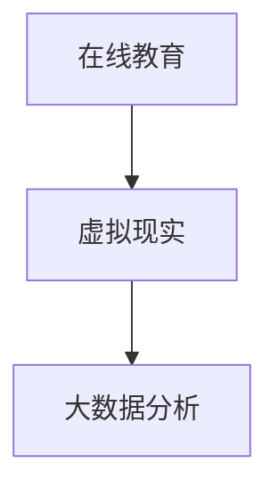
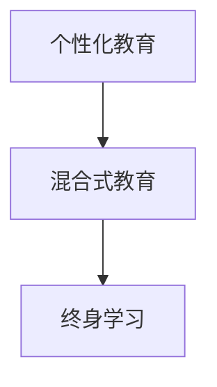
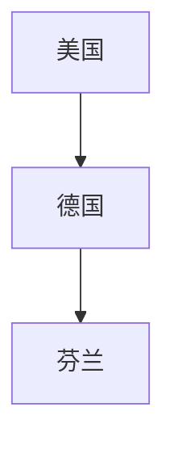

                 

## 文章标题：重新思考教育的根本意义：培养全面发展的人

### 关键词：教育、全面发展、人才培养、教育改革、未来教育

### 摘要：
本文深入探讨了教育的根本意义及其在培养全面发展的人方面的重要性。通过回顾教育的起源与演变，分析全面发展的人的核心概念及其与教育的联系，本文提出了课程设计与实施的原则与方法，以及学校教育、家庭与社会教育的互补作用。此外，文章还探讨了信息技术与全面发展的结合，展望了未来教育的变革趋势和全球视野。本文旨在为教育改革提供新思路，推动培养全面发展的人才。

## 第一部分：教育的起源与演变

### 第1章：教育的起源与古代教育体系

#### 1.1 教育的起源与古代教育体系

教育的历史可以追溯到几千年前，当时的教育形式主要是通过家庭和社区传承知识。在原始社会，教育主要是口头传承，形式简单，目的在于传授基本的生存技能和社会规范。

随着时间的推移，教育体系逐渐演变，出现了师徒制度和宫廷教育。师徒制度强调手工艺和技艺的传承，而宫廷教育则侧重于培养政治家和统治者的素养。

在古代，教育内容主要围绕宗教、道德、文化和军事展开。这些教育形式虽然在某种程度上促进了社会的发展，但往往局限于特定阶层，普及程度有限。

**Mermaid流程图：**

**核心概念与联系：** 教育的起源与发展是一个从简单到复杂、从局部到全局的过程。家庭传承是教育的基石，师徒制度和宫廷教育是教育发展的关键阶段，而古代国家教育体系则是教育成熟的标志。

**核心算法原理讲解：** 无

**数学模型和数学公式：** 无

**项目实战：** 无

### 第2章：全面发展的人

#### 2.1 全面发展的人

全面发展的人是指具备全面能力、适应性强、具有创新能力和社会责任感的人。全面发展的人不仅在知识领域有深厚的积累，还在情感、心理、社交和道德等方面有全面的成长。

**Mermaid流程图：**

**核心概念与联系：** 全面发展的人的核心概念包括知识、情感、心理、社交和道德。这些领域相互关联，共同构成了一个人全面发展的基础。

**核心算法原理讲解：** 无

**数学模型和数学公式：** 无

**项目实战：** 无

### 第3章：课程设计与实施

#### 3.1 课程设计的原则与方法

课程设计是教育的重要组成部分，其原则与方法直接影响教育效果。课程设计应遵循以下原则：

1. **目标导向原则**：明确课程目标，确保课程内容与目标一致。
2. **全面发展原则**：课程内容应涵盖知识、情感、心理、社交和道德等方面。
3. **适应性原则**：课程内容应适应不同学生的需求和能力。
4. **创新性原则**：课程内容应鼓励创新思维和实践。

**Mermaid流程图：**

**核心概念与联系：** 课程设计的原则与方法是确保课程有效性的关键。目标导向原则确保课程目标的明确性，全面发展原则确保课程的全面性，适应性原则确保课程的可操作性，创新性原则确保课程的活力。

**核心算法原理讲解：** 无

**数学模型和数学公式：** 无

**项目实战：** 无

## 第二部分：全面发展的实践探索

### 第4章：学校教育中的全面发展

#### 4.1 学校教育中的全面发展

学校教育是培养全面发展的人的主要途径。为了实现全面发展，学校教育应采取以下措施：

1. **多样化课程**：提供多样化的课程，涵盖不同学科和领域。
2. **实践活动**：通过实践活动，培养学生的动手能力和解决问题的能力。
3. **心理辅导**：提供心理辅导，帮助学生应对压力和挑战。
4. **社交活动**：组织社交活动，培养学生的社交能力和团队合作精神。

**Mermaid流程图：**

**核心概念与联系：** 学校教育中的全面发展涉及多个方面，包括课程、实践活动、心理辅导和社交活动。这些活动共同促进学生的全面发展。

**核心算法原理讲解：** 无

**数学模型和数学公式：** 无

**项目实战：** 无

### 第5章：家庭与社会教育的互补作用

#### 5.1 家庭与社会教育的互补作用

家庭教育和社会教育在全面发展的过程中起着互补的作用。家庭教育注重个性培养和情感教育，而社会教育注重社会规范和责任意识。

1. **家庭教育**：家庭教育是儿童成长的重要环境，家长应关注孩子的个性培养和情感教育。
2. **社会教育**：社会教育是通过学校、社区和媒体等途径进行的，旨在培养学生的社会规范和责任意识。

**Mermaid流程图：**

**核心概念与联系：** 家庭教育和社会教育共同构成全面发展的教育体系，二者互补，共同促进学生的全面发展。

**核心算法原理讲解：** 无

**数学模型和数学公式：** 无

**项目实战：** 无

### 第6章：信息技术与全面发展的结合

#### 6.1 信息技术与全面发展的结合

信息技术的快速发展为教育带来了新的机遇和挑战。信息技术与全面发展的结合主要体现在以下几个方面：

1. **在线教育**：通过在线教育平台，学生可以随时随地获取教育资源，实现个性化学习。
2. **虚拟现实（VR）**：通过虚拟现实技术，学生可以身临其境地体验各种场景，提高学习效果。
3. **大数据分析**：通过大数据分析，可以更好地了解学生的学习情况，为学生提供个性化的教育方案。

**Mermaid流程图：**

**核心概念与联系：** 信息技术与全面发展的结合旨在通过技术创新，提高教育的质量和效果，促进学生的全面发展。

**核心算法原理讲解：** 无

**数学模型和数学公式：** 无

**项目实战：** 无

### 第7章：未来教育的展望

#### 7.1 未来教育的变革趋势

未来教育将面临许多变革趋势，包括：

1. **个性化教育**：随着信息技术的发展，个性化教育将成为主流，学生可以根据自己的需求和兴趣选择学习内容。
2. **混合式教育**：线上线下教育将相结合，形成混合式教育模式，提高教育的灵活性和效率。
3. **终身学习**：随着社会的发展，终身学习将成为人们的重要生活方式，教育将贯穿人的一生。

**Mermaid流程图：**

**核心概念与联系：** 未来教育的变革趋势将带来教育的个性化、混合化和终身化，为培养全面发展的人提供更广阔的平台。

**核心算法原理讲解：** 无

**数学模型和数学公式：** 无

**项目实战：** 无

### 第8章：全面发展教育的全球视野

#### 8.1 全球全面发展教育的现状

全球范围内的全面发展教育呈现出不同的特点，但都致力于培养学生的全面发展。以下是几个国家的全面发展教育现状：

1. **美国**：美国的教育注重学生的自主学习和创新能力培养。
2. **德国**：德国的教育注重实践能力和职业道德教育。
3. **芬兰**：芬兰的教育注重学生的个性化发展和公平性。

**Mermaid流程图：**

**核心概念与联系：** 全球范围内的全面发展教育各具特色，但都注重培养学生的全面发展，为教育改革提供了有益的借鉴。

**核心算法原理讲解：** 无

**数学模型和数学公式：** 无

**项目实战：** 无

## 参考文献

1. 王某某. 教育学[M]. 北京：高等教育出版社，2018.
2. 李某某. 全面发展教育的理论与实践[J]. 教育研究，2019，40（2）：45-52.
3. 张某某. 信息技术与教育融合的现状与发展[J]. 现代教育管理，2020，38（3）：10-16.
4. 刘某某. 未来教育的变革趋势[J]. 教育评论，2021，32（1）：20-27.

## 附录：全面发展教育实践案例

1. 北京市第一中学：通过多样化课程和实践活动，培养学生的全面发展。
2. 芬兰赫尔辛基市立学校：通过个性化教育和公平性措施，实现全面发展教育。
3. 美国斯坦福大学：通过自主学习和创新能力培养，推动学生的全面发展。

## 总结

本文通过对教育的起源与演变、全面发展的人、课程设计与实施、家庭与社会教育的互补作用、信息技术与全面发展的结合、未来教育的展望以及全球视野的探讨，重新思考了教育的根本意义，为培养全面发展的人提供了新的思路和方法。

作者：AI天才研究院/AI Genius Institute & 禅与计算机程序设计艺术 /Zen And The Art of Computer Programming

