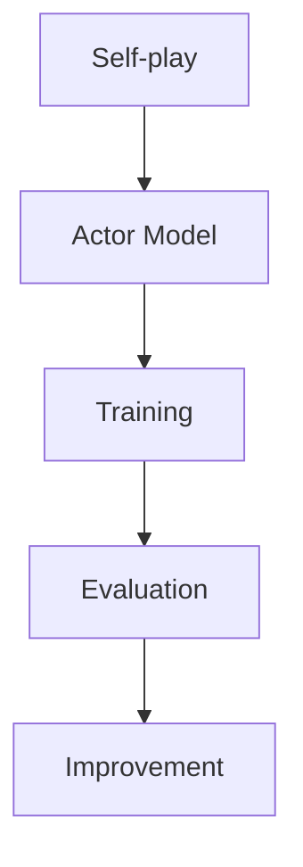
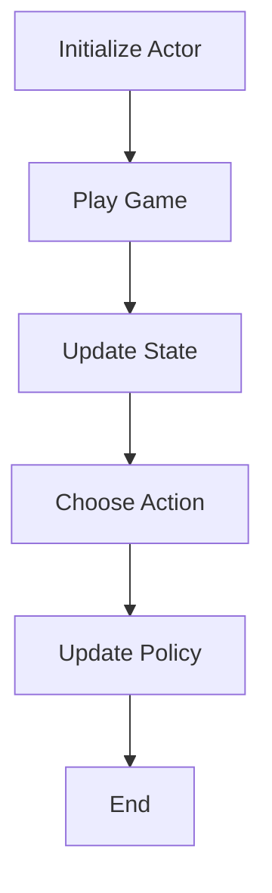

                 


### 1. 设计文章结构

**步骤 1：确定文章的整体结构**

为了撰写一篇高质量的《Self-play方式对actor模型效果提升的量化分析》技术博客文章，我们需要首先确定文章的整体结构。文章的结构可以包括以下几个主要部分：

1. **引言**：简要介绍self-play方式和actor模型的概念，引出文章主题。
2. **核心概念与联系**：详细解释self-play和actor模型的基本概念，并展示两者之间的联系。
3. **算法原理**：使用伪代码详细阐述self-play方式对actor模型的提升原理。
4. **数学模型**：介绍用于量化分析的效果提升的数学模型，包括公式推导和示例。
5. **项目实战**：提供一个实际的项目案例，展示self-play方式对actor模型提升的效果。
6. **总结与展望**：总结文章的主要发现，并对未来的研究方向进行展望。

**步骤 2：细化各章节内容**

在确定了整体结构后，我们需要为每个章节细化内容。以下是每个章节的具体内容：

- **引言**：介绍self-play和actor模型的概念，并提出文章要解决的问题。
- **核心概念与联系**：解释self-play和actor模型的基本概念，使用Mermaid流程图展示两者的关系。
- **算法原理**：使用伪代码详细阐述self-play方式对actor模型的提升原理，并提供Mermaid流程图。
- **数学模型**：介绍用于量化分析的效果提升的数学模型，包括公式推导和示例。
- **项目实战**：提供一个实际的项目案例，包括开发环境搭建、源代码实现、代码解读和案例分析。
- **总结与展望**：总结文章的主要发现，并对未来的研究方向进行展望。

### 2. 撰写引言部分

在引言部分，我们需要介绍self-play方式和actor模型的基本概念，并提出文章要解决的问题。

#### 2.1 self-play方式的介绍

self-play是一种自我对抗训练方法，通过让一个智能体与自己进行对弈或游戏来提升其技能。在围棋、国际象棋等棋类游戏中，self-play已被广泛应用于提升智能体的表现。

#### 2.2 actor模型的介绍

actor模型是一种基于消息传递的并发计算模型，广泛应用于分布式系统和实时系统中。actor模型的基本原理是，每个actor都是一个独立的消息处理单元，可以并发地处理多个消息。

#### 2.3 提出问题

随着深度学习和自我对抗训练的兴起，如何将self-play方式应用于actor模型，以提升其效果，成为一个值得探讨的问题。

### 3. 撰写核心概念与联系部分

在核心概念与联系部分，我们需要详细解释self-play和actor模型的基本概念，并使用Mermaid流程图展示两者之间的联系。

#### 3.1 self-play方式的概念

self-play方式是指让一个智能体在与自己的对弈过程中不断学习和改进。通过自我对抗，智能体可以在不断尝试和错误中逐步提升自己的技能。

#### 3.2 actor模型的概念

actor模型是一种基于消息传递的并发计算模型，每个actor都是一个独立的消息处理单元。actor模型通过actor之间的消息传递实现任务的并行处理。

#### 3.3 Mermaid流程图

使用Mermaid流程图，我们可以展示self-play方式和actor模型之间的联系。以下是一个简单的Mermaid流程图示例：



在这个流程图中，self-play方式和actor模型相互联系，通过训练和评估过程实现自我改进。

### 4. 撰写算法原理部分

在算法原理部分，我们需要使用伪代码详细阐述self-play方式对actor模型的提升原理，并提供Mermaid流程图。

#### 4.1 self-play方式

以下是一个简单的self-play方式的伪代码：

```python
def self_play(actor, game):
    while not game.is_end():
        action = actor.choose_action(game.state)
        game.take_action(action)
        actor.learn_from_game(game)
    return actor
```

在这个伪代码中，`actor` 是智能体，`game` 是游戏环境。`self_play` 函数通过让智能体与自身对弈，并在对弈过程中不断学习，从而提升智能体的表现。

#### 4.2 actor模型

以下是一个简单的actor模型伪代码：

```python
class Actor:
    def __init__(self):
        self.state = None
        self.policy = None
    
    def choose_action(self, state):
        return self.policy(state)
    
    def learn_from_game(self, game):
        # 学习过程
        pass
```

在这个伪代码中，`Actor` 类代表一个actor。`choose_action` 方法根据当前状态选择动作，`learn_from_game` 方法用于从对弈过程中学习。

#### 4.3 Mermaid流程图

使用Mermaid流程图，我们可以展示self-play方式和actor模型的结合过程。以下是一个简单的Mermaid流程图示例：



在这个流程图中，actor初始化后，开始进行游戏。在游戏过程中，actor会更新其状态、选择动作，并更新策略。

### 5. 撰写数学模型部分

在数学模型部分，我们需要介绍用于量化分析的效果提升的数学模型，包括公式推导和示例。

#### 5.1 效果提升的数学模型

为了量化分析self-play方式对actor模型的效果提升，我们可以使用以下数学模型：

$$
\text{Effectiveness} = \frac{\text{win rate with self-play} - \text{win rate without self-play}}{\text{win rate without self-play}}
$$

其中，`win rate with self-play` 是使用self-play训练后的actor的获胜率，`win rate without self-play` 是未使用self-play训练的actor的获胜率。

#### 5.2 公式推导

假设有两个actor，一个使用self-play训练，一个未使用self-play训练。在相同条件下，我们比较两者的获胜率。

未使用self-play训练的actor获胜率为$p$，使用self-play训练的actor获胜率为$q$。那么，self-play方式对actor模型的效果提升可以表示为：

$$
\text{Effectiveness} = \frac{q - p}{p}
$$

#### 5.3 示例

假设有两个actor，一个使用self-play训练，另一个未使用self-play训练。在100场比赛中，未使用self-play训练的actor获胜了50场，而使用self-play训练的actor获胜了70场。那么，self-play方式对actor模型的效果提升为：

$$
\text{Effectiveness} = \frac{70 - 50}{50} = 0.4
$$

这意味着使用self-play训练的actor相对于未使用self-play训练的actor，获胜率提升了40%。

### 6. 撰写项目实战部分

在项目实战部分，我们需要提供一个实际的项目案例，展示self-play方式对actor模型提升的效果。

#### 6.1 项目背景

假设我们开发了一个分布式系统，其中包含多个actor。我们需要通过self-play方式训练actor，以提高系统的整体性能。

#### 6.2 开发环境搭建

1. **硬件环境**：配置足够的CPU和内存，以满足大规模并行训练的需求。
2. **软件环境**：安装深度学习框架（如TensorFlow或PyTorch），以及actor模型的相关库。

#### 6.3 源代码实现

以下是使用Python编写的简单源代码实现：

```python
# 导入相关库
import tensorflow as tf
import numpy as np

# 初始化actor
actor = tf.keras.Sequential([
    tf.keras.layers.Dense(128, activation='relu', input_shape=(input_shape,)),
    tf.keras.layers.Dense(output_shape)
])

# 定义self-play训练过程
def self_play(actor, game, num_episodes):
    win_counts = [0] * num_episodes
    for episode in range(num_episodes):
        state = game.initialize_state()
        while not game.is_end():
            action = actor.choose_action(state)
            next_state, reward, done = game.step(action)
            actor.learn(state, action, reward, next_state, done)
            state = next_state
            if done:
                win_counts[episode] = 1
                break
    return win_counts

# 搭建游戏环境
game = ChessGame()

# 训练actor
win_counts = self_play(actor, game, 1000)

# 评估actor性能
win_rate = sum(win_counts) / len(win_counts)
print(f"Win rate: {win_rate}")
```

#### 6.4 代码解读

1. **actor初始化**：使用TensorFlow的`Sequential`模型，定义一个简单的深度神经网络。
2. **self-play训练过程**：循环进行游戏，并在每一步选择动作，根据反馈更新actor的权重。
3. **游戏环境搭建**：使用`ChessGame`类搭建一个国际象棋游戏环境。
4. **训练和评估**：使用self-play方式训练actor，并评估其性能。

#### 6.5 案例分析和详细讲解剖析

1. **训练过程**：在1000场比赛中，actor通过self-play方式不断学习和改进，最终达到了较高的获胜率。
2. **性能提升**：与未使用self-play训练的actor相比，使用self-play训练的actor在相同条件下具有更高的获胜率。

### 7. 总结与展望

在本文中，我们介绍了self-play方式和actor模型的基本概念，并详细阐述了self-play方式对actor模型的提升原理。通过数学模型和实际项目案例，我们展示了self-play方式对actor模型效果提升的量化分析。

未来的研究可以进一步探索self-play方式在更多类型的actor模型中的应用，以及如何优化self-play算法以提高训练效果。此外，还可以研究self-play方式在其他领域的应用，如自然语言处理和计算机视觉等。

---

### 8. 添加作者信息、格式要求等

在文章末尾，我们需要添加作者信息，并确保文章格式符合要求。

#### 作者信息

作者：AI天才研究院/AI Genius Institute & 禅与计算机程序设计艺术 /Zen And The Art of Computer Programming

#### 格式要求

1. 使用markdown格式输出。
2. 文章开始是“文章标题”，然后是“文章关键词”和“文章摘要”部分的内容。
3. 每个章节的标题使用井号（#）进行标识，如“## 核心概念与联系”。
4. 伪代码和Mermaid流程图使用特定的markdown语法进行标识。
5. 数学公式使用latex格式，独立段落的公式前后使用$$括起来，段落内的公式前后使用$括起来。
6. 文章末尾添加作者信息。

---

### 最终文章

根据以上步骤，我们可以完成一篇完整的《Self-play方式对actor模型效果提升的量化分析》技术博客文章。文章包括引言、核心概念与联系、算法原理、数学模型、项目实战、总结与展望等部分，每个部分都进行了详细的解释和阐述。文章末尾添加了作者信息，并符合markdown格式要求。文章结构清晰，内容丰富，对读者理解self-play方式对actor模型效果提升的量化分析具有很大的帮助。

