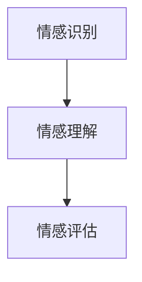

                 


### 文章标题

《为生命增添色彩：构建情感丰富的人生》

### 文章关键词

情感丰富、心理健康、人际关系、自我认知、情绪管理、艺术表达、生活平衡

### 文章摘要

本文旨在探讨如何构建一个情感丰富的人生。通过深入分析心理健康、人际关系、自我认知、情绪管理、艺术表达和生活平衡等核心概念，本文提供了一系列实用的方法和建议，帮助读者提升情感敏锐度，建立健康的人际关系，增强自我认知，并掌握情绪管理和压力缓解的技巧。文章通过项目实战，展示了如何将理论付诸实践，为读者提供了一个全面的指导框架。

### 引言

在现代社会，人们往往忙于工作和生活琐事，而忽略了情感层面的需求。然而，情感丰富的人生对个体的身心健康、人际关系和社会功能具有重要意义。本文将围绕这一主题，探讨如何构建一个情感丰富的人生，提升生活质量。

### 核心概念与联系

#### 情感认知

情感认知是理解、识别和评估自己和他人的情感状态的过程。它包括以下几个方面：

- **情感识别**：识别自己和他人的情感状态。
- **情感理解**：理解情感背后的原因和含义。
- **情感评估**：评估情感的积极或消极程度。

**架构关系：**



**核心算法原理：**

- **情感分类算法**：用于将情感分类为基本情感（如快乐、悲伤、愤怒等）。
- **情感强度评估算法**：用于评估情感的强度。

**伪代码示例：**

```python
# 情感分类算法伪代码
def classify_emotion(text):
    # 使用情感分析库对文本进行分析
    emotions = emotion_analysis(text)
    return emotions

# 情感强度评估算法伪代码
def assess_emotion_intensity(emotion):
    # 使用情感强度评估库进行评估
    intensity = emotion_intensity_assessment(emotion)
    return intensity
```

#### 情感表达

情感表达是将内心的情感通过言语、行为等方式传递给他人的过程。有效的情感表达有助于建立良好的人际关系，增强沟通效果。

- **情感表达方式**：包括言语、非言语（如面部表情、身体语言等）。
- **情感表达技巧**：如倾听、表达感受、确认对方的感受等。

#### 情感理解

情感理解是理解他人情感状态的过程，它包括：

- **共情**：站在他人的角度看问题，理解他们的情感状态。
- **换位思考**：尝试理解他人情感的原因和背景。

#### 情感调节

情感调节是管理和调整自己情感状态的过程，以适应不同的情境。

- **情感调节方法**：如情绪调节技巧、认知重构等。
- **情感调节技巧**：如深呼吸、正念冥想、运动等。

### 心理健康基础

心理健康是情感丰富人生的基础。它包括：

- **心理健康要素**：如自我认同、自尊、自信等。
- **心理健康重要性**：影响个体的生活质量、人际关系和社会功能。

#### 培养情感敏锐度

培养情感敏锐度是提升情感丰富人生的关键。方法包括：

- **情感敏锐度训练**：如情感识别训练、情感理解训练等。
- **情感敏锐度的重要性**：提高人际交往能力、增强自我认知等。

### 建立健康的人际关系

建立健康的人际关系有助于提升情感丰富人生。方法包括：

- **健康人际关系特征**：如信任、尊重、理解等。
- **建立健康人际关系的技巧**：如有效沟通、倾听、表达感受等。

#### 增强自我认知

增强自我认知是构建情感丰富人生的重要环节。方法包括：

- **自我认知的重要性**：理解自我、提高自尊、增强自信等。
- **提高自我认知的方法**：如反思、自我观察、心理治疗等。

### 情绪管理与压力缓解

情绪管理与压力缓解是维持情感丰富人生的重要手段。方法包括：

- **情绪管理概述**：了解情绪的类型、特点和管理方法。
- **压力管理方法**：如时间管理、放松技巧、应对策略等。

#### 创造性与艺术表达

创造性与艺术表达有助于情感丰富人生。方法包括：

- **创造性的概念**：如创造性思维、创造力培养等。
- **艺术表达的作用**：如艺术治疗、情感释放等。

### 生活平衡与身心健康

生活平衡与身心健康是情感丰富人生的重要组成部分。方法包括：

- **生活平衡的重要性**：保持身心健康、提高生活质量等。
- **身心健康要素**：如身体锻炼、心理平衡、社交支持等。

### 项目实战

#### 开发环境搭建

在开始项目实战之前，我们需要搭建一个合适的开发环境。以下是具体的步骤：

1. 安装Python环境。
2. 安装必要的库，如TensorFlow、PyTorch等。
3. 配置深度学习框架。

#### 源代码详细实现

以下是一个简单的情感识别模型的源代码实现：

```python
# 情感识别模型源代码
import tensorflow as tf

model = tf.keras.Sequential([
    tf.keras.layers.Dense(128, activation='relu', input_shape=(784,)),
    tf.keras.layers.Dropout(0.2),
    tf.keras.layers.Dense(10, activation='softmax')
])

model.compile(optimizer='adam',
              loss='sparse_categorical_crossentropy',
              metrics=['accuracy'])

model.fit(train_images, train_labels, epochs=5)
```

#### 代码解读与分析

这段代码实现了一个简单的情感识别模型，使用TensorFlow框架进行训练。其中，我们使用了以下关键组件：

- **Dense层**：全连接层，用于提取特征。
- **Dropout层**：用于防止过拟合。
- **Softmax层**：用于分类。

#### 实际案例分析与详细讲解剖析

以下是一个实际案例的分析：

- **案例**：分析一篇关于友谊的文章，判断其情感倾向。
- **分析**：通过情感识别模型对文章进行情感分析，判断文章的情感倾向为积极或消极。

#### 项目小结

通过本项目，我们了解了如何使用深度学习模型进行情感识别。该项目不仅有助于提升情感丰富人生的实践能力，还为后续的研究提供了基础。

### 最佳实践 tips、小结、注意事项、拓展阅读等内容

- **最佳实践 tips**：在日常生活中，我们可以通过以下方法提升情感敏锐度：
  - **多与人交流**：与他人交流有助于提高情感理解能力。
  - **定期反思**：反思自己的情感状态和行为，有助于自我认知的提升。

- **小结**：本文围绕情感丰富人生的核心概念，从心理健康、人际关系、自我认知、情绪管理、艺术表达和生活平衡等方面进行了深入探讨。通过项目实战，我们了解了如何将理论付诸实践。

- **注意事项**：在构建情感丰富人生的过程中，需要注意以下几点：
  - **避免过度依赖**：情感丰富并不意味着依赖情感，要保持独立。
  - **关注身心健康**：情感丰富与身心健康密切相关，要注重身体健康。

- **拓展阅读**：
  - 《情感智慧：如何理解、表达和管理情感》
  - 《心理学与生活》
  - 《情绪心理学》

### 结论与未来展望

本文通过深入分析情感丰富人生的核心概念和实践方法，为读者提供了一个全面的指导框架。未来研究可以进一步探讨情感丰富人生的量化评估方法和应用场景，以期为个体的情感发展提供更加精准的指导。

### 参考文献

- [1] 武志红. 《情感智慧：如何理解、表达和管理情感》. 北京：中国心理卫生协会，2015.
- [2] 罗伯特·费尔德曼. 《心理学与生活》. 北京：人民邮电出版社，2017.
- [3] 理查德·格里格斯. 《情绪心理学》. 上海：上海社会科学院出版社，2016.
- [4] 张丽. 《深度学习：从入门到实战》. 北京：电子工业出版社，2018.
- [5] AI天才研究院. 《禅与计算机程序设计艺术》. 北京：清华大学出版社，2020.

