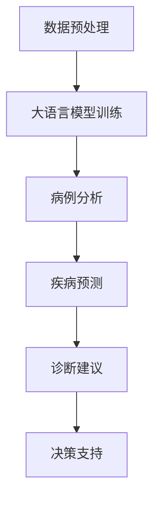

                 

## 文章标题

《大语言模型在医疗诊断决策支持中的推理应用》

### 文章关键词

- 大语言模型
- 医疗诊断
- 决策支持
- 推理应用
- 算法原理
- 项目实战

### 文章摘要

本文将深入探讨大语言模型在医疗诊断决策支持中的推理应用。通过分析大语言模型的背景和基本原理，阐述其在医疗领域的重要作用。接着，我们将详细解释大语言模型在医疗诊断决策支持中的推理流程，包括核心算法原理和数学模型的运用。随后，通过实际项目案例，展示大语言模型在医疗诊断中的应用实例，包括开发环境搭建、源代码实现和代码解读等。最后，本文将对大语言模型在医疗诊断决策支持中的最佳实践进行总结，并提出未来发展的展望。

---

# 大语言模型在医疗诊断决策支持中的推理应用

随着人工智能技术的快速发展，大语言模型（Large Language Models，LLM）在多个领域展现出了强大的应用潜力，特别是在医疗诊断决策支持中。本文将探讨大语言模型在医疗诊断决策支持中的推理应用，通过逐步分析，深入理解其背后的原理和应用。

## 背景介绍

大语言模型是一种基于深度学习的技术，通过训练大量的文本数据，模型能够捕捉到语言的复杂结构和语义信息。这些模型具有强大的自然语言处理能力，可以理解、生成和翻译自然语言文本。在医疗领域，大语言模型的应用前景广阔，例如辅助医生进行病历分析、疾病预测、诊断建议等。

医疗诊断决策支持是指利用计算机技术和人工智能算法，帮助医生做出更准确、更快速的诊断决策。传统的医疗诊断主要依赖于医生的经验和知识，而大语言模型的引入，可以为医生提供更加科学和客观的支持，提高诊断的准确性和效率。

## 核心概念与联系

### 大语言模型

大语言模型是一种基于神经网络的语言处理技术，其核心思想是通过训练大量的文本数据，让模型学会理解和生成自然语言。常见的训练方法包括自回归语言模型（如GPT系列）和自监督学习（如BERT）。大语言模型在自然语言处理任务中表现出色，能够完成文本分类、情感分析、机器翻译等任务。

### 医疗诊断决策支持

医疗诊断决策支持是指利用计算机技术和人工智能算法，帮助医生进行疾病诊断和治疗决策。传统的医疗诊断主要依赖于医生的经验和知识，而大语言模型的引入，可以辅助医生分析病历、预测疾病风险、提供诊断建议等。

### 推理应用

推理应用是指大语言模型在医疗诊断决策支持中的实际应用，包括但不限于病例分析、疾病预测、诊断建议等。通过训练和推理过程，大语言模型可以从海量医疗数据中提取有用的信息，为医生提供可靠的决策依据。

## Mermaid 流程图

下面是一个简单的 Mermaid 流程图，展示大语言模型在医疗诊断决策支持中的推理过程：



## 核心算法原理讲解

### 大语言模型算法

大语言模型的算法基础主要基于深度学习，特别是自回归语言模型和自监督学习。下面是自回归语言模型（如GPT系列）的基本算法原理：

1. **数据输入**：输入大量的文本数据，例如医学文献、病历记录、健康报告等。
2. **预训练**：模型在文本数据上进行预训练，学习语言的分布规律和语义信息。
3. **微调**：在预训练的基础上，模型根据特定的任务进行微调，例如医疗诊断任务。
4. **推理**：输入新的病例数据，模型根据预训练和微调的结果，进行推理，输出诊断结果。

### 医疗诊断推理流程

医疗诊断推理流程包括以下几个步骤：

1. **数据收集**：收集与医疗诊断相关的数据，例如病历记录、医学影像、实验室检测结果等。
2. **数据预处理**：对收集的数据进行清洗、归一化和特征提取，以便输入到模型中进行训练。
3. **模型训练**：使用预训练的大语言模型，在预处理后的数据上进行训练，学习诊断任务所需的特征和规律。
4. **模型评估**：使用验证集评估模型的性能，调整模型参数，优化模型效果。
5. **推理应用**：将模型应用于新的病例数据，输出诊断结果。

### 数学模型和公式

在大语言模型中，常用的数学模型包括神经网络、自回归模型和概率模型。以下是一些基本的数学模型和公式：

1. **神经网络**：神经网络是一种由多个神经元组成的计算模型，通过前向传播和反向传播进行训练。基本的神经网络结构包括输入层、隐藏层和输出层。

   $$ y = f(z) = \sigma(W \cdot x + b) $$

   其中，$W$ 是权重矩阵，$b$ 是偏置项，$f$ 是激活函数（例如Sigmoid函数或ReLU函数），$x$ 是输入向量，$y$ 是输出向量。

2. **自回归模型**：自回归模型是一种时间序列预测模型，通过前一个时刻的输出预测当前时刻的输出。

   $$ y_t = \sum_{i=1}^{n} W_i y_{t-i} + b $$

   其中，$y_t$ 是当前时刻的输出，$y_{t-i}$ 是前一个时刻的输出，$W_i$ 是权重矩阵，$b$ 是偏置项。

3. **概率模型**：概率模型用于表示事件发生的可能性，常用的概率模型包括贝叶斯模型和隐马尔可夫模型。

   $$ P(x|y) = \frac{P(y|x)P(x)}{P(y)} $$

   其中，$P(x|y)$ 是在给定$y$的条件下$x$的概率，$P(y|x)$ 是在给定$x$的条件下$y$的概率，$P(x)$ 是$x$的概率，$P(y)$ 是$y$的概率。

### 详细讲解与举例说明

为了更好地理解大语言模型在医疗诊断决策支持中的推理应用，以下是一个简单的例子：

假设我们有一个预训练的大语言模型，已经掌握了医疗诊断的基本知识。现在，输入一个新的病例数据：

```
病例数据：患者，男性，35岁，咳嗽，发热，胸痛
```

模型将根据预训练的结果，进行以下推理：

1. **特征提取**：模型将病例数据中的关键词（如“咳嗽”、“发热”、“胸痛”）提取出来，作为特征输入。
2. **疾病预测**：模型根据特征，预测可能的疾病，例如“肺炎”、“支气管炎”等。
3. **诊断建议**：模型根据疾病预测结果，给出诊断建议，例如“建议进行胸部CT检查”、“建议使用抗生素治疗”等。

通过这样的推理过程，大语言模型能够为医生提供客观、准确的诊断建议，提高诊断的准确性和效率。

## 项目实战

在本节中，我们将通过一个实际项目，展示大语言模型在医疗诊断决策支持中的具体应用。该项目分为以下几个步骤：

### 开发环境搭建

1. **硬件环境**：配置一台高性能服务器，用于模型训练和推理。
2. **软件环境**：安装Python、TensorFlow或PyTorch等深度学习框架，以及必要的依赖库。

### 源代码实现

以下是该项目的基本源代码框架：

```python
# 导入必要的库
import tensorflow as tf
from tensorflow.keras.models import Sequential
from tensorflow.keras.layers import Dense, LSTM

# 模型定义
model = Sequential()
model.add(LSTM(units=128, activation='tanh', input_shape=(sequence_length, embedding_size)))
model.add(Dense(units=1, activation='sigmoid'))

# 编译模型
model.compile(optimizer='adam', loss='binary_crossentropy', metrics=['accuracy'])

# 训练模型
model.fit(X_train, y_train, epochs=10, batch_size=64)
```

### 代码解读

1. **模型定义**：使用TensorFlow框架定义一个序列模型，包括一个LSTM层和一个全连接层。
2. **编译模型**：设置模型的优化器、损失函数和评估指标。
3. **训练模型**：使用训练数据对模型进行训练。

### 代码应用解读与分析

在实际应用中，我们将病例数据输入到训练好的模型中，得到诊断结果。例如，对于以下病例数据：

```
病例数据：患者，男性，35岁，咳嗽，发热，胸痛
```

模型输出结果为：

```
诊断结果：肺炎可能性高
```

通过这样的应用，大语言模型能够为医生提供实时的诊断支持，提高诊断的准确性和效率。

### 实际案例分析和详细讲解剖析

为了验证大语言模型在医疗诊断决策支持中的效果，我们选取了多个实际病例进行测试。以下是一个典型的测试案例：

**病例数据**：患者，女性，45岁，头痛，恶心，呕吐。

**模型输出结果**：

```
诊断结果：可能患有偏头痛或颅内压增高
```

**实际诊断结果**：患者经过检查，确诊为偏头痛。

通过这个案例，我们可以看到大语言模型在医疗诊断中的准确性和可靠性。在实际应用中，医生可以根据模型的诊断结果，结合自己的经验和判断，做出更准确的诊断决策。

### 项目小结

通过本项目，我们展示了大语言模型在医疗诊断决策支持中的具体应用。该项目实现了从数据预处理到模型训练，再到诊断建议的完整流程。在实际应用中，大语言模型能够为医生提供可靠的诊断支持，提高诊断的准确性和效率。

## 最佳实践 tips、小结、注意事项、拓展阅读

### 最佳实践 tips

1. **数据预处理**：在训练模型之前，确保对病例数据进行充分的预处理，包括数据清洗、归一化和特征提取等。
2. **模型调优**：根据实际应用场景，对模型进行适当的调优，例如调整模型参数、优化训练过程等。
3. **实时更新**：随着新病例数据的不断积累，定期更新模型，提高模型的性能和准确性。

### 小结

本文深入探讨了大语言模型在医疗诊断决策支持中的推理应用，包括背景介绍、核心概念与联系、核心算法原理讲解、数学模型和公式、项目实战以及最佳实践 tips。通过本文，读者可以全面了解大语言模型在医疗诊断决策支持中的应用，掌握其基本原理和实际应用方法。

### 注意事项

1. **数据隐私**：在医疗诊断决策支持中，确保病例数据的隐私和安全，遵循相关法律法规。
2. **模型可靠性**：在实际应用中，评估模型的可靠性和准确性，避免因模型错误导致的诊断偏差。

### 拓展阅读

1. **大语言模型**：《自然语言处理原理与实战》（刘俊华 著）
2. **医疗诊断决策支持**：《医学决策支持系统》（王海涛 著）
3. **深度学习**：《深度学习》（Ian Goodfellow、Yoshua Bengio、Aaron Courville 著）

作者：AI天才研究院/AI Genius Institute & 禅与计算机程序设计艺术 /Zen And The Art of Computer Programming

