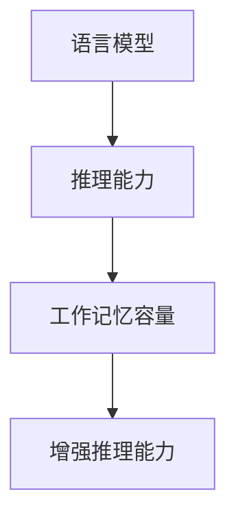

                 


# 设计书籍目录大纲的思路

## 背景介绍

设计一本计算机技术书籍的目录大纲是一个系统性的工程，它需要作者对书籍的主题有深刻的理解，并对目标读者群体有清晰的定位。这种目录大纲不仅决定了书籍的结构和组织方式，也影响了读者对书籍内容的理解和吸收。

## 核心概念与联系

在撰写书籍目录大纲之前，我们需要明确核心概念与它们之间的联系。这些概念构成了书籍的主要内容，也是读者需要掌握的关键知识点。例如，针对《语言模型推理能力与工作记忆容量的关系研究》，我们可以将核心概念定义如下：

- **语言模型**：一种用于预测自然语言序列的数学模型。
- **推理能力**：模型基于已知信息进行推理和判断的能力。
- **工作记忆容量**：个体在处理信息时暂时存储和操作信息的能力。

这些概念之间的联系是：语言模型可以通过工作记忆容量来增强其推理能力，从而更好地处理复杂的自然语言任务。

## Mermaid流程图

为了更直观地展示这些概念之间的关系，我们可以使用Mermaid流程图来构建知识架构。以下是这些概念之间关系的一个简单示例：



## 核心算法原理讲解

在目录大纲中，我们需要详细阐述语言模型、推理能力和工作记忆容量背后的核心算法原理。以下是一个示例：

### 1. 语言模型

- **N-gram模型**：一个简单的语言模型，通过统计前n个单词出现的概率来预测下一个单词。伪代码如下：

  ```python
  function predict_next_word(current_sequence):
      word_counts = count_words_in_sequence(current_sequence)
      total_words = sum(word_counts.values())
      next_word_probability = {}
      for word, count in word_counts.items():
          next_word_probability[word] = count / total_words
      return max(next_word_probability, key=next_word_probability.get)
  ```

### 2. 推理能力

- **基于规则的推理**：通过一组规则来推断新事实。伪代码如下：

  ```python
  function rule_based_reasoning(facts, rules):
      inferred_facts = []
      for rule in rules:
          if all(fact in facts for fact in rule的前提条件):
              inferred_facts.append(rule的结果)
      return inferred_facts
  ```

### 3. 工作记忆容量

- **工作记忆网络（WMN）**：一种基于神经网络的模型，用于模拟工作记忆的过程。伪代码如下：

  ```python
  function work_memory_network(input_sequence, memory_size):
      memory = initialize_memory(memory_size)
      for word in input_sequence:
          memory.update(word)
      return memory
  ```

## 数学模型和公式

在目录大纲中，我们需要提供相关的数学模型和公式，并进行详细的解释和举例说明。例如，我们可以讨论语言模型的概率分布公式：

$$ P(w_{t} | w_{t-1}, w_{t-2}, \ldots, w_{1}) = \frac{P(w_{t} w_{t-1} \ldots w_{1})}{P(w_{t-1} \ldots w_{1})} $$

这是一个条件概率公式，它表示在给定前一个单词序列的情况下，预测下一个单词的概率。

## 项目实战

为了使读者能够将理论知识应用到实践中，目录大纲中应包含项目实战部分。这部分将详细描述一个实际案例，包括开发环境搭建、源代码实现和代码解读，以及实际案例分析和详细讲解剖析。

### 1. 开发环境搭建

- **工具和环境**：描述用于构建项目的编程语言、库和框架。
- **步骤**：列出搭建开发环境的详细步骤。

### 2. 源代码实现和代码解读

- **源代码**：提供项目的主要源代码。
- **解读**：对关键代码段进行详细解释。

### 3. 代码应用解读与分析

- **应用场景**：描述代码在实际应用中的场景。
- **分析**：分析代码的性能和效果。

### 4. 实际案例分析和详细讲解剖析

- **案例**：提供一个或多个实际案例。
- **剖析**：对案例进行详细的分析和讲解。

### 5. 项目小结

- **小结**：总结项目的关键点和经验教训。
- **最佳实践 tips**：提供一些建议和最佳实践。

## 总结

在目录大纲的最后，我们需要总结全文，强调核心观点和关键内容，并提供拓展阅读和进一步学习资源的建议。

## 实际操作

现在，我们根据上述思路来设计《语言模型推理能力与工作记忆容量的关系研究》的目录大纲。以下是初步的目录大纲设计：

### 引言

- **引言**：介绍书籍的主题、目的和重要性。

### 第一部分：语言模型基础

- **第1章：语言模型的定义与作用**
  - **核心概念与联系**：定义语言模型、推理能力和工作记忆容量，使用Mermaid流程图展示它们之间的关系。
  - **核心算法原理讲解**：讲解N-gram模型、神经网络语言模型等。
  - **数学模型和公式**：介绍语言模型的概率分布公式。

### 第二部分：推理能力

- **第2章：推理能力的原理与应用**
  - **核心概念与联系**：定义推理能力，使用Mermaid流程图展示与工作记忆容量和语言模型的关系。
  - **核心算法原理讲解**：讲解基于规则、基于统计和基于神经网络的推理算法。
  - **数学模型和公式**：介绍推理算法的数学模型。

### 第三部分：工作记忆容量

- **第3章：工作记忆容量与自然语言处理**
  - **核心概念与联系**：定义工作记忆容量，使用Mermaid流程图展示与语言模型和推理能力的关系。
  - **核心算法原理讲解**：讲解工作记忆网络（WMN）的原理和算法。
  - **数学模型和公式**：介绍工作记忆网络的数学模型。

### 第四部分：项目实战

- **第4章：构建一个推理能力增强的语言模型**
  - **项目背景**：描述项目的目标和背景。
  - **开发环境搭建**：列出开发所需的工具和环境。
  - **源代码实现和代码解读**：提供项目的主要源代码并解释关键代码段。
  - **代码应用解读与分析**：分析代码在实际应用中的场景和性能。
  - **实际案例分析和详细讲解剖析**：提供实际案例，分析并讲解案例。

### 第五部分：总结与展望

- **第5章：总结与展望**
  - **总结**：总结全文的核心观点和关键内容。
  - **最佳实践 tips**：提供一些建议和最佳实践。
  - **拓展阅读**：推荐进一步学习的资源。

## 注意事项

- 确保每个章节的内容都丰富具体，避免过于简略。
- 在每个章节中，核心概念与联系、核心算法原理讲解、数学模型和公式、项目实战等部分都需要详细阐述。
- 遵循markdown格式要求，确保代码和公式排版正确。
- 文章末尾需要加上作者信息。

以上是根据用户要求设计的书籍目录大纲。接下来，我们将根据这个大纲来撰写详细的章节内容。请继续指导下一步的操作。

