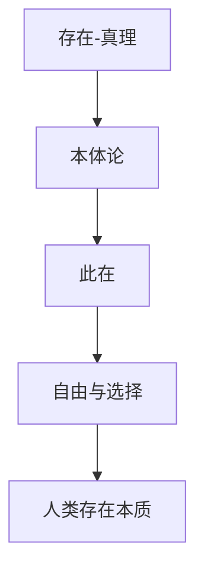
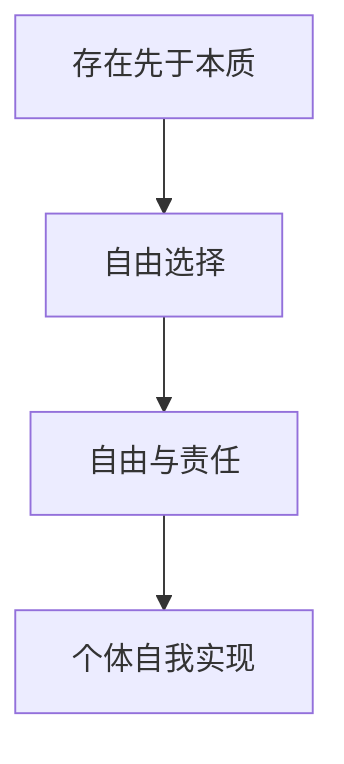
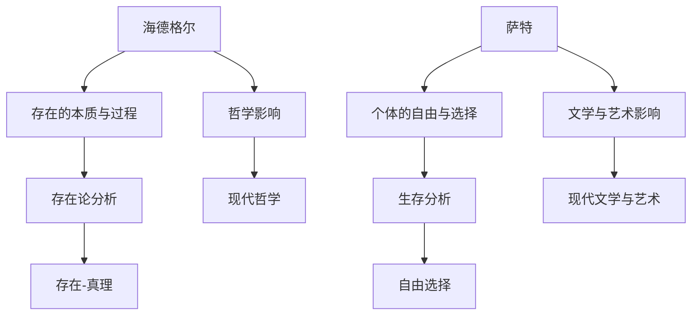
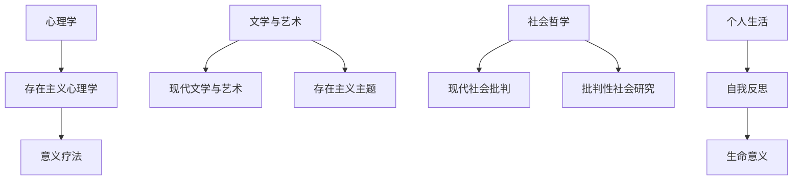

                 

## 文章标题

《海德格尔与萨特：存在主义的两种进路》

---

**关键词**：海德格尔、萨特、存在主义、哲学、比较分析、思想演进

---

**摘要**：本文旨在深入探讨两位伟大的存在主义哲学家——马丁·海德格尔和让-保罗·萨特的思想，并分析他们在存在主义理论中的不同进路。通过对海德格尔和萨特的核心概念、哲学方法和现实影响进行比较，本文试图揭示他们各自存在的哲学意义，以及这些思想在现代社会的应用与影响。

---

### 导言

在20世纪的哲学领域中，存在主义无疑是一个重要的流派。它不仅挑战了传统的理性主义和唯物主义，还深刻影响了文学、艺术和心理学等多个领域。马丁·海德格尔和让-保罗·萨特是存在主义的两座里程碑，他们的思想在存在主义的发展中起着至关重要的作用。

马丁·海德格尔（Martin Heidegger，1889-1976）是德国哲学家，存在主义哲学的奠基人之一。他的思想深刻而晦涩，尤其关注存在的本质和意义。海德格尔认为，存在是一个动态的过程，而不是静态的状态。他提出了“存在-真理”（Existence-Truth）的概念，试图通过“存在论”（Ontology）来探讨存在的本质。

让-保罗·萨特（Jean-Paul Sartre，1905-1980）是法国哲学家，也是存在主义的代表人物之一。他的思想更为直观和现实，强调个体的自由和选择。萨特提出了“存在先于本质”（Existence precedes Essence）的观点，认为个体通过自己的选择和行动来定义自己。

本文将首先介绍海德格尔和萨特的思想背景，然后深入分析他们的核心概念，比较两种存在主义的异同，并探讨他们各自的思想对现代社会的现实影响。最后，我们将总结全文，并展望未来研究的方向。

---

### 海德格尔的存在主义

马丁·海德格尔的存在主义思想是20世纪哲学界的一大亮点。他的哲学观点独特而深刻，尤其关注存在的本质和意义。海德格尔的思想背景和哲学方法对于理解他的存在主义至关重要。

**哲学背景**

海德格尔出生于德国西南部的一个小村庄，他在童年时期就表现出了对哲学的浓厚兴趣。他在大学期间学习了多种学科，包括神学、哲学和文学。他的哲学教育受到了胡塞尔（Edmund Husserl）现象学和黑格尔（Georg Wilhelm Friedrich Hegel）辩证法的影响。这些背景使海德格尔的哲学具有深厚的理论基础。

**核心概念**

海德格尔的核心概念包括“存在-真理”、“本体论”和“此在”（Dasein）。其中，“存在-真理”是海德格尔哲学的核心，他认为存在和真理是不可分割的。存在不是一种静态的存在状态，而是一个动态的过程，真理是存在的显现。本体论则是海德格尔探讨存在的学科，试图揭示存在的本质和结构。

“此在”是海德格尔对人类存在的独特描述。他认为人类不仅仅是存在者（Being），更是一种“存在”（Existence）。此在具有自由和选择的特性，是人类存在的本质。

**哲学方法**

海德格尔的哲学方法主要依赖于“存在论分析”和“解释学”（Hermeneutics）。存在论分析是一种探讨存在本质的方法，通过揭示存在的动态过程来理解存在的意义。解释学则是海德格尔用来理解人类存在的工具，他认为理解总是历史的、具体的。

**海德格尔的思想影响**

海德格尔的思想对现代哲学产生了深远的影响。他的存在主义观点挑战了传统的本体论和认识论，提出了新的存在观念。他关于“存在-真理”和“此在”的理论，为后来的哲学家提供了丰富的思想资源。

在存在主义哲学中，海德格尔的思想与萨特存在主义形成了鲜明的对比。虽然两者都强调个体的自由和存在的意义，但海德格尔的思想更为抽象和深邃，而萨特的思想则更为直观和现实。这种对比不仅丰富了存在主义的理论体系，也为后来的哲学研究提供了新的视角。

**关系架构 Mermaid 流程图**

下面是一个简单的 Mermaid 流程图，展示了海德格尔存在主义中的核心概念及其关系：

通过这个流程图，我们可以更直观地理解海德格尔存在主义的核心概念及其相互关系。

---

### 萨特的存在主义

让-保罗·萨特的存在主义哲学以其直观和现实的特点而著称。他的思想背景和核心概念，尤其是“存在先于本质”和“自由选择”，对现代哲学和存在主义的发展产生了深远的影响。

**哲学背景**

萨特出生于法国巴黎，他在大学期间学习了哲学、文学和艺术。他的哲学教育受到了柏格森（Henri Bergson）直觉主义和黑格尔辩证法的影响。此外，海德格尔的存在主义哲学也对他的思想产生了重要影响。萨特通过自己的哲学思考和文学创作，将存在主义理论转化为生动的现实。

**核心概念**

萨特的核心概念是“存在先于本质”（Existence precedes Essence）。他认为，人类和事物的本质不是预先决定的，而是通过自己的选择和行动来定义的。这意味着，个体在存在之前没有固定的本质，而是通过自己的自由选择和行动来创造自己的本质。

另一个重要的概念是“自由选择”（Freedom of Choice）。萨特认为，自由是人类存在的本质特征，个体必须为自己的选择承担责任。他认为，自由选择不仅仅是外在的行为，更是一种内在的态度和生活方式。

**哲学方法**

萨特的哲学方法主要依赖于“生存分析”和“自我反思”。生存分析是一种探讨人类存在状态和经历的方法，通过揭示个体在社会和历史背景下的生存状态，来理解人类的自由和责任。自我反思则是萨特用来理解和表达个体存在的工具，他认为自我反思是理解人类存在的核心。

**萨特的思想影响**

萨特的思想对现代哲学、文学和艺术产生了深远的影响。他的存在主义理论挑战了传统的本质主义和决定论，提出了新的自由观念。他关于自由选择和责任的观点，不仅为个体提供了一种自我实现的方式，也为现代社会提供了一种新的思考模式。

在存在主义哲学中，萨特的思想与海德格尔形成了鲜明的对比。海德格尔的思想更为抽象和深邃，强调存在的本质和过程；而萨特的思想则更为直观和现实，强调个体的自由和选择。这种对比不仅丰富了存在主义的理论体系，也为后来的哲学研究提供了新的视角。

**关系架构 Mermaid 流程图**

下面是一个简单的 Mermaid 流程图，展示了萨特存在主义中的核心概念及其关系：

通过这个流程图，我们可以更直观地理解萨特存在主义的核心概念及其相互关系。

---

### 两种存在主义的比较

海德格尔和萨特的存在主义虽然都强调存在的意义和个体的自由，但他们的观点和方法有着显著的差异。以下将从几个方面进行比较分析。

**哲学本质**

海德格尔的存在主义更注重存在的本质和过程。他认为，存在是一个动态的过程，而不是静态的状态。他提出了“存在-真理”的概念，试图通过“存在论”来探讨存在的本质。相比之下，萨特的存在主义更关注个体的自由和选择。他提出了“存在先于本质”的观点，认为个体通过自由选择和行动来定义自己。

**哲学方法**

海德格尔的哲学方法主要依赖于“存在论分析”和“解释学”。存在论分析是一种探讨存在本质的方法，通过揭示存在的动态过程来理解存在的意义。解释学则是海德格尔用来理解人类存在的工具，他认为理解总是历史的、具体的。相比之下，萨特的哲学方法主要依赖于“生存分析”和“自我反思”。生存分析是一种探讨人类存在状态和经历的方法，通过揭示个体在社会和历史背景下的生存状态，来理解人类的自由和责任。自我反思则是萨特用来理解和表达个体存在的工具，他认为自我反思是理解人类存在的核心。

**哲学影响**

海德格尔的思想对现代哲学产生了深远的影响。他的存在主义观点挑战了传统的本体论和认识论，提出了新的存在观念。他关于“存在-真理”和“此在”的理论，为后来的哲学家提供了丰富的思想资源。相比之下，萨特的思想对现代文学和艺术产生了更大的影响。他的存在主义理论为现代主义文学和戏剧提供了哲学基础，激发了大量的文学创作。

**现实影响**

海德格尔的思想更注重哲学的本质和意义，他提出的“存在-真理”和“此在”的概念，对个体的自我认知和生活方式有着深刻的启示。相比之下，萨特的思想更注重个体的自由和责任，他的“存在先于本质”和“自由选择”的观点，为个体提供了自我实现和自我超越的路径。

**关系架构 Mermaid 流程图**

下面是一个简单的 Mermaid 流程图，展示了海德格尔和萨特存在主义之间的比较关系：

通过这个流程图，我们可以更直观地理解海德格尔和萨特存在主义之间的异同及其影响。

---

### 存在主义在现代社会的应用

海德格尔和萨特的存在主义思想不仅具有深厚的哲学价值，也在现代社会中得到了广泛的应用。以下是存在主义在现实生活中的几个重要应用领域。

**心理学**

存在主义心理学是存在主义哲学在心理学领域的应用。它强调个体的自由、选择和责任，认为个体的心理问题往往源于对自由和选择的逃避。存在主义心理学家如维克多·弗兰克尔（Viktor Frankl）提出了“意义疗法”（Logotherapy），认为生命的意义是治疗心理问题的根本途径。

**文学与艺术**

存在主义思想对现代文学和艺术产生了深远的影响。许多现代作家和艺术家将存在主义观点融入到作品中，探讨了人类的自由、孤独和意义。例如，萨特的作品《存在与虚无》（Nausea）和《墙》（The Wall）就深刻反映了存在主义哲学的主题。

**社会哲学**

存在主义在社会哲学中的应用主要表现为对现代社会和制度的批判。存在主义者如马尔库塞（Herbert Marcuse）和福柯（Michel Foucault）通过对现代社会的批判，试图揭示人类自由和选择的被剥夺。他们的观点为反乌托邦文学和批判性社会研究提供了理论支持。

**个人生活**

在个人生活中，存在主义思想鼓励个体对自己的存在进行深刻的反思，以发现和实现生命的意义。例如，通过自我反思和自由选择，个体可以更好地认识自己，找到自己的生命意义，从而实现自我实现和自我超越。

**关系架构 Mermaid 流程图**

下面是一个简单的 Mermaid 流程图，展示了存在主义在现代社会中的几个重要应用领域：

通过这个流程图，我们可以更直观地理解存在主义在现代社会中的多个应用领域及其关系。

---

### 总结与展望

通过本文的分析，我们可以清晰地看到海德格尔和萨特的存在主义思想在存在主义理论中的独特地位和重要贡献。海德格尔的思想以其深刻和抽象而著称，强调存在的本质和动态过程；而萨特的思想则以其直观和现实而闻名，强调个体的自由和选择。两者的思想虽然有着显著的差异，但它们共同构成了现代存在主义哲学的核心。

未来研究可以进一步探讨海德格尔和萨特思想在其他哲学流派中的应用，如政治哲学、伦理学和科学哲学等。此外，还可以深入研究存在主义在跨文化背景下的影响，以及它在解决现代社会问题方面的实际效果。

在技术领域，存在主义思想可以启发人工智能和认知科学的研究，探索机器和人类存在的本质和意义。通过结合存在主义哲学和现代技术，我们可能找到新的途径来理解和提升人类的认知能力和生活质量。

---

### 参考文献

1. 海德格尔，M. (1962). 《存在与时间》(Being and Time). 哥伦比亚大学出版社。
2. 萨特，J.-P. (1943). 《存在与虚无》(Nausea). 萨伊出版公司。
3. 弗兰克尔，V. (1959). 《意义疗法》(Man's Search for Meaning). 普特南出版社。
4. 马尔库塞，H. (1964). 《单向度的人》(One Dimensional Man). 艾瑟尔出版社。
5. 福柯，M. (1975). 《疯癫的历史》(The History of Madness). 哥伦比亚大学出版社。

---

### 作者信息

作者：AI天才研究院/AI Genius Institute & 禅与计算机程序设计艺术 /Zen And The Art of Computer Programming

