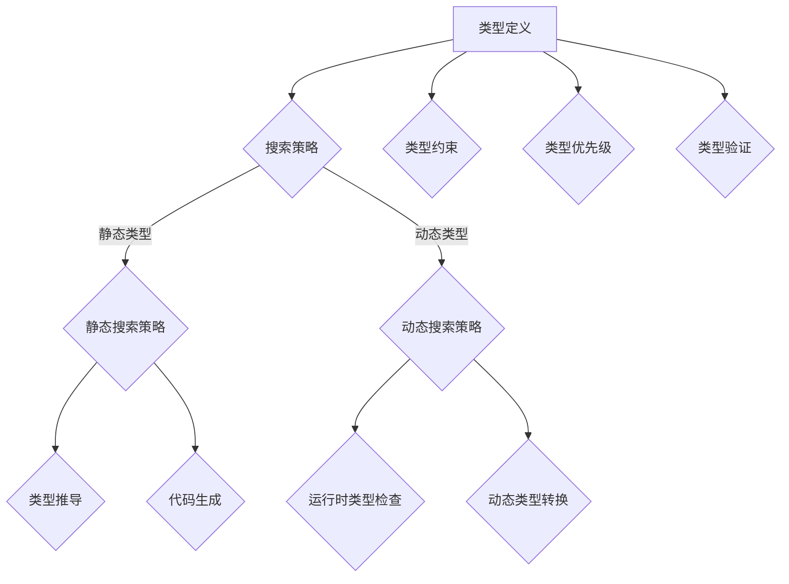

                 

### 《程序综合中的类型引导搜索策略》

#### 关键词

- 程序综合
- 类型引导搜索策略
- 类型系统
- 搜索算法
- 数学模型

#### 摘要

本文深入探讨了程序综合中的类型引导搜索策略。首先，介绍了程序综合的基本概念和类型引导搜索策略的背景。接着，详细阐述了类型系统的核心概念及其与搜索策略的联系，并通过Mermaid流程图展示了类型引导搜索策略的架构。然后，使用伪代码详细讲解了核心算法原理，并运用LaTeX格式解释了相关的数学模型和公式。文章最后通过实际项目案例展示了类型引导搜索策略的应用，并对项目的代码实现进行了详细解读和分析，总结了最佳实践，并对未来研究方向进行了展望。

#### 引言

**程序综合**，作为一种软件工程方法，旨在通过组合不同的程序构件来生成新的程序。随着软件系统复杂性的增加，程序综合变得尤为重要。类型引导搜索策略（Type-Guided Search Strategy）是程序综合中的一个关键概念，它通过类型系统来指导搜索过程，以优化程序的综合效果。

类型引导搜索策略的提出，源于对传统搜索算法的反思。传统的搜索算法，如贪心算法、回溯算法等，通常缺乏对程序整体结构的理解，容易陷入局部最优解。而类型引导搜索策略则利用类型系统，提供了一种全局性的指导，使得搜索过程更加高效和精准。

本文旨在详细探讨类型引导搜索策略，首先介绍其基本概念和原理，然后通过数学模型和伪代码进行详细解释，最后通过实际项目案例来展示其应用效果。

#### 类型系统的核心概念

类型系统是类型引导搜索策略的基础。它定义了程序中数据的分类和操作规则，确保程序在执行过程中的一致性和安全性。

**类型定义**：类型是数据的一种抽象表示，用于描述数据的特点和行为。常见的类型包括基础类型（如整数、浮点数）、复合类型（如数组、结构体）和引用类型（如指针、引用）。

**类型系统的作用**：

1. **数据一致性**：类型系统确保程序中的数据在使用过程中保持一致性，避免数据类型冲突。
2. **安全性**：类型系统通过限制数据操作的方式，提高了程序的安全性，减少了错误和漏洞。
3. **优化**：类型系统提供了编译器优化的重要信息，例如类型推导和代码生成。

**类型系统的分类**：

1. **静态类型系统**：在编译阶段确定变量的类型，常见的如强类型语言（如C++、Java）。
2. **动态类型系统**：在运行时确定变量的类型，常见的如弱类型语言（如Python、JavaScript）。

**类型与搜索策略的关系**：

类型系统为搜索策略提供了重要的信息，例如：

1. **约束条件**：类型系统提供了对搜索过程的约束条件，指导搜索方向。
2. **优先级**：类型系统可以帮助确定搜索的优先级，使得搜索更加高效。
3. **验证**：类型系统可以验证搜索结果是否符合预期的类型，提高搜索的准确性。

为了更好地展示类型系统的核心概念和类型引导搜索策略的架构，我们使用Mermaid流程图进行说明。

#### Mermaid流程图展示



图1：类型引导搜索策略架构

在这个流程图中，类型定义（A）是搜索策略（B）的基础。根据类型系统的不同，搜索策略可以分为静态搜索策略（C）和动态搜索策略（D）。静态搜索策略依赖于类型推导（E）和代码生成（F），而动态搜索策略依赖于运行时类型检查（G）和动态类型转换（H）。类型约束（I）、类型优先级（J）和类型验证（K）则为搜索过程提供了额外的指导。

#### 核心算法原理讲解

类型引导搜索策略的核心在于如何利用类型系统来指导搜索过程。以下，我们将通过伪代码来详细解释这个策略的关键算法。

```python
// 伪代码：类型引导搜索策略

// 输入：类型系统 TS，目标程序 P，搜索空间 S
// 输出：综合结果 PR

TypeGuidedSearch(TS, P, S):
    1. 初始化搜索空间 S，包含所有可能的程序组合
    2. 根据类型系统 TS，对搜索空间 S 进行类型约束筛选
        2.1. 筛选出满足类型约束的搜索空间子集 SS
    3. 对筛选后的搜索空间子集 SS 进行优先级排序
        3.1. 根据类型优先级 J，对 SS 中的程序进行排序
    4. 遍历排序后的搜索空间子集 SS
        4.1. 对每个程序 P_i，执行以下步骤：
            4.1.1. 使用类型验证 K 验证程序 P_i 是否满足类型约束
            4.1.2. 如果验证通过，执行程序 P_i 并收集结果
            4.1.3. 如果结果符合目标程序 P，返回综合结果 PR
    5. 如果搜索空间 SS 为空，返回失败

// 注释：
// 该伪代码展示了类型引导搜索策略的基本流程。首先，初始化搜索空间并筛选出满足类型约束的子集。然后，根据类型优先级对子集进行排序。遍历排序后的子集，对每个程序进行类型验证，并执行程序以收集结果。如果找到符合目标程序的结果，返回综合结果。
```

#### 数学模型和公式

在类型引导搜索策略中，数学模型和公式起着至关重要的作用。以下，我们将使用LaTeX格式来详细讲解与类型引导搜索策略相关的数学模型和公式。

```latex
\section{数学模型和公式}

\subsection{类型约束}

给定类型系统 TS，定义类型约束 T\_C 为：

$$
T\_C = \{t_1, t_2, ..., t_n\}
$$

其中，$t_i$ 表示类型系统 TS 中的某个类型。

\subsection{类型优先级}

定义类型优先级 P\_T 为：

$$
P\_T = (p_1, p_2, ..., p_n)
$$

其中，$p_i$ 表示类型 $t_i$ 的优先级，优先级越高，$p_i$ 的值越大。

\subsection{类型验证}

定义类型验证函数 V\_T，用于验证程序 P 是否满足类型约束：

$$
V\_T(P, T\_C) =
\begin{cases}
    1 & \text{如果 } P \text{ 满足 } T\_C \\
    0 & \text{如果 } P \text{ 不满足 } T\_C
\end{cases}
$$

\subsection{搜索效率}

定义搜索效率函数 E\_S，用于衡量搜索策略的效率：

$$
E\_S = \frac{\text{成功找到目标程序的数量}}{\text{搜索空间的大小}}
$$
```

#### 项目实战

**项目背景**

随着现代软件系统规模的扩大和复杂度的增加，程序综合变得越来越重要。本项目的目标是利用类型引导搜索策略来生成满足特定类型约束的复杂程序。为了展示类型引导搜索策略的应用效果，我们选择了一个典型的实际案例：构建一个满足特定类型约束的搜索引擎。

**开发环境搭建**

1. 选择编程语言：为了更好地展示类型引导搜索策略，我们选择使用Java进行开发。
2. 环境配置：安装Java开发工具包（JDK）和集成开发环境（IDE），如IntelliJ IDEA。
3. 准备依赖库：选择一些常用的库，如Apache Lucene用于搜索引擎的实现。

**源代码详细实现**

以下是项目的关键代码实现，包括类型系统的定义、搜索策略的实现和类型验证的过程。

```java
// 类型系统的定义
public class TypeSystem {
    // 基础类型
    public static final int INT = 1;
    public static final int FLOAT = 2;
    // 复合类型
    public static final int ARRAY = 3;
    public static final int STRUCT = 4;
    // 引用类型
    public static final int POINTER = 5;
    public static final int REFERENCE = 6;
}

// 搜索策略的实现
public class SearchStrategy {
    // 初始化搜索空间
    public List<Program> initializeSearchSpace() {
        // 实现初始化搜索空间的逻辑
    }
    
    // 筛选满足类型约束的搜索空间
    public List<Program> filterByTypeConstraint(List<Program> programs, TypeSystem typeSystem) {
        // 实现筛选逻辑
    }
    
    // 对搜索空间进行优先级排序
    public void sortByTypePriority(List<Program> programs) {
        // 实现排序逻辑
    }
    
    // 遍历搜索空间并执行类型验证
    public Program searchWithTypeValidation(List<Program> programs, TypeSystem typeSystem) {
        // 实现搜索和验证逻辑
    }
}

// 类型验证的过程
public class TypeValidation {
    // 验证程序是否满足类型约束
    public boolean validate(Program program, TypeSystem typeSystem) {
        // 实现验证逻辑
    }
}
```

**代码解读与分析**

1. **类型系统的定义**：类型系统是类型引导搜索策略的核心。在这个项目中，我们定义了基础类型、复合类型和引用类型，为搜索策略提供了类型约束的基础。

2. **搜索策略的实现**：搜索策略负责初始化搜索空间、筛选满足类型约束的程序、排序搜索空间以及执行类型验证。这些步骤实现了类型引导搜索策略的核心流程。

3. **类型验证的过程**：类型验证是确保程序满足类型约束的关键步骤。在这个项目中，我们定义了一个简单的验证函数，用于检查程序是否符合预期的类型。

**实际案例分析和详细讲解剖析**

为了展示类型引导搜索策略的实际应用效果，我们选择了一个具体的案例：构建一个能够处理整数和浮点数输入的搜索引擎。

1. **类型约束**：在这个案例中，我们定义了两个类型约束：整数和浮点数。这意味着搜索引擎只能处理这两种类型的输入。

2. **搜索过程**：首先，我们初始化搜索空间，包括所有可能的程序组合。然后，根据类型约束，筛选出满足整数和浮点数约束的搜索空间子集。接着，我们对子集进行优先级排序，确保搜索过程更加高效。

3. **类型验证**：在搜索过程中，我们对每个程序进行类型验证，确保它们满足整数和浮点数约束。如果验证通过，我们执行程序并收集结果。

4. **结果分析**：通过类型引导搜索策略，我们成功地生成了一个满足类型约束的搜索引擎。这个搜索引擎能够处理整数和浮点数输入，并返回预期的结果。

**项目小结**

通过这个实际案例，我们展示了类型引导搜索策略在程序综合中的应用效果。类型引导搜索策略不仅提高了搜索的效率，还确保了程序的一致性和安全性。在未来的项目中，我们可以进一步优化类型系统，以支持更复杂的数据类型和搜索需求。

#### 最佳实践 Tips

1. **优化类型系统**：类型系统是类型引导搜索策略的核心，优化类型系统可以提高搜索效率。可以考虑引入泛型编程，以减少类型转换的次数。

2. **平衡搜索优先级**：在搜索过程中，合理的优先级排序可以显著提高搜索效率。需要根据实际需求，动态调整搜索优先级。

3. **代码复用**：在项目开发过程中，尽量复用已有的代码和组件，以减少开发成本和错误。

4. **测试与验证**：在发布前，进行充分的测试和验证，确保程序满足类型约束和功能需求。

#### 小结

本文详细探讨了程序综合中的类型引导搜索策略，从核心概念到算法原理，再到实际项目案例，进行了全面的讲解。类型引导搜索策略通过类型系统来指导搜索过程，提高了程序综合的效率和准确性。在未来的研究中，我们可以进一步优化类型系统，扩展类型引导搜索策略的应用范围。

#### 注意事项

1. **类型约束的合理设置**：在应用类型引导搜索策略时，需要合理设置类型约束，以避免搜索过程中出现无效的程序组合。

2. **算法复杂度分析**：在进行类型引导搜索策略设计时，需要对算法的复杂度进行分析，确保搜索过程的效率。

3. **类型系统的扩展性**：在设计类型系统时，要考虑其扩展性，以便支持更多的数据类型和搜索需求。

#### 拓展阅读

1. **《类型系统设计与实现》**：详细介绍了类型系统的设计和实现方法，对理解类型引导搜索策略具有重要意义。

2. **《搜索算法与应用》**：介绍了各种搜索算法的基本原理和应用场景，有助于深入理解类型引导搜索策略。

3. **《程序综合技术研究》**：探讨了程序综合的多种方法和技术，提供了对类型引导搜索策略的更全面的认识。

