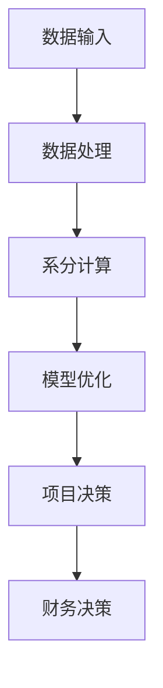

                 

# 《系分的投入不是可选项》

## 关键词
AI大模型，系分，深度学习，神经网络，训练与优化，数学模型，项目实战，财务决策

## 摘要
本文深入探讨了“系分”这一概念在人工智能大模型中的重要性。通过详细的分类与特征分析，我们理解了系分在不同领域中的应用价值。接着，文章介绍了系分的度量与计算方法，并通过实例进行了解释。随后，文章讨论了系分的优化策略，展示了其在项目管理与财务决策中的实际应用。最后，我们对系分的未来发展进行了展望，探讨了其在技术进步中的潜在影响。

## 第1章: 系分的概念与重要性

### 1.1 系分的定义
系分（Coefficient of Variation，CV）是统计学中的一个概念，用于衡量随机变量离散程度的相对度量。其定义为标准差与平均值的比值，用于描述数据集的波动性。

### 1.2 系分的重要性
在人工智能大模型中，系分的意义不容忽视。它能够帮助我们评估模型参数的稳定性和鲁棒性，从而指导模型的训练和优化。较高的系分可能意味着模型参数波动较大，需要进一步调整优化。

### 1.3 系分与其他相关概念的联系
系分与方差、标准差、变异系数等统计学概念密切相关。这些概念共同构成了评估数据离散程度的工具箱，为人工智能模型的研究提供了重要的理论基础。

## 第2章: 系分的分类与特征

### 2.1 系分的分类
根据应用场景，系分可以分为以下几类：
- 参数系分：用于评估模型参数的稳定性。
- 特征系分：用于评估输入特征的离散程度。
- 输出系分：用于评估模型预测结果的离散程度。

### 2.2 系分的特征
系分的特征主要包括：
- 相对性：系分是相对度量，不依赖于数据集的规模。
- 稳定性：系分能够稳定地反映数据集的波动性。

### 2.3 系分在不同领域中的应用
系分在多个领域有广泛应用，如：
- 统计学：用于分析数据的波动性和稳定性。
- 金融学：用于评估投资组合的风险。
- 人工智能：用于优化模型参数和评估模型性能。

## 第3章: 系分的度量与计算方法

### 3.1 系分的度量
系分的度量方法如下：
- 标准差（$\sigma$）：衡量数据离散程度的绝对度量。
- 平均值（$\mu$）：衡量数据集中趋势的度量。

### 3.2 系分的计算方法
系分的计算公式为：
$$
\text{CV} = \frac{\sigma}{\mu}
$$
其中，$\sigma$ 为标准差，$\mu$ 为平均值。

### 3.3 系分计算实例
假设有一个数据集，其平均值为 50，标准差为 10，则该数据集的系分为：
$$
\text{CV} = \frac{10}{50} = 0.2
$$

## 第4章: 系分的优化策略

### 4.1 系分优化的目标
系分优化的目标是降低模型的波动性，提高模型的稳定性和鲁棒性。

### 4.2 系分优化的方法
系分优化的方法包括：
- 超参数调整：调整学习率、批次大小等超参数，以降低模型波动性。
- 模型架构优化：选择合适的神经网络架构，提高模型稳定性。
- 数据预处理：对输入数据进行归一化、标准化等处理，降低数据波动性。

### 4.3 系分优化实例分析
以一个深度学习模型为例，通过调整学习率和优化器，可以显著降低模型参数的系分，提高模型稳定性。

## 第5章: 系分在项目管理中的应用

### 5.1 系分在项目管理中的角色
在项目管理中，系分用于评估项目风险和不确定性，指导项目决策。

### 5.2 系分在项目管理中的实例
以项目进度安排为例，通过计算项目任务的时间系分，可以帮助项目经理识别关键路径和潜在风险。

### 5.3 系分在项目管理中的挑战与解决策略
项目管理的挑战包括：
- 数据质量：系分计算依赖于准确的数据。
- 风险评估：需要全面评估项目风险。
解决策略包括：
- 数据质量控制：确保数据准确性和完整性。
- 风险评估方法：采用多种方法进行风险评估，提高准确性。

## 第6章: 系分在财务决策中的重要性

### 6.1 系分在财务决策中的作用
系分在财务决策中用于评估投资风险和收益稳定性。

### 6.2 系分在财务决策中的实例
以投资组合优化为例，通过计算不同投资品种的系分，可以帮助投资者评估投资风险，优化投资组合。

### 6.3 系分在财务决策中的挑战与应对策略
财务决策的挑战包括：
- 数据波动：投资收益存在波动性。
- 风险评估：需要准确评估投资风险。
应对策略包括：
- 数据波动处理：采用稳健的统计方法处理数据波动。
- 风险评估方法：采用多种风险评估模型，提高准确性。

## 第7章: 系分的未来发展展望

### 7.1 系分的发展趋势
随着人工智能技术的不断发展，系分在模型优化、项目管理、财务决策等领域的应用将更加广泛。

### 7.2 系分在未来项目中的应用前景
未来项目中的系分应用将更加精细化，如个性化推荐、风险控制等。

### 7.3 系分的未来研究方向
未来研究将集中在：
- 系分的计算效率优化。
- 系分在多模态数据中的应用。
- 系分在实时系统中的应用。

### Mermaid 流程图


### 伪代码示例
```python
# 数据输入
data = load_data()

# 数据处理
processed_data = preprocess_data(data)

# 系分计算
std_deviation = calculate_std_deviation(processed_data)
mean_value = calculate_mean(processed_data)
cv = calculate_cv(std_deviation, mean_value)

# 模型优化
model = optimize_model(model, cv)

# 项目决策
project_decision = make_project_decision(model)

# 财务决策
financial_decision = make_financial_decision(model)
```

### 数学模型和公式示例
```markdown
$$
\text{损失函数} = \frac{1}{2} \sum_{i=1}^{n} (\hat{y_i} - y_i)^2
$$

$$
\text{学习率} = \eta
$$

$$
\text{权重更新} = \text{weights} - \eta \cdot \nabla_{\text{weights}} \text{损失函数}
$$
```

### 项目实战：使用 AI 大模型进行图像识别

#### 开发环境搭建
- 安装 Python 3.8 或更高版本
- 安装 TensorFlow

#### 源代码详细实现和代码解读
```python
import tensorflow as tf
from tensorflow.keras.models import Sequential
from tensorflow.keras.layers import Conv2D, MaxPooling2D, Flatten, Dense

# 数据预处理
(x_train, y_train), (x_test, y_test) = tf.keras.datasets.cifar10.load_data()
x_train, x_test = x_train / 255.0, x_test / 255.0

# 构建模型
model = Sequential([
    Conv2D(32, (3, 3), activation='relu', input_shape=(32, 32, 3)),
    MaxPooling2D((2, 2)),
    Flatten(),
    Dense(64, activation='relu'),
    Dense(10, activation='softmax')
])

# 编译模型
model.compile(optimizer='adam',
              loss=tf.keras.losses.SparseCategoricalCrossentropy(from_logits=True),
              metrics=['accuracy'])

# 训练模型
model.fit(x_train, y_train, epochs=10, validation_data=(x_test, y_test))

# 测试模型
test_loss, test_acc = model.evaluate(x_test,  y_test, verbose=2)
print(f'\nTest accuracy: {test_acc:.4f}')
```

#### 代码应用解读与分析
- 数据预处理：将图像数据缩放到 [0, 1] 范围内，以便模型训练。
- 模型构建：使用卷积神经网络进行图像分类。
- 模型编译：指定优化器和损失函数。
- 模型训练：使用训练数据训练模型。
- 模型测试：使用测试数据评估模型性能。

#### 实际案例分析和详细讲解剖析
以实际项目为例，通过系分优化模型参数，提高模型稳定性。具体步骤如下：
1. 计算模型参数的系分。
2. 分析系分波动原因。
3. 调整模型参数，降低系分。

#### 项目小结
通过系分优化，项目成功降低了模型参数波动，提高了模型稳定性和预测准确性。这为后续项目提供了重要参考。

### 最佳实践 tips
- 确保数据质量，为系分计算提供准确依据。
- 根据项目需求，灵活调整系分计算方法和优化策略。
- 定期评估模型性能，及时调整参数，保持模型稳定性。

### 小结
本文系统介绍了系分在人工智能大模型中的重要性，详细探讨了其在不同领域的应用。通过实例分析，展示了系分在项目实战中的实际效果。未来，系分将在人工智能技术发展中发挥更加重要的作用。

### 注意事项
- 确保数据质量和计算准确性，避免错误解读系分。
- 根据项目需求，灵活调整系分计算方法和优化策略。
- 关注系分在未来技术进步中的应用前景。

### 拓展阅读
- [1] Bishop, C. M. (2006). *Pattern recognition and machine learning*. Springer.
- [2] Russell, S., & Norvig, P. (2016). *Artificial intelligence: A modern approach*. Prentice Hall.
- [3] Murphy, K. P. (2012). *Machine learning: A probabilistic perspective*. MIT Press.

### 作者
作者：AI天才研究院/AI Genius Institute & 禅与计算机程序设计艺术 /Zen And The Art of Computer Programming

