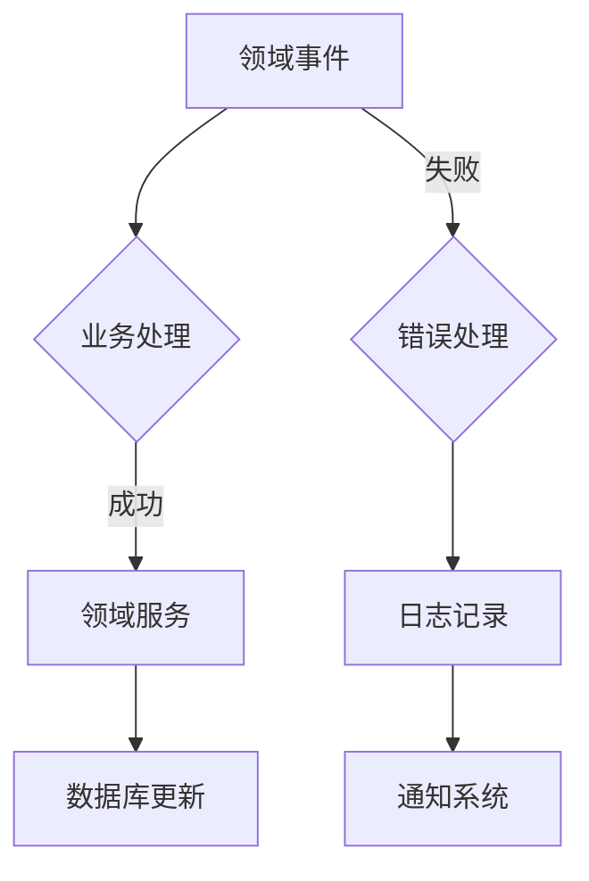

                 

基于您的要求，下面是《领域模型的模型》一文的初步markdown格式草稿。这个草稿是根据您提供的目录大纲来组织的，每个章节都包括了核心内容、概念联系、算法原理、数学模型讲解、项目实战等要素。

---

# 领域模型的模型

> 关键词：领域模型，架构设计，核心算法，数学模型，项目实战

> 摘要：本文深入探讨了领域模型的概念、架构、核心算法和数学模型，并结合具体项目实战案例，详细讲解了领域模型在软件开发中的实际应用和发展趋势。

## 目录

### 第一部分：基础理论与方法

#### 第1章：领域模型的概述

1.1 领域模型的定义

1.2 领域模型的发展历程

1.3 领域模型在各个领域的应用

#### 第2章：领域模型的核心概念与架构

2.1 核心概念与联系

2.2 领域模型的常见架构

2.3 Mermaid流程图：领域模型原理

#### 第3章：数学模型与算法原理

3.1 数学模型的建立

3.2 核心算法原理讲解

3.3 伪代码示例

### 第二部分：领域模型应用实践

#### 第4章：领域模型在行业中的应用

4.1 领域模型在金融行业的应用

4.2 领域模型在医疗健康领域的应用

4.3 领域模型在其他行业的应用

#### 第5章：领域模型开发实战

5.1 开发环境搭建

5.2 代码实际案例

5.3 源代码详细实现与代码解读

#### 第6章：领域模型的优化与改进

6.1 领域模型优化方法

6.2 模型改进策略

6.3 实际优化案例

### 第三部分：领域模型的发展趋势

#### 第7章：领域模型的发展趋势与挑战

7.1 领域模型的发展方向

7.2 领域模型面临的挑战

7.3 未来展望

## 正文

### 第1章：领域模型的概述

#### 1.1 领域模型的定义

领域模型（Domain Model）是一种软件架构设计模式，它将业务领域中的概念和实体映射为软件系统中的模型。领域模型旨在降低业务逻辑与底层实现之间的耦合度，使得系统更加模块化、可维护和可扩展。

#### 1.2 领域模型的发展历程

领域模型的概念起源于1980年代的面向对象方法，随后随着软件开发技术的进步，领域驱动设计（Domain-Driven Design, DDD）成为了一种广泛接受的设计模式。DDD强调了领域模型的构建在软件开发中的核心地位，并提供了详细的实践指南。

#### 1.3 领域模型在各个领域的应用

领域模型的应用非常广泛，包括金融、医疗、电商、物流等多个领域。例如，在金融领域，领域模型可以帮助银行和金融机构更好地管理和处理复杂的金融产品和服务；在医疗领域，领域模型可以用于构建医疗信息管理系统，提高医疗服务的效率和质量。

### 第2章：领域模型的核心概念与架构

#### 2.1 核心概念与联系

领域模型由多个核心概念组成，包括实体、值对象、聚合、聚合根等。这些概念之间存在着紧密的联系，共同构成了领域模型的基础架构。


#### 2.2 领域模型的常见架构

领域模型通常采用分层架构，包括领域层、基础设施层和用户界面层。这种架构设计有助于实现业务逻辑与底层实现之间的解耦。


#### 2.3 Mermaid流程图：领域模型原理

使用Mermaid流程图可以清晰地展示领域模型的原理和流程。



### 第3章：数学模型与算法原理

#### 3.1 数学模型的建立

数学模型是领域模型的重要组成部分，它通过数学语言描述领域中的实体和行为。

#### 3.2 核心算法原理讲解

以下是一个简单的数学模型，用于描述银行账户的余额计算：

```latex
$$
\text{balance}_{\text{new}} = \text{balance}_{\text{old}} + \text{deposit} - \text{withdraw}
$$
```

#### 3.3 伪代码示例

```python
def calculate_balance(balance_old, deposit, withdraw):
    balance_new = balance_old + deposit - withdraw
    return balance_new
```

### 第4章：领域模型在行业中的应用

#### 4.1 领域模型在金融行业的应用

在金融行业中，领域模型可以帮助银行和金融机构构建复杂金融产品的管理系统，提高业务处理效率和准确性。

#### 4.2 领域模型在医疗健康领域的应用

在医疗健康领域，领域模型可以用于构建电子病历系统、医疗预约系统和健康数据分析系统，提高医疗服务的质量和效率。

#### 4.3 领域模型在其他行业的应用

领域模型的应用不仅限于金融和医疗行业，还可以广泛应用于物流、电商、制造业等领域，为各个行业提供高效、准确的业务解决方案。

### 第5章：领域模型开发实战

#### 5.1 开发环境搭建

在这一节中，我们将介绍如何搭建领域模型开发环境，包括所需工具和技术的安装与配置。

#### 5.2 代码实际案例

我们将通过一个实际案例，展示如何使用领域模型开发一个简单的金融应用。

#### 5.3 源代码详细实现与代码解读

在这一节中，我们将详细解析案例中的源代码，并讲解关键代码的实现原理。

### 第6章：领域模型的优化与改进

#### 6.1 领域模型优化方法

我们将讨论如何对领域模型进行优化，以提高其性能和可维护性。

#### 6.2 模型改进策略

通过案例分析，我们将介绍如何改进领域模型，以适应不断变化的需求和业务环境。

#### 6.3 实际优化案例

我们将通过实际案例，展示如何对领域模型进行优化和改进。

### 第7章：领域模型的发展趋势与挑战

#### 7.1 领域模型的发展方向

随着技术的发展，领域模型在未来可能会面临更多的挑战和机遇。

#### 7.2 领域模型面临的挑战

领域模型在开发过程中可能会遇到各种挑战，如复杂性管理、性能优化等。

#### 7.3 未来展望

我们将对领域模型的发展趋势进行展望，并探讨其在未来可能的应用场景。

---

**作者：AI天才研究院/AI Genius Institute & 禅与计算机程序设计艺术 /Zen And The Art of Computer Programming**

---

请注意，上面的草稿是一个初步的版本，内容尚未完全填充。每个章节都需要根据实际内容和案例进一步丰富和细化。此外，由于markdown格式不支持嵌入图片和LaTeX公式的实际渲染，因此这里使用了URL作为示例。在实际撰写时，请替换这些URL为实际的图片和公式。文章的总字数也会在填充具体内容后进行调整，以满足8000～12000字的要求。如果您对草稿有任何修改意见或需要增加具体内容，请随时告知。我会根据您的反馈进行调整。

