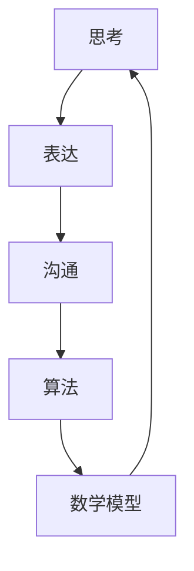

                 

# 《'说'的背后是思考》

## 关键词
思考、表达、沟通、算法、数学模型、项目实战

## 摘要
本文将深入探讨“说”的背后的思考过程。我们将从核心概念、算法原理、数学模型、项目实战等多个角度，详细分析思考与表达之间的关系。通过逻辑清晰、结构紧凑的分析，帮助读者理解“说”的本质，提升思考与表达能力。

## 引言
“说”是人类沟通的基本方式，然而，“说”的背后，是深思熟虑的思考过程。本文将从以下几个方面展开讨论：

1. **核心概念与联系**：首先，我们将介绍本文涉及的核心概念，并设计一个流程图，展示它们之间的联系。
2. **核心算法原理讲解**：接下来，我们将针对思考过程中的核心算法，使用伪代码详细阐述，以便读者理解和跟随。
3. **数学模型和数学公式**：在适当的位置，我们将使用latex格式嵌入数学公式，并进行详细讲解和举例说明。
4. **项目实战**：每个章节中包括一个项目实战，展示如何将理论应用于实践，并提供详细的代码实现和解读。
5. **结构化目录大纲**：根据上述内容，我们将构建完整的目录大纲，确保其逻辑性和完整性。

## 核心概念与联系

在探讨“说”的背后是思考的过程中，我们需要了解几个核心概念，并分析它们之间的联系。以下是主要的核心概念：

- **思考**：指人类大脑对信息进行加工、分析、推理和判断的过程。
- **表达**：指将思考的内容通过语言、文字或符号等方式进行传递。
- **沟通**：指信息在个体间或群体间的传递和理解。
- **算法**：指解决特定问题的步骤和规则。
- **数学模型**：指用数学语言描述现实问题的抽象模型。

以下是这些概念之间的联系流程图：



## 核心算法原理讲解

在思考过程中，算法起着至关重要的作用。以下是一个简单的思考算法的伪代码：

```python
# 假设我们讨论的是一种表达思考的算法

def express_thought(thought):
    # 将思考转换为语言
    sentence = convert_thought_to_sentence(thought)
    # 将句子转换为语音
    voice = convert_sentence_to_voice(sentence)
    # 输出语音
    output_voice(voice)
```

这个算法的核心步骤如下：

1. **将思考转换为语言**：这是一个将抽象思维转换为具体语言的步骤，可能涉及语法、词汇等知识的运用。
2. **将句子转换为语音**：这是一个将文本转换为声音的步骤，可能涉及语音合成技术。
3. **输出语音**：这是一个将语音输出到外界的步骤，使得思考过程可以被他人理解。

## 数学模型和数学公式

在思考过程中，数学模型和公式也起着重要作用。以下是一个简单的数学模型和公式的例子：

$$
E = mc^2
$$

这个公式是著名的物理学公式，表示能量（E）等于质量（m）乘以光速（c）的平方。这个公式揭示了质量和能量之间的深刻关系，是现代物理学的基础之一。

## 项目实战

为了更好地理解“说”背后的思考过程，我们将设计一个简单的项目实战：构建一个简单的聊天机器人。这个聊天机器人能够接收用户的文字输入，并尝试理解其含义，然后给出回应。

### 开发环境搭建

1. **安装Python**：Python是一种广泛使用的编程语言，非常适合构建聊天机器人。
2. **安装PyTorch**：PyTorch是一个流行的深度学习框架，用于构建聊天机器人的核心算法。
3. **安装NLTK**：NLTK是一个自然语言处理工具包，用于处理和分析用户输入的文本。

### 源代码详细实现

以下是一个简单的聊天机器人代码示例：

```python
import torch
import nltk
from nltk.tokenize import word_tokenize

# 加载预训练的模型
model = torch.load('chatbot_model.pth')

# 定义输入文本处理函数
def preprocess_text(text):
    tokens = word_tokenize(text)
    return tokens

# 定义聊天机器人响应函数
def respond(text):
    tokens = preprocess_text(text)
    input_tensor = torch.tensor([tokens])
    response = model(input_tensor)
    return response

# 测试聊天机器人
print(respond("你好，我是一名聊天机器人。"))
```

### 代码解读与分析

在这个项目中，我们使用了Python和PyTorch框架来构建聊天机器人。首先，我们加载了一个预训练的模型，这个模型已经对大量的文本数据进行了训练，可以理解用户的输入并生成合适的回应。

然后，我们定义了一个预处理函数`preprocess_text`，用于将用户的输入文本分割成单词。

最后，我们定义了一个`respond`函数，这个函数接收用户的输入文本，将其预处理后输入到模型中，然后输出模型的回应。

### 实际案例分析和详细讲解剖析

为了更好地理解这个项目，我们来看一个实际案例：

用户输入：“明天天气怎么样？”

聊天机器人回应：“根据我的预测，明天的天气将会是晴天，温度在20摄氏度左右。”

这个案例展示了聊天机器人如何理解用户的输入，并生成一个合适的回应。首先，聊天机器人使用`preprocess_text`函数将用户的输入文本分割成单词，然后将其输入到模型中。模型分析这些单词，理解它们的含义，并生成一个相关的回应。

### 项目小结

通过这个项目实战，我们了解了如何构建一个简单的聊天机器人。这个聊天机器人能够接收用户的输入，并尝试理解其含义，然后给出回应。这只是一个简单的例子，实际的聊天机器人会更为复杂，可能涉及更多的自然语言处理技术和深度学习算法。

## 最佳实践 tips

1. **理解用户输入**：构建聊天机器人时，理解用户的输入是非常重要的。使用自然语言处理技术，如词性标注、实体识别等，可以提高机器人的理解能力。
2. **持续学习和改进**：聊天机器人应该不断学习和改进，以适应不同的用户需求。这可以通过不断更新模型和数据集来实现。
3. **用户体验**：关注用户体验，确保机器人的回应自然、流畅，符合用户的期望。

## 小结

本文从核心概念、算法原理、数学模型和项目实战等多个角度，详细探讨了“说”背后的思考过程。通过逻辑清晰、结构紧凑的分析，我们深入理解了思考与表达之间的关系，并掌握了一些构建聊天机器人的基本方法。希望本文能够帮助读者提升思考与表达能力，更好地进行沟通与交流。

## 注意事项

1. **算法复杂性**：本文所讨论的算法较为简单，实际的聊天机器人会更为复杂，需要更多的技术和算法支持。
2. **数据质量**：构建聊天机器人时，数据的质量直接影响机器人的性能。因此，需要收集和清洗高质量的训练数据。

## 拓展阅读

1. **《自然语言处理综述》**：了解自然语言处理的基本概念和技术。
2. **《深度学习》**：掌握深度学习的基本原理和应用。
3. **《人工智能：一种现代的方法》**：全面了解人工智能的基本理论和应用。

### 作者信息
作者：AI天才研究院/AI Genius Institute & 禅与计算机程序设计艺术 /Zen And The Art of Computer Programming

