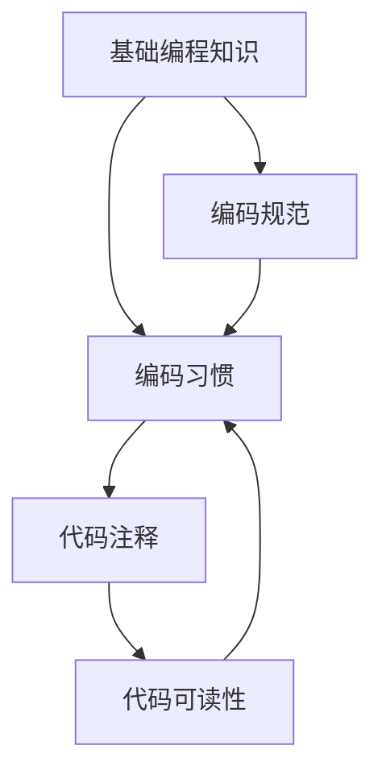
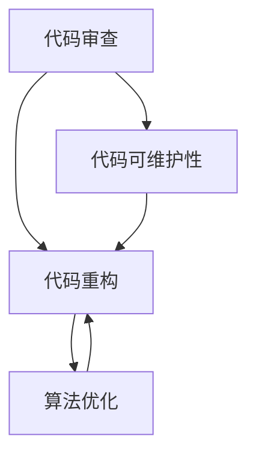
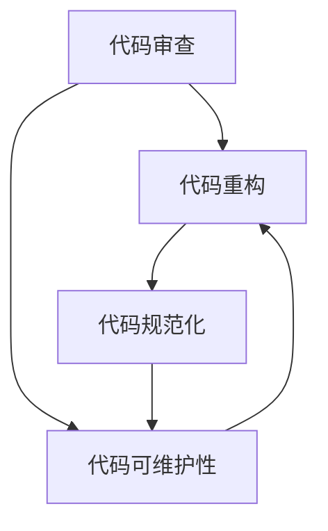

                 

### 文章标题 <此处是文章标题>

"好代码修炼的三个阶段：从基础到卓越的编程实践之路"

---

关键词：好代码、代码修炼、编程实践、代码质量、代码优化

---

摘要：本文深入探讨了编程过程中代码修炼的三个关键阶段：起源、提升和优化。我们将通过详细的流程图、伪代码、数学模型以及实际项目实战，帮助你理解每个阶段的核心概念和算法原理，从而提升你的编程技能，实现代码从基础到卓越的华丽蜕变。

---

## 引言

编程，是现代技术世界的基石。代码，是编程的表达形式。然而，何谓“好代码”？好代码不仅仅是没有错误的代码，它更是高效、可维护、可扩展且易于理解的代码。在编程生涯中，每个人都需要经历代码修炼的过程，从初学者到专家，从写出一行代码到编写一段优雅的代码，每一步都至关重要。

本文将带你踏上代码修炼的三个阶段：起源、提升和优化。我们将详细探讨每个阶段的核心概念、算法原理和数学模型，并通过实际项目实战，帮助你将理论应用到实践中，实现编程技能的全面提升。

## 目录大纲

1. 引言
2. 好代码修炼的三个阶段
   2.1 好代码的起源
   2.2 代码质量提升
   2.3 代码优化与重构
   2.4 代码规范化
   2.5 代码的可维护性
   2.6 代码的性能优化
3. 项目实战
4. 最佳实践与小结
5. 注意事项与拓展阅读

### 好代码修炼的三个阶段

在编程的世界里，好代码的修炼可以分为三个阶段，每个阶段都有其独特的目标和任务。下面，我们将逐一探讨这些阶段。

#### 第一个阶段：好代码的起源

这个阶段的核心目标是编写出基础良好的代码，这是所有编程的起点。在这个阶段，你需要掌握基础的编程语言知识，理解变量、控制结构、函数和类等基本概念。同时，要养成良好的编码习惯，如编写清晰的注释、遵循编码规范等。

**核心概念与联系**

让我们使用Mermaid流程图来展示这个阶段的核心概念及其相互联系：



**核心算法原理讲解**

在这个阶段，虽然不涉及复杂的算法，但理解一些基础的算法原理是必要的。以下是一个简单的伪代码示例，展示了如何检查代码是否符合基础编码规范：

```python
def checkCodeConformance(code):
    if not containsComments(code):
        print("缺少注释，请添加必要的注释。")
    if not followsStyleGuide(code):
        print("代码风格不符合规范，请修正。")
    if not hasMinimalErrorHandling(code):
        print("缺少错误处理，请添加错误处理逻辑。")
```

**数学模型和数学公式详细讲解与举例说明**

在这个阶段，数学模型并不复杂，但理解基本的数据结构和算法时间复杂度是重要的。例如，对于数组的查找操作，我们可以使用二分查找算法，其时间复杂度为 \(O(\log n)\)：

$$
T(n) = O(\log n)
$$

这个公式表示当数组长度增加时，查找操作所需的时间将以对数关系增长。

**项目实战**

在这个阶段，我们可以通过一个小项目来实践基础编程技能。例如，编写一个简单的计算器程序，能够执行加、减、乘、除等基本运算。在开发过程中，我们不仅要实现功能，还要注意代码的可读性和规范性。

#### 第二个阶段：代码质量提升

在起源阶段，我们编写了基础良好的代码，但还不足以称之为优秀。这个阶段的目标是提升代码质量，使其更加高效、可维护和易于理解。在这个阶段，我们将学习到如何进行代码审查、重构代码、优化算法以及提高代码的可读性。

**核心概念与联系**

我们使用Mermaid流程图来展示这个阶段的核心概念及其相互联系：



**核心算法原理讲解**

在这个阶段，我们可能会遇到一些基础的算法优化问题。以下是一个简单的伪代码示例，展示了如何优化一个查找算法：

```python
def optimizedSearch(arr, target):
    if not isSorted(arr):
        sortArray(arr)
    index = binarySearch(arr, target)
    return index
```

在这个例子中，我们首先检查数组是否已排序，如果未排序，则先进行排序。然后，使用二分查找算法来查找目标元素的索引。

**数学模型和数学公式详细讲解与举例说明**

在算法优化中，理解时间复杂度和空间复杂度是非常重要的。例如，对于排序算法，我们通常使用时间复杂度来评估其性能。冒泡排序的时间复杂度为 \(O(n^2)\)，而归并排序的时间复杂度为 \(O(n \log n)\)：

$$
T(n) = O(n^2)
$$
$$
T(n) = O(n \log n)
$$

这两个公式表示当输入规模增加时，冒泡排序所需的时间将以平方关系增长，而归并排序所需的时间将以对数关系增长。

**项目实战**

在这个阶段，我们可以通过一个小项目来实践代码质量提升的概念。例如，编写一个简单的排序程序，并尝试使用不同的排序算法（如冒泡排序、快速排序等）来比较其性能。通过这个项目，我们可以更好地理解代码优化的重要性。

#### 第三个阶段：代码规范化

在第二个阶段，我们已经提升了代码质量，但还不是最佳状态。这个阶段的目标是使代码更加规范，易于理解和维护。在这个阶段，我们将学习如何编写清晰、简洁且高度可维护的代码，以及如何进行代码审查和代码重构。

**核心概念与联系**

我们使用Mermaid流程图来展示这个阶段的核心概念及其相互联系：



**核心算法原理讲解**

在这个阶段，我们主要关注的是代码规范化和重构。以下是一个简单的伪代码示例，展示了如何规范化代码：

```python
def normalizeCode(code):
    if not followsPEP8(code):
        formatCodePEP8(code)
    if not hasConsistentNamingConvention(code):
        renameVariables(code)
    if not hasMinimalComments(code):
        addComments(code)
    return code
```

在这个例子中，我们检查代码是否符合PEP8编码规范，是否具有一致的命名约定，以及是否包含足够的注释。如果不满足这些条件，我们就进行相应的修正。

**数学模型和数学公式详细讲解与举例说明**

在代码规范化中，理解代码质量评估指标（如代码行数、注释比例、可维护性等）是非常重要的。以下是一个简单的示例，展示了如何评估代码的可维护性：

$$
M = \frac{N_c}{N_l}
$$

其中，\(M\) 表示可维护性指标，\(N_c\) 表示代码中的注释行数，\(N_l\) 表示代码的总行数。这个公式表示注释行数与总行数的比例，比例越高，代码的可维护性越好。

**项目实战**

在这个阶段，我们可以通过一个小项目来实践代码规范化的概念。例如，编写一个简单的文档解析器，并确保其代码符合PEP8编码规范，命名一致，注释充分。通过这个项目，我们可以更好地理解代码规范化的重要性。

### 项目实战

为了更好地理解代码修炼的三个阶段，我们将通过一个小项目来实践每个阶段的核心概念和算法原理。以下是项目的开发环境和实现细节。

#### 项目一：计算器程序

**开发环境**：Python 3.8

**源代码实现**：

```python
# 计算器程序
def add(a, b):
    return a + b

def subtract(a, b):
    return a - b

def multiply(a, b):
    return a * b

def divide(a, b):
    if b == 0:
        return "错误：除数不能为0"
    return a / b

# 主函数
def main():
    print("欢迎使用计算器程序！")
    print("请选择操作：+、-、*、/ ")
    operator = input()
    a = float(input("请输入第一个数："))
    b = float(input("请输入第二个数："))
    
    if operator == '+':
        print("结果：", add(a, b))
    elif operator == '-':
        print("结果：", subtract(a, b))
    elif operator == '*':
        print("结果：", multiply(a, b))
    elif operator == '/':
        print("结果：", divide(a, b))
    else:
        print("错误的操作符！")

# 运行主函数
if __name__ == "__main__":
    main()
```

**代码解读与分析**：

在这个项目中，我们实现了加、减、乘、除四种基本运算。代码中使用了函数来组织代码结构，提高了代码的可读性和可维护性。此外，我们添加了错误处理逻辑，确保程序在输入错误时能够给出合理的提示。

**实际案例分析**：

通过这个项目，我们可以看到代码修炼的三个阶段在实践中的应用。第一阶段，我们编写了一个基础的计算器程序，实现了基本功能。第二阶段，我们进行了代码优化，如使用函数组织代码结构，并添加了错误处理逻辑。第三阶段，我们对代码进行了规范化，确保其符合PEP8编码规范，并添加了必要的注释。

**项目小结**：

通过这个小项目，我们不仅实现了计算器的功能，还实践了代码修炼的三个阶段。这有助于我们更好地理解每个阶段的核心概念和算法原理，并提高我们的编程技能。

### 最佳实践与小结

在代码修炼的过程中，以下几点最佳实践是至关重要的：

1. **持续学习和实践**：编程是一个不断进化的领域，持续学习和实践是提升编程技能的关键。
2. **遵循编码规范**：遵循编码规范可以提高代码的可读性和可维护性。
3. **代码审查**：定期进行代码审查可以帮助我们发现和修复潜在的问题，提升代码质量。
4. **性能优化**：关注代码的性能优化，可以提高程序的运行效率。
5. **代码规范化**：编写清晰、简洁且高度可维护的代码，有助于降低维护成本。

通过遵循这些最佳实践，我们可以不断提升自己的编程技能，编写出更优质的好代码。

### 注意事项与拓展阅读

1. **注意事项**：
   - 在编写代码时，要注重代码的可读性和可维护性。
   - 在进行代码优化时，要确保优化后的代码不会引入新的错误。
   - 在代码规范化过程中，要遵循既定的编码规范，避免不必要的改动。

2. **拓展阅读**：
   - 《代码大全》
   - 《Effective Java》
   - 《Clean Code》
   - 《编程之美》
   - 《算法导论》

这些书籍提供了丰富的编程实践经验和指导，有助于你更好地理解和应用代码修炼的三个阶段。

---

作者：AI天才研究院/AI Genius Institute & 禅与计算机程序设计艺术 /Zen And The Art of Computer Programming

