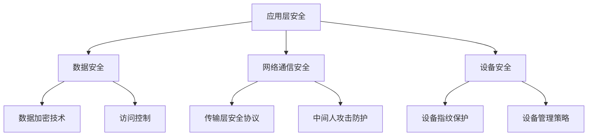
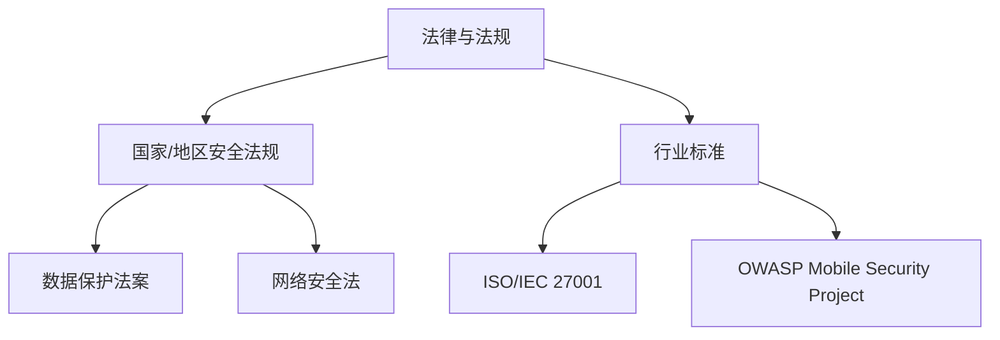

                 

### 文章标题

# 移动应用安全开发指南

> 关键词：移动应用安全、加密技术、权限管理、网络安全、中间人攻击防护、安全测试、案例分析

> 摘要：本文旨在为移动应用开发者提供一套全面的安全开发指南，涵盖从基础知识到高级技术，从理论到实践，帮助开发者构建安全可靠的移动应用。本文将逐步介绍移动应用安全的核心概念、开发技术、案例分析以及最佳实践。

## 第一部分：移动应用安全开发基础

### 第1章：移动应用安全概述

#### 1.1 移动应用安全的定义与重要性

移动应用安全是指保护移动应用及其数据在开发和部署过程中不受恶意攻击和未经授权访问的措施。随着移动设备的普及，移动应用已经成为人们日常生活中不可或缺的一部分，其安全问题变得尤为重要。移动应用安全的重要性主要体现在以下几个方面：

1. **数据保护**：移动应用经常涉及用户隐私数据，如个人身份信息、金融信息等。确保这些数据的安全是移动应用安全的首要任务。

2. **应用程序完整性**：防止应用程序被篡改或恶意软件感染，确保用户下载的应用程序是可信的。

3. **用户信任**：一个安全的应用程序能够增强用户对品牌的信任，减少用户流失。

4. **合规要求**：遵循相关的法律法规和行业标准，如GDPR、ISO/IEC 27001等，是移动应用安全的重要组成部分。

#### 1.2 移动应用安全的核心概念与联系

移动应用安全涉及多个层面的技术，这些技术相互关联，共同构成了一个完整的安全体系。以下是几个关键概念及其相互关系：

1. **应用层安全**：涉及应用代码的安全性，包括安全编码、漏洞修复等。

2. **数据安全**：涉及数据的加密、存储和保护，确保数据在整个生命周期中的安全。

3. **网络通信安全**：涉及数据在网络传输过程中的保护，防止中间人攻击等。

4. **设备安全**：涉及移动设备的物理和软件安全，包括设备锁定、恶意软件防护等。

以下是一个简化的移动应用安全架构图，展示了这些核心概念及其联系：



#### 1.3 移动应用安全的法律与标准

移动应用安全不仅涉及技术方面，还涉及法律和标准。以下是几个关键方面：

1. **安全法规概述**：了解各个国家和地区的安全法规，如GDPR、CCPA等。

2. **行业标准**：参考行业内的最佳实践，如OWASP Mobile Security Project、ISO/IEC 27001等。

3. **合规流程**：建立合规流程，确保应用开发、部署和运维过程中符合相关法规和标准。

以下是一个简化的合规流程图：



#### 1.4 移动应用安全的发展趋势

移动应用安全领域持续发展，新的威胁和攻击手段不断涌现。以下是当前移动应用安全的发展趋势：

1. **安全威胁分析**：深入了解最新的安全威胁，如高级持续性威胁（APT）、勒索软件等。

2. **未来安全技术的发展方向**：探索区块链、人工智能等新兴技术在移动应用安全领域的应用。

### 第2章：移动应用安全开发技术

#### 2.1 加密技术

加密技术是移动应用安全的核心技术之一。以下是对几种常见加密技术的介绍：

1. **对称加密与非对称加密**：对称加密速度快，但密钥管理复杂；非对称加密安全但速度慢。

2. **数据加密技术**：包括全盘加密、文件加密、数据库加密等。

3. **访问控制**：确保只有授权用户可以访问加密数据。

以下是对称加密算法AES的伪代码实现：

```python
# Pseudo-code for AES encryption
def AES_encrypt(plaintext, key):
    # Initialize the AES cipher
    cipher = AES.new(key, AES.MODE_EAX)
    
    # Encrypt the plaintext
    ciphertext, tag = cipher.encrypt_and_digest(plaintext)
    
    return ciphertext, tag
```

#### 2.2 权限管理系统

移动设备上的权限管理系统对于应用安全至关重要。以下是Android和iOS的权限管理系统简介：

1. **Android权限管理系统**：基于AndroidManifest.xml文件定义权限。

2. **iOS权限管理系统**：通过Info.plist文件配置权限。

权限滥用风险与防范措施包括：

1. **最小权限原则**：应用程序应仅请求必要权限。

2. **动态权限请求**：在应用实际需要时请求权限，而不是一开始就请求所有权限。

#### 2.3 网络安全

网络安全是移动应用安全的重要组成部分。以下是对HTTPS协议和网络安全技术的介绍：

1. **HTTPS协议的工作原理**：HTTP协议的加密版，通过SSL/TLS协议提供数据传输加密。

2. **传输层安全协议**：如SSL、TLS，用于确保数据在网络传输过程中的安全。

3. **中间人攻击防护**：防止中间人攻击的技术手段，如HTTPS、VPN等。

以下是对HTTPS连接建立过程的伪代码：

```python
# Pseudo-code for establishing an HTTPS connection
def establish_https_connection(url, port, ca_cert):
    # Create a context with the CA certificate
    context = ssl._create_unverified_context()

    # Connect to the server using the HTTPS protocol
    with socket.create_connection((url, port)) as sock:
        with context.wrap_socket(sock, server_hostname=url) as ssock:
            # Send an HTTPS request
            request = "GET / HTTP/1.1\r\nHost: " + url + "\r\n\r\n"
            ssock.sendall(request)
```

#### 2.4 防护中间人攻击

中间人攻击（MITM）是一种常见的网络安全攻击。以下是防止中间人攻击的技术手段：

1. **HTTPS**：使用HTTPS协议确保数据传输加密。

2. **VPN**：通过虚拟专用网络（VPN）隐藏数据传输路径。

3. **数字证书**：使用可信的数字证书确保通信双方的认证。

#### 2.5 安全测试与评估

安全测试与评估是确保移动应用安全的关键步骤。以下是几种常见的安全测试方法：

1. **漏洞扫描工具**：如Nessus、Burp Suite等。

2. **代码审计**：手动或自动检查代码中的安全漏洞。

3. **渗透测试**：模拟攻击者对应用进行攻击测试。

#### 2.6 应用安全开发最佳实践

应用安全开发最佳实践包括以下方面：

1. **安全开发周期**：在应用程序的开发周期中，始终关注安全。

2. **安全编码规范**：遵循安全编码规范，减少安全漏洞。

3. **持续安全培训**：定期为开发团队提供安全培训。

### 第3章：移动应用安全案例分析

#### 3.1 案例分析1：知名移动应用的安全漏洞

在本节中，我们将分析一个知名移动应用的安全漏洞，探讨漏洞的背景、原因、影响以及修复措施。

#### 3.2 案例分析2：移动应用的安全事件

在本节中，我们将分析一个移动应用的安全事件，探讨事件的影响、处理过程以及应对策略。

### 第4章：移动应用安全最佳实践

在本章中，我们将总结移动应用安全开发的最佳实践，包括开发环境搭建、源代码管理、安全测试和部署等。

## 总结与展望

本文介绍了移动应用安全开发的基础知识、核心技术、案例分析以及最佳实践。通过本文，读者可以系统地了解移动应用安全，掌握安全开发的技能。随着移动应用的发展，安全威胁也在不断演变，开发者需要持续关注安全领域的新动态，不断提升自身的安全能力。

### 作者信息

作者：AI天才研究院/AI Genius Institute & 禅与计算机程序设计艺术 /Zen And The Art of Computer Programming

### 拓展阅读

1. **《移动应用安全：原理、实践与案例》**：详细探讨移动应用安全的理论和实践。
2. **《移动应用安全测试与评估》**：介绍移动应用安全测试的方法和工具。
3. **《移动应用安全开发指南》**：提供全面的移动应用安全开发指导。

