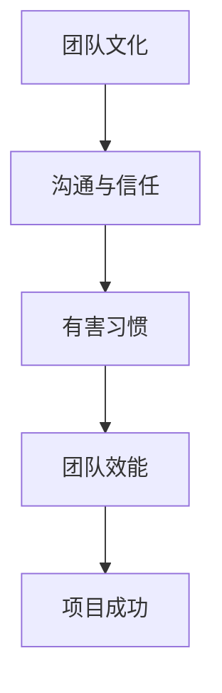

                 

### 文章标题

# 《让团队跌份的坏习惯》

### 文章关键词

- 团队文化
- 有害习惯
- 领导力
- 效能提升
- 团队协作

### 文章摘要

在当今快速变化的技术环境中，团队的成功不仅仅依赖于技术实力，更取决于团队文化和成员之间的协作。然而，一些常见的有害习惯可能正在侵蚀团队的效能，导致项目延期、沟通不畅和员工士气低落。本文将深入探讨这些坏习惯，分析它们对团队的影响，并提供具体的解决方案和最佳实践，帮助团队领导者和成员识别并改正这些有害行为，从而提升整体团队绩效。

### 目录

1. **引言**
   - **背景介绍**
   - **核心概念与联系**

2. **常见的有害习惯**
   - **缺乏沟通**
   - **缺乏信任**
   - **推诿责任**
   - **缺乏目标一致性**

3. **这些习惯的负面影响**
   - **沟通不畅**
   - **信任危机**
   - **士气低落**
   - **效能下降**

4. **如何识别和改正有害习惯**
   - **自我反思**
   - **建立反馈机制**
   - **团队培训**

5. **实际案例研究**
   - **案例一：缺乏沟通的团队**
   - **案例二：缺乏信任的团队**

6. **行动指南**
   - **逐步改善团队文化**
   - **建立一个健康的团队环境**

7. **总结与建议**
   - **核心内容回顾**
   - **最佳实践**

### 文章正文

#### 引言

在当今快速发展的科技行业，团队的协同工作是实现项目成功的关键。然而，团队并非总是运作顺畅。实际上，许多团队面临诸多挑战，其中一些常见的问题可能源于一些有害的习惯。这些习惯不仅影响了团队的整体表现，还可能导致项目延误、沟通失败和团队士气低落。因此，识别并改正这些有害习惯对于提升团队效能至关重要。

本文将探讨一些常见的有害习惯，分析它们对团队的影响，并提供具体的解决方案和最佳实践。通过深入了解这些问题，团队领导者和成员可以共同努力，打造一个更高效、更和谐的团队环境。

#### 核心概念与联系

在讨论这些有害习惯之前，我们需要先了解一些核心概念。首先，团队文化是指团队内部共同遵循的价值观、信仰和行为准则。一个健康的团队文化能够促进成员之间的沟通、信任和合作，从而提高团队的整体效能。其次，有害习惯是指在团队中普遍存在的、对团队表现产生负面影响的个人行为。

为了更好地理解这些概念之间的关系，我们可以使用Mermaid流程图来展示团队文化、有害习惯和团队效能之间的联系。

从流程图中可以看出，团队文化是团队效能的基础，而有害习惯则是团队文化中的隐患，可能对项目成功产生负面影响。

#### 常见的有害习惯

在团队中，一些常见的有害习惯可能正在悄悄地侵蚀团队的效能。以下是一些主要的有害习惯：

##### 缺乏沟通

缺乏沟通是团队中最为普遍的问题之一。当团队成员之间缺乏有效的沟通时，可能会导致误解、冲突和项目延误。沟通不畅不仅会影响团队成员之间的协作，还可能影响他们对项目的理解和目标。

##### 缺乏信任

缺乏信任是团队合作的致命伤。当团队成员之间不信任时，他们可能会避免分享信息或提供帮助，从而降低团队的效率。缺乏信任还可能导致团队成员之间的敌对情绪，进一步损害团队的合作氛围。

##### 推诿责任

推诿责任是指团队成员在面对问题时，不愿意承担责任，而是将责任推卸给他人。这种行为不仅会影响团队成员的士气，还可能导致项目进度延误和整体效能下降。

##### 缺乏目标一致性

当团队成员没有共同的目标时，他们可能会在各自的路径上前进，导致团队整体的效率降低。缺乏目标一致性可能会导致团队成员之间的矛盾和冲突，从而影响团队的表现。

#### 这些习惯的负面影响

这些有害习惯对团队的负面影响是多方面的。以下是其中的一些主要影响：

##### 沟通不畅

缺乏沟通会导致团队成员之间的误解和冲突，从而影响团队的协作效率。团队成员可能会在错误的方向上工作，导致项目进度延误。

##### 信任危机

缺乏信任会导致团队成员不愿意分享信息或提供帮助，从而降低团队的效率。团队成员之间的敌对情绪也会进一步损害团队的合作氛围。

##### 士气低落

推诿责任和缺乏目标一致性会导致团队成员的士气低落，从而影响他们的工作动力。低落的士气可能会降低团队成员的创造力和解决问题的能力。

##### 效能下降

这些有害习惯最终会导致团队的整体效能下降。项目可能会延误，质量也可能受到影响。长期来看，这可能会损害团队的整体声誉。

#### 如何识别和改正有害习惯

为了识别和改正有害习惯，团队领导者和成员可以采取以下措施：

##### 自我反思

团队领导者和成员可以通过自我反思来识别自己是否有这些有害习惯。自我反思可以帮助他们了解自己的行为对团队的影响，并采取相应的改进措施。

##### 建立反馈机制

团队领导者和成员可以建立反馈机制，以便及时识别和改正有害习惯。反馈机制可以包括定期的团队会议、匿名调查和开放讨论等。

##### 团队培训

团队领导者和成员可以通过团队培训来提高他们的沟通技巧、信任意识和责任感。培训可以包括研讨会、工作坊和模拟练习等。

#### 实际案例研究

##### 案例一：缺乏沟通的团队

在一个开发团队中，由于沟通不畅，导致项目进度延误。团队成员经常在没有充分沟通的情况下开始各自的工作，导致最终的工作结果不一致。为了解决这个问题，团队领导决定引入每日站立会议，并要求团队成员在会议中分享他们的进展和问题。通过这种方式，团队成员之间的沟通得到了改善，项目进度也恢复正常。

##### 案例二：缺乏信任的团队

在一个IT咨询团队中，由于缺乏信任，团队成员之间的合作效率低下。一些成员担心自己的工作成果会被其他人窃取，因此不愿意分享信息或提供帮助。为了解决这个问题，团队领导组织了一次信任建设活动，包括团队合作游戏和角色扮演。通过这些活动，团队成员之间的信任得到了加强，团队的协作效率也得到了显著提高。

#### 行动指南

为了改善团队文化，团队领导者和成员可以采取以下行动：

##### 逐步改善团队文化

团队文化不是一蹴而就的，需要通过一系列的小步骤来逐步改善。领导者和成员可以共同制定一个文化改进计划，并逐步实施。

##### 建立一个健康的团队环境

建立一个健康的团队环境对于团队文化的改善至关重要。领导者和成员可以共同制定一些行为准则，并鼓励团队成员遵守。

#### 总结与建议

通过本文的讨论，我们可以看到，有害习惯对团队的效能产生了巨大的负面影响。为了改善团队文化，团队领导者和成员需要共同努力，识别并改正这些有害习惯。通过自我反思、建立反馈机制和团队培训，团队可以逐步改善其文化，提高整体效能。

对于团队领导者和成员，以下是一些最佳实践：

- **持续沟通**：保持开放和诚实的沟通，确保团队成员之间的信息流通。
- **建立信任**：通过团队合作活动和定期反馈，加强团队成员之间的信任。
- **承担责任**：鼓励团队成员对自己的工作负责，并共同承担团队的成功与失败。
- **明确目标**：确保团队成员对项目的目标和预期有共同的理解。

总之，改善团队文化是一个持续的过程，需要每个成员的积极参与和努力。通过共同努力，团队可以克服有害习惯，打造一个高效、和谐的团队环境。

#### 结语

作为团队领导者和成员，我们都有责任识别并改正那些有害的习惯，从而提升团队的整体效能。通过本文的讨论，我们深入了解了这些有害习惯对团队的负面影响，并提出了具体的解决方案和最佳实践。让我们携手合作，共同打造一个更高效、更和谐的团队环境。

### 作者信息

- 作者：AI天才研究院/AI Genius Institute & 禅与计算机程序设计艺术 /Zen And The Art of Computer Programming

---

在本文中，我们通过逐步分析和推理的方式，探讨了团队中常见的有害习惯及其对团队效能的负面影响。我们提出了一系列具体的解决方案和最佳实践，帮助团队领导者和成员识别并改正这些有害行为，从而提升整体团队绩效。通过共同努力，团队可以克服有害习惯，打造一个高效、和谐的团队环境。

