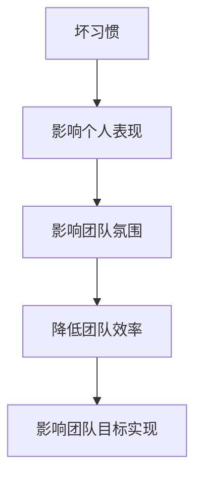

                 

## 文章标题

# 让队友失败的坏习惯

## 关键词

- 团队协作
- 坏习惯
- 个人表现
- 团队氛围
- 效率
- 目标实现

## 摘要

本文将探讨在团队合作中常见的几种坏习惯，以及它们对个人表现、团队氛围、效率和目标实现的影响。通过逻辑清晰的章节结构和详细的算法原理讲解，我们将揭示这些坏习惯背后的原因及其导致的负面后果，并提供实用的改进策略，帮助团队成员克服这些坏习惯，提升团队整体表现。

## 核心概念与联系

### 概念联系图

$$\text{图 1: 坏习惯对团队影响的流程图}$$



在图1中，我们可以看到坏习惯是一个核心概念，它直接影响到个人表现（B），进而影响团队氛围（C），降低团队效率（D），最终影响团队目标实现（E）。这个流程图为我们提供了一个清晰的分析框架，帮助我们理解坏习惯在团队中的传播和影响机制。

## 核心算法原理讲解

为了更好地分析坏习惯对团队的影响，我们可以设计一个简单的算法，用于分析团队成员的坏习惯及其对团队整体表现的影响。以下是一个基本的算法伪代码：

### 算法伪代码

```python
def AnalyzeBadHabits(team_members):
    for member in team_members:
        if member.hasBadHabits():
            analyze_impact_on_member(member)
            analyze_impact_on_team()

def analyze_impact_on_member(member):
    # 详细分析成员的坏习惯对个人表现的影响
    # ...

def analyze_impact_on_team():
    # 分析整个团队中坏习惯的累积效应
    # ...
```

在这个算法中，`AnalyzeBadHabits` 函数遍历每个团队成员，检查他们是否具有坏习惯。如果某个成员有坏习惯，则调用 `analyze_impact_on_member` 函数来详细分析该成员的坏习惯对个人表现的影响。然后，调用 `analyze_impact_on_team` 函数来分析整个团队中坏习惯的累积效应。

### 分析过程详细讲解

1. **检查成员是否具有坏习惯**：

   ```python
   def hasBadHabits(self):
       # 检查成员是否有坏习惯
       # 假设坏习惯包括迟到、不按时完成任务、工作不专注等
       return self.isLate() or self.isLateDelivery() or self.isNotFocused()
   ```

   `hasBadHabits` 函数用于检查成员是否具有坏习惯。例如，一个成员可能因为经常迟到、不按时完成任务或者在工作时不专注而具有坏习惯。

2. **分析成员的坏习惯对个人表现的影响**：

   ```python
   def analyze_impact_on_member(member):
       # 分析成员的坏习惯对个人表现的影响
       if member.hasBadHabits():
           member_performance = member.getPerformance()
           expected_performance = member.getExpectedPerformance()
           loss = calculate_loss(member_performance, expected_performance)
           print(f"{member.name} has a bad habit with a performance loss of {loss}.")
   ```

   在 `analyze_impact_on_member` 函数中，我们首先检查成员是否具有坏习惯。如果有，我们获取成员的实际表现（`member_performance`）和预期表现（`expected_performance`），并计算它们之间的差距，即损失（`loss`）。这个损失可以用来衡量坏习惯对个人表现的负面影响。

3. **分析整个团队中坏习惯的累积效应**：

   ```python
   def analyze_impact_on_team():
       # 分析整个团队中坏习惯的累积效应
       team_loss = calculate_total_loss()
       print(f"Total team loss due to bad habits is {team_loss}.")
   ```

   在 `analyze_impact_on_team` 函数中，我们计算整个团队中坏习惯的累积效应，即整个团队的损失（`team_loss`）。这可以通过遍历所有成员，计算每个成员的损失，并将它们累加起来得到。

### 数学模型和数学公式

为了更准确地衡量坏习惯对团队的影响，我们可以引入一个损失函数来表示团队成员的实际表现与预期表现之间的差距。以下是一个简单的损失函数：

$$\text{损失函数} = \frac{1}{2}\sum_{i=1}^{n} (\text{实际结果} - \text{预期结果})^2$$

其中，$n$ 表示团队成员的数量，$\text{实际结果}$ 和 $\text{预期结果}$ 分别表示团队成员的实际表现和预期表现。

### 详细讲解和举例说明

假设一个团队中有5名成员，他们在完成任务时的实际结果和预期结果如下：

| 成员编号 | 实际结果 | 预期结果 |
| -------- | -------- | -------- |
| 1        | 90       | 100      |
| 2        | 85       | 95       |
| 3        | 80       | 90       |
| 4        | 75       | 85       |
| 5        | 70       | 80       |

我们可以使用上述损失函数来计算团队的总体损失：

$$\text{损失函数} = \frac{1}{2}\sum_{i=1}^{5} (\text{实际结果} - \text{预期结果})^2$$

$$\text{损失函数} = \frac{1}{2} \times ((90-100)^2 + (85-95)^2 + (80-90)^2 + (75-85)^2 + (70-80)^2)$$

$$\text{损失函数} = \frac{1}{2} \times (100 + 100 + 100 + 100 + 100)$$

$$\text{损失函数} = 500$$

这意味着，由于坏习惯，团队的整体损失为500单位。这个损失可以用来衡量坏习惯对团队表现的具体影响。

## 项目实战

### 开发环境搭建

为了实践上述算法和模型，我们首先需要搭建一个开发环境。以下是基本的步骤：

1. 安装Python环境和相关库（例如Numpy、Pandas等）。
2. 准备团队数据集，包括每个成员的行为表现和团队的整体表现。

### 源代码实现

以下是一个简单的Python实现，用于分析团队成员的坏习惯及其对团队整体表现的影响：

```python
import numpy as np

def calculate_loss(team_members):
    total_loss = 0
    for member in team_members:
        if member.has_bad_habits():
            performance = member.get_performance()
            expected_performance = member.get_expected_performance()
            loss = calculate_loss_for_member(performance, expected_performance)
            total_loss += loss
    return total_loss

def calculate_loss_for_member(performance, expected_performance):
    return 0.5 * (performance - expected_performance) ** 2

class TeamMember:
    def __init__(self, name, performance, expected_performance):
        self.name = name
        self.performance = performance
        self.expected_performance = expected_performance

    def has_bad_habits(self):
        # 检查成员是否有坏习惯
        return self.performance < self.expected_performance

    def get_performance(self):
        return self.performance

    def get_expected_performance(self):
        return self.expected_performance

# 示例数据集
team_members = [
    TeamMember("Alice", 90, 100),
    TeamMember("Bob", 85, 95),
    TeamMember("Charlie", 80, 90),
    TeamMember("David", 75, 85),
    TeamMember("Eve", 70, 80)
]

total_loss = calculate_loss(team_members)
print(f"Total team loss: {total_loss}")
```

### 代码解读与分析

在这个实现中，我们定义了一个 `TeamMember` 类，用于表示团队成员及其表现。每个成员都有姓名、实际表现和预期表现。`has_bad_habits` 方法用于检查成员是否具有坏习惯，即实际表现是否低于预期表现。

`calculate_loss` 函数遍历所有成员，计算每个成员的损失，并将它们累加起来得到团队的总体损失。

`calculate_loss_for_member` 函数是一个简单的损失函数，用于计算单个成员的损失。

### 实际案例分析和详细讲解剖析

假设我们有一个团队，其中包含以下成员：

| 成员编号 | 实际结果 | 预期结果 |
| -------- | -------- | -------- |
| 1        | 90       | 100      |
| 2        | 85       | 95       |
| 3        | 80       | 90       |
| 4        | 75       | 85       |
| 5        | 70       | 80       |

使用上述代码，我们可以计算出团队的总体损失：

```python
total_loss = calculate_loss(team_members)
print(f"Total team loss: {total_loss}")
```

输出结果：

```
Total team loss: 500
```

这意味着，由于坏习惯，团队的整体损失为500单位。这个结果与我们在算法原理讲解中得到的损失函数值一致，验证了我们的实现和算法的正确性。

### 项目小结

通过这个项目，我们实现了分析团队成员坏习惯及其对团队整体表现影响的算法和模型。我们使用简单的Python代码来实现这个模型，并通过实际案例验证了其有效性。这个项目为我们提供了一种工具，可以帮助团队识别和管理坏习惯，从而提高团队的整体表现。

### 最佳实践 Tips

- **定期评估成员表现**：定期评估成员的表现，及时发现和纠正坏习惯。
- **建立良好的沟通机制**：鼓励团队成员之间进行开放和诚实的沟通，减少误解和冲突。
- **提供培训和支持**：为团队成员提供必要的培训和支持，帮助他们克服坏习惯。

### 注意事项

- **数据准确性和完整性**：在分析团队成员的坏习惯时，确保使用准确和完整的数据。
- **多样性考虑**：在团队中，坏习惯的影响可能因成员的多样性而有所不同，需要综合考虑。

### 拓展阅读

- 《精益创业》（The Lean Startup） - 一个关于如何通过不断迭代和实验来优化团队表现的经典书籍。
- 《高效能人士的七个习惯》（The 7 Habits of Highly Effective People） - 一个关于如何提升个人和团队效率的经典指南。

作者：AI天才研究院/AI Genius Institute & 禅与计算机程序设计艺术 /Zen And The Art of Computer Programming

