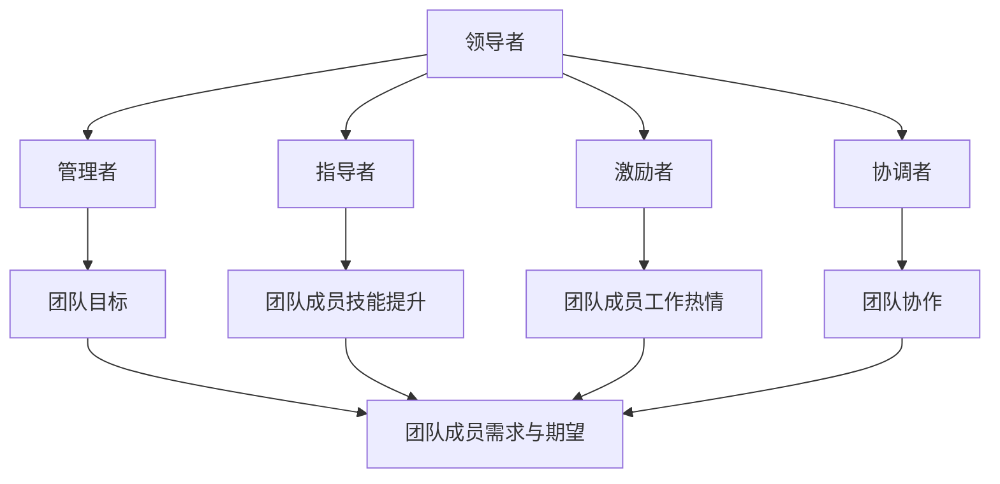

                 


## 文章标题：领导力与远见：预见未来的能力

### 关键词：领导力、远见、预见未来、战略规划、团队协作

### 摘要：
本文旨在探讨领导力与预见未来之间的深刻联系。领导力不仅是管理和指导团队的关键能力，更是预见未来、引领变革的核心素质。通过深入分析领导力的基础、提升策略以及领导力与组织文化的关系，本文揭示了领导力在组织中的重要作用。同时，本文还将探讨预见未来的重要性，以及如何通过远见思维和工具来培养和运用远见。最终，本文将结合案例，阐述领导力与远见在实际应用中的综合实践，为读者提供宝贵的启示。

## 第一部分：领导力基础

### 第1章：领导力概述

#### 1.1 领导力的定义与类型

领导力是一种独特的能力，它不仅涉及对团队的管理，更涉及到对团队的影响和激励。在技术领域，领导力尤为重要，因为它不仅要求领导者具备技术领域的专业知识，还需要具备跨领域的视野和远见。以下是领导力的基本定义和类型：

**定义：**
领导力是一种激发和指导他人实现共同目标的能力。它不仅包括对团队成员的管理和指导，还涉及到对团队氛围的塑造和对团队价值观的引领。

**类型：**
1. **权威型领导力（Autocratic Leadership）：** 这种领导力模式强调领导者的权威和控制。领导者做出决策，并要求团队成员执行。
   
   ```plaintext
   function autocraticLeadership(teamMember) {
       makeDecision();
       executeDecision(teamMember);
   }
   ```

2. **民主型领导力（Democratic Leadership）：** 这种领导力模式鼓励团队成员参与决策过程，领导者负责协调和汇总意见。

   ```plaintext
   function democraticLeadership(teamMembers) {
       gatherOpinions(teamMembers);
       makeDecisionBasedOnOpinions();
   }
   ```

3. **放任型领导力（Laissez-Faire Leadership）：** 这种领导力模式赋予团队成员最大程度的自主权，领导者很少干预团队的工作。

   ```plaintext
   function laissezFaireLeadership(teamMember) {
       allowAutonomy(teamMember);
   }
   ```

#### 1.2 领导者角色与职责

领导者的角色和职责是多方面的，他们不仅需要管理团队，还需要培养团队成员、激励团队成员，并确保团队目标的实现。

**角色：**
- **管理者：** 负责团队资源的管理和分配。
- **指导者：** 负责指导团队成员，帮助他们提升技能。
- **激励者：** 负责激励团队成员，激发他们的工作热情。
- **协调者：** 负责协调团队成员之间的沟通和合作。

**职责：**
- **设定目标：** 明确团队的目标和愿景。
- **规划执行：** 制定实现目标的计划和策略。
- **监督执行：** 跟踪团队的工作进度，确保目标得以实现。
- **反馈与改进：** 定期提供反馈，帮助团队成员改进工作。

领导者与团队成员的关系是相互依存的。领导者需要了解团队成员的需求和期望，同时，团队成员也需要对领导者有信心和支持。以下是领导者与团队成员关系的 Mermaid 流程图：



### 第2章：领导力发展与提升

#### 2.1 领导力自我评估

领导力的发展需要自我评估，以了解自己的优势和不足。以下是领导力自我评估的方法：

- **问卷调查：** 通过问卷调查，了解自己在不同领导力维度上的表现。
- **360度反馈：** 从团队成员、上级和其他利益相关者那里获取反馈，以全面了解自己的领导力表现。
- **个人反思：** 定期进行个人反思，思考自己在领导力方面的进步和需要改进的地方。

#### 2.2 领导力提升策略

提升领导力需要从多个方面入手，包括个人学习与成长、团队协作与沟通、领导力培训与教练。

- **个人学习与成长：** 通过阅读书籍、参加培训课程、实践和反思，不断提升自己的领导力。
- **团队协作与沟通：** 建立有效的团队沟通机制，促进团队成员之间的协作和合作。
- **领导力培训与教练：** 参加专业的领导力培训课程，接受专业的教练指导，以提升领导力。

### 第3章：领导力在组织中的实践

#### 3.1 领导力在组织中的功能

领导力在组织中的功能包括设定组织愿景与目标、组织变革与适应。以下是领导力在组织中的具体功能：

- **设定组织愿景与目标：** 领导者需要明确组织的愿景和目标，并将其传达给团队成员，以统一行动方向。
- **组织变革与适应：** 领导者需要引领组织进行变革，以适应不断变化的外部环境。

#### 3.2 领导力对组织文化的影响

领导力对组织文化有深远的影响。领导者需要塑造积极向上的组织文化，以推动组织的长期发展。以下是领导力对组织文化的影响：

- **组织文化的塑造：** 领导者通过言行和决策，塑造组织的价值观和行为规范。
- **领导力在组织文化传承中的作用：** 领导者需要传承和弘扬组织文化，确保组织文化的持续发展。

### 第4章：领导力与领导风格

#### 4.1 领导风格概述

领导风格是领导者管理团队的方式和手段。不同的领导风格适用于不同的情境和团队。以下是常见的领导风格：

- **权威型领导风格：** 强调领导者的权威和控制。
- **民主型领导风格：** 鼓励团队成员参与决策。
- **放任型领导风格：** 给予团队成员最大程度的自主权。

#### 4.2 领导风格的选择与应用

选择合适的领导风格是领导者的一项关键技能。以下是选择和应用领导风格的方法：

- **情境适应：** 根据团队的实际情况和环境，选择合适的领导风格。
- **团队成员差异：** 考虑团队成员的差异，选择能够激励和调动团队成员积极性的领导风格。
- **目标导向：** 根据团队的目标和任务要求，选择能够有效推动团队目标实现的领导风格。

## 第二部分：远见培养与实践

### 第5章：预见未来的重要性

#### 5.1 远见的价值

预见未来的能力对个人和组织都具有重要的价值。以下是远见的价值：

- **个人发展：** 远见帮助个人预见未来的机会和挑战，从而制定有效的个人发展规划。
- **组织决策：** 远见帮助组织预见未来的趋势和变化，从而做出更为明智的决策。

#### 5.2 远见与领导力的关系

远见是领导力的重要组成部分。领导者需要具备远见，以引领组织走向未来。以下是远见与领导力的关系：

- **远见如何提升领导力：** 远见帮助领导者预见未来的趋势和变化，从而做出更为前瞻性的决策。
- **领导力如何培养远见：** 领导者通过学习和实践，不断提升自己的远见能力，以更好地引领组织。

### 第6章：远见思维与工具

#### 6.1 远见思维模式

远见思维模式是一种前瞻性的思考方式，它帮助领导者预见未来的变化。以下是远见思维模式的几个关键要素：

- **未来思考的框架：** 建立一个明确的未来思考框架，帮助领导者系统地分析未来的趋势和变化。
- **漏洞思考与机会发现：** 通过漏洞思考，发现潜在的机会和风险，从而制定更为有效的应对策略。

#### 6.2 远见工具与方法

远见工具和方法帮助领导者更系统地培养和运用远见。以下是几种常见的远见工具和方法：

- **SWOT分析：** 对组织的优势、劣势、机会和威胁进行分析，以制定更为有效的战略规划。
- **创意思维技巧：** 通过创造性思维，激发新的想法和解决方案，以应对未来的挑战。
- **趋势预测工具：** 使用数据分析和其他预测工具，对未来的趋势进行预测，以做出更为明智的决策。

### 第7章：预见未来与战略规划

#### 7.1 战略规划的重要性

战略规划是组织未来发展的重要蓝图。以下是战略规划的重要性和核心要素：

- **战略规划的重要性：** 战略规划帮助组织明确未来的目标和方向，确保组织在未来的竞争中获得优势。
- **战略规划的核心要素：** 包括愿景、目标、策略、执行和监控。

#### 7.2 远见在战略规划中的应用

远见在战略规划中扮演着关键角色。以下是远见在战略规划中的应用：

- **预见未来趋势：** 通过远见，组织可以更好地预测未来的趋势和变化，从而制定更为前瞻性的战略规划。
- **制定应对策略：** 通过远见，组织可以提前制定应对策略，以应对未来的挑战和风险。

### 第8章：领导力与远见的综合实践

#### 8.1 领导力与远见的融合

领导力与远见是相辅相成的。领导者需要将远见融入领导力实践中，以更好地引领组织。以下是领导力与远见的融合：

- **领导力与远见的相互作用：** 远见帮助领导者做出更为前瞻性的决策，而领导力则确保这些决策能够得到有效的执行。
- **综合能力的培养与实践：** 领导者需要不断培养和提升自己的远见能力，并将其应用到领导实践中。

#### 8.2 案例分析：成功领导者的远见实践

为了更好地理解领导力与远见的综合实践，我们可以分析一些成功领导者的案例。以下是几个案例分析：

- **案例一：** 某技术公司的CEO通过远见，预见了云计算的发展趋势，并带领公司迅速转型，从而在市场中占据了领先地位。
- **案例二：** 某创新企业的创始人通过远见，看到了人工智能的巨大潜力，并投入大量资源进行研发，最终推出了具有革命性的产品。

这些案例表明，领导力与远见相结合，可以推动组织实现跨越式发展。

## 附录

### 附录A：相关资源与推荐阅读

为了进一步了解领导力与远见，以下是几本推荐的书籍和研究论文：

- **书籍：**
  - 《领导力与远见》
  - 《未来简史》
  - 《创新者的窘境》

- **研究论文：**
  - 《领导力：理论与实践》
  - 《远见：领导力的未来趋势》
  - 《组织文化与领导力》

这些资源将为读者提供更深入的理解和启示。

### 作者信息

作者：AI天才研究院/AI Genius Institute & 禅与计算机程序设计艺术 /Zen And The Art of Computer Programming

### 完整性要求

为了确保文章的完整性，每个章节的内容都需要包含以下元素：

- **背景介绍：** 概述领导力或远见的背景和重要性。
- **核心概念与联系：** 使用 Mermaid 流程图展示核心概念之间的关系。
- **核心算法原理讲解：** 使用伪代码详细阐述关键算法原理。
- **数学模型和公式详细讲解与举例说明：** 使用 LaTeX 格式嵌入数学公式，并进行详细讲解和举例。
- **项目实战：** 描述具体的开发环境和源代码实现，并进行代码解读与分析。
- **实际案例分析和详细讲解剖析：** 分析具体案例，并提供深入的分析和讲解。
- **最佳实践 tips、小结、注意事项、拓展阅读等内容：** 提供实践建议和进一步的阅读资源。

通过这些内容的详细讲解，文章将提供一个全面、深入的领导力与远见探讨，帮助读者更好地理解和应用这些概念。

