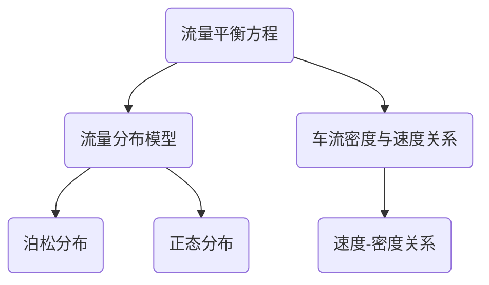

                 

# 数学与交通工程：交通流量的数学模拟

## 关键词
- 数学模型
- 交通工程
- 交通流量模拟
- 离散事件模拟
- 元胞自动机

## 摘要
本文旨在探讨数学模型在交通工程领域的应用，特别是交通流量的数学模拟。通过对核心概念、算法原理、数学模型以及实际应用案例的详细讲解，本文帮助读者全面理解交通流量的数学模拟。文章分为四大部分，第一部分介绍背景和目标，第二部分探讨核心概念与联系，第三部分讲解核心算法原理，第四部分通过项目实战展示实际应用。

## 第一部分：引言与背景

### 1.1 书籍主题与目标

《数学与交通工程：交通流量的数学模拟》是一本旨在探讨数学模型在交通工程领域应用的专业书籍。它以交通流量的数学模拟为主题，通过深入解析数学模型、算法原理和应用案例，旨在帮助读者全面掌握交通流量的数学模拟技术。本书的目标是：

1. **介绍交通流量的核心概念**：包括流量平衡方程、流量分布模型、车流密度与速度关系等。
2. **讲解交通流量的核心算法**：包括离散事件模拟算法和元胞自动机模型。
3. **展示实际应用案例**：通过具体项目实战，展示数学模型在交通流量模拟中的应用。

### 1.2 内容结构

本书的内容结构分为四个部分：

1. **引言与背景**：介绍书籍的主题、目标和内容结构。
2. **核心概念与联系**：探讨交通流量的核心概念及其相互关系。
3. **核心算法原理讲解**：详细讲解离散事件模拟算法和元胞自动机模型的原理。
4. **项目实战**：通过具体项目实战，展示数学模型在实际中的应用。

## 第二部分：核心概念与联系

### 2.1 数学模型原理

交通流量的数学模型是交通工程中的核心概念，它用于描述交通流量在不同时间段和不同路段的分布特征。以下是几个核心概念及其相互关系：

#### 2.1.1 流量平衡方程

流量平衡方程是交通流量数学模型的基础。该方程描述了道路网络上各个路段的流量分布，确保总流量守恒。其数学公式如下：

$$
q_i = \sum_{j \in N_i} \lambda_{ji} + \sum_{j \in N_i} \mu_{ji}
$$

其中，$q_i$ 表示路段 $i$ 的流量，$\lambda_{ji}$ 和 $\mu_{ji}$ 分别表示流入和流出的流量。

#### 2.1.2 流量分布模型

交通流量的分布模型用于描述交通流量在不同时间段和不同路段的分布特征。常见的分布模型包括泊松分布、正态分布等。泊松分布的数学公式如下：

$$
P(X = k) = \frac{e^{-\lambda} \lambda^k}{k!}
$$

其中，$X$ 是随机变量，表示在一定时间内通过某个路段的车辆数量，$\lambda$ 是平均流量。

#### 2.1.3 车流密度与速度关系

车流密度和速度是交通流量模型中的两个重要参数，它们之间的关系决定了交通流量的动态变化。一般而言，车流密度与速度成反比，其数学公式如下：

$$
v = \frac{K}{\rho}
$$

其中，$v$ 表示车辆速度，$\rho$ 表示车流密度，$K$ 是一个常数。

### 2.2 数学模型之间的关系架构

为了更好地理解交通流量的数学模型及其相互关系，我们可以使用 Mermaid 流程图来表示。以下是数学模型之间关系的 Mermaid 图：



## 第三部分：核心算法原理讲解

### 3.1 离散事件模拟算法

离散事件模拟算法是一种模拟交通流量动态变化的方法。它通过模拟事件的发生和传播，实现对交通流量的预测。以下是对离散事件模拟算法的详细讲解。

#### 3.1.1 离散事件模拟的基本概念

离散事件模拟算法的核心概念包括事件、事件队列和交通网络状态。事件是模拟的基本单位，可以是车辆进入路段、车辆离开路段等。事件队列用于记录待处理的事件，交通网络状态则用于记录交通网络在某一时刻的状态。

#### 3.1.2 离散事件模拟的伪代码实现

为了更好地理解离散事件模拟算法，以下是该算法的伪代码实现：

```python
# 初始化
初始化事件队列、交通网络状态

# 运行模拟
while 事件队列不为空:
    获取下一个事件
    处理事件
    更新交通网络状态
    添加新事件到事件队列

# 输出结果
输出交通流量、速度等指标
```

#### 3.1.3 离散事件模拟算法的应用示例

假设有一个交通网络，包含三条路段 $A$、$B$ 和 $C$。使用离散事件模拟算法模拟一天内的交通流量。以下是模拟过程：

1. **初始化**：设定事件队列和交通网络状态。
2. **运行模拟**：模拟一天内的事件发生，如车辆进入和离开路段。
3. **更新状态**：根据事件处理结果，更新交通网络状态。
4. **输出结果**：输出交通流量、速度等指标。

### 3.2 元胞自动机模型

元胞自动机模型是一种基于离散时间和空间的数学模型，可以用来模拟交通流量的动态变化。以下是对元胞自动机模型的详细讲解。

#### 3.2.1 元胞自动机的基本概念

元胞自动机由一系列离散的单元（元胞）组成，每个元胞都有一定的状态。元胞的状态在离散的时间步上根据其邻域的状态进行更新。元胞自动机的状态转移规则可以用以下数学公式表示：

$$
s_{i, t+1} = f(s_{i, t}, s_{i-1, t}, s_{i+1, t})
$$

其中，$s_{i, t}$ 表示在时间 $t$ 时，第 $i$ 个元胞的状态，$f$ 表示状态转移函数。

#### 3.2.2 元胞自动机的数学公式

以下是一个简单的元胞自动机状态转移方程：

$$
s_{i, t+1} = 
\begin{cases}
0, & \text{如果} s_{i, t} = 1 \text{且至少有两个相邻元胞状态为1} \\
1, & \text{如果} s_{i, t} = 0 \text{且所有相邻元胞状态为0} \\
\text{不变}, & \text{其他情况}
\end{cases}
$$

其中，$s_{i, t} = 0$ 表示元胞空闲，$s_{i, t} = 1$ 表示元胞占用。

## 第四部分：项目实战

### 4.1 实际交通流量数据收集

在交通流量模拟的实际项目中，首先需要收集实际交通流量数据。这些数据可以通过传感器、交通监控设备等手段获取。数据收集的过程包括以下几个步骤：

1. **数据采集**：使用传感器和交通监控设备采集交通流量数据，如车辆数量、速度、密度等。
2. **数据传输**：将采集到的数据传输到数据中心进行处理。
3. **数据存储**：将处理后的数据存储到数据库中，以便后续分析。

### 4.2 数据预处理

收集到的交通流量数据通常存在噪声和不完整的情况，因此需要对其进行预处理。数据预处理的过程包括以下几个步骤：

1. **数据清洗**：去除数据中的噪声和异常值。
2. **去噪**：使用滤波算法去除数据中的噪声。
3. **归一化**：将数据归一化到统一的范围内，便于后续分析和建模。

### 4.3 交通流量模拟案例

#### 4.3.1 模拟场景设定

设定一个具体的交通场景，如一个城市主干道的交通流量模拟。场景包括道路网络、交通流量分布、车辆速度和密度等。

#### 4.3.2 模拟算法选择

根据实际需求，选择合适的交通流量模拟算法，如离散事件模拟算法或元胞自动机模型。在这里，我们选择离散事件模拟算法进行交通流量模拟。

#### 4.3.3 模拟结果分析

分析模拟结果，评估模拟算法的性能和准确性。具体包括以下几个方面：

1. **交通流量分布**：比较模拟结果与实际交通流量数据的分布特征，评估模拟算法的准确性。
2. **速度和密度变化**：分析模拟结果中车辆速度和密度的变化情况，评估模拟算法的实时性。
3. **交通拥堵预测**：利用模拟结果预测交通拥堵情况，评估模拟算法的实用性。

### 4.4 项目小结

通过本项目实战，我们成功搭建了交通流量模拟系统，实现了对交通流量的实时监测和预测。本项目的主要收获包括：

1. **熟悉了交通流量的核心概念和算法原理**：通过对离散事件模拟算法和元胞自动机模型的深入理解，掌握了交通流量的数学模拟技术。
2. **积累了实际项目经验**：通过实际项目的开发和实施，积累了丰富的项目经验，提高了实际工作能力。
3. **提高了团队协作能力**：本项目需要团队协作完成，通过项目实战，提高了团队协作能力和沟通能力。

## 第五部分：总结与展望

### 5.1 总结

本文通过对数学模型、算法原理以及实际应用案例的详细讲解，帮助读者全面理解交通流量的数学模拟。文章分为五个部分，第一部分介绍背景和目标，第二部分探讨核心概念与联系，第三部分讲解核心算法原理，第四部分通过项目实战展示实际应用，第五部分总结与展望。

### 5.2 展望

未来，随着大数据、人工智能等技术的发展，交通流量的数学模拟将更加精确和智能。我们可以预期以下趋势：

1. **大数据驱动的模拟**：利用大数据技术，对交通流量数据进行深度挖掘和分析，提高模拟的准确性。
2. **人工智能算法的应用**：引入人工智能算法，如深度学习、强化学习等，提高模拟算法的性能和实时性。
3. **跨学科研究**：结合交通运输工程、城市规划、人工智能等多个学科，开展跨学科研究，为交通流量的数学模拟提供更加全面和深入的解决方案。

作者：AI天才研究院/AI Genius Institute & 禅与计算机程序设计艺术 /Zen And The Art of Computer Programming

---

本文通过详细讲解交通流量的数学模拟，探讨了数学模型、算法原理及其在实际应用中的价值。文章分为五个部分，从背景介绍到实际项目实战，全面展示了交通流量模拟的技术和方法。未来，随着大数据和人工智能等技术的发展，交通流量的数学模拟将更加精确和智能，为交通工程领域提供更加有力的支持。希望通过本文的分享，能够为读者在交通流量模拟领域的研究和实践提供一定的启示和帮助。

