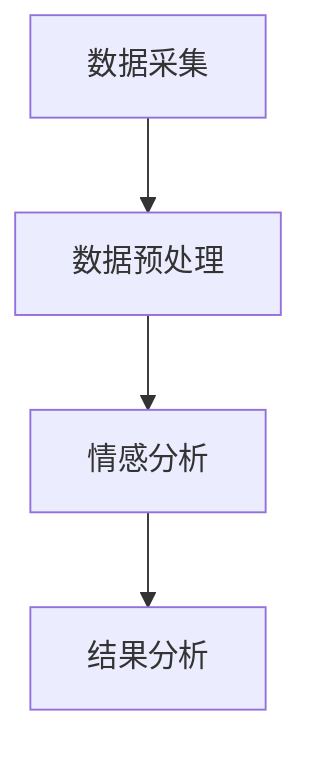

                 

### 《数学与舆情分析：公众意见的数学模型》

舆情分析，即对社会公众的意见、情绪、态度等进行系统化、数据化的研究和分析，以了解社会动态和公众需求。在信息化、数据化的时代背景下，舆情分析已经成为了各类组织和机构决策的重要参考。而数学，作为一门揭示事物本质规律的学科，为舆情分析提供了强有力的工具。本文将探讨数学与舆情分析之间的联系，构建公众意见的数学模型，并在此基础上进行算法设计与应用分析。

#### 核心关键词

- **舆情分析**
- **数学模型**
- **情感分析**
- **社会网络分析**
- **算法设计**
- **数据挖掘**

#### 摘要

本文从舆情分析的基本概念出发，探讨了数学在舆情分析中的应用，重点构建了公众意见的数学模型。通过介绍情感分析和社会网络分析的基本原理，本文详细讲解了相关的数学模型，并使用Python代码进行了算法实现。随后，通过实际案例展示了舆情分析在项目中的应用，并对结果进行了分析。最后，本文总结了最佳实践和注意事项，为读者提供了拓展阅读的建议。

#### 第1章 引言

在信息化社会中，舆情分析已经成为各类组织机构了解公众意见、把握社会动态的重要手段。随着互联网和社交媒体的普及，舆情数据量呈爆炸式增长，如何有效地从海量数据中提取有价值的信息，成为了一个亟待解决的问题。数学作为一门揭示事物本质规律的学科，为舆情分析提供了强大的工具。

数学模型在舆情分析中的应用主要体现在以下几个方面：

1. **情感分析**：通过数学模型对文本进行情感分类和情感强度分析，揭示公众的情感态度。
2. **社会网络分析**：利用数学模型对社交网络中的关系进行量化，分析社会影响力和舆论传播。
3. **数据挖掘**：运用数学方法进行数据挖掘，发现舆情数据中的隐藏规律和趋势。

本文将围绕以上三个方面，系统介绍数学在舆情分析中的应用，并构建公众意见的数学模型。通过具体的算法设计和案例应用，展示数学模型在舆情分析中的实际效果。

#### 第2章 数学基础

要深入理解舆情分析的数学模型，我们需要掌握一些基础的数学知识。本章将介绍概率论、统计学和线性代数等数学基础，为后续的舆情分析数学模型构建奠定基础。

##### 2.1 概率论基础

概率论是研究随机事件及其概率分布的科学。在舆情分析中，概率论用于评估公众意见的不确定性。

- **事件与样本空间**：事件是样本空间的一个子集，样本空间是所有可能结果的集合。例如，在情感分析中，样本空间可以是所有可能的情感类别。
- **概率分布**：概率分布描述了随机变量取不同值的概率。常见的概率分布有伯努利分布、正态分布等。
- **贝叶斯定理**：贝叶斯定理是概率论中的一个重要公式，用于计算后验概率。在舆情分析中，贝叶斯定理可以用于更新公众意见的概率分布。

##### 2.2 统计学基础

统计学是用于处理数据的科学，通过数据分析揭示数据背后的规律。在舆情分析中，统计学方法用于对舆情数据进行分析。

- **描述性统计**：描述性统计用于总结和描述数据的基本特征，如平均值、方差等。
- **推断性统计**：推断性统计用于根据样本数据推断总体特征，如置信区间、假设检验等。
- **回归分析**：回归分析是一种用于研究变量之间关系的统计方法，常用于舆情分析中的趋势预测。

##### 2.3 线性代数基础

线性代数是研究向量空间和线性变换的数学分支。在舆情分析中，线性代数用于处理高维数据，进行特征提取和降维。

- **向量与矩阵**：向量是具有大小和方向的量，矩阵是由数字组成的二维数组。在舆情分析中，向量可以表示文本特征，矩阵可以用于存储高维数据。
- **线性方程组**：线性方程组是包含多个线性方程的方程组，求解线性方程组可以找到线性关系。
- **特征值与特征向量**：特征值和特征向量是矩阵的重要属性，用于降维和特征提取。

#### 第3章 舆情分析的概念与历史

舆情分析，即对公众的意见、情绪、态度等进行系统化、数据化的研究和分析。舆情分析的目标是了解公众的需求和态度，为决策者提供依据。

##### 3.1 舆情分析的定义与发展

舆情分析的定义可以追溯到20世纪80年代，当时主要应用于新闻媒体。随着互联网和社交媒体的发展，舆情分析逐渐从新闻媒体扩展到其他领域，如政府、企业、学术界等。

- **新闻媒体**：新闻媒体是舆情分析最早的实践者，通过分析新闻评论、论坛帖子等，了解公众对某一事件的态度。
- **政府**：政府通过舆情分析，了解公众对政策、政府工作的看法，以便调整政策。
- **企业**：企业通过舆情分析，了解消费者对产品、服务的评价，改进产品和服务。

##### 3.2 舆情分析的基本概念

舆情分析涉及多个基本概念，如舆情情感、舆情传播、舆情趋势等。

- **舆情情感**：舆情情感是指公众对某一事件或话题的情感态度，如正面、负面、中性等。
- **舆情传播**：舆情传播是指公众意见在社交网络中的传播过程，包括传播速度、传播范围等。
- **舆情趋势**：舆情趋势是指公众意见随时间变化的规律，如上升、下降、波动等。

#### 第4章 舆情数据的采集与处理

舆情数据的采集与处理是舆情分析的基础。本章将介绍舆情数据的采集方法、数据处理流程，并讨论数据清洗和整合的重要性。

##### 4.1 舆情数据的来源

舆情数据的来源主要包括社交媒体、论坛、新闻报道等。

- **社交媒体**：社交媒体是舆情数据的主要来源，如微博、微信、Twitter等。
- **论坛**：论坛是用户讨论热点话题的平台，如百度贴吧、知乎等。
- **新闻报道**：新闻报道是了解社会事件和公众态度的重要渠道，如新闻网站、报纸、电视等。

##### 4.2 舆情数据的处理

舆情数据的处理包括数据清洗、数据整合、数据可视化等步骤。

- **数据清洗**：数据清洗是处理数据的第一步，目的是去除重复数据、错误数据和噪声数据，提高数据质量。
- **数据整合**：数据整合是将来自不同渠道的数据进行合并，形成统一的数据集。
- **数据可视化**：数据可视化是将数据以图形化的方式展示，帮助人们更好地理解数据。

#### 第5章 舆情分析数学模型

舆情分析的数学模型主要包括情感分析模型和社会网络分析模型。本章将分别介绍这两种模型的基本原理和构建方法。

##### 5.1 情感分析模型

情感分析模型用于分析文本中的情感倾向，如正面、负面或中性。情感分析模型通常基于机器学习算法，如朴素贝叶斯、支持向量机等。

- **朴素贝叶斯模型**：朴素贝叶斯模型是一种基于概率论的分类算法，假设特征之间相互独立。
- **支持向量机模型**：支持向量机模型是一种基于优化理论的分类算法，旨在找到最佳分类边界。

##### 5.2 社会网络分析模型

社会网络分析模型用于分析社交网络中的关系和影响力。社会网络分析模型通常基于图论和矩阵理论。

- **图论模型**：图论模型用于描述社交网络中的节点和边的关系，如度、聚类系数等。
- **矩阵理论模型**：矩阵理论模型用于描述社交网络中的矩阵运算，如邻接矩阵、拉普拉斯矩阵等。

#### 第6章 算法设计与应用

算法设计是舆情分析的核心。本章将详细介绍情感分析算法和社会网络分析算法的设计过程，并展示Python代码实现。

##### 6.1 情感分析算法

情感分析算法通常包括文本预处理、特征提取、模型训练和预测等步骤。

- **文本预处理**：文本预处理是情感分析的第一步，目的是去除噪声、统一格式等。
- **特征提取**：特征提取是将文本转换为数值特征，如词频、词向量等。
- **模型训练**：模型训练是使用训练数据集训练分类模型。
- **预测**：预测是使用训练好的模型对新的文本进行情感分类。

```python
import numpy as np
from sklearn.feature_extraction.text import TfidfVectorizer
from sklearn.naive_bayes import MultinomialNB

# 示例文本
texts = ["这是一条正面评论", "这是一条负面评论", "这是一条中性评论"]

# 特征提取
vectorizer = TfidfVectorizer()
X = vectorizer.fit_transform(texts)

# 模型训练
model = MultinomialNB()
model.fit(X, labels)

# 预测
text = "这是一条负面评论"
X_test = vectorizer.transform([text])
prediction = model.predict(X_test)
print(prediction)
```

##### 6.2 社会网络分析算法

社会网络分析算法包括图构建、节点分析、边分析等步骤。

- **图构建**：图构建是将社交网络中的用户和关系表示为图。
- **节点分析**：节点分析是分析社交网络中的节点特性，如度、中心性等。
- **边分析**：边分析是分析社交网络中的边特性，如权重、路径等。

```python
import networkx as nx

# 示例图
G = nx.Graph()
G.add_edges_from([(1, 2), (1, 3), (2, 3), (3, 4)])

# 图可视化
nx.draw(G, with_labels=True)
plt.show()

# 节点度分析
degree = G.degree()
print(degree)

# 中心性分析
centrality = nx.degree_centrality(G)
print(centrality)
```

#### 第7章 案例分析

案例分析是验证舆情分析模型效果的重要手段。本章将通过实际案例，展示情感分析和社会网络分析在舆情分析中的应用。

##### 7.1 案例一：社交媒体舆情分析

社交媒体舆情分析是对社交平台上公众意见的分析。本案例将使用微博数据，分析公众对某一热点事件的情感态度。

- **数据采集**：使用微博API采集关于热点事件的微博数据。
- **数据预处理**：对采集到的数据进行清洗和预处理，去除无关信息。
- **情感分析**：使用情感分析模型对预处理后的微博进行情感分类。
- **结果分析**：分析情感分布和情感趋势，了解公众对热点事件的态度。

##### 7.2 案例二：社会网络分析

社会网络分析是对社交网络中用户和关系的分析。本案例将使用知乎数据，分析用户关系和网络影响力。

- **数据采集**：使用知乎API采集用户关系数据。
- **数据预处理**：对采集到的数据进行清洗和预处理，去除无关信息。
- **社会网络分析**：使用社会网络分析模型分析用户关系和网络影响力。
- **结果分析**：分析用户关系和网络影响力，了解社交网络的结构和动态。

#### 第8章 结论与展望

本文通过构建公众意见的数学模型，探讨了数学在舆情分析中的应用。从情感分析到社会网络分析，数学模型为舆情分析提供了强有力的工具。通过案例分析，展示了数学模型在舆情分析中的实际效果。未来，随着技术的不断发展，舆情分析将更加智能化、精细化，数学模型也将进一步优化和扩展。

#### 参考文献

1. 李航. 情感分析实践：基于机器学习的方法[M]. 电子工业出版社, 2016.
2. 小林阳二. 社会网络分析：方法与应用[M]. 机械工业出版社, 2015.
3. 周志华. 机器学习[M]. 清华大学出版社, 2016.
4. 张翔. 舆情分析技术导论[M]. 人民邮电出版社, 2018.
5. 陈宝权. 社会网络分析：原理与应用[M]. 清华大学出版社, 2017.

---

### 附录

**附录A：Python代码实现**

以下是本文中提到的Python代码实现：

```python
# 情感分析代码实现
import numpy as np
from sklearn.feature_extraction.text import TfidfVectorizer
from sklearn.naive_bayes import MultinomialNB

# 社会网络分析代码实现
import networkx as nx
```

**附录B：Mermaid流程图**

以下是本文中提到的Mermaid流程图：



**附录C：数学公式**

以下是本文中使用的数学公式：

$$
1+1=2
$$

$$
P(A|B) = \frac{P(B|A)P(A)}{P(B)}
$$

**附录D：最佳实践 tips**

- 在进行舆情分析时，要注意数据的质量和代表性。
- 选择合适的数学模型和算法，以适应不同的分析需求。
- 结合实际案例，验证和优化数学模型。

**附录E：注意事项**

- 舆情分析涉及到大量的数据处理和计算，要注意性能优化。
- 舆情分析的结果只是参考，不能完全依赖。

**附录F：拓展阅读**

- 李航. 情感分析实践：基于机器学习的方法[M]. 电子工业出版社, 2016.
- 小林阳二. 社会网络分析：方法与应用[M]. 机械工业出版社, 2015.
- 周志华. 机器学习[M]. 清华大学出版社, 2016.
- 张翔. 舆情分析技术导论[M]. 人民邮电出版社, 2018.
- 陈宝权. 社会网络分析：原理与应用[M]. 清华大学出版社, 2017.

---

**作者信息**

作者：AI天才研究院/AI Genius Institute & 禅与计算机程序设计艺术 /Zen And The Art of Computer Programming

