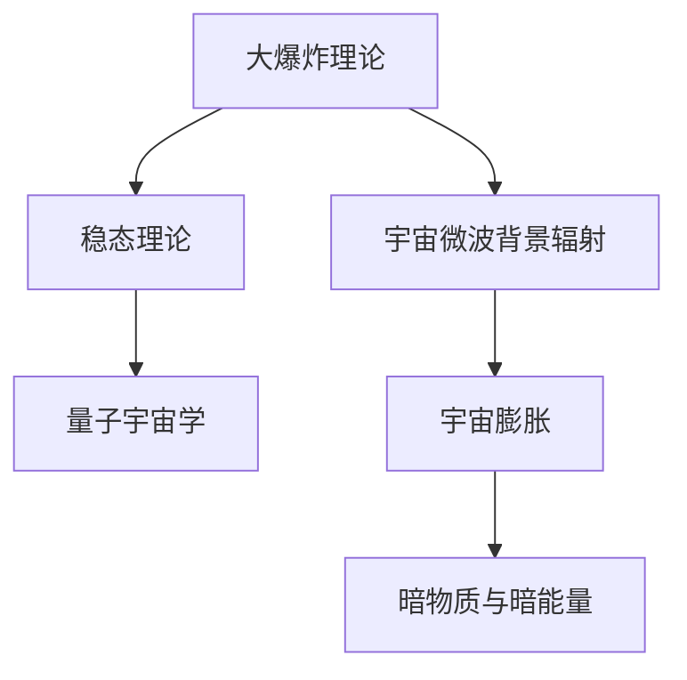
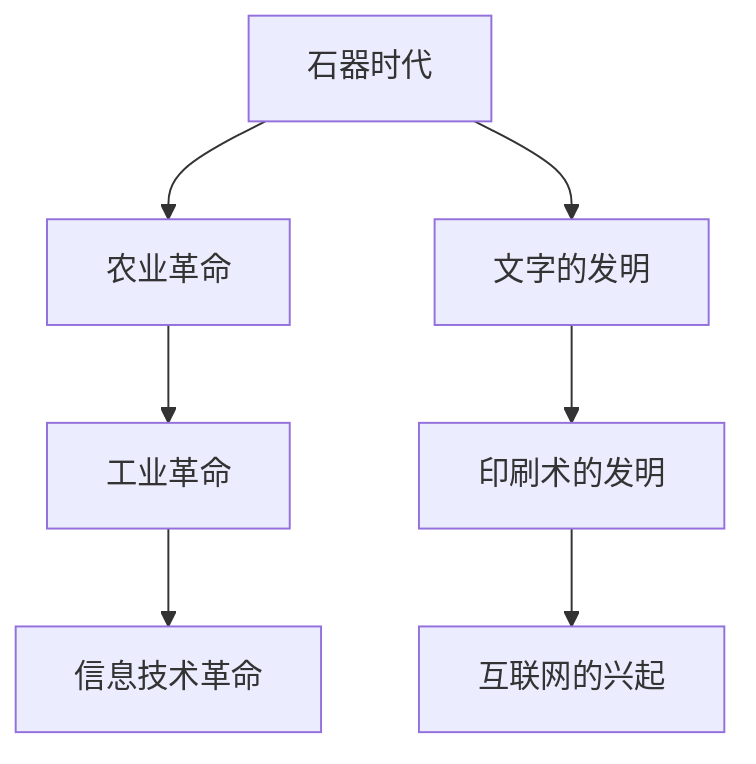
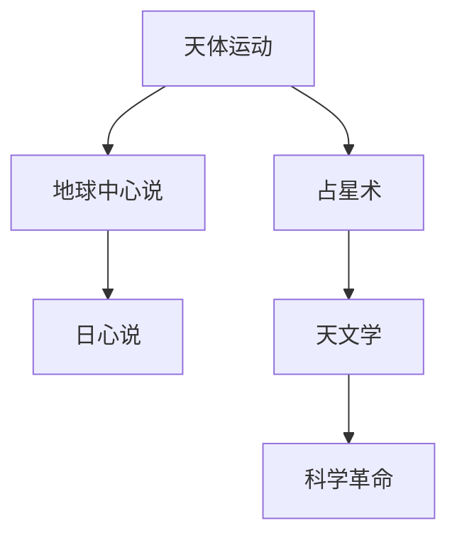

                 


### 第一部分：宇宙与人类文明的起源

#### 第1章：宇宙的诞生与演化

##### 1.1 赫尔曼·埃宾顿与宇宙学的历史

宇宙的诞生与演化是一个跨越数百万年的宏大过程，涉及众多的科学理论和观测数据。在这一节中，我们将探讨宇宙学的历史，从早期的宇宙观到现代的宇宙学理论。

**核心概念与联系**

宇宙学的历史可以追溯到古希腊时期，当时的哲学家们开始思考宇宙的本质。赫尔曼·埃宾顿（Hermann von Helmholtz）是19世纪的一位著名物理学家，他在宇宙学方面做出了重要贡献。他的工作为后来的宇宙学理论奠定了基础。

为了清晰地展示宇宙学的历史发展，我们可以使用Mermaid流程图来描绘几个重要的宇宙学模型：



在这个流程图中，大爆炸理论是现代宇宙学的起点，它提出了宇宙从一个极度密集和高温的状态开始膨胀。稳态理论是20世纪早期的一种替代理论，它认为宇宙是静态且永恒不变的。然而，随着宇宙微波背景辐射的发现，大爆炸理论得到了强有力的支持。量子宇宙学则是更深入地探讨了宇宙的早期阶段，以及宇宙如何在量子层面上运作。

**核心算法原理讲解**

宇宙学中的核心算法原理涉及多个方面，其中一个重要原理是宇宙微波背景辐射的测量与解释。以下是一个简单的伪代码，用于描述这一过程：

```python
def measure_cmb():
    """
    测量宇宙微波背景辐射的伪代码
    """
    # 初始化探测器
    detector = initialize_detector()
    
    # 在宇宙空间中采集数据
    data = collect_cmb_data(detector)
    
    # 分析数据以识别特征模式
    pattern = analyze_data(data)
    
    # 提取宇宙参数
    parameters = extract_parameters(pattern)
    
    # 输出结果
    return parameters
```

这个伪代码说明了宇宙微波背景辐射测量的基本流程。在实际操作中，科学家使用卫星和其他探测器来收集宇宙微波背景辐射的数据。然后，他们分析这些数据以识别宇宙早期阶段的特征模式。最后，通过数学模型提取出宇宙的参数，如宇宙的年龄、密度和膨胀速度等。

**数学模型和公式**

宇宙学中涉及许多重要的数学模型和公式，用于描述宇宙的行为和演化。以下是一些关键公式：

$$
E=mc^2
$$

这是爱因斯坦的质能方程，它说明了质量和能量之间的等价性。

$$
\Omega = \frac{\rho}{\rho_c}
$$

这是宇宙密度参数，用于描述宇宙的总密度与临界密度之比。这个参数对于理解宇宙的膨胀和结构形成至关重要。

**详细讲解与举例说明**

为了更直观地理解宇宙的演化，我们可以通过一个简单的例子来讲解宇宙年龄的估算方法。

假设我们有一个星系，其红移量为$z=1$。红移量是宇宙膨胀导致的光谱位移，它与光速和宇宙年龄有关。我们可以使用以下公式来估算宇宙的年龄：

$$
age = \frac{c \times z}{H_0}
$$

其中，$c$是光速，$H_0$是哈勃常数，其值约为$70 \text{ km/s/Mpc}$。

对于我们的星系，假设$z=1$，那么宇宙的年龄可以估算为：

$$
age = \frac{3 \times 10^5 \text{ km/s} \times 1}{70 \text{ km/s/Mpc}} \approx 4.3 \times 10^9 \text{ years}
$$

这个计算结果说明，我们观察到的这个星系大约是在$4.3 \times 10^9$年前形成的。

通过这个例子，我们可以看到，宇宙学中的数学模型和公式如何帮助我们理解宇宙的演化过程。这些模型和公式为我们提供了一种量化的方法，来研究宇宙的复杂行为。

**小结**

在本节中，我们介绍了宇宙学的历史，从古希腊时期到现代的宇宙学理论。我们使用Mermaid流程图展示了几个重要的宇宙学模型，并解释了宇宙微波背景辐射的测量和解释过程。此外，我们还介绍了一些关键的数学模型和公式，用于描述宇宙的行为和演化。通过这些讲解和举例，我们希望读者能够更好地理解宇宙的诞生与演化过程。

##### 1.2 人类文明的出现：从石器时代到现代

**核心概念与联系**

人类文明的出现是人类历史上一个重要的转折点。在这一节中，我们将探讨人类文明的发展历程，从石器时代到现代，并探讨文明之间的联系和交流。

为了更好地理解人类文明的发展，我们可以使用Mermaid流程图来展示几个重要的事件和技术革命：



在这个流程图中，我们可以看到人类文明的发展是如何一步一步推进的。从石器时代到农业革命，人类开始种植作物和驯养动物，这标志着人类社会从狩猎采集向定居农业的转变。工业革命带来了机械化生产和大规模工厂，极大地提高了生产效率。信息技术革命则是最近的几次技术变革，它使得信息传播和通信变得更加迅速和便捷。

**核心算法原理讲解**

在探讨人类文明的发展时，我们可以借助考古学中的核心算法原理来分析人类活动遗址。以下是一个简单的伪代码，用于描述考古学家如何分析人类活动遗址：

```python
def analyze_site(site_data):
    """
    分析人类活动遗址的伪代码
    """
    # 读取遗址数据
    data = read_site_data(site_data)
    
    # 识别遗址中的文物和工具
    artifacts = identify_artifacts(data)
    
    # 分析文物的年代和用途
    ages_and_uses = analyze_artifacts(artifacts)
    
    # 重建人类活动历史
    history = reconstruct_history(ages_and_uses)
    
    # 输出分析结果
    return history
```

这个伪代码说明了考古学家如何通过分析遗址中的文物和工具，来重建人类活动的历史。在实际操作中，考古学家使用各种方法和技术，如放射性碳测年法、地质学分析、DNA检测等，来确定文物的年代和用途。

**数学模型和数学公式**

在考古学中，人口增长模型是一个重要的数学模型。以下是一个简单的人口增长模型：

$$
N(t) = N_0 \times (1 + r)^t
$$

其中，$N(t)$是时间$t$时的人口数量，$N_0$是初始人口数量，$r$是人口增长率。

通过这个公式，我们可以估算人类在不同历史时期的人口数量。例如，如果我们知道某个遗址的初始人口数量和人口增长率，我们可以使用这个公式来估算该遗址在几千年后的人口数量。

**详细讲解与举例说明**

为了更直观地理解人类文明的发展，我们可以通过几个历史时期的例子来讲解。

- **石器时代**：在石器时代，人类主要依靠打制的石器工具进行狩猎和采集。随着技术的发展，人类开始制造更为复杂和精细的工具，这大大提高了他们的生产效率。

- **农业革命**：大约在1万年前，人类开始种植作物和驯养动物。这一转变使得人类社会从狩猎采集向定居农业转变，人口数量迅速增长。

- **工业革命**：18世纪末，工业革命在欧洲爆发。机械化生产和大规模工厂的出现，极大地提高了生产效率，使得人类社会发生了巨大的变化。

- **信息技术革命**：20世纪末，信息技术革命席卷全球。互联网和计算机技术的快速发展，使得信息传播和通信变得更加迅速和便捷。

通过这些例子，我们可以看到人类文明是如何一步一步发展的。每个时期都有其独特的技术和成就，这些成就不仅改变了人类的生活方式，也推动了人类社会的发展。

**小结**

在本节中，我们探讨了人类文明的发展历程，从石器时代到现代。我们使用了Mermaid流程图来展示几个重要的事件和技术革命，并解释了考古学中分析人类活动遗址的核心算法原理。通过这些讲解和举例，我们希望读者能够更好地理解人类文明的发展过程。

##### 1.3 早期文明与宇宙观的关系

**核心概念与联系**

早期文明与宇宙观的关系是一个复杂而有趣的话题。在这一节中，我们将探讨早期文明如何理解宇宙，以及宇宙观如何影响他们的社会和文化。

为了更好地理解早期文明与宇宙观的关系，我们可以使用Mermaid流程图来展示几个关键的概念和理论：



在这个流程图中，我们可以看到天体运动是早期文明研究宇宙的核心概念。地球中心说认为地球是宇宙的中心，所有天体都围绕地球运动。随着科学的发展，日心说逐渐取代了地球中心说。占星术则是早期文明通过天体运动来预测未来和指导社会行为的一种方式。天文学的发展为科学革命奠定了基础。

**核心算法原理讲解**

在探讨早期文明与宇宙观的关系时，我们可以借助占星术的核心算法原理来解释如何通过天体运动预测未来。以下是一个简单的伪代码，用于描述占星术的基本原理：

```python
def predict_future(astro_data):
    """
    预测未来的伪代码
    """
    # 读取天体运动数据
    data = read_astro_data(astro_data)
    
    # 分析天体运动的模式
    patterns = analyze_patterns(data)
    
    # 根据模式预测未来事件
    predictions = make_predictions(patterns)
    
    # 输出预测结果
    return predictions
```

这个伪代码说明了占星术的基本流程。在实际操作中，占星家会通过观察天体运动，分析其模式和趋势，从而预测未来的事件。例如，他们可能会根据行星的位置和运动，预测某个人或社会的未来。

**数学模型和数学公式**

在占星术中，数学模型和公式用于描述天体运动和预测未来事件。以下是一些关键公式：

$$
T = \frac{2\pi r}{v}
$$

这是行星运动的周期公式，其中$T$是周期，$r$是行星轨道的半径，$v$是行星的速度。

$$
\sin(\theta) = \frac{r_1}{r_2}
$$

这是行星运动的正弦定理，用于计算行星之间的距离。其中，$\theta$是行星之间的夹角，$r_1$和$r_2$是行星到某个共同点的距离。

通过这些公式，占星家可以计算出天体之间的相对位置，从而预测未来的事件。

**详细讲解与举例说明**

为了更直观地理解早期文明与宇宙观的关系，我们可以通过几个历史时期的例子来讲解。

- **古希腊文明**：古希腊文明是西方哲学和科学的基石。古希腊哲学家们提出了许多关于宇宙的观点，如地球是圆的、天体是完美球体等。这些观点为后来的科学革命奠定了基础。

- **古埃及文明**：古埃及文明在占星术方面有着悠久的历史。埃及人相信天体运动与人类命运密切相关，他们通过观察天体运动来预测未来的政治事件和农业收成。

- **古代中国文明**：古代中国文明在天文学方面有着丰富的成就。中国天文学家制定了详细的星历，用于指导农业和天文观测。这些星历对中国社会和文化产生了深远的影响。

- **玛雅文明**：玛雅文明在南美洲繁荣了数千年。玛雅人在天文学方面有着卓越的成就，他们制定了精确的历法，用于预测天文事件和指导农业。

通过这些例子，我们可以看到早期文明如何通过宇宙观来理解世界，并如何将这种理解应用到他们的社会和文化中。

**小结**

在本节中，我们探讨了早期文明与宇宙观的关系。我们使用了Mermaid流程图展示了几个关键的概念和理论，并解释了占星术的核心算法原理。通过这些讲解和举例，我们希望读者能够更好地理解早期文明如何通过宇宙观来理解世界，并如何将这种理解应用到他们的社会和文化中。这为我们理解人类文明的发展提供了宝贵的启示。

