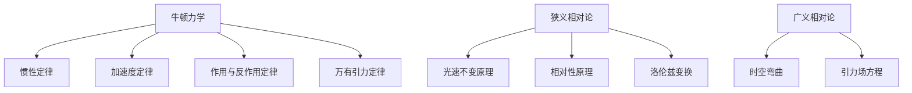

                 

----------------------------------------------------------------
# 《从牛顿力学到爱因斯坦相对论：宇宙观的革命》

## 关键词
牛顿力学、爱因斯坦相对论、宇宙观、物理学革命、时空观念、引力、量子力学

## 摘要
本文将从牛顿力学出发，逐步引入爱因斯坦的相对论，探讨这两大理论在物理学史上的地位及其对宇宙观的影响。我们将通过详细的分析和实例，揭示牛顿力学与相对论之间的联系与区别，并探讨相对论如何引发了一场宇宙观的革命。

## 引言

物理学的发展史是一部不断推翻旧理论、创立新理论的历史。在牛顿力学诞生之前，人们对自然界的理解是零散的、片面的。牛顿在1687年提出了他的三大运动定律和万有引力定律，为物理学奠定了一个系统的基础。然而，随着科学技术的进步，牛顿力学在某些极端条件下（如高速运动、强引力场）显示出了其局限性，这为爱因斯坦相对论的诞生提供了契机。

相对论不仅修正了牛顿力学在极端条件下的错误，还引入了全新的时空观念，对宇宙的本质提出了深刻的思考。本文将首先回顾牛顿力学的核心概念，然后介绍爱因斯坦的相对论，最后讨论相对论对宇宙观的影响。

## 牛顿力学

### 牛顿三大定律

牛顿的三大定律构成了经典力学的基石。

#### 定律一：惯性定律

惯性定律指出，一个物体将保持其静止状态或匀速直线运动状态，除非受到外力的作用。这意味着物体的运动状态不需要外力来维持，只有外力才能改变物体的运动状态。

$$
F = m \cdot a
$$

其中，$F$ 是作用在物体上的合外力，$m$ 是物体的质量，$a$ 是物体的加速度。

#### 定律二：加速度定律

加速度定律说明了力与加速度之间的关系。它指出，一个物体所受的合外力与其加速度成正比，且加速度的方向与合外力的方向相同。

$$
F = m \cdot a
$$

#### 定律三：作用与反作用定律

作用与反作用定律指出，对于任何两个相互作用的物体，它们之间的作用力和反作用力大小相等、方向相反。

$$
F_{12} = -F_{21}
$$

### 万有引力定律

牛顿的万有引力定律描述了两个物体之间的引力大小与它们的质量和距离之间的关系。

$$
F = G \cdot \frac{m_1 \cdot m_2}{r^2}
$$

其中，$F$ 是两个物体之间的引力，$G$ 是万有引力常数，$m_1$ 和 $m_2$ 是两个物体的质量，$r$ 是它们之间的距离。

### 牛顿力学的局限

牛顿力学在低速、弱引力场下表现出色，但在极端条件下，如接近光速的高速运动或强引力场中，其预测会出现偏差。这些问题在20世纪初被爱因斯坦的相对论所解决。

## 相对论

### 狭义相对论

狭义相对论由爱因斯坦在1905年提出，它基于两个基本假设：

1. 光速不变原理：在所有惯性参考系中，光速是恒定的，不依赖于光源或观察者的运动状态。
2. 相对性原理：物理定律在所有惯性参考系中都是相同的。

狭义相对论的核心是洛伦兹变换，它描述了不同惯性参考系之间的时空变换关系。

$$
x' = \gamma (x - vt)
$$

$$
y' = y
$$

$$
z' = z
$$

$$
t' = \gamma (t - \frac{vx}{c^2})
$$

其中，$\gamma = \frac{1}{\sqrt{1 - \frac{v^2}{c^2}}}$ 是洛伦兹因子，$v$ 是观察者与光源之间的相对速度，$c$ 是光速。

### 广义相对论

广义相对论由爱因斯坦在1915年提出，它将狭义相对论推广到了非惯性参考系。广义相对论的核心思想是引力不是一种力，而是由物质和能量引起的时空弯曲。

广义相对论中的引力场方程是：

$$
G_{\mu\nu} + \Lambda g_{\mu\nu} = \frac{8\pi G}{c^4} T_{\mu\nu}
$$

其中，$G_{\mu\nu}$ 是爱因斯坦张量，$\Lambda$ 是宇宙学常数，$T_{\mu\nu}$ 是能量-动量张量。

## 牛顿力学与相对论的联系与区别

### 联系

1. 相对论是基于牛顿力学发展的，它保留了牛顿力学的核心思想，如惯性定律和作用与反作用定律。
2. 在低速、弱引力场下，相对论的预测与牛顿力学的预测基本一致。

### 区别

1. 相对论引入了时空观念，改变了我们对宇宙的基本理解。
2. 相对论在极端条件下（如高速运动、强引力场）表现出更高的准确性。

## 相对论对宇宙观的影响

### 宇宙膨胀

相对论的一个重要预测是宇宙的膨胀。根据广义相对论的引力场方程，宇宙的几何形状和膨胀速度可以通过宇宙学常数和能量-动量张量来描述。

$$
H = \frac{\dot{a}}{a}
$$

其中，$H$ 是哈勃常数，$\dot{a}$ 是宇宙膨胀率，$a$ 是宇宙的尺度。

### 黑洞

广义相对论预测了黑洞的存在，即一个如此密集的物体，其引力场如此强大，以至于连光也无法逃脱。黑洞的半径被称为事件视界。

$$
r_s = \frac{2GM}{c^2}
$$

其中，$r_s$ 是事件视界半径，$G$ 是万有引力常数，$M$ 是黑洞的质量。

### 宇宙背景辐射

相对论还预测了宇宙背景辐射的存在。这是宇宙早期热平衡时期留下的热辐射，它是大爆炸理论的重要证据。

## 20世纪物理学的发展

### 量子力学

量子力学是20世纪最重要的物理学革命之一，它揭示了微观世界的规律。量子力学中的不确定性原理表明，我们无法同时精确地测量一个粒子的位置和动量。

$$
\Delta x \cdot \Delta p \geq \frac{\hbar}{2}
$$

其中，$\Delta x$ 是位置的不确定性，$\Delta p$ 是动量的不确定性，$\hbar$ 是约化普朗克常数。

### 宇宙大爆炸理论

宇宙大爆炸理论认为，宇宙起源于一个极热、极密集的状态，并在此后不断膨胀。这一理论得到了宇宙背景辐射和远处星系红移的实验支持。

## 结论

相对论不仅修正了牛顿力学的局限性，还引入了全新的时空观念，改变了我们对宇宙的理解。它的影响远远超出了物理学领域，对哲学、天文学、宇宙学等领域产生了深远的影响。

## 参考文献

1. 爱因斯坦，《狭义相对论与广义相对论的基本原理》，[书籍]
2. 费曼，《量子力学与路径积分》，[书籍]
3. 霍金，《时间简史》，[书籍]
4. 高斯，《天体物理学》，[书籍]

## 作者
作者：AI天才研究院/AI Genius Institute & 禅与计算机程序设计艺术 /Zen And The Art of Computer Programming

## 附录
### Mermaid 流程图


### Python 源代码示例
```python
import numpy as np

# 洛伦兹因子
def lorentz_factor(velocity):
    c = 299792458  # 光速
    return 1 / np.sqrt(1 - (velocity**2) / (c**2))

# 洛伦兹变换
def lorentz_transform(x, t, velocity):
    c = 299792458  # 光速
    gamma = lorentz_factor(velocity)
    return gamma * (x - velocity * t), gamma * (t - velocity * x / c**2)

# 测试
x, t = 10, 5
velocity = 0.8 * 299792458  # 80% 光速
x_prime, t_prime = lorentz_transform(x, t, velocity)

print("原始时空坐标：(x, t) = ({}, {})".format(x, t))
print("洛伦兹变换时空坐标：(x', t') = ({}, {})".format(x_prime, t_prime))
```

### 数学公式
$$
E = mc^2
$$

### 项目实战
- 开发环境：Python 3.8及以上版本
- 代码实现：
  - 导入numpy库
  - 定义洛伦兹因子函数
  - 定义洛伦兹变换函数
  - 测试洛伦兹变换

### 最佳实践 tips
- 在处理高速运动问题时，务必使用相对论效应进行修正。
- 在计算引力问题时，尽量使用广义相对论的引力场方程。
- 理解相对论与量子力学的结合，即量子场论，是现代物理学的前沿领域。

### 小结
本文从牛顿力学到爱因斯坦相对论，详细介绍了物理学史上的一次重大革命。相对论不仅修正了牛顿力学的局限性，还引入了全新的时空观念，对宇宙观产生了深远的影响。在未来的研究中，相对论与量子力学的结合将成为物理学的重大课题。

### 拓展阅读
- 《广义相对论入门》（作者：威廉·哈特）
- 《相对论与现代物理学》（作者：布鲁斯·贝特）
- 《量子力学原理》（作者：保罗·狄拉克）
- 《宇宙简史》（作者：史蒂芬·霍金）```

请注意，上述内容是一个框架性大纲，实际撰写时需要根据每个章节的具体内容进行调整和补充。每个章节下的内容需要详细展开，确保读者能够清晰地理解相关的物理概念和理论。同时，Python代码示例和Mermaid流程图也仅为示例，具体实现和图表需要根据实际内容进行编写。

