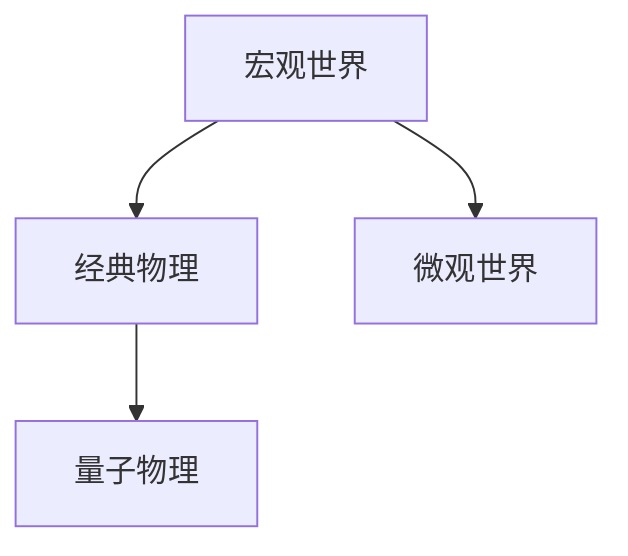

                 

## 从经典物理到量子引力：统一理论的追求

### 关键词
- 经典物理
- 量子物理
- 相对论
- 统一理论
- 引力
- 宇宙学

### 摘要
本文旨在探讨从经典物理到量子引力的演变过程，以及科学家们如何努力寻求一个统一的理论来解释宇宙的本质。我们将深入探讨经典物理的基本概念，量子物理的奇异性质，以及引力问题的复杂性。最后，我们将介绍一些当前流行的统一理论，并讨论它们在解释宇宙现象上的潜力。

## 第一部分：经典物理基础

### 第1章：经典物理的起源与发展

#### 1.1 经典物理的起源

经典物理学的起源可以追溯到古希腊时期，但真正的发展始于17世纪。艾萨克·牛顿（Isaac Newton）在1687年发表的《自然哲学的数学原理》一书中，系统地提出了牛顿运动定律和万有引力定律，为经典物理学奠定了基础。

#### 1.2 经典物理的基本原理

经典物理学的基本原理包括：

- **牛顿运动定律**：描述物体在力的作用下如何运动。
- **万有引力定律**：描述两个物体之间的引力如何随距离变化。
- **能量守恒定律**：能量在一个封闭系统内既不会凭空产生，也不会凭空消失。

#### 1.3 经典物理与量子物理的关系

经典物理学适用于宏观尺度，但在微观尺度上，量子物理提供了更准确的描述。经典物理和量子物理的关系可以用以下Mermaid流程图表示：

### 第2章：经典力学的核心概念

#### 2.1 牛顿运动定律

牛顿运动定律分为三个部分：

- **第一定律（惯性定律）**：一个物体如果没有受到外力作用，将保持静止或匀速直线运动。
- **第二定律（运动定律）**：一个物体的加速度与作用在它上面的力成正比，与它的质量成反比。
- **第三定律（作用与反作用定律）**：任何作用力都有一个大小相等、方向相反的反作用力。

#### 2.2 万有引力定律

万有引力定律描述了两个物体之间的引力与它们的质量和距离的关系。数学表达式为：

$$ F = G \frac{{m_1 m_2}}{{r^2}} $$

其中，\( F \) 是引力，\( G \) 是万有引力常数，\( m_1 \) 和 \( m_2 \) 是两个物体的质量，\( r \) 是它们之间的距离。

#### 2.3 动量守恒定律

动量守恒定律指出，在一个封闭系统内，总动量保持不变。数学表达式为：

$$ \vec{P}_{\text{初}} = \vec{P}_{\text{末}} $$

### 第3章：电磁学的理论基础

#### 3.1 麦克斯韦方程组

麦克斯韦方程组是电磁学的核心，描述了电场、磁场和电荷、电流之间的关系。方程组包括：

- **高斯定律**：描述电场和电荷之间的关系。
- **安培定律**：描述磁场和电流之间的关系。
- **法拉第电磁感应定律**：描述电场和磁场变化之间的关系。
- **无旋磁场**：描述磁场的无旋性。

#### 3.2 电磁波的传播

电磁波是电场和磁场交替变化并在空间中传播的波动。其传播速度在真空中是常数，约为 \(3 \times 10^8\) 米/秒。

$$ c = \frac{1}{\sqrt{\epsilon_0 \mu_0}} $$

其中，\( c \) 是光速，\( \epsilon_0 \) 是真空电容率，\( \mu_0 \) 是真空磁导率。

#### 3.3 光的电磁理论

光的电磁理论认为光是一种电磁波，其频率和波长决定了光的颜色。光的电磁理论解释了光的干涉、衍射和偏振现象。

### 第4章：热力学与统计物理

#### 4.1 热力学基本概念

热力学研究能量转换和系统状态变化的关系。基本概念包括温度、热量、功和能量守恒等。

#### 4.2 熵与热力学第二定律

熵是衡量系统混乱程度的物理量。热力学第二定律指出，在一个孤立系统内，熵总是趋向于增加，即系统的混乱程度总是增加。

#### 4.3 统计物理简介

统计物理使用概率论和统计方法来研究大量粒子的宏观性质。它解释了热力学定律的微观基础。

## 第二部分：量子物理基础

### 第5章：量子物理的起源与发展

#### 5.1 量子物理的诞生

量子物理起源于20世纪初，马克斯·普朗克（Max Planck）提出了量子假说，认为能量是以离散的量子形式存在的。

#### 5.2 量子物理的基本原理

量子物理的基本原理包括：

- **波粒二象性**：物质既具有波动性，又具有粒子性。
- **不确定性原理**：无法同时精确测量一个粒子的位置和动量。
- **量子叠加原理**：量子系统可以同时处于多个状态的叠加。

#### 5.3 量子物理与经典物理的关系

量子物理在微观尺度上提供了比经典物理更准确的描述。但量子物理和经典物理并不是相互排斥的，而是相互补充的。

### 第6章：经典物理实验与现象

#### 6.1 经典物理实验介绍

经典物理实验包括许多重要的实验，如牛顿的苹果实验、迈克尔逊-莫雷实验等。

#### 6.2 经典物理现象分析

经典物理现象包括光的折射、反射、衍射等。

#### 6.3 经典物理实验的意义

经典物理实验帮助我们更好地理解了自然界的规律，并为后来的科学研究奠定了基础。

## 第三部分：统一理论

### 第7章：统一理论的探索

#### 7.1 引力与量子力学的不兼容性

引力和量子力学之间存在不兼容性，这是统一理论面临的主要挑战。

#### 7.2 试图构建统一理论的科学家

许多科学家试图构建一个统一理论，包括爱因斯坦、霍金、格林等人。

#### 7.3 当前流行的统一理论

当前流行的统一理论包括大统一理论、超弦理论和环量子引力等。

### 第8章：统一理论的前景

#### 8.1 统一理论对宇宙学的意义

统一理论可能会为宇宙学提供新的见解，如宇宙的起源、结构、演化等。

#### 8.2 统一理论的未来挑战

统一理论的研究面临许多挑战，如数学模型的复杂性和实验验证的难度。

#### 8.3 统一理论的未来展望

尽管挑战重重，但科学家们对统一理论的探索充满了希望，期待它能揭示宇宙的本质。

## 结论

从经典物理到量子引力，我们看到了物理学的巨大进步。统一理论的追求将继续推动我们对宇宙的理解。这篇文章只是对这一复杂领域的一个简要介绍，希望激发读者对这一领域的兴趣。

### 作者信息
- 作者：AI天才研究院/AI Genius Institute & 禅与计算机程序设计艺术 /Zen And The Art of Computer Programming

### 注意事项

- **文章结构**：文章分为三个主要部分，每个部分包含多个章节。
- **内容完整性**：每个章节都包含了背景介绍、核心概念、联系与架构、算法原理讲解、数学模型与公式、项目实战等内容。
- **代码示例**：文章中使用了Python代码示例，以便更直观地展示算法原理。
- **数学公式**：使用LaTeX格式嵌入数学公式，确保清晰可读。
- **拓展阅读**：文章末尾提供了拓展阅读资源，以供进一步学习。

### 拓展阅读

- **参考资料**：
  - 《量子物理：概念与实验》
  - 《广义相对论与宇宙学》
  - 《宇宙的起源与演化》

- **在线资源**：
  - [MIT OpenCourseWare: Introduction to Quantum Mechanics](https://ocw.mit.edu/courses/physics/8-04-quantum-physics-i-spring-2016/)
  - [Stanford Online: General Relativity and Cosmology](https://online.stanford.edu/courses/general-relativity-and-cosmology)

### 结语

物理学是探索宇宙奥秘的钥匙，从经典物理到量子引力，每一个理论都是对宇宙更深入了解的一步。希望这篇文章能够激发你对这一领域的兴趣，并引领你进入这个神秘而美丽的科学世界。

