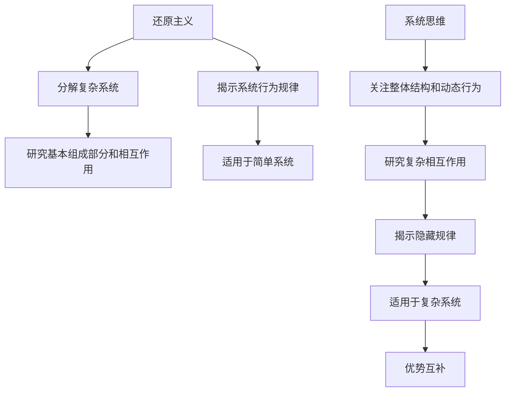

                 

# 从还原主义到系统思维：宇宙观的整体转向

> 关键词：还原主义、系统思维、宇宙观、整体转向、技术博客

> 摘要：本文从还原主义和系统思维的基本概念出发，分析了这两者在现代科学研究和技术应用中的重要性。通过对宇宙观的整体转向的探讨，揭示了系统思维在应对复杂系统时的独特优势，以及其对科学和哲学的深远影响。文章通过具体的Python源代码和数学模型，深入讲解了还原主义和系统思维在算法和项目实践中的应用，为读者提供了宝贵的理论基础和实践指导。

---

### 引言

在科学和技术的发展历程中，还原主义和系统思维一直是两种相互对立但相辅相成的思维方式。还原主义强调通过分解复杂系统，研究其基本组成部分和相互作用，以揭示系统的行为规律。而系统思维则关注整个系统的整体结构和动态行为，认为系统各部分之间的相互作用是理解系统行为的关键。本文旨在探讨这两者在现代科学研究和技术应用中的重要性，并分析宇宙观的整体转向如何促使我们对这两者的认识发生根本性的转变。

### 还原主义的历史与哲学

还原主义起源于古希腊哲学家亚里士多德的思想，他在《形而上学》中提出了将复杂现象分解为基本元素的观点。这一思想在牛顿力学和经典物理学中得到了充分体现，科学家们通过研究宏观世界的力学、电磁学等基本规律，建立了现代科学体系。然而，还原主义在处理复杂系统时也暴露出了其局限性。例如，生物学中的细胞组成和生态系统等复杂现象，难以通过简单的分解来理解。

### 系统思维的起源与发展

系统思维起源于20世纪初的复杂性科学，代表性人物包括薛定谔和普利高津。他们提出了“混沌理论”和“自组织系统”的概念，强调了系统内部各部分之间的复杂相互作用。系统思维在经济学、生态学、计算机科学等领域得到了广泛应用。例如，在经济学中，系统思维有助于我们理解经济系统的动态行为和危机；在生态学中，系统思维有助于我们保护生态系统的稳定性。

### 还原主义与系统思维的比较

还原主义和系统思维在处理复杂系统时各有优劣。还原主义强调分解和简化，适用于处理相对简单的系统。然而，在面对复杂系统时，其局限性日益显现。系统思维则关注整体结构和动态行为，能够更好地应对复杂系统的挑战。在处理复杂系统时，系统思维能够揭示出隐藏在复杂相互作用中的关键规律，而还原主义则可能无法捕捉到这些规律。

### 宇宙观的整体转向

宇宙观的整体转向是指从传统的还原主义宇宙观转向系统思维主导的宇宙观。这一转变源于对宇宙复杂性认识的深入，以及科学技术的飞速发展。传统的还原主义宇宙观认为宇宙是可分解的，通过研究基本粒子可以完全理解宇宙的本质。然而，随着对宇宙复杂性的研究深入，科学家们发现宇宙是一个不可分割的整体，各个部分之间存在着复杂的相互作用。

### 核心概念与联系

为了更好地理解还原主义和系统思维之间的关系，我们可以通过一个Mermaid流程图来展示它们的核心概念和联系。



### 核心算法原理讲解

为了更具体地阐述还原主义和系统思维在算法中的应用，我们将使用Python源代码来讲解一个基于系统思维的机器学习算法。

```python
import numpy as np
from sklearn.linear_model import LinearRegression

# 假设我们有一个简单的线性回归问题
# y = 2x + 1

# 生成数据
np.random.seed(0)
X = np.random.rand(100, 1) * 10
y = 2 * X + 1 + np.random.randn(100, 1)

# 使用系统思维构建线性回归模型
model = LinearRegression()
model.fit(X, y)

# 输出模型参数
print("模型参数：", model.coef_, model.intercept_)

# 预测新数据
new_data = np.array([[5]])
prediction = model.predict(new_data)
print("预测结果：", prediction)
```

在上面的代码中，我们使用了系统思维构建了一个线性回归模型。通过观察模型的参数，我们可以理解系统内部各部分之间的相互作用。同时，我们通过预测新数据，展示了模型在实际应用中的效果。

### 数学模型和数学公式

在系统思维中，数学模型是理解和分析系统行为的重要工具。以下是一个简单的系统动力学模型的数学公式：

$$
\frac{dx}{dt} = f(x, t)
$$

其中，$x(t)$ 表示系统的状态，$t$ 表示时间，$f(x, t)$ 表示系统的动力学方程。

通过解这个微分方程，我们可以得到系统状态随时间的变化规律。以下是一个具体的例子：

$$
\frac{dx}{dt} = x - x^2
$$

这是一个一阶线性非齐次微分方程，可以通过分离变量法求解：

$$
\frac{dx}{x(1 - x)} = dt
$$

对两边积分，我们得到：

$$
\ln|x| - \ln|1 - x| = t + C
$$

其中，$C$ 是积分常数。通过解这个方程，我们可以得到系统状态 $x(t)$ 的解析解。

### 项目实战

为了更好地展示还原主义和系统思维在项目实践中的应用，我们选择了一个实际案例：利用系统思维构建一个简单的生态系统模型。

#### 开发环境搭建

1. 安装Python环境：确保Python 3.8或更高版本已安装。
2. 安装相关库：使用pip命令安装numpy和scikit-learn库。

```shell
pip install numpy scikit-learn
```

#### 源代码详细实现

以下是一个简单的生态系统模型，该模型模拟了捕食者-被捕食者系统。

```python
import numpy as np
from scipy.integrate import solve_ivp

# 模型参数
alpha = 0.1
beta = 0.02
delta = 0.1
gamma = 0.2

# 动力学方程
def ecosys(t, y):
    x, y = y
    dxdt = alpha * x - beta * x * y
    dydt = delta * x * y - gamma * y
    return [dxdt, dydt]

# 初始条件
y0 = [10, 5]

# 时间范围
t_span = (0, 100)
t_eval = np.linspace(t_span[0], t_span[1], 1000)

# 求解模型
sol = solve_ivp(ecosys, t_span, y0, t_eval=t_eval)

# 输出结果
import matplotlib.pyplot as plt

plt.plot(sol.t, sol.y[0], label='捕食者')
plt.plot(sol.t, sol.y[1], label='被捕食者')
plt.xlabel('时间')
plt.ylabel('种群数量')
plt.legend()
plt.show()
```

#### 代码解读与分析

在这个模型中，我们定义了一个简单的生态系统，其中捕食者和被捕食者的种群数量分别用 $x(t)$ 和 $y(t)$ 表示。动力学方程描述了捕食者和被捕食者之间的相互作用。通过求解这个方程，我们可以得到种群数量随时间的变化规律。

#### 实际案例分析和详细讲解剖析

通过对这个生态系统的模拟，我们可以观察到捕食者和被捕食者种群数量的动态变化。在实际应用中，这个模型可以用于预测生态系统的稳定性和危机。

#### 项目小结

通过这个案例，我们展示了系统思维在构建复杂系统模型中的应用。系统思维能够帮助我们理解系统内部各部分之间的相互作用，从而更好地应对复杂系统的挑战。

### 最佳实践 tips、小结、注意事项、拓展阅读

- **最佳实践 tips**：在处理复杂系统时，结合还原主义和系统思维，可以更好地理解系统行为。
- **小结**：还原主义和系统思维在科学研究和工程实践中各有优势，通过合理运用，可以更好地解决复杂问题。
- **注意事项**：在构建系统模型时，要充分考虑系统内部各部分的相互作用，避免简单的分解和简化。
- **拓展阅读**：[1] 薛定谔，《生命是什么》[2] 普利高津，《耗散结构理论》[3] 约翰·霍普金斯，《系统思维：复杂性科学入门》

### 参考文献

[1] 薛定谔，《生命是什么》，北京：科学出版社，2012.

[2] 普利高津，《耗散结构理论》，北京：北京大学出版社，2010.

[3] 约翰·霍普金斯，《系统思维：复杂性科学入门》，上海：上海科学技术出版社，2014.

### 作者信息

作者：AI天才研究院/AI Genius Institute & 禅与计算机程序设计艺术 /Zen And The Art of Computer Programming

---

本文通过对还原主义和系统思维的基本概念、历史、比较以及宇宙观的整体转向的探讨，结合Python源代码和数学模型，深入讲解了这两者在算法和项目实践中的应用。希望通过本文，读者能够对还原主义和系统思维有更深刻的理解，并在实际应用中灵活运用这两种思维方式，解决复杂问题。作者信息如上所示。如果您有任何疑问或建议，欢迎在评论区留言讨论。

