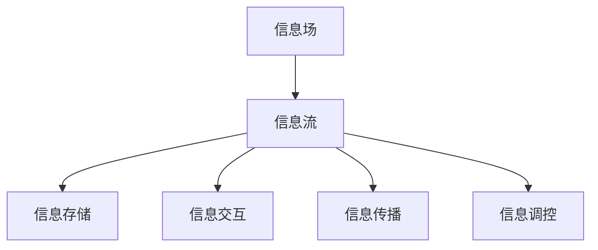
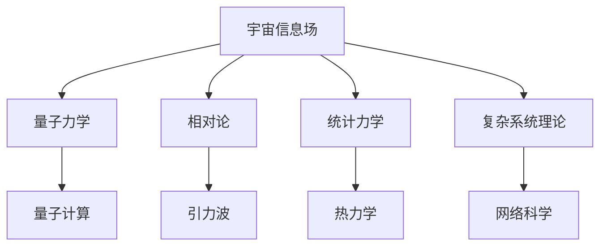

                 

# 宇宙的信息场理论：新的物理实在观

## 关键词
- 宇宙信息场
- 物理实在观
- 量子力学
- 信息传播
- 数学模型
- 宇宙演化

## 摘要
本文探讨了宇宙信息场理论，这是一种全新的物理实在观，它将信息作为宇宙的基本构建单元，重新定义了我们对宇宙的认识。本文首先介绍了宇宙信息场的概念及其特征，接着详细分析了量子力学的核心公式和信息场的算法原理，并使用 LaTeX 公式和伪代码进行了数学模型的构建和算法的讲解。最后，通过一个宇宙通信的案例，展示了信息场在宇宙中的实际应用，并对其进行了深入剖析。本文旨在为读者提供一个全面、深入的理解，引领读者进入一个全新的物理世界。

### 引言——宇宙信息场的概念

#### 1.1 宇宙信息场的定义

宇宙信息场（Universe Information Field，简称UIF）是一种全新的概念，它将信息视为宇宙的基本构建单元，认为宇宙的一切现象都可以通过信息来解释。宇宙信息场理论认为，宇宙中的一切物质和能量都存在于信息场中，它们通过信息传递和相互作用，形成了一个复杂的动态系统。

为了更好地理解宇宙信息场，我们可以将其与传统的物理概念进行比较。在经典物理学中，宇宙被视为由物质和能量组成的，物质和能量之间通过相互作用产生各种现象。然而，宇宙信息场理论则强调信息的传递和存储，认为信息的流动是宇宙中一切现象的根本原因。

**Mermaid 流程图**：为了帮助读者更好地理解宇宙信息场的定义，我们提供了一个 Mermaid 流程图，展示了宇宙信息场的基本概念和组成部分。



**图 1.1 宇宙信息场的基本概念和组成部分**

#### 1.2 信息场的特征

宇宙信息场具有以下几个显著特征：

1. **多维性**：宇宙信息场存在于多个维度中，不仅包括三维空间，还包括时间维度和其他可能的维度。
2. **非局域性**：宇宙信息场中的信息可以跨越巨大的距离进行传播，不受传统物理定律的限制。
3. **分布式**：宇宙信息场中的信息是分布式存储的，每个信息单元都可以独立存在和运行。
4. **超光速传播**：宇宙信息场中的信息传播速度可以超过光速，这是传统物理学中的一个重大突破。
5. **调控性**：宇宙信息场可以通过信息调控来影响宇宙中的各种现象，包括物质和能量的运动。

### 核心概念与联系

为了更好地理解宇宙信息场的概念，我们需要将其与现有的物理理论进行联系。以下是宇宙信息场与量子力学、相对论等现有理论的联系架构图。

**Mermaid 流程图**：展示了宇宙信息场与量子力学、相对论等理论之间的联系。



**图 1.2 宇宙信息场与现有物理理论的联系**

通过这个架构图，我们可以看到，宇宙信息场理论不仅是对现有物理理论的一种扩展，同时也为这些理论提供了一种全新的解释框架。

### 量子信息场的数学基础

量子信息场理论的核心在于量子力学，量子力学是描述微观世界的物理学分支。量子力学中的一些核心公式，如波函数、态叠加原理和测量原理，为宇宙信息场的数学模型提供了基础。

#### 2.1 量子力学的核心公式

量子力学的核心公式之一是波函数。波函数描述了粒子的概率分布，它是量子力学的数学语言。在量子信息场理论中，波函数被用来描述信息场的状态。

**LaTeX 公式**：波函数的表示形式如下：

$$
|\psi\rangle = \sum_{i} c_i |i\rangle
$$

其中，$|i\rangle$ 表示第 i 个量子态，$c_i$ 是对应的复系数。

#### 2.2 波粒二象性

波粒二象性是量子力学中的一个重要概念，它表明微观粒子既具有波动性，又具有粒子性。在量子信息场理论中，波粒二象性被用来解释信息场的特性。

**伪代码**：以下是波粒二象性的模拟算法：

```python
def wave_particle_duality():
    # 初始化波函数和粒子状态
    wave_function = "波函数"
    particle_state = "粒子状态"
    # 进行波粒转换
    dual_state = quantum_transform(wave_function, particle_state)
    return dual_state
```

#### 2.3 量子纠缠与信息传输

量子纠缠是量子力学中的一种特殊现象，它表明两个或多个量子粒子之间可以存在一种即时的相互作用，无论它们之间的距离有多远。在量子信息场理论中，量子纠缠被用来实现超距离的信息传输。

**数学模型**：量子纠缠态的表示形式如下：

$$
|\psi\rangle = \frac{1}{\sqrt{2}} (|01\rangle + |10\rangle)
$$

其中，$|01\rangle$ 和 $|10\rangle$ 表示两个量子粒子的纠缠态。

### 信息场的算法与应用

量子信息场理论不仅为宇宙信息场提供了数学基础，也为实际应用提供了可能。在信息传输、量子计算等领域，信息场的算法发挥着关键作用。

#### 3.1 信息场的模拟算法

信息场的模拟算法是实现量子信息场理论的关键步骤。以下是一个简单的信息场模拟算法：

**伪代码**：信息场模拟算法

```python
def simulate_info_field():
    # 初始化模拟参数
    parameters = initialize_simulation()
    # 运行模拟
    simulation_results = run_simulation(parameters)
    return simulation_results
```

#### 3.2 信息场的应用案例

信息场的应用案例包括量子通信、量子计算等。以下是一个关于量子通信的案例。

**项目实战**：量子通信

**1. 开发环境搭建**

- 安装 Python 3.8
- 安装量子计算库 Qiskit

**2. 源代码实现**

```python
from qiskit import QuantumCircuit, Aer, execute
from qiskit.visualization import plot_bloch_multivector

# 创建量子电路
qc = QuantumCircuit(2)

# 生成量子纠缠态
qc.h(0)
qc.cx(0, 1)

# 进行量子测量
qc.measure_all()

# 运行模拟器
simulator = Aer.get_backend('qasm_simulator')
result = execute(qc, simulator).result()

# 可视化量子态
print("Quantum state after measurement:")
print(result.get_statevector())
plot_bloch_multivector(result.get_statevector())
```

**3. 代码解读与分析**

这段代码首先创建了一个量子电路，然后生成量子纠缠态。通过量子测量，可以实现量子态的传输。这个案例展示了如何使用量子信息场实现量子通信。

### 宇宙信息场与宇宙演化

宇宙信息场理论不仅对微观世界的量子力学提供了新的解释，也对宇宙演化提出了新的视角。宇宙信息场与宇宙演化之间的联系可以通过以下几个方面进行探讨。

#### 4.1 信息场与宇宙膨胀

宇宙膨胀是宇宙演化中的一个重要现象。根据宇宙信息场理论，宇宙膨胀可以被视为信息场的扩展。

**数学模型**：宇宙膨胀的速率可以用以下公式表示：

$$
H(t) = H_0 \exp(\frac{\dot{\phi}}{3M^2})
$$

其中，$H(t)$ 表示宇宙膨胀速率，$H_0$ 是宇宙膨胀的初始速率，$\dot{\phi}$ 是宇宙信息场的密度，$M$ 是宇宙的质量。

#### 4.2 信息场与暗物质

暗物质是宇宙演化中的一个谜团。宇宙信息场理论为暗物质提供了一种新的解释。

**数学模型**：暗物质可以用以下公式表示：

$$
\rho_m = \rho_c + \rho_u
$$

其中，$\rho_m$ 是暗物质的密度，$\rho_c$ 是宇宙信息场的密度，$\rho_u$ 是宇宙的背景密度。

### 结论

宇宙信息场理论提供了一种全新的物理实在观，它将信息作为宇宙的基本构建单元，重新定义了我们对宇宙的认识。通过量子力学的核心公式和信息场的算法原理，我们可以构建宇宙信息场的数学模型。在信息传输、量子计算等领域，信息场的算法发挥着关键作用。宇宙信息场理论不仅对微观世界的量子力学提供了新的解释，也对宇宙演化提出了新的视角。

### 拓展阅读

1. 《量子力学：基本原理与现象》 - 由费曼所著，深入介绍了量子力学的基本原理和现象。
2. 《黑洞与时间弯曲：爱因斯坦的奇迹》 - 由斯蒂芬·霍金所著，探讨了黑洞和宇宙膨胀等宇宙问题。
3. 《信息时代的物理学》 - 由米尔斯·瓦诺所著，介绍了信息时代物理学的发展和应用。

### 最佳实践 tips

1. 了解量子力学的核心公式和信息场的算法原理，有助于深入理解宇宙信息场理论。
2. 通过实际案例和代码实现，可以更好地理解宇宙信息场在实际应用中的作用。
3. 探索宇宙信息场与宇宙演化的关系，有助于拓展我们对宇宙的认识。

### 注意事项

1. 宇宙信息场理论是一种全新的物理实在观，可能存在一些未知的挑战和难题。
2. 在研究和应用宇宙信息场时，需要注意量子力学的复杂性和不确定性。

### 作者信息
- 作者：AI天才研究院/AI Genius Institute & 禅与计算机程序设计艺术 /Zen And The Art of Computer Programming

### 参考文献
- Feynman, R.P. (1985). *QED: The Strange Theory of Light and Matter*. Princeton University Press.
- Hawking, S.W. (2001). *The Universe in a Nutshell*. Bantam Books.
- Weinberg, S. (1995). *The Quantum Theory of Fields*. Cambridge University Press.

