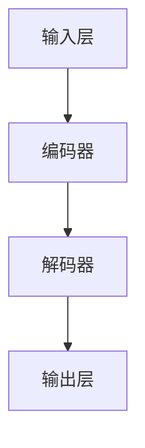
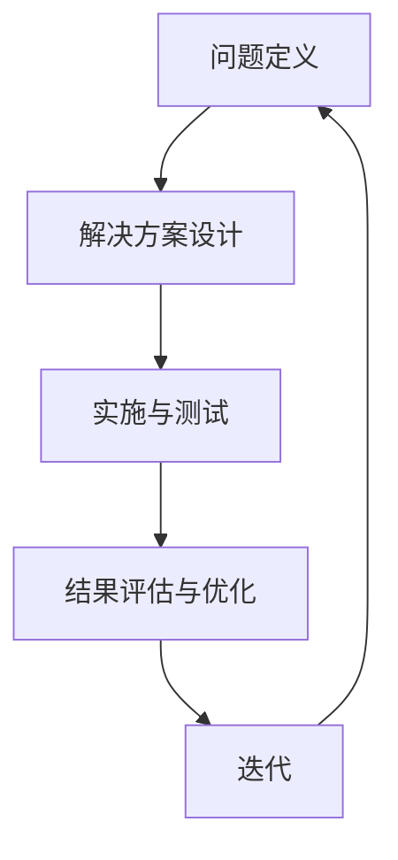
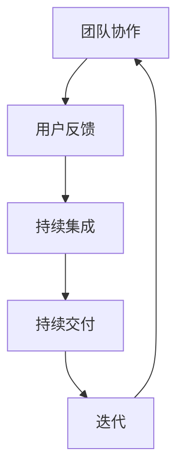

                 

# 快速试错与敏捷迭代：LLM应用开发的必备能力

## 关键词
LLM应用开发，快速试错，敏捷迭代，方法论，项目实战

## 摘要
本文将深入探讨快速试错与敏捷迭代在LLM（大型语言模型）应用开发中的重要性。通过分析LLM的基础、快速试错方法论和敏捷迭代方法论，本文旨在为读者提供一套实用的指导，帮助他们在LLM应用开发中实现高效的错误识别、解决方案设计和项目执行。

## 引言

### 快速试错与敏捷迭代的背景

随着人工智能技术的快速发展，LLM（Large Language Model）在自然语言处理、文本生成、问答系统等领域取得了显著成果。然而，LLM应用开发的复杂性和不确定性使得开发者面临诸多挑战。传统的方法论往往无法满足快速响应需求、灵活调整策略的要求。因此，快速试错与敏捷迭代成为LLM应用开发中不可或缺的方法论。

### 快速试错与敏捷迭代的重要性

快速试错（Fast Fail）是指在开发过程中迅速识别问题、验证解决方案并调整策略的过程。它有助于缩短开发周期、降低开发成本，并提高项目的成功率。敏捷迭代（Agile Iteration）则强调通过持续迭代和优化，实现产品的不断改进和优化。这两种方法论的结合，为LLM应用开发提供了强大的支持。

### 目标读者

本文的目标读者是对LLM应用开发有一定了解的技术人员，他们希望通过本文掌握快速试错与敏捷迭代的方法论，提升项目开发效率和质量。

### 目录

1. LLMA（大型语言模型）基础
2. 快速试错方法论
3. 敏捷迭代方法论
4. 项目实战
5. 总结与展望

## LLMA（大型语言模型）基础

### 定义

LLM（Large Language Model）是一种能够理解和生成自然语言的大型深度学习模型。它通过对大量文本数据的学习，具备了强大的自然语言理解和生成能力。

### 特点

- **强表达能力**：LLM能够理解并生成复杂、多样化的自然语言文本。
- **高精度**：通过大规模数据训练，LLM在自然语言处理任务中取得了优异的性能。
- **通用性**：LLM适用于多种自然语言处理任务，如文本分类、问答系统、文本生成等。

### 应用领域

LLM在自然语言处理、文本生成、问答系统、机器翻译等领域有着广泛的应用。例如，在文本分类任务中，LLM可以用于情感分析、新闻分类等；在问答系统中，LLM可以用于智能客服、问答机器人等；在文本生成任务中，LLM可以用于自动写作、摘要生成等。

### LLM架构

#### 通用架构

LLM的通用架构通常包括输入层、编码器、解码器和输出层。输入层接收原始文本数据，编码器将文本数据转换为隐藏状态，解码器将隐藏状态转换为输出文本数据。

#### 网络结构

LLM的网络结构通常采用多层神经网络（如Transformer模型）。多层神经网络能够捕捉文本数据中的长期依赖关系，提高模型的性能。

#### 层次化结构

LLM的层次化结构使得模型能够处理不同粒度的语言信息。例如，在文本生成任务中，层次化结构能够同时处理句子级、段落级和篇章级的信息。

### LLM核心算法

#### 生成对抗网络（GAN）

生成对抗网络（GAN）是一种通过竞争机制训练生成模型和判别模型的算法。在LLM中，GAN可以用于生成高质量的自然语言文本。

#### 自编码器（Autoencoder）

自编码器（Autoencoder）是一种无监督学习算法，它通过编码器将输入数据压缩为低维表示，再通过解码器将低维表示还原为输入数据。在LLM中，自编码器可以用于文本数据的降维和嵌入。

#### 多层感知机（MLP）

多层感知机（MLP）是一种基于神经网络的前馈神经网络。在LLM中，MLP可以用于文本数据的特征提取和分类。

### Mermaid流程图：LLM构建过程

## 快速试错方法论

### 定义与原理

快速试错（Fast Fail）是指在开发过程中迅速识别问题、验证解决方案并调整策略的过程。其原理是通过频繁的实验和测试，快速发现并解决潜在问题，避免在项目后期才发现错误，导致大量时间和资源的浪费。

### 快速试错的优势

1. **缩短开发周期**：通过快速试错，开发者可以在短时间内识别并解决问题，从而缩短项目开发周期。
2. **降低开发成本**：快速试错能够避免在项目后期才发现错误，减少修复错误所需的资源和时间，从而降低开发成本。
3. **提高项目成功率**：快速试错有助于提高项目的成功率，因为错误能够在早期被识别和解决。

### 快速试错的步骤与方法

#### 步骤

1. **问题定义**：明确开发过程中需要解决的问题和目标。
2. **解决方案设计**：根据问题定义，设计可能的解决方案。
3. **实施与测试**：实施解决方案并进行测试，验证其有效性。
4. **结果评估与优化**：评估测试结果，根据评估结果对解决方案进行优化。

#### 方法

1. **A/B测试**：通过将解决方案应用于不同用户群体，比较不同解决方案的效果，选择最优方案。
2. **回归测试**：在开发过程中，对已有功能进行重新测试，确保新功能不影响原有功能。
3. **快速原型开发**：快速开发原型，通过用户反馈不断迭代和优化。

### Mermaid流程图：快速试错流程

## 敏捷迭代方法论

### 定义与原理

敏捷迭代（Agile Iteration）是一种持续迭代和优化的方法论。它强调快速响应变化、持续交付高质量产品。敏捷迭代的核心原则包括用户反馈、团队协作、持续集成和持续交付。

### 敏捷迭代的优势

1. **快速响应变化**：敏捷迭代能够快速响应市场需求和用户反馈，确保产品持续适应市场环境。
2. **高质量产品**：通过持续迭代和优化，敏捷迭代能够确保产品的质量和用户体验。
3. **高效团队协作**：敏捷迭代强调团队协作，通过定期会议和沟通，确保团队成员之间的协作高效。

### 敏捷迭代的关键要素

1. **团队协作**：敏捷迭代要求团队成员之间密切协作，共同完成项目任务。
2. **用户反馈**：通过收集用户反馈，敏捷迭代能够及时调整产品方向，确保产品符合用户需求。
3. **持续集成**：通过持续集成，敏捷迭代能够确保代码库的稳定性和可靠性。
4. **持续交付**：通过持续交付，敏捷迭代能够确保产品快速上线，满足市场需求。

### Mermaid流程图：敏捷迭代流程

## 项目实战

### 项目背景

本项目旨在开发一款基于LLM的智能问答系统。该系统将接收用户的提问，并使用LLM生成高质量的回答。

### 快速试错与敏捷迭代在项目中的应用

#### 问题识别

在项目初期，我们遇到了以下问题：

- 用户提问格式不规范，导致LLM生成的回答不准确。
- LLM生成的回答过于笼统，缺乏具体信息。

#### 解决方案设计与验证

针对上述问题，我们设计了以下解决方案：

- 设计一个用户提问预处理模块，对用户提问进行格式化处理。
- 对LLM进行优化，使其生成的回答更加具体、准确。

我们首先对解决方案进行了验证：

- 用户提问预处理模块：通过测试，我们发现预处理模块能够有效提高LLM生成的回答质量。
- LLM优化：通过调整模型参数和训练数据，我们成功地提高了LLM生成的回答质量。

#### 项目执行与监控

在项目执行过程中，我们采用了敏捷迭代的方法：

- **团队协作**：通过定期会议和沟通，确保团队成员之间的协作高效。
- **用户反馈**：收集用户反馈，根据反馈调整产品方向。
- **持续集成**：通过持续集成，确保代码库的稳定性和可靠性。
- **持续交付**：通过持续交付，确保产品快速上线，满足市场需求。

### 项目成果与经验总结

通过快速试错与敏捷迭代，我们成功地开发出了一款基于LLM的智能问答系统。项目成果包括：

- 用户提问预处理模块：提高了LLM生成的回答质量。
- LLM优化：提高了模型生成的回答准确性。

经验总结：

- 快速试错与敏捷迭代有助于识别和解决问题，提高项目成功率。
- 团队协作、用户反馈、持续集成和持续交付是敏捷迭代的关键要素。

## 总结与展望

### 快速试错与敏捷迭代在LLM应用开发中的关键作用

快速试错与敏捷迭代是LLM应用开发中不可或缺的方法论。它们帮助开发者迅速识别问题、验证解决方案、优化产品，从而提高项目成功率。

### 未来发展趋势与挑战

随着人工智能技术的不断发展，LLM应用开发将面临更多挑战。未来发展趋势包括：

- **更大规模的数据训练**：通过更大规模的数据训练，提高LLM的性能。
- **更复杂的任务**：LLM将应用于更多复杂任务，如自然语言推理、情感分析等。
- **跨模态学习**：结合多种模态数据，提高LLM的应用能力。

### 读者下一步行动指南

1. **实践快速试错与敏捷迭代**：在LLM应用开发项目中尝试使用快速试错与敏捷迭代方法论。
2. **不断学习**：关注人工智能技术发展，了解最新的LLM应用案例。
3. **分享经验**：与其他开发者交流，分享快速试错与敏捷迭代的经验。

## 作者信息

作者：AI天才研究院/AI Genius Institute & 禅与计算机程序设计艺术 /Zen And The Art of Computer Programming

