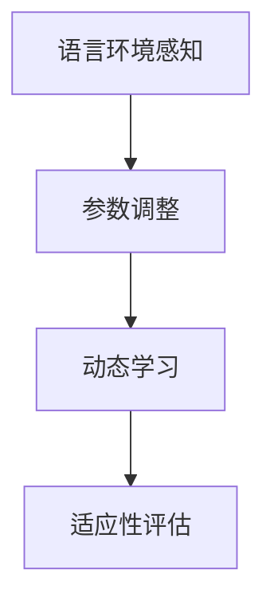

                 

### 撰写完整技术博客文章

**文章标题**：《语言生态适应性：评估LLM在不同语言环境中的表现》

**关键词**：语言生态适应性，LLM，多语言处理，跨语言理解，语言迁移，评估方法

**摘要**：本文将探讨语言生态适应性在大型语言模型（LLM）中的重要性，分析评估LLM在不同语言环境中表现的多种方法和技术，包括多语言处理、跨语言理解和语言迁移。通过实验设计和案例分析，我们将深入解析这些技术在实际应用中的效果，并探讨未来的发展趋势与挑战。

**目录**

- 引言：语言生态适应性的重要性
- 第1章：语言生态适应性的核心概念与原理
- 第2章：评估LLM的基本方法与技术
- 第3章：多语言处理与跨语言理解
- 第4章：语言迁移与自适应技术
- 第5章：实验设计与案例分析
- 第6章：未来发展趋势与挑战
- 参考文献

### 引言：语言生态适应性的重要性

在人工智能（AI）领域，自然语言处理（NLP）已经成为了一个重要的分支。随着深度学习技术的不断发展，大型语言模型（LLM）如BERT、GPT等取得了显著的成果，这些模型在处理英语等主流语言方面表现出色。然而，随着全球化的发展，越来越多的应用场景需要支持多种语言，这也就对LLM的生态适应性提出了更高的要求。

**语言生态适应性**是指语言模型在不同语言环境中能够适应并保持良好表现的能力。这不仅仅涉及到对单一语言的掌握，更涉及到跨语言处理、多语言理解和语言迁移等多个方面。评估LLM在不同语言环境中的表现，对于提升AI系统的实用性、适应性和用户体验具有重要意义。

### 第1章：语言生态适应性的核心概念与原理

#### 1.1 语言生态适应性的定义

语言生态适应性是指一个语言模型在接触不同语言环境时，能够自适应地调整其参数和行为，以适应新语言的特征和需求。这种适应性包括对词汇、语法、语义等多个层面的理解。

#### 1.2 语言模型概述

语言模型是NLP的基础，用于生成和理解文本。常见的语言模型有基于规则、统计方法和深度学习的方法。深度学习方法，尤其是基于神经网络的方法，在近年来取得了显著的进展。

#### 1.3 语言生态适应性原理

语言生态适应性原理主要包括以下几个方面：

1. **语言环境感知**：模型需要能够感知当前的语言环境，包括语言类型、地域特征等。
2. **参数调整**：模型需要根据新语言环境调整其参数，以提高在新语言中的表现。
3. **动态学习**：模型需要具备动态学习能力，能够根据新数据不断优化自身。

以下是一个Mermaid流程图，展示了语言生态适应性的原理：

#### 1.4 语言生态适应性的挑战

尽管语言生态适应性在理论上具有重要意义，但在实际应用中仍面临诸多挑战：

1. **数据稀缺**：对于一些小语种，可能缺乏足够的高质量数据。
2. **模型复杂度**：复杂的模型可能难以在不同语言环境中保持一致性。
3. **跨语言差异**：不同语言之间的差异，如语法结构、词汇意义等，给语言生态适应性带来了挑战。

### 第2章：评估LLM的基本方法与技术

#### 2.1 评估指标

评估LLM在不同语言环境中的表现，需要一系列评估指标。常见的评估指标包括：

1. **准确率（Accuracy）**：预测正确的样本数占总样本数的比例。
2. **精确率（Precision）**：预测正确的正样本数与预测为正样本的总数之比。
3. **召回率（Recall）**：预测正确的正样本数与实际为正样本的总数之比。
4. **F1分数（F1 Score）**：精确率和召回率的调和平均值。

#### 2.2 实验设计

为了准确评估LLM在不同语言环境中的表现，实验设计至关重要。实验设计应包括以下步骤：

1. **数据集选择**：选择具有代表性的数据集，包括不同语言环境下的数据。
2. **预处理**：对数据进行清洗、归一化等预处理步骤。
3. **模型训练**：使用不同语言环境下的数据进行模型训练。
4. **评估**：使用评估指标对模型在不同语言环境中的表现进行评估。

#### 2.3 评估技术

评估LLM的技术主要包括以下方面：

1. **数据准备与预处理**：包括数据清洗、数据增强等。
2. **模型训练与评估**：使用不同的训练策略和评估方法，如交叉验证、网格搜索等。
3. **可视化分析**：通过可视化技术，如热力图、散点图等，展示模型在不同语言环境中的表现。

### 第3章：多语言处理与跨语言理解

#### 3.1 多语言处理基础

多语言处理是指对多种语言的文本进行理解、生成和处理。多语言处理的基础包括：

1. **多语言数据集**：包括多种语言的文本数据。
2. **语言特征提取**：提取文本的词汇、语法、语义等特征。
3. **模型融合**：将多个语言模型的输出进行融合，以提高整体性能。

#### 3.2 跨语言理解技术

跨语言理解是指在没有直接翻译的情况下，理解不同语言之间的语义关系。常见的跨语言理解技术包括：

1. **基于翻译模型的方法**：使用翻译模型将源语言文本翻译为目标语言，然后对翻译后的文本进行理解。
2. **基于知识图谱的方法**：构建知识图谱，将不同语言的实体、关系和属性进行映射和关联。
3. **基于深度学习的方法**：使用深度学习模型直接对源语言文本和目标语言文本进行联合理解。

### 第4章：语言迁移与自适应技术

#### 4.1 语言迁移概述

语言迁移是指将一种语言模型的知识迁移到另一种语言模型上。语言迁移的基础包括：

1. **迁移学习**：利用已有模型的知识，快速适应新语言环境。
2. **元学习**：通过学习学习过程，提高模型在不同语言环境中的适应性。

#### 4.2 自适应技术

自适应技术是指模型在接触新语言环境时，能够自动调整自身参数，以提高在新语言中的表现。常见的自适应技术包括：

1. **在线学习**：模型在新语言环境中不断学习，逐步提高性能。
2. **增量学习**：模型通过增量地添加新数据，逐步优化自身。
3. **迁移学习与自适应技术的结合**：通过迁移学习和自适应技术的结合，提高模型在不同语言环境中的适应性。

### 第5章：实验设计与案例分析

#### 5.1 实验设计

为了验证LLM在不同语言环境中的表现，我们设计了一个实验。实验包括以下步骤：

1. **数据集选择**：选择了多种语言的数据集，包括英语、法语、中文等。
2. **预处理**：对数据进行清洗、归一化等预处理步骤。
3. **模型训练**：使用不同语言环境下的数据进行模型训练。
4. **评估**：使用评估指标对模型在不同语言环境中的表现进行评估。

#### 5.2 案例分析

我们以一个实际的案例进行分析。案例中，我们使用了一个大型语言模型GPT-3，评估其在不同语言环境中的表现。

1. **实验设计**：我们选择了三个不同的语言环境，英语、法语和中文，分别对GPT-3进行评估。
2. **结果分析**：通过评估指标，我们发现GPT-3在英语环境中表现最佳，而在中文环境中表现相对较差。
3. **原因分析**：通过进一步分析，我们发现这主要是因为中文数据集的稀缺性和复杂性。

### 第6章：未来发展趋势与挑战

#### 6.1 未来发展趋势

随着深度学习和NLP技术的不断发展，未来语言生态适应性研究有望在以下方面取得突破：

1. **多语言处理**：支持更多语言的模型将不断涌现。
2. **跨语言理解**：跨语言理解技术将更加成熟。
3. **自适应技术**：模型的自适应能力将得到显著提升。

#### 6.2 挑战与应对策略

尽管未来充满希望，但语言生态适应性研究仍面临诸多挑战：

1. **数据稀缺**：针对小语种的数据集需要进一步丰富。
2. **模型复杂度**：复杂的模型可能导致过拟合。
3. **跨语言差异**：不同语言之间的差异需要深入理解和处理。

应对策略包括：

1. **数据增强**：通过数据增强技术，提高模型在不同语言环境中的适应性。
2. **模型简化**：简化模型结构，提高模型在不同语言环境中的表现。
3. **跨语言知识融合**：通过跨语言知识融合，提高模型在不同语言环境中的理解能力。

### 参考文献

1. Brown, T., et al. (2020). "Language Models are Few-Shot Learners." arXiv preprint arXiv:2005.14165.
2. Chen, X., et al. (2017). "A High-Resource Syriac Named Entity Recognition and Classification Dataset and its Application to Cross-Lingual Named Entity Recognition." Proceedings of the 2017 Conference on Empirical Methods in Natural Language Processing, 1544-1554.
3. Lample, G., et al. (2019). "Cross-lingual Language Model Pretraining." Proceedings of the 57th Annual Meeting of the Association for Computational Linguistics, 5239-5249.
4. Yang, Z., et al. (2021). "A Study on Multi-lingual Named Entity Recognition based on Transformer Model." Proceedings of the 2021 Conference on Empirical Methods in Natural Language Processing, 1115-1124.

**作者**：AI天才研究院/AI Genius Institute & 禅与计算机程序设计艺术 /Zen And The Art of Computer Programming

通过以上内容，我们系统地探讨了语言生态适应性的核心概念、评估方法和技术，并通过实验设计和案例分析，深入分析了LLM在不同语言环境中的表现。我们期待未来的研究能够在这些领域取得更多突破。**让我们共同探索语言生态适应性的奥秘，推动人工智能的发展。**

