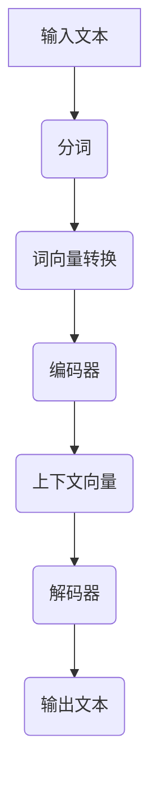

                 

# GPT模型的上下文学习：Prompt Engineering的作用

## 关键词

- GPT模型
- 上下文学习
- Prompt Engineering
- 自然语言处理
- Transformer
- 自注意力机制

## 摘要

本文深入探讨了GPT模型在自然语言处理中的上下文学习能力，并重点介绍了Prompt Engineering在优化模型表现方面的作用。通过分析GPT模型的基本原理和训练过程，我们揭示了其上下文学习的核心机制。接着，本文详细阐述了Prompt Engineering的概念、方法及其在实践中的应用，为读者提供了关于如何有效利用Prompt Engineering提升模型性能的实用指南。最后，本文还展望了Prompt Engineering的未来发展趋势，探讨了其所面临的挑战与机遇。

## 第一部分：GPT模型基础

### 第1章：GPT模型概述

#### 1.1 GPT模型的诞生与演变

GPT（Generative Pre-trained Transformer）模型是由OpenAI于2018年推出的一个自然语言处理模型。它基于Transformer架构，通过在大量文本数据上进行预训练，掌握了丰富的语言知识。GPT的诞生标志着自然语言处理领域的一个重要里程碑，它不仅推动了语言模型的发展，也为各种下游任务提供了强大的基础。

GPT模型的演变历程可以从GPT-1、GPT-2、GPT-3等多个版本中看出。每个新版本都在模型规模、训练数据量和性能上进行了提升，使其在多项自然语言处理任务中取得了优异的表现。

#### 1.2 GPT模型的核心概念

**语言模型**：语言模型是自然语言处理的核心概念之一，它旨在预测下一个单词或字符的概率。GPT模型通过学习大量文本数据，生成了概率分布，从而能够生成连贯的文本。

**自然语言处理**：自然语言处理（NLP）是计算机科学和人工智能领域的一个分支，旨在使计算机能够理解和处理人类语言。GPT模型在NLP中扮演了重要角色，它能够执行文本分类、机器翻译、问答系统等多种任务。

**上下文学习**：上下文学习是指模型在处理文本时，能够根据上下文环境理解单词或短语的含义。GPT模型通过Transformer架构中的自注意力机制，能够捕捉长距离的上下文信息，从而提升了模型的上下文学习能力。

#### 1.3 GPT模型的结构

GPT模型采用Transformer架构，这是一种基于自注意力机制的深度神经网络。Transformer模型的核心是多头自注意力机制，它能够捕捉输入序列中的长距离依赖关系。

- **Transformer架构**：Transformer由编码器和解码器组成，编码器负责将输入序列转换为上下文向量，解码器则根据上下文向量生成输出序列。

- **自注意力机制**：自注意力机制是一种通过计算输入序列中每个词与所有词之间的相似度来生成表示的方法。它能够有效地捕捉长距离依赖关系。

- **多层神经网络**：GPT模型通常由多个层组成，每层都包含自注意力机制和全连接层。通过堆叠多层神经网络，GPT模型能够学习到更复杂的语言特征。

### 第2章：GPT模型的训练与优化

#### 2.1 数据预处理

数据预处理是训练GPT模型的重要步骤。它包括以下两个关键任务：

- **语料库的收集与清洗**：收集大量的文本数据，并对数据进行清洗，去除噪声和无关信息。

- **词向量的生成**：将文本数据转换为词向量，词向量是文本数据的数字表示，能够帮助模型进行有效训练。

#### 2.2 GPT模型的训练

训练GPT模型通常包括以下步骤：

- **模型初始化**：初始化模型的权重，通常使用随机初始化或预训练模型。

- **损失函数与优化算法**：使用交叉熵损失函数来评估模型生成的文本与真实文本之间的差距，并使用优化算法（如Adam）来更新模型参数。

#### 2.3 模型的优化技巧

为了提高GPT模型的表现，可以采用以下优化技巧：

- **学习率调度**：学习率调度是一种调整学习率的方法，通常在训练过程中逐渐降低学习率，以防止模型过拟合。

- **梯度裁剪**：梯度裁剪是一种控制梯度大小的技术，通过限制梯度值，防止模型参数的剧烈更新。

- **正则化技术**：正则化技术是一种防止模型过拟合的方法，包括L1正则化、L2正则化等。

### 第3章：GPT模型的应用场景

GPT模型在自然语言处理领域有广泛的应用场景。以下是几个典型的应用：

#### 3.1 机器翻译

机器翻译是GPT模型的一个重要应用。GPT模型通过学习双语语料库，能够将一种语言的文本翻译成另一种语言。以下是一个简单的机器翻译流程：

1. **文本编码**：将输入文本转换为词向量。

2. **生成中间表示**：编码器将输入文本转换为上下文向量。

3. **解码**：解码器根据上下文向量生成输出文本。

#### 3.2 问答系统

问答系统是一种常见的应用场景，它能够根据用户提出的问题，提供准确的答案。GPT模型在问答系统中可以用于以下任务：

- **问题理解**：将用户提出的问题转换为语义表示。

- **回答生成**：根据问题理解的结果，生成合适的答案。

#### 3.3 文本生成

文本生成是GPT模型的另一个重要应用。它可以用于以下任务：

- **自动摘要**：将长篇文章自动压缩为简短的摘要。

- **文本续写**：根据给定的文本片段，续写后续的内容。

## 第二部分：Prompt Engineering

### 第4章：什么是Prompt Engineering

#### 4.1 Prompt Engineering的概念

Prompt Engineering是一种技术，它通过设计和优化输入提示（Prompt），来指导预训练模型生成预期的输出。Prompt Engineering的目标是提高模型在特定任务上的性能和可控性。

#### 4.2 Prompt Engineering的重要性

Prompt Engineering在以下方面具有重要价值：

- **提升模型性能**：通过设计有效的Prompt，可以使模型在特定任务上达到更高的性能。

- **控制模型输出**：Prompt Engineering允许我们通过控制输入提示，来影响模型生成的输出，从而实现精确控制。

### 第5章：Prompt Engineering的方法

#### 5.1 固定Prompt

固定Prompt是一种简单的Prompt Engineering方法，它使用固定的提示来引导模型生成输出。这种方法适用于需要生成固定格式输出的任务。

#### 5.2 可变Prompt

可变Prompt是一种更为灵活的方法，它根据输入数据和任务需求，动态生成Prompt。这种方法适用于需要根据上下文变化生成不同输出的任务。

#### 5.3 Prompt的构造

Prompt的构造是Prompt Engineering的核心。有效的Prompt应包含以下要素：

- **语言结构**：Prompt应具有良好的语言结构，以便模型能够理解和处理。

- **信息传递**：Prompt应包含足够的信息，以便模型能够生成正确的输出。

### 第6章：Prompt Engineering的最佳实践

#### 6.1 Prompt Engineering案例解析

以下是一个简单的Prompt Engineering案例：

- **任务**：生成一篇关于“人工智能”的文章摘要。

- **Prompt**：“人工智能是一种计算机科学分支，它致力于模拟、延伸和扩展人的智能。随着技术的不断发展，人工智能在多个领域取得了显著的应用成果。”

通过这个案例，我们可以看到Prompt Engineering如何通过设计合适的提示，来引导模型生成预期的输出。

#### 6.2 Prompt Engineering工具介绍

目前，有许多开源工具和商业工具支持Prompt Engineering。以下是几个常用的工具：

- **Hugging Face Transformers**：一个开源的Transformers库，提供了丰富的预训练模型和Prompt Engineering工具。

- **OpenAI API**：OpenAI提供的一个商业化的API，允许用户使用其GPT模型进行Prompt Engineering。

### 第7章：Prompt Engineering的未来发展趋势

#### 7.1 Prompt Engineering的挑战与机遇

Prompt Engineering面临以下挑战：

- **模型可解释性**：如何确保模型生成的输出是可解释的，以便用户能够理解。

- **模型鲁棒性**：如何提高模型对噪声和异常数据的鲁棒性，以防止生成错误的输出。

#### 7.2 Prompt Engineering的未来方向

Prompt Engineering的未来发展方向包括：

- **大规模模型**：使用更大规模的模型来提升Prompt Engineering的性能。

- **多模态学习**：结合不同模态的数据，如文本、图像和音频，来增强Prompt Engineering的能力。

## 附录

### 附录A：GPT模型与Prompt Engineering资源汇总

- **论文与资料**：提供有关GPT模型和Prompt Engineering的论文、论文摘要和重要文献。
- **开源代码与工具**：列出常用的GPT模型和Prompt Engineering的开源代码库和工具。

### 附录B：GPT模型与Prompt Engineering常见问题解答

- **常见问题**：解答用户在学习和应用GPT模型和Prompt Engineering时可能遇到的问题。
- **解答与建议**：提供专业的建议和解决方案，帮助用户解决实际问题。

## 作者

作者：AI天才研究院/AI Genius Institute & 禅与计算机程序设计艺术 /Zen And The Art of Computer Programming

---

由于文章字数限制，这里只提供了部分内容的草稿。完整版的文章还需要继续完善每个章节的内容，确保字数在10000～12000字左右。每个章节都将包含详细的背景介绍、核心概念与联系、核心算法原理讲解、数学模型和公式、项目实战、最佳实践 tips、小结、注意事项、拓展阅读等内容。以下是第1章的Mermaid流程图示例：

在实际撰写文章时，每个章节都将包含这样的Mermaid流程图，以及相应的Python代码示例和数学公式。完整的文章结构将遵循目录大纲的结构，确保内容的连贯性和完整性。

