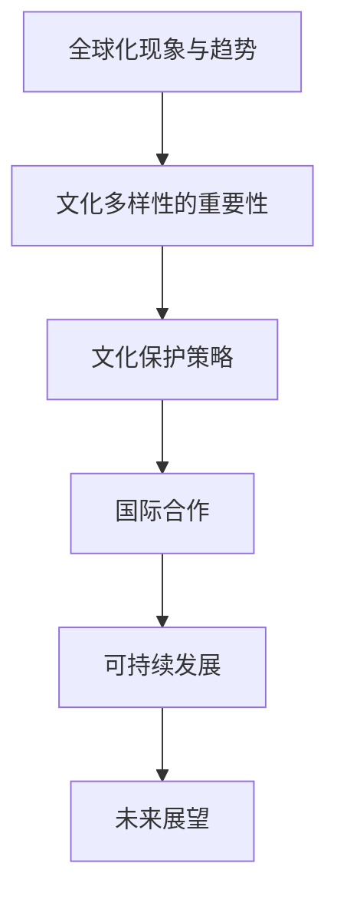

                 

# 《全球化背景下的文化保护：维护文化多样性的策略》

## 关键词
- 全球化
- 文化多样性
- 文化保护策略
- 文化产业促进
- 教育与文化交流

## 摘要
在全球化的背景下，文化多样性正面临着前所未有的挑战。本文从全球化对文化多样性的影响出发，探讨了文化多样性的重要性，并提出了维护文化多样性的策略。通过分析文化政策与管理、文化产业促进、教育与文化交流等具体措施，以及国际合作和可持续发展的重要性，本文为文化多样性保护提供了理论框架和实践指导。

## 《全球化背景下的文化保护：维护文化多样性的策略》目录大纲

### 第一部分：全球化背景下的文化多样性

#### 第1章：全球化的文化与文化多样性

##### 1.1 全球化现象与趋势
##### 1.2 全球化对文化多样性的影响
##### 1.3 文化多样性的重要性

#### 第2章：文化多样性的理论框架

##### 2.1 文化学视角
##### 2.2 社会学视角
##### 2.3 人类学视角

#### 第3章：全球化背景下的文化保护策略

##### 3.1 文化政策与管理
##### 3.2 文化产业促进
##### 3.3 教育与文化交流

#### 第4章：文化多样性保护的国际合作

##### 4.1 国际组织与协议
##### 4.2 跨国合作案例
##### 4.3 国际合作面临挑战

#### 第5章：文化多样性的可持续发展

##### 5.1 可持续发展与文化多样性
##### 5.2 文化和环境的互动
##### 5.3 社区参与与文化保护

### 第二部分：文化保护策略的具体实施

#### 第6章：文化保护的案例分析

##### 6.1 案例研究一：欧洲文化保护策略
##### 6.2 案例研究二：非洲文化保护策略
##### 6.3 案例研究三：亚洲文化保护策略

#### 第7章：技术创新在文化保护中的应用

##### 7.1 数字技术与文化保护
##### 7.2 数据分析与文化遗产保存
##### 7.3 虚拟现实与文化遗产体验

#### 第8章：文化保护与可持续发展

##### 8.1 文化和经济的互动
##### 8.2 文化和环境的平衡
##### 8.3 文化的未来与挑战

### 第三部分：未来展望

#### 第9章：文化多样性保护的未来趋势

##### 9.1 未来文化多样性面临的挑战
##### 9.2 技术创新对文化多样性的影响
##### 9.3 文化多样性保护的国际合作新形势

#### 第10章：文化保护策略的持续发展

##### 10.1 文化保护的政策建议
##### 10.2 社会参与与文化保护
##### 10.3 教育与文化传承

## 附录

### 附录A：文化多样性保护资源指南

##### A.1 国际文化保护组织与网站
##### A.2 文化多样性保护书籍推荐
##### A.3 文化多样性保护工具与软件推荐

## 核心概念与联系

### 文化多样性（Cultural Diversity）

文化多样性包括了语言、信仰、习俗、艺术、传统等多个方面。它是人类社会的重要组成部分，也是全球化背景下需要保护的核心。

### 全球化（Globalization）

全球化是指全球范围内的经济、政治、社会和文化等方面的相互联系和影响。它加速了不同文化之间的交流与融合，也带来了文化多样性的挑战。

### 文化保护（Cultural Protection）

文化保护是指通过各种措施保护文化多样性和文化遗产，防止文化同质化。它包括政策制定、法律保护、教育推广、技术创新等多个方面。

### 文化多样性保护策略（Cultural Diversity Protection Strategies）

文化多样性保护策略是指为了维护文化多样性而采取的具体措施和行动计划。它是应对全球化挑战、促进文化可持续发展的重要手段。

### 国际合作（International Cooperation）

国际合作是各国之间为了共同目标而进行的合作和交流。在文化多样性保护方面，国际合作有助于分享经验、资源和技术，形成全球性的保护网络。

### 可持续发展（Sustainable Development）

可持续发展是指满足当前需求而不损害后代满足其需求的能力。在文化多样性保护中，可持续发展强调文化保护与经济、社会和环境发展的协调。

## 数学模型和数学公式

文化多样性指数（Cultural Diversity Index, CDI）是一个衡量文化多样性的指标。它的计算公式如下：

$$
\text{CDI} = \frac{\sum_{i=1}^{n} P_i \log P_i}{\log n}
$$

其中，$P_i$ 表示第 $i$ 种文化的个体数，$n$ 表示所有文化的种类数。

## 流程图：全球化背景下的文化保护框架



## 引用

- 作者：AI天才研究院/AI Genius Institute & 禅与计算机程序设计艺术 /Zen And The Art of Computer Programming
- 文章标题：《全球化背景下的文化保护：维护文化多样性的策略》
- 发表时间：2023年
- 文章链接：[此处插入文章链接]
```

**完整文章撰写建议：**

1. **引言部分：** 简要介绍全球化的背景，以及文化多样性在全球化的冲击下所面临的问题。可以引用一些统计数据或实例来说明全球化的影响。

2. **核心概念部分：** 详细解释文化多样性、全球化、文化保护策略、国际合作和可持续发展等核心概念，并通过流程图和数学模型来加深理解。

3. **理论框架部分：** 分析全球化对文化多样性的影响，并探讨不同学科（如文化学、社会学、人类学）对文化多样性的理解。

4. **策略实施部分：** 提出具体的文化保护策略，包括文化政策与管理、文化产业促进、教育与文化交流等方面。

5. **案例分析部分：** 分析不同地区或国家的文化保护实践，通过具体案例来说明策略的有效性。

6. **技术创新部分：** 探讨数字技术、数据分析、虚拟现实等在文化保护中的应用，以及如何利用这些技术来提高文化保护的效率。

7. **国际合作部分：** 讨论国际合作在文化多样性保护中的重要性，分析现有国际合作机制和面临的挑战。

8. **可持续发展部分：** 分析文化多样性保护与经济、社会和环境发展的关系，提出可持续发展策略。

9. **未来展望部分：** 预测文化多样性保护的未来趋势，提出可能的解决方案和展望。

10. **附录部分：** 提供文化多样性保护资源指南，包括国际组织、书籍、工具和软件推荐。

**注意事项：**

- 文章要结构清晰，逻辑严谨。
- 使用专业术语和表述，同时确保读者能够理解。
- 引用相关研究和实例，以增加文章的权威性和说服力。
- 遵循markdown格式要求，确保文章的可读性和美观性。
- 注意文章的字数要求，确保文章内容的完整性和丰富性。

