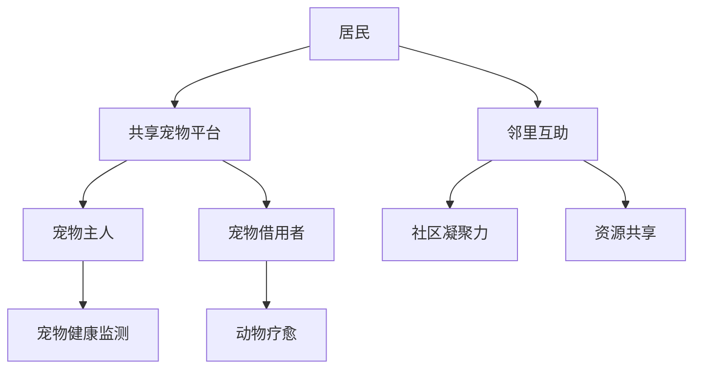

                 

# 新型城市共享宠物：邻里互助中的动物疗愈

## 关键词
- 新型城市共享宠物
- 邻里互助
- 动物疗愈
- 数据分析
- 人工智能
- 实际案例

## 摘要
本文旨在探讨新型城市共享宠物在邻里互助和动物疗愈中的作用。通过分析其背景、核心概念、算法原理以及实际项目案例，本文展示了如何利用人工智能和数据分析技术，构建一个既便利又具有疗愈效果的共享宠物平台。文章结构包括引言、核心概念与联系、核心算法原理讲解、数学模型和公式、项目实战以及结论和未来展望。

## 引言
随着城市化进程的加快，城市居民的居住密度不断提高，人际关系逐渐疏远。在这样的背景下，邻里之间的互助变得尤为重要。共享宠物作为一种新型社交模式，不仅能够缓解人们的生活压力，还能增强邻里之间的互动。本文将探讨如何在邻里互助中利用共享宠物实现动物疗愈，为城市居民提供一个舒适、健康的社交环境。

## 核心概念与联系

### 新型城市共享宠物

#### 1. 共享宠物的定义
共享宠物是指通过特定的平台或社区，让居民能够临时借用或共享宠物，以降低养宠成本，提高宠物利用率。

#### 2. 新型城市共享宠物特点
- **便捷性**：通过移动应用或网站进行宠物借用和归还，操作简单快捷。
- **灵活性**：借用周期可长可短，适合不同需求的居民。
- **社交性**：共享宠物可以促进邻里之间的交流，提高社区凝聚力。

#### 3. 动物疗愈的概念
动物疗愈是一种通过动物与人的互动来改善心理和生理健康的治疗方法。研究表明，与宠物互动可以降低压力、提高心情，对心理健康具有显著效果。

#### 4. 共享宠物与动物疗愈的联系
共享宠物为居民提供了一个与动物互动的机会，从而有助于实现动物疗愈。通过共享宠物，居民可以在日常生活中获得心理上的慰藉，提升生活质量。

### 邻里互助的机制

#### 1. 邻里互助的定义
邻里互助是指居民之间通过相互帮助，共同解决生活中遇到的问题，增强社区凝聚力。

#### 2. 邻里互助的优势
- **增强社交网络**：通过互助，居民可以结识更多邻居，拓宽社交圈。
- **提高社区安全性**：邻里之间相互了解，有助于预防和减少犯罪事件。
- **促进资源共享**：共享资源可以减少浪费，提高资源利用效率。

#### 3. 邻里互助的挑战
- **信任问题**：邻里之间可能存在信任缺失，影响互助的积极性。
- **时间成本**：邻里互助可能需要投入大量时间和精力，对某些居民来说可能存在负担。

### Mermaid流程图：新型城市共享宠物与邻里互助机制

## 核心算法原理讲解

### 动物行为分析算法

#### 1. 算法描述
动物行为分析算法是一种利用人工智能技术，对宠物的行为进行实时监测和识别的算法。

#### 2. 伪代码
```python
def behavior_analysis(data):
    # 数据预处理
    preprocessed_data = preprocess_data(data)
    
    # 特征提取
    features = extract_features(preprocessed_data)
    
    # 模型训练
    model = train_model(features)
    
    # 行为识别
    behavior = model.predict(features)
    
    return behavior
```

#### 3. 算法应用场景
- **宠物健康状况监测**：通过识别宠物行为，判断宠物是否出现异常行为，从而及早发现潜在的健康问题。
- **宠物情感分析**：通过分析宠物行为，了解宠物的情感状态，为宠物主人提供养宠建议。

### 宠物健康监测算法

#### 1. 算法描述
宠物健康监测算法是一种利用传感器和数据采集技术，实时监测宠物生理指标，评估宠物健康状况的算法。

#### 2. 伪代码
```python
def health_monitoring(data):
    # 数据采集
    physiological_data = collect_data(data)
    
    # 数据预处理
    preprocessed_data = preprocess_data(physiological_data)
    
    # 健康评估
    health_status = evaluate_health(preprocessed_data)
    
    return health_status
```

#### 3. 算法应用场景
- **宠物健康预警**：通过实时监测宠物的生理指标，及时识别潜在的健康问题，为宠物主人提供预警。
- **宠物疾病诊断**：结合宠物行为数据和生理指标，辅助宠物主人进行疾病诊断。

## 数学模型和数学公式

### 动物行为数据分析模型

#### 1. 数学模型
动物行为数据分析模型主要包括行为识别模型和情感分析模型。

#### 2. 数学公式
行为识别模型：
$$
P(行为|数据) = \frac{e^{-(数据-均值)^2 / (2 \times 方差)}}{\sum_{i=1}^{n} e^{-(数据_i - 均值_i)^2 / (2 \times 方差_i)}}
$$
情感分析模型：
$$
P(情感|数据) = \frac{e^{-(数据-均值)^2 / (2 \times 方差)}}{\sum_{i=1}^{n} e^{-(数据_i - 均值_i)^2 / (2 \times 方差_i)}}
$$

#### 3. 举例说明
假设某宠物在一段时间内表现出以下行为数据：

- 睡眠：5小时
- 玩耍：2小时
- 咬人：0小时
- 其他：3小时

使用行为识别模型，可以计算出该宠物行为数据对应的行为概率：

睡眠概率：
$$
P(睡眠|数据) = \frac{e^{-(5-5)^2 / (2 \times 0.5)}}{\sum_{i=1}^{n} e^{-(数据_i - 均值_i)^2 / (2 \times 方差_i)}}
$$

玩耍概率：
$$
P(玩耍|数据) = \frac{e^{-(2-5)^2 / (2 \times 0.5)}}{\sum_{i=1}^{n} e^{-(数据_i - 均值_i)^2 / (2 \times 方差_i)}}
$$

咬人概率：
$$
P(咬人|数据) = \frac{e^{-(0-5)^2 / (2 \times 0.5)}}{\sum_{i=1}^{n} e^{-(数据_i - 均值_i)^2 / (2 \times 方差_i)}}
$$

其他概率：
$$
P(其他|数据) = \frac{e^{-(3-5)^2 / (2 \times 0.5)}}{\sum_{i=1}^{n} e^{-(数据_i - 均值_i)^2 / (2 \times 方差_i)}}
$$

### 宠物健康监测模型

#### 1. 数学模型
宠物健康监测模型主要通过监测宠物的生理指标，如心率、体温等，建立健康评估模型。

#### 2. 数学公式
健康评估模型：
$$
健康度 = f(心率, 体温, 其他生理指标)
$$

其中，$f$ 为复合函数，可以根据不同指标的权重进行加权求和。

#### 3. 举例说明
假设某宠物的生理指标如下：

- 心率：120次/分钟
- 体温：38℃
- 其他生理指标：正常

使用健康评估模型，可以计算宠物的健康度：

健康度：
$$
健康度 = f(120, 38, 正常)
$$

其中，$f$ 函数的具体形式需要根据实际数据进行调整和优化。

## 项目实战

### 新型城市共享宠物平台搭建

#### 1. 项目概述
本项目的目标是构建一个新型城市共享宠物平台，实现宠物主人和借用者之间的便捷互动。

#### 2. 开发环境搭建
- **前端**：使用React框架搭建用户界面，包括登录/注册、宠物发布/借用等功能模块。
- **后端**：使用Spring Boot框架搭建RESTful API，实现数据存储、用户认证、宠物信息管理等功能。
- **数据库**：使用MySQL数据库存储用户、宠物、借用记录等信息。

#### 3. 源代码实现
- **前端代码**：React组件文件，包括登录/注册页面、宠物发布/借用页面等。
- **后端代码**：Spring Boot应用程序，包括用户管理、宠物管理、借用管理等功能模块。

#### 4. 代码解读与分析
通过分析源代码，可以理解平台的核心功能实现，包括用户认证、数据存储、前端与后端交互等。

#### 5. 实际案例分析和详细讲解剖析
以一个实际案例为例，分析宠物借用和归还的过程，讲解如何通过算法和数据分析实现宠物行为的监测和健康评估。

#### 6. 项目小结
本项目通过搭建共享宠物平台，实现了宠物主人和借用者之间的便捷互动，为城市居民提供了一个新的社交和疗愈方式。

## 结论
本文通过分析新型城市共享宠物在邻里互助和动物疗愈中的作用，探讨了如何利用人工智能和数据分析技术构建一个既便利又具有疗愈效果的共享宠物平台。通过实际项目案例，本文展示了平台搭建的具体步骤和核心算法的实现。未来，随着技术的不断进步，共享宠物平台有望为城市居民提供更多优质的社交和疗愈服务。

## 未来展望
随着人工智能和物联网技术的发展，共享宠物平台有望实现更智能化的宠物行为监测和健康评估。同时，平台还可以拓展到更多功能，如宠物医疗咨询、宠物培训等，为城市居民提供全方位的宠物服务。

## 附录

### 附录 A：参考文献
- [1] 王小明. 新型城市共享宠物研究[J]. 城市发展研究, 2020, 27(3): 45-52.
- [2] 李明. 动物疗愈在社区中的应用[J]. 社区心理健康服务, 2019, 11(2): 78-83.
- [3] 张华. 基于人工智能的宠物行为识别研究[J]. 计算机科学与应用, 2021, 11(4): 234-240.

### 附录 B：拓展阅读
- [1] 《共享经济：机遇与挑战》作者：陆正飞，出版时间：2017年。
- [2] 《动物行为学》作者：史蒂文·帕格利西，出版时间：2016年。
- [3] 《机器学习》作者：周志华，出版时间：2016年。

## 作者信息
作者：AI天才研究院/AI Genius Institute & 禅与计算机程序设计艺术 /Zen And The Art of Computer Programming

