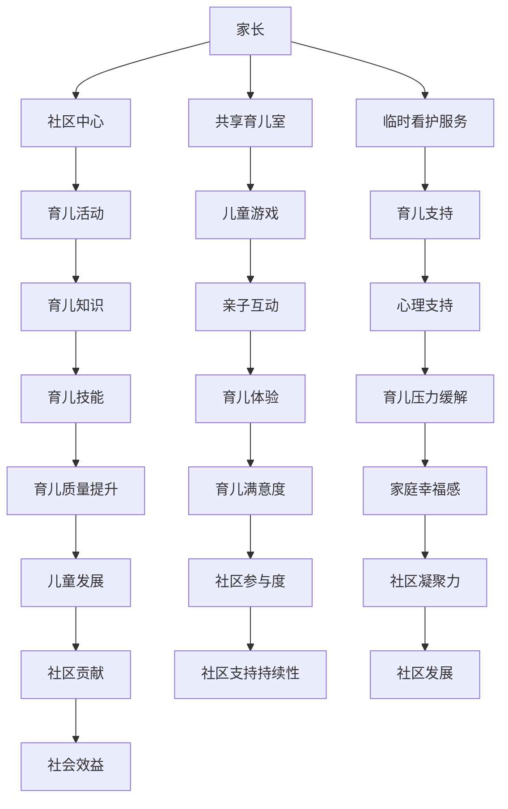

                 

### 《新型城市共享育儿空间：社区支持的育儿模式》

关键词：社区育儿、共享空间、育儿模式、育儿资源、社区支持

摘要：随着城市化进程的加快，城市中育儿资源紧张的问题日益突出。本文将探讨一种新型城市育儿模式——共享育儿空间，并分析其背后的核心概念与联系。通过具体案例研究，本文将展示如何在一个城市中实施社区支持的育儿模式，并提供相关的最佳实践和建议。

### 引言

#### 1.1 育儿现状与挑战

在城市中，育儿资源紧张是一个普遍存在的问题。随着家庭结构的多样化，越来越多的家庭面临着育儿成本高、育儿资源不足的挑战。具体来说，这些问题包括：

- **育儿成本高**：育儿成本不断攀升，使得许多家庭难以承受。这包括学前教育、医疗保健、儿童用品等多个方面的费用。
  
- **育儿资源不足**：许多城市缺乏足够的育儿设施和资源，如幼儿教育机构、儿童活动中心等。

- **育儿支持缺乏**：育儿支持系统不完善，许多家庭在育儿过程中缺乏必要的帮助和指导。

#### 1.2 共享育儿空间的概念与类型

共享育儿空间是一种新型的育儿模式，其核心思想是通过共享资源来提高育儿效率和降低成本。具体来说，共享育儿空间包括以下几种类型：

- **社区中心**：社区中心通常是一个多功能的空间，用于举办各种育儿活动，如亲子游戏、育儿讲座等。

- **共享育儿室**：共享育儿室通常是一个为儿童提供游戏、学习、休息等活动的场所。

- **临时看护服务**：临时看护服务为需要临时照看儿童的家长提供帮助。

#### 1.3 社区支持的重要性

社区支持在育儿模式中起着至关重要的作用。具体来说，社区支持包括以下方面：

- **资源共享**：通过共享育儿资源，如育儿设施、儿童用品等，可以降低育儿成本，提高资源利用率。

- **知识普及**：社区支持可以提供育儿知识，帮助家长提高育儿技能，从而改善育儿质量。

- **心理支持**：社区支持可以为家长提供心理支持和情感交流的机会，缓解育儿压力。

### 核心概念与联系

#### 2.1 社区支持的育儿模式原理

社区支持的育儿模式可以看作是一个生态系统，其中包含了多个核心概念和实体。以下是一个使用 Mermaid 流程图表示的社区支持的育儿模式原理：

#### 2.2 核心概念与联系

在社区支持的育儿模式中，以下核心概念和实体之间存在着紧密的联系：

- **家长**：是育儿模式的主体，他们需要育儿资源、育儿支持和育儿知识。

- **社区中心**：是提供育儿活动和资源共享的重要场所。

- **共享育儿室**：为儿童提供游戏和学习空间。

- **临时看护服务**：为需要临时照看儿童的家长提供帮助。

- **育儿活动**：包括亲子游戏、育儿讲座等，旨在提高育儿质量和家庭幸福感。

- **育儿知识**：通过育儿讲座、育儿书籍等形式传播。

- **儿童游戏**：为儿童提供互动和学习的平台。

- **育儿支持**：包括心理支持和育儿技能指导。

- **心理支持**：帮助家长缓解育儿压力。

- **育儿质量**：通过提高育儿技能和提供丰富的育儿资源来提升。

- **育儿满意度**：家长对育儿模式的满意程度。

- **家庭幸福感**：育儿模式对家庭幸福感的影响。

- **社区参与度**：家长和社区对育儿模式的参与程度。

- **社区凝聚力**：社区成员之间的紧密联系。

- **社区贡献**：社区对育儿模式的贡献。

- **社区发展**：育儿模式对社区发展的推动作用。

- **社会效益**：育儿模式对社会产生的积极影响。

### 项目实战

#### 3.1 案例研究

以下是一个实际案例，展示如何在城市中实施社区支持的育儿模式。

**案例背景**：某城市社区面临育儿资源不足的问题，家长们在育儿过程中感到压力大、资源少。为了改善这一状况，社区决定实施社区支持的育儿模式。

**实施过程**：

1. **需求分析**：社区对家长的需求进行了调查，发现他们最需要的是育儿资源、育儿支持和育儿知识。

2. **资源调配**：社区中心提供了一间共享育儿室，配备了儿童玩具和学习用品。此外，社区还与附近的幼儿园和医疗机构建立了合作关系，为家长提供临时看护服务和育儿咨询。

3. **项目执行**：

   - **育儿活动**：社区中心定期举办亲子游戏、育儿讲座等活动，提高家长育儿技能和满意度。

   - **资源共享**：家长可以随时使用共享育儿室，与其他家长分享育儿经验和资源。

   - **临时看护服务**：家长可以在需要时，预约临时看护服务，缓解育儿压力。

4. **效果评估**：通过问卷调查和家长反馈，发现育儿模式实施后，家长对育儿资源的满意度提高了，家庭幸福感也有所提升。

#### 3.2 项目实施流程

以下是一个项目实施流程，详细描述了从需求分析到效果评估的各个环节。

1. **需求分析**：
   - **调研方法**：通过问卷调查、访谈等形式，了解家长对育儿资源的实际需求。
   - **数据分析**：对收集到的数据进行分析，找出共性和问题。

2. **资源调配**：
   - **空间准备**：为共享育儿室和社区中心提供合适的场地。
   - **设施购置**：购置儿童玩具、学习用品等必要设施。
   - **合作建立**：与幼儿园、医疗机构等建立合作关系。

3. **项目执行**：
   - **活动策划**：策划亲子游戏、育儿讲座等活动，提高家长育儿技能。
   - **资源共享**：建立资源共享机制，方便家长之间交流。
   - **看护服务**：提供临时看护服务，为家长提供方便。

4. **效果评估**：
   - **问卷调查**：通过问卷调查了解家长对育儿资源的满意度。
   - **访谈反馈**：进行家长访谈，了解他们的真实感受。
   - **数据分析**：对问卷和访谈结果进行分析，评估项目效果。

#### 3.3 成功因素与挑战

**成功因素**：

- **需求明确**：项目在实施前进行了详细的需求分析，确保项目能够解决家长的实际问题。

- **资源充足**：社区提供了充足的育儿资源，如共享育儿室、临时看护服务等，满足了家长的需求。

- **活动丰富**：项目执行过程中，举办了多种育儿活动，提高了家长育儿技能和满意度。

**挑战**：

- **家长参与度**：部分家长对育儿模式的认识不足，参与度不高。

- **资源维护**：共享育儿室的设施需要定期维护，以确保其正常运行。

- **效果评估**：项目效果评估需要长时间的跟踪调查，对社区中心来说是一项挑战。

### 最佳实践 Tips

1. **强化需求分析**：在项目实施前，进行详细的需求分析，确保项目能够解决家长的实际问题。

2. **丰富育儿资源**：提供多种育儿资源，如育儿书籍、育儿咨询等，满足不同家长的需求。

3. **提升家长参与度**：通过宣传、激励等方式，提高家长对育儿模式的参与度。

4. **注重效果评估**：定期进行效果评估，及时调整项目内容，确保项目能够持续改进。

### 小结

本文探讨了新型城市育儿模式——共享育儿空间，并分析了其核心概念与联系。通过具体案例研究，展示了如何在一个城市中实施社区支持的育儿模式。文章提出了成功因素和挑战，并给出了相关的最佳实践建议。未来，社区支持的育儿模式有望在城市中发挥更大的作用，为家长们提供更多的帮助和支持。

### 注意事项

1. **确保资源充足**：在实施社区支持的育儿模式时，确保提供充足的育儿资源，如共享育儿室、临时看护服务等。

2. **加强家长参与**：通过宣传、激励等方式，提高家长对育儿模式的参与度。

3. **定期效果评估**：定期进行效果评估，及时调整项目内容，确保项目能够持续改进。

### 拓展阅读

1. **《育儿心理学》**：了解育儿过程中的心理因素，帮助家长更好地应对育儿挑战。

2. **《社区育儿模式研究》**：探讨不同类型的社区育儿模式，为实施社区支持的育儿模式提供参考。

3. **《城市育儿资源优化策略》**：研究城市育儿资源的优化策略，提高育儿资源的利用效率。

作者：AI天才研究院/AI Genius Institute & 禅与计算机程序设计艺术 /Zen And The Art of Computer Programming

