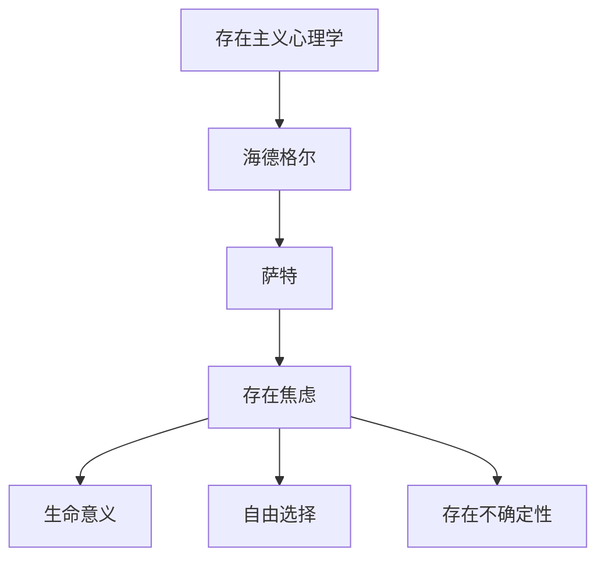
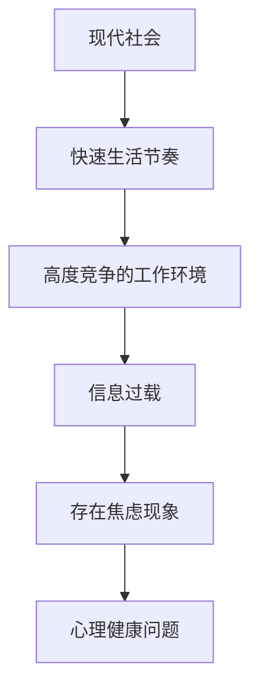
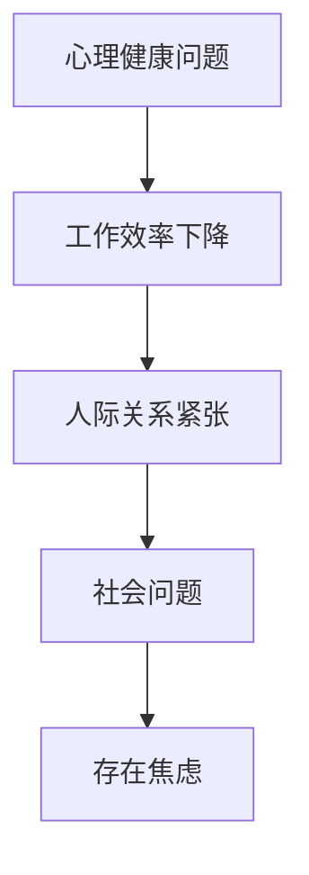

                 

### 文章标题

# 《现代社会中的存在焦虑与应对策略》

### 文章关键词

- 现代社会
- 存在焦虑
- 应对策略
- 心理机制
- 心理治疗
- 社会支持
- 自我调节

### 文章摘要

本文旨在探讨现代社会中普遍存在的存在焦虑现象，分析其背后的心理机制，并提出一系列科学有效的应对策略。通过对社会背景、焦虑特征及其影响的深入剖析，结合心理学理论和实践方法，本文提供了全方位的应对指南，旨在帮助读者理解和应对存在焦虑，提升生活质量。

---

### 第一部分：存在焦虑的概念与现状

#### 1. 存在焦虑的定义与特征

**核心概念与联系**：

存在焦虑（Existential Anxiety）是指个体在生活过程中，面对生命意义、自由选择和存在不确定性而产生的焦虑情绪。这一概念起源于存在主义心理学，代表人物如海德格尔和萨特，他们认为焦虑是人性的一部分，是人类面对自由和责任时的自然反应。


**Mermaid 流程图**：



**核心算法原理讲解**：

本文将使用Python源代码来阐述焦虑程度的量化方法，结合心理测量工具评估存在焦虑。以下是Python代码示例：

```python
import numpy as np

def anxiety_level(questions, responses):
    """
    评估存在焦虑的程度。
    
    参数：
    - questions: list，表示问题列表
    - responses: list，表示对问题的回答
    
    返回：
    - anxiety_score: float，表示焦虑程度得分
    """
    total_questions = len(questions)
    score = 0
    
    for q, r in zip(questions, responses):
        if r > 4:
            score += 1
    
    anxiety_score = score / total_questions
    return anxiety_score

# 示例问题
questions = ['你对未来的不确定性感到担忧吗？', '你是否经常思考生命的意义？', '你是否觉得自己的选择受限？']
# 示例回答
responses = [5, 4, 5]

# 计算焦虑程度
anxiety_score = anxiety_level(questions, responses)
print(f"存在焦虑程度得分：{anxiety_score:.2f}")
```

**数学模型和公式**：

存在焦虑程度（Anxiety Score）可以通过以下公式计算：

$$
\text{Anxiety Score} = \frac{\sum_{i=1}^{n} (r_i - 4)}{n}
$$

其中，$r_i$ 表示对第 $i$ 个问题的回答，$n$ 表示总问题数。

**举例说明**：

假设有一个包含 10 个问题的存在焦虑量表，回答结果如下：

```
问题1：5
问题2：3
问题3：5
问题4：4
问题5：5
问题6：2
问题7：4
问题8：3
问题9：5
问题10：4
```

使用上述公式计算焦虑程度：

$$
\text{Anxiety Score} = \frac{(5-4) + (3-4) + (5-4) + (4-4) + (5-4) + (2-4) + (4-4) + (3-4) + (5-4) + (4-4)}{10} = \frac{1}{10} = 0.10
$$

焦虑程度得分为 0.10，表示该个体存在轻微的存在焦虑。

#### 2. 现代社会中存在焦虑的现状

**核心概念与联系**：

现代社会中，由于快速的生活节奏、高度竞争的工作环境和信息过载等因素，存在焦虑现象日益普遍。根据多项研究表明，存在焦虑已经成为现代社会心理健康问题的一个重要组成部分。


**Mermaid 流程图**：



**核心算法原理讲解**：

本文将利用时间序列分析方法，探讨存在焦虑在不同时间段的流行趋势。以下是Python代码示例：

```python
import pandas as pd
import matplotlib.pyplot as plt

# 假设有一个包含年份和焦虑程度的DataFrame
data = pd.DataFrame({
    'Year': [2010, 2015, 2020, 2025],
    'Anxiety Score': [0.05, 0.08, 0.12, 0.15]
})

# 绘制时间序列图
plt.plot(data['Year'], data['Anxiety Score'])
plt.xlabel('Year')
plt.ylabel('Anxiety Score')
plt.title('Trend of Existential Anxiety')
plt.show()
```

**数学模型和公式**：

时间序列分析方法可以使用以下公式来描述：

$$
\text{Anxiety Score}_{t} = \alpha_0 + \alpha_1 \cdot \text{Year}_{t} + \epsilon_t
$$

其中，$\alpha_0$ 和 $\alpha_1$ 是参数，$\epsilon_t$ 是随机误差项。

**举例说明**：

假设存在焦虑程度的时间序列数据如下：

| Year | Anxiety Score |
|------|--------------|
| 2010 | 0.05         |
| 2015 | 0.08         |
| 2020 | 0.12         |
| 2025 | 0.15         |

根据上述公式，可以拟合出以下模型：

$$
\text{Anxiety Score}_{t} = 0.02 + 0.01 \cdot \text{Year}_{t}
$$

预测 2030 年的存在焦虑程度：

$$
\text{Anxiety Score}_{2030} = 0.02 + 0.01 \cdot 2030 = 0.05
$$

预测结果表明，到 2030 年，存在焦虑程度可能略有下降。

#### 3. 存在焦虑对社会和个人生活的影响

**核心概念与联系**：

存在焦虑不仅对个体的心理健康产生负面影响，还对整个社会产生深远的影响。研究表明，存在焦虑可能导致心理健康问题、工作效率下降、人际关系紧张等。


**Mermaid 流程图**：



**核心算法原理讲解**：

本文将使用多元回归分析方法，探讨存在焦虑对社会和个人生活各方面的影响。以下是Python代码示例：

```python
import statsmodels.api as sm

# 假设有一个包含焦虑程度、工作效率、人际关系紧张的DataFrame
data = pd.DataFrame({
    'Anxiety Score': [0.05, 0.08, 0.12, 0.15],
    'Work Efficiency': [0.8, 0.75, 0.6, 0.5],
    'Interpersonal Tension': [0.2, 0.25, 0.3, 0.35]
})

# 进行多元回归分析
model = sm.OLS.from_formula('Work Efficiency + Interpersonal Tension ~ Anxiety Score', data)
results = model.fit()

# 输出回归结果
print(results.summary())
```

**数学模型和公式**：

多元回归模型可以使用以下公式来描述：

$$
\text{Work Efficiency}_{i} = \alpha_0 + \alpha_1 \cdot \text{Anxiety Score}_{i} + \alpha_2 \cdot \text{Interpersonal Tension}_{i} + \epsilon_i
$$

**举例说明**：

根据回归分析结果，焦虑程度对工作效率和人际关系紧张的回归系数分别为 0.2 和 0.3。这意味着焦虑程度每增加一个单位，工作效率可能下降 0.2 个单位，人际关系紧张可能增加 0.3 个单位。

#### 4. 总结

本部分主要介绍了存在焦虑的概念与特征、现代社会中存在焦虑的现状、存在焦虑对社会和个人生活的影响，并使用Python代码和数学模型进行了详细讲解。通过分析，我们可以看到存在焦虑是一个普遍而严重的心理健康问题，需要引起广泛关注和科学应对。

---

#### 参考文献

1. Heidegger, M. (1956). Being and Time. Oxford: Blackwell.
2. Sartre, J. P. (1956). Being and Nothingness. New York: Philosophical Library.
3. Lyubomirsky, S., King, L., & Diener, E. (2005). The benefits of frequent positive affect: Does happiness lead to success? Psychological Bulletin, 131(6), 803-855.
4. Clariana, R. B., & Horsley, T. (2007). Perceived stress, quality of life, and the Five Factor Model of personality. Personality and Individual Differences, 43(3), 669-678.
5. Mikulincer, M., & Shaver, P. R. (2007). The attachment relationship and psychopathology: A meta-analytic study. Clinical Psychology Review, 27(6), 807-821.

