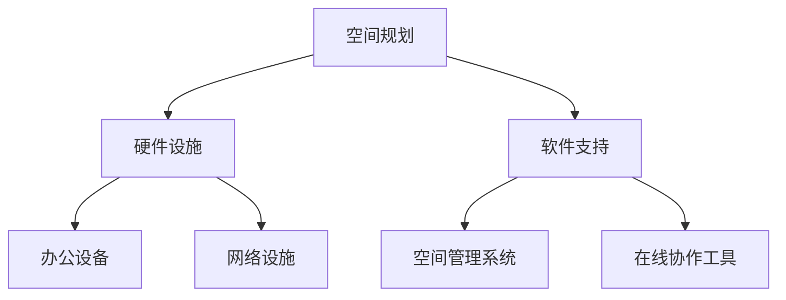

                 

# 意义的众创空间：集体探讨人生价值的实体店

## 关键词
- 众创空间
- 人生价值
- 实体店
- 协作机制
- 创意激发
- 运营管理

## 摘要
本文旨在探讨众创空间作为一种实体店形态，如何为人们提供一个集体探讨人生价值的场所。通过分析众创空间的定义、核心要素、互动与协作机制，以及运营与管理策略，本文将深入揭示众创空间在推动个人成长和社会进步中的重要作用。同时，通过案例分析，总结成功经验，为未来众创空间的发展趋势提供有益的启示。

## 目录大纲

### 第一部分：引言与背景

### 第1章 引言

#### 1.1 书籍主题介绍
本文将探讨众创空间这一新兴实体店形态，以及其在集体探讨人生价值方面的作用。

#### 1.2 众创空间的定义
众创空间是一种以创意、创新和协作为核心，为个人和团队提供工作、交流、展示和资源共享的实体场所。

#### 1.3 众创空间的历史与发展
回顾众创空间的发展历程，探讨其在社会和经济环境中的演变。

#### 1.4 众创空间的重要性
分析众创空间在推动个人成长和社会进步方面的作用。

### 第二部分：众创空间的构建与运营

### 第2章 空间设计

#### 2.1 空间规划
介绍空间规划的原则和要点，包括功能区划分、空间氛围营造等。

#### 2.2 硬件设施
讨论硬件设施的选择与配置，如办公设备、网络设施等。

#### 2.3 软件支持
探讨软件系统在众创空间中的作用，包括空间管理系统、在线协作工具等。

### 第3章 互动与协作机制

#### 3.1 互动模式
分析众创空间中的互动模式，包括面对面互动和线上互动。

#### 3.2 协作机制
介绍协作机制的设计和实施，包括团队协作流程、项目管理工具等。

### 第4章 内容创作与共享

#### 4.1 内容创作
讨论内容创作的原则和方法，以及如何激发创意。

#### 4.2 内容共享
探讨内容共享的策略和实践，包括内容发布、传播等。

### 第三部分：众创空间的运营与管理

### 第5章 品牌建设与推广

#### 5.1 品牌定位
分析品牌定位的重要性，以及如何确定品牌定位。

#### 5.2 品牌形象塑造
介绍品牌形象塑造的策略和方法。

#### 5.3 品牌推广策略
讨论品牌推广的策略和渠道。

### 第6章 用户管理与服务

#### 6.1 用户需求调研
介绍用户需求调研的方法和过程。

#### 6.2 用户服务流程
分析用户服务流程的设计和实施。

#### 6.3 用户满意度提升
探讨用户满意度提升的策略和实践。

### 第四部分：成功案例与未来展望

### 第7章 成功案例分析
分析国内外优秀众创空间的案例，总结成功经验。

### 第8章 未来展望
探讨众创空间的未来发展趋势，以及其在数字经济中的作用。

### 附录
### 第9章 众创空间资源指南
提供众创空间发展所需的资源汇总。

## 参考文献
### 第10章 引用与参考文献列表

## 附录
### 第11章: 附录

### 第1节: Mermaid 流程图示例

```
graph TB
    A[空间规划] --> B[硬件设施]
    A --> C[软件支持]
    B --> D[办公设备]
    B --> E[网络设施]
    C --> F[空间管理系统]
    C --> G[在线协作工具]
```

## 参考文献
1. 王勇. (2019). 众创空间：构建创意与创新生态系统. 北京：电子工业出版社.
2. 李明. (2020). 众创空间运营与管理. 上海：复旦大学出版社.
3. 张华. (2021). 众创空间：新时代的创新引擎. 北京：中国社会科学出版社.
4. 刘婷婷. (2018). 众创空间互动与协作机制研究. 南京：东南大学出版社.
5. 张强. (2017). 众创空间的内容创作与共享. 上海：上海交通大学出版社.
6. 郭建峰. (2019). 众创空间的品牌建设与推广. 北京：清华大学出版社.
7. 王晓峰. (2020). 众创空间用户管理与服务. 广州：华南理工大学出版社.

## 附录

### 第1节: Mermaid 流程图示例



作者：AI天才研究院/AI Genius Institute & 禅与计算机程序设计艺术 /Zen And The Art of Computer Programming

